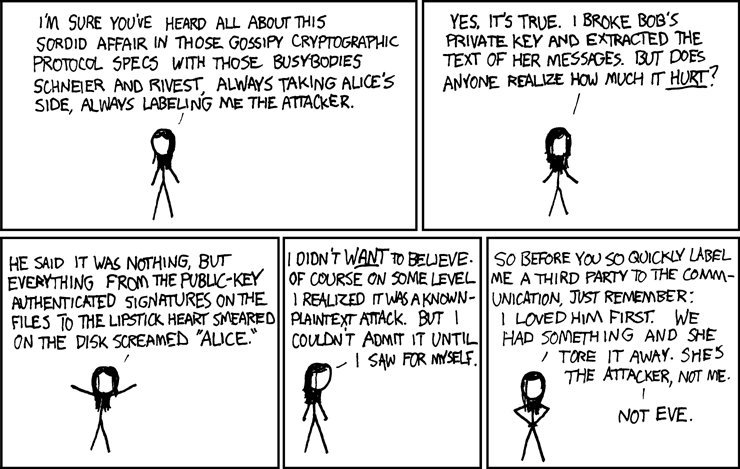
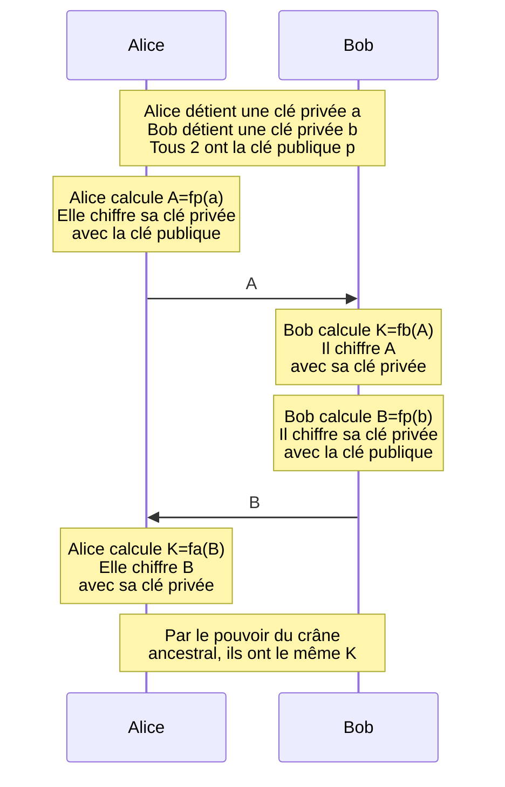
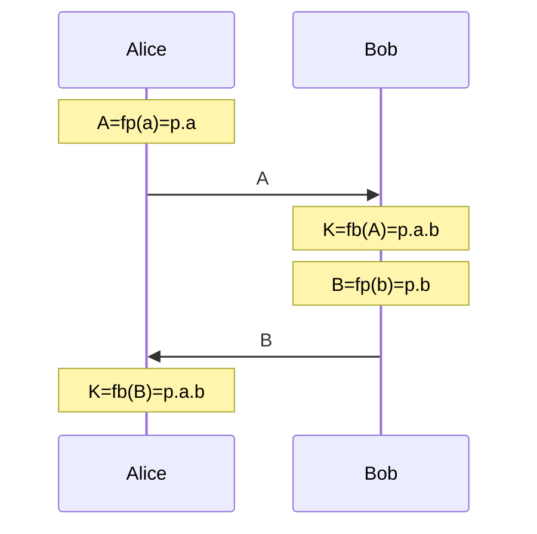
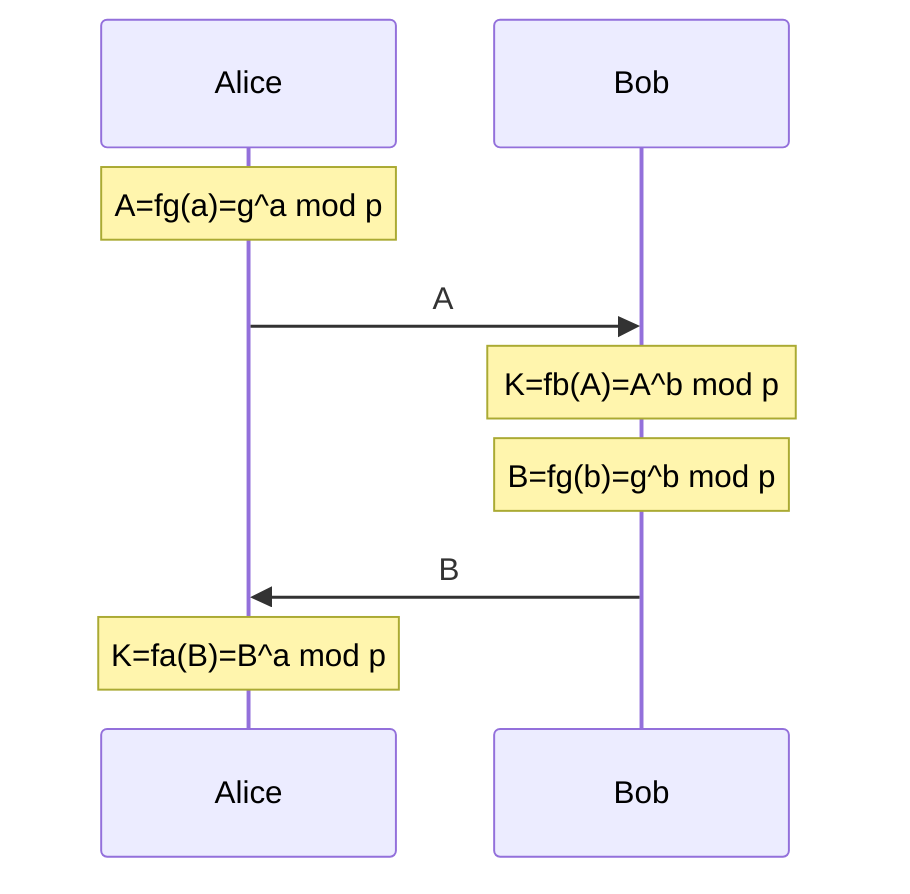

# Cryptographie Asymétriques

!!! abstract "Définition"
    Les protocoles de sécurisation asymétriques font appel à:
    
    - Une clé publique: un ensemble d'informations auxquelles tout le monde peut avoir accès
    - Une clé privée: un ensemble d'informations secrétes qu'une seule personne connaît.

    Dans les protocoles symétriques, le secret (la clé) est connue des deux communiquants. Dans les protocoles asymétriques, il n'y a aucun secret partagé. Chaque communiquant a son propre secret qu'il ne partagera jamais avec personne. (Nous allons bien sûr exmplorer cette sorcellerie)

    Ce type de protocole permet entre autre de :

    - Chiffrer un message
    - Authentifier un message (ex : signature numérique)
    - Echanger une clé secrète de façon sécurisée


C'est sur le dernier point que nous allons nous attarder.


Voici le principe qui, comme d'habitude en crypto, va vous êtes présenté par 2 stars interplanétaires: [Alice et Bob](https://en.wikipedia.org/wiki/Alice_and_Bob).


Le but de la vie d'Alice et Bob c'est de s'échanger des messages secret sans que leur ennemie jurée, la terrifiante Eve, ne puisse lire ces message. Eve est très très forte en hacking, c'est la déesse vénérée des hackers. Un hacker, c'est un peu une instance de Eve.



Alice et Bob veulent continuer de pouvoir faire du chiffrement symétrique, mais Eve trouve toujours un moyen de leur chourrer la clé. Qu'à celà ne tienne, ils ont soumi leur problème à Diffie et Hellman qui leur ont trouvé une solution. (Alice et Bob ne résolvent pas vraiment tout seuls leurs problèmes, ils demandent toujours de l'aide à des gens qui n'ont que ça à faire).


L'idée, c'est de construire une clé de chiffrement symétrique commune $K$ sans que jamais elle ne soit communiquée.

Alice et Bob disposent d'une clé publique. Elle est tellement publique qu'ils la distribuent en soirée. Très très publique.

Alice et Bob disposent d'une fonction $f_k: \mathbb{N} \rarr \mathbb{N}$. Cette fonction fait aussi partie des informations publiques. C'est une fonction de chiffrement. $k$ est une information de clé. Calculer $f_k(M)$ revient à chiffrer le message $M$ avec la clé $k$.

Alice et Bob disposent chacun d'une clé privée ($a$ pour Alice et $b$ pour Bob)qui ne doit JAMAIS être divulguée, ni même entre eux. Ce sont les seules informations secrètes. Tout le reste, même la méthode, est publique.


Voici comment ils vont s'y prendre:



Pouvoir du crâne ancestral ⤵️


Eve a sniffé toutes les communications, elle est donc en possession de:

- A
- B
- la clé publique p
- Elle connaît aussi la fonction utilisée.

Vu qu'elle intercepte A, elle est en possession de $f_k(a)$.
Il lui suffit donc de calculer $f_k^{-1}(A)$ pour trouver a, et tout le système tombe.

Pour mieux comprendre, on va imaginer que la fonction est celle-ci:

$$\large f_k : x \mapsto k.x$$



Alice et Bob ont bien le même $K$ sans avoir échangé leur clé.

Cependant, Eve intercepte A, donc $f_p(a)$

Elle sait que $f_k(x)=k.x$

Elle cherche donc sa fonction réciproque.

Elle résoud donc $y=k.x$ en $x$

Elle trouve $\displaystyle x= \frac{y}{k}$

Elle en déduit que $\displaystyle f_k^{-1}(y)=\frac{y}{k}$

Elle dispose de p, donc elle calcule $\displaystyle f_p^{-1}(A)=\frac{A}{p}$

En interceptant B, elle peut en déduire b de la même façon et reconstruire la clé partagée $K$.

Si on veut aller plus loin, Bob peut tout à fait aussi reconstituer la clé d'Alice par le même moyen.

**Tout le problème est donc de trouver une fonction $\bold{f_k}$ dont la réciproque est très difficile à calculer**

De telles fonctions existent, elles sont au coeur de la cryptographie moderne. On les appelle des **Fonctions à sens unique**

!!! hint "Fonction à sens unique"
    Une fonction à sens unique (one-way function) est une fonction $f$ telle que :

    - Il est **facile** de calculer $f(x)$ pour tout $x$
    - Il est **difficile** (ou impossible) de retrouver $x$ à partir de $f(x)$

Alors on ne va pas y aller par 4 chemins et je vais directement vous présenter la fonction qui nous intéresse ici. On l'appelle **l'exponentielle modulaire**:

Pour un entier $p$ fixé, voici la fonction que nous utiliserons:

$$\Huge f_{k} : x \mapsto x^k \mod p$$

En python, ça correspond à l'expression `(g**x)%p`

Il n'existe pas de formule pour la réciproque. On est obligé de procéder algorithmiquement pour chaque cas et le calcul est difficile quand p est un grand nombre premier. La recherche de son inverse est qualifiée de problème du logarithme discret. On ne sait pas le faire en temps raisonnable (après avoir travaillé sur le problème TSP, vous comprenez maintenant très bien cette phrase en informatique).

Alice et Bob ont alors:

- Une clé publique comportant
    - Un entier $g$
    - Un grand nombre premier $p$
- Chacun leur clé privée $a$ et $b$



Ainsi, même si Eve intercepte $A$ et $B$, elle est dans l'incapacité de retrouver $a$ et $b$ pour ainsi reconstituer $K$

Aussi, il faut quand même montrer qu'on a effectivement un $K$ identique de chaque côté. Ca tient en une ligne quand on a fait un peu d'arithmétique.

$$f_a(B) \equiv B^a \equiv (g^b)^a \equiv g^{ab} \equiv (g^a)^b \equiv A^b \equiv f_b(A) \pmod p$$


# La pratique

Pour cette activité, vous vous mettrez en binôme.

1. Dans MSYS2, générez un grand nombre premier grâce à openssl, ça sera votre $p$ commun. Si vous n'avez pas openssl, `pacman -S openssl`

```bash
openssl prime -generate -bits 2048
```

2. Pour $g$, en théorie, il faut prendre ce qu'on appelle une racine primitive de $p$, mais en réalité, quand $p$ est très grand, 2 est suffisant. On prendra 2.

3. Pour constituer votre clé privée, vous utiliserez le module secrets, qui est l'équivalent de random pour faire de la crypto. et vous utiliserez sa  secrets.randbits afin de générer une clé privée de la taille de la clé publique, mais strictement inférieure à la clé publique.

