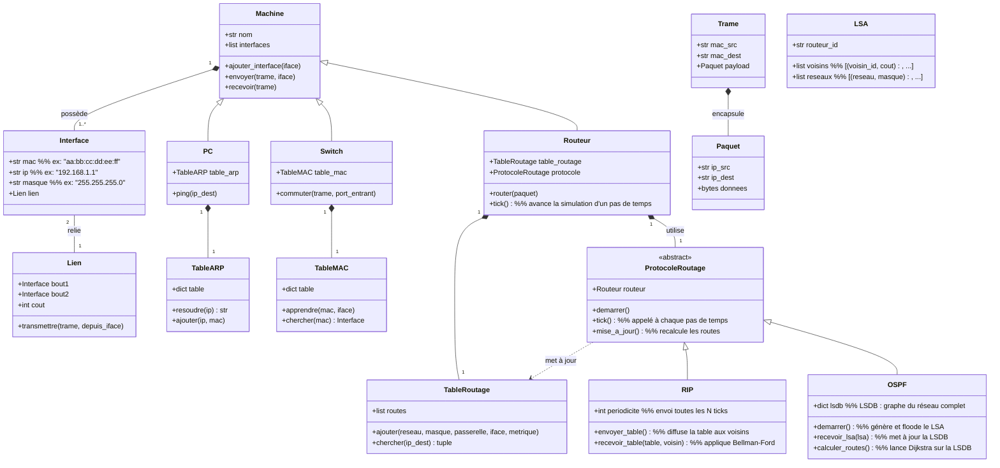
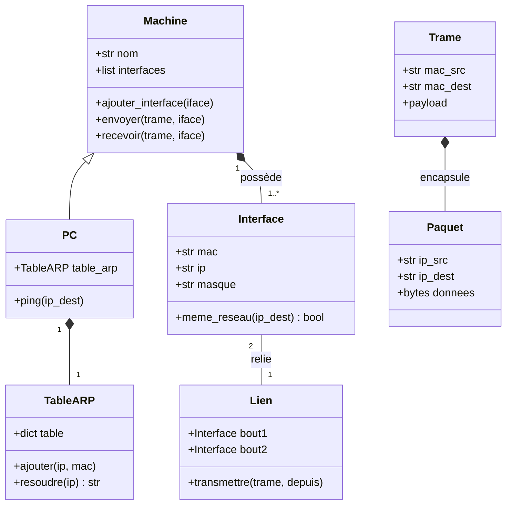
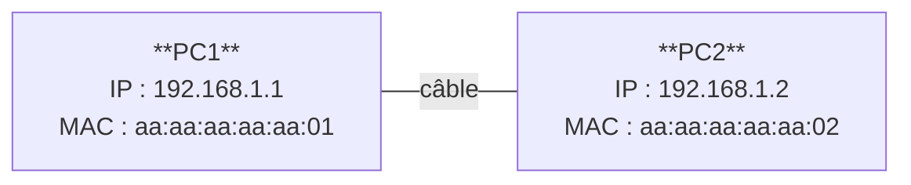
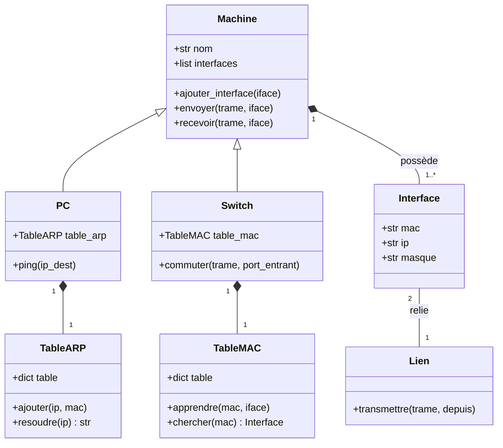
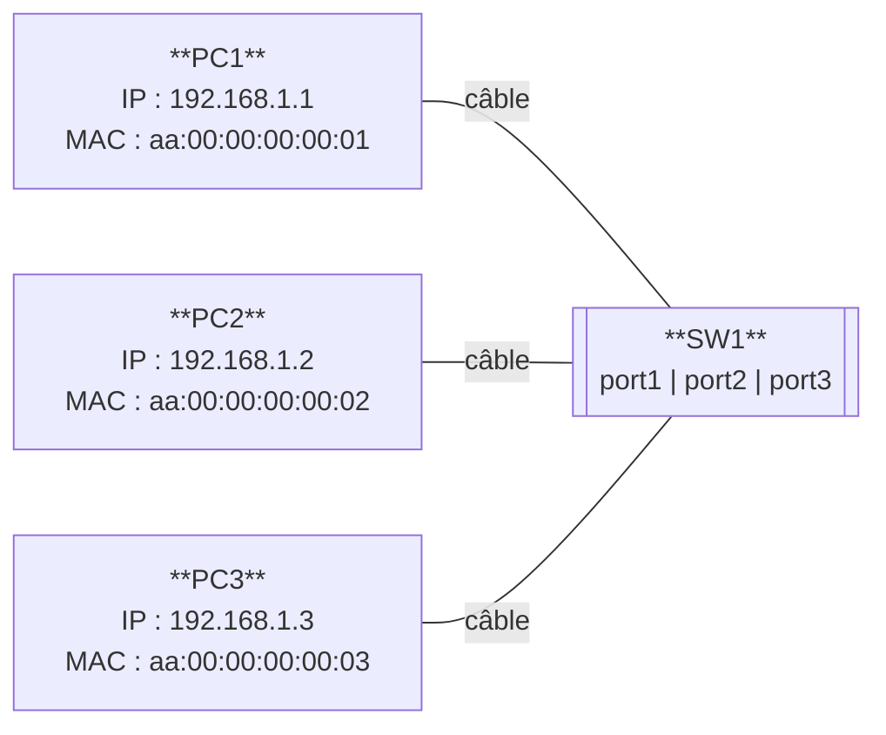
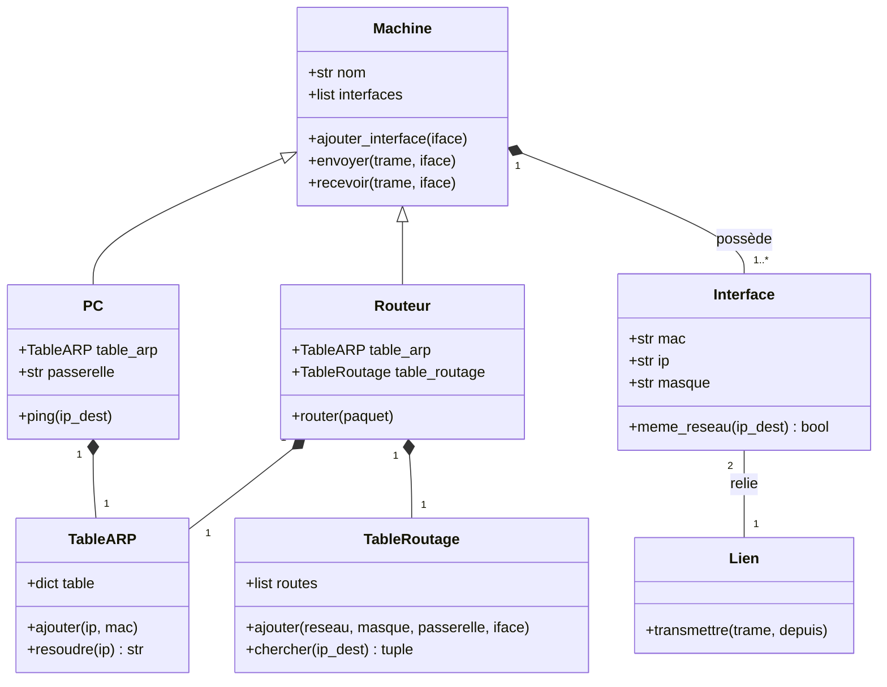
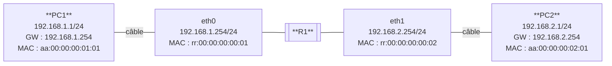
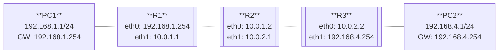
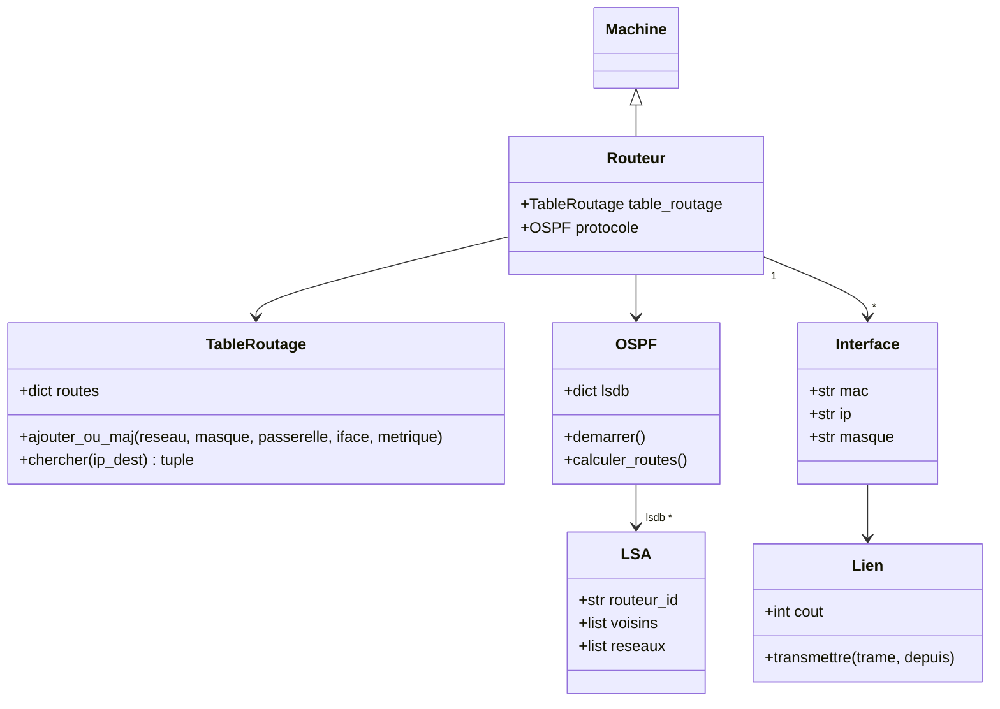
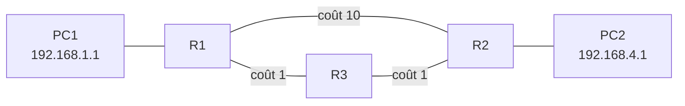

# Modélisation orientée objet




---

## Chapitre 1 - Faire communiquer deux PCs



### Topologie



### Ce qu'on veut obtenir

```
PC1 (192.168.1.1) ----câble---- PC2 (192.168.1.2)

PC1.ping("192.168.1.2")
  [PC1] ARP : qui a 192.168.1.2 ?
  [PC2] ARP réponse : c'est moi (aa:aa:aa:aa:aa:02)
  [PC1] ARP appris : 192.168.1.2 -> aa:aa:aa:aa:aa:02
  [PC2] reçu de 192.168.1.1 : b'ping!'
```

Avant d'envoyer un paquet IP, un PC doit connaitre le MAC de destination : c'est le rôle du protocole **ARP**.

---

### Les messages échangés

```python
class Paquet:
    """Couche 3 - transporté dans une Trame"""
    def __init__(self, ip_src, ip_dest, donnees=b""):
        self.ip_src = ip_src
        self.ip_dest = ip_dest
        self.donnees = donnees


class RequeteARP:
    """Broadcast : qui possède cette IP ?"""
    def __init__(self, ip_src, mac_src, ip_cible):
        self.ip_src = ip_src
        self.mac_src = mac_src
        self.ip_cible = ip_cible


class ReponseARP:
    """Réponse unicast : cette IP m'appartient"""
    def __init__(self, ip_annoncee, mac_annoncee):
        self.ip_annoncee = ip_annoncee
        self.mac_annoncee = mac_annoncee


class Trame:
    """Couche 2 - unité de transfert sur le câble"""
    MAC_BROADCAST = "ff:ff:ff:ff:ff:ff"

    def __init__(self, mac_src, mac_dest, payload):
        self.mac_src = mac_src
        self.mac_dest = mac_dest
        self.payload = payload   # Paquet, RequeteARP ou ReponseARP
```

---

### L'infrastructure

```python
import ipaddress


class TableARP:
    """Associe des adresses IP à des adresses MAC (cache ARP)."""

    def __init__(self):
        self.table = {}          # ip (str) -> mac (str)

    def ajouter(self, ip, mac):
        """Enregistre l'association ip -> mac.

        >>> t = TableARP()
        >>> t.ajouter("192.168.1.2", "aa:bb:cc:dd:ee:ff")
        >>> t.resoudre("192.168.1.2")
        'aa:bb:cc:dd:ee:ff'
        """
        self.table[ip] = mac

    def resoudre(self, ip):
        """Retourne le MAC associé à ip, ou None si inconnu.

        >>> t = TableARP()
        >>> t.resoudre("192.168.1.99") is None
        True
        >>> t.ajouter("192.168.1.1", "aa:00:00:00:00:01")
        >>> t.resoudre("192.168.1.1")
        'aa:00:00:00:00:01'
        """
        return self.table.get(ip)


class Interface:
    """Carte réseau d'une machine : adresse MAC, IP et masque."""

    def __init__(self, mac, ip, masque):
        self.mac = mac
        self.ip = ip
        self.masque = masque
        self.lien = None         # rempli par Lien.__init__
        self.machine = None      # rempli par Machine.ajouter_interface

    def meme_reseau(self, ip_dest):
        """Retourne True si ip_dest appartient au même sous-réseau.

        >>> iface = Interface("aa:bb:cc:dd:ee:ff", "192.168.1.1", "255.255.255.0")
        >>> iface.meme_reseau("192.168.1.42")
        True
        >>> iface.meme_reseau("192.168.2.1")
        False
        >>> iface.meme_reseau("10.0.0.1")
        False
        """
        reseau = ipaddress.ip_network(f"{self.ip}/{self.masque}", strict=False)
        return ipaddress.ip_address(ip_dest) in reseau


class Lien:
    """Câble reliant deux interfaces : livre les trames d'un bout à l'autre."""

    def __init__(self, bout1, bout2):
        self.bout1 = bout1
        self.bout2 = bout2
        bout1.lien = self
        bout2.lien = self

    def transmettre(self, trame, depuis):
        """Livre la trame à l'extrémité opposée à depuis."""
        arrivee = self.bout2 if depuis is self.bout1 else self.bout1
        arrivee.machine.recevoir(trame, arrivee)


class Machine:
    """Equipement réseau de base : gère une liste d'interfaces."""

    def __init__(self, nom):
        self.nom = nom
        self.interfaces = []

    def ajouter_interface(self, iface):
        """Attache iface à cette machine et met à jour la back-reference.

        >>> m = Machine("test")
        >>> iface = Interface("aa:bb:cc:dd:ee:ff", "10.0.0.1", "255.0.0.0")
        >>> m.ajouter_interface(iface)
        >>> iface.machine is m
        True
        >>> m.interfaces == [iface]
        True
        """
        iface.machine = self
        self.interfaces.append(iface)

    def envoyer(self, trame, iface):
        """Affiche la trame et la dépose sur le câble connecté à iface."""
        print(f"  [{self.nom}] --> {trame.mac_src} -> {trame.mac_dest}")
        iface.lien.transmettre(trame, iface)

    def recevoir(self, trame, iface):
        """Traite une trame arrivant sur iface. A implémenter dans les sous-classes."""
        raise NotImplementedError
```

---

### Le PC

```python
class PC(Machine):
    def __init__(self, nom):
        super().__init__(nom)
        self.table_arp = TableARP()

    # --- méthodes privées ---

    def _trouver_interface_vers(self, ip_dest):
        """Renvoie l'interface sur le même réseau que ip_dest, ou None.

        >>> pc = PC("test")
        >>> iface = Interface("aa:bb:cc:dd:ee:01", "192.168.1.1", "255.255.255.0")
        >>> pc.ajouter_interface(iface)
        >>> pc._trouver_interface_vers("192.168.1.99") is iface
        True
        >>> pc._trouver_interface_vers("10.0.0.1") is None
        True
        """
        for iface in self.interfaces:
            if iface.meme_reseau(ip_dest):
                return iface
        return None

    def _envoyer_requete_arp(self, ip_dest, iface):
        requete = RequeteARP(iface.ip, iface.mac, ip_dest)
        trame = Trame(iface.mac, Trame.MAC_BROADCAST, requete)
        print(f"  [{self.nom}] ARP : qui a {ip_dest} ?")
        self.envoyer(trame, iface)

    # --- réception ---

    def recevoir(self, trame, iface):
        payload = trame.payload

        if isinstance(payload, RequeteARP):
            if payload.ip_cible == iface.ip:
                # Apprendre l'émetteur au passage
                self.table_arp.ajouter(payload.ip_src, payload.mac_src)
                # Répondre en unicast
                reponse = ReponseARP(iface.ip, iface.mac)
                rep = Trame(iface.mac, trame.mac_src, reponse)
                print(f"  [{self.nom}] ARP réponse : {iface.ip} -> {iface.mac}")
                self.envoyer(rep, iface)

        elif isinstance(payload, ReponseARP):
            self.table_arp.ajouter(payload.ip_annoncee, payload.mac_annoncee)
            print(f"  [{self.nom}] ARP appris : {payload.ip_annoncee} -> {payload.mac_annoncee}")

        elif isinstance(payload, Paquet):
            if payload.ip_dest == iface.ip:
                print(f"  [{self.nom}] reçu de {payload.ip_src} : {payload.donnees}")

    # --- émission ---

    def ping(self, ip_dest):
        print(f"\n[{self.nom}] ping {ip_dest}")
        iface = self._trouver_interface_vers(ip_dest)
        if not iface:
            print(f"  [{self.nom}] pas de route vers {ip_dest}")
            return

        mac_dest = self.table_arp.resoudre(ip_dest)
        if not mac_dest:
            self._envoyer_requete_arp(ip_dest, iface)
            mac_dest = self.table_arp.resoudre(ip_dest)

        if mac_dest:
            paquet = Paquet(iface.ip, ip_dest, b"ping!")
            trame = Trame(iface.mac, mac_dest, paquet)
            self.envoyer(trame, iface)
        else:
            print(f"  [{self.nom}] {ip_dest} injoignable (pas de réponse ARP)")
```

---

### Exemple complet

```python
if __name__ == "__main__":
    pc1 = PC("PC1")
    pc2 = PC("PC2")

    iface1 = Interface("aa:aa:aa:aa:aa:01", "192.168.1.1", "255.255.255.0")
    iface2 = Interface("aa:aa:aa:aa:aa:02", "192.168.1.2", "255.255.255.0")

    pc1.ajouter_interface(iface1)
    pc2.ajouter_interface(iface2)

    Lien(iface1, iface2)

    pc1.ping("192.168.1.2")   # 1er ping : ARP nécessaire
    pc1.ping("192.168.1.2")   # 2e ping  : ARP déjà en cache
    pc1.ping("10.0.0.1")      # hors réseau
```

Sortie attendue :

```
[PC1] ping 192.168.1.2
  [PC1] ARP : qui a 192.168.1.2 ?
  [PC1] --> aa:aa:aa:aa:aa:01 -> ff:ff:ff:ff:ff:ff
  [PC2] ARP réponse : 192.168.1.2 -> aa:aa:aa:aa:aa:02
  [PC2] --> aa:aa:aa:aa:aa:02 -> aa:aa:aa:aa:aa:01
  [PC1] ARP appris : 192.168.1.2 -> aa:aa:aa:aa:aa:02
  [PC1] --> aa:aa:aa:aa:aa:01 -> aa:aa:aa:aa:aa:02
  [PC2] reçu de 192.168.1.1 : b'ping!'

[PC1] ping 192.168.1.2
  [PC1] --> aa:aa:aa:aa:aa:01 -> aa:aa:aa:aa:aa:02
  [PC2] reçu de 192.168.1.1 : b'ping!'

[PC1] ping 10.0.0.1
  [PC1] pas de route vers 10.0.0.1
```

---

## Chapitre 2 - Trois PCs via un Switch



### Topologie



### Ce qu'on veut obtenir

```
PC1 ---Lien--- port1 \
PC2 ---Lien--- port2  SW1
PC3 ---Lien--- port3 /

PC1.ping("192.168.1.2")
  [PC1] ARP broadcast
  [SW1] flood sur port2 et port3  <- MAC inconnue
  [PC2] ARP réponse
  [SW1] forward sur port1         <- MAC de PC1 apprise
  [PC1] envoie le ping
  [SW1] forward sur port2         <- MAC de PC2 apprise
  [PC2] reçu !
```

Le switch **apprend** les MACs au fur et à mesure : après le premier échange, il sait sur quel port se trouve chaque machine et ne floode plus.

---

### TableMAC

```python
class TableMAC:
    """Associe les adresses MAC aux ports (interfaces) du switch."""

    def __init__(self):
        self.table = {}          # mac (str) -> Interface

    def apprendre(self, mac, iface):
        """Enregistre que mac est joignable via iface.

        >>> t = TableMAC()
        >>> iface = Interface("sw:00:00:00:00:01", "0.0.0.0", "0.0.0.0")
        >>> t.apprendre("aa:00:00:00:00:01", iface)
        >>> t.chercher("aa:00:00:00:00:01") is iface
        True
        """
        self.table[mac] = iface

    def chercher(self, mac):
        """Retourne l'interface associée à mac, ou None si inconnue.

        >>> t = TableMAC()
        >>> t.chercher("aa:00:00:00:00:99") is None
        True
        """
        return self.table.get(mac)
```

---

### Switch

```python
class Switch(Machine):
    """Commutateur réseau : apprend les MACs et commute les trames à la couche 2."""

    def __init__(self, nom):
        super().__init__(nom)
        self.table_mac = TableMAC()

    def recevoir(self, trame, iface_entree):
        """Apprend le MAC source puis commute la trame."""
        self.table_mac.apprendre(trame.mac_src, iface_entree)
        self.commuter(trame, iface_entree)

    def commuter(self, trame, port_entrant):
        """Forward vers le port connu, flood si destination inconnue ou broadcast."""
        if trame.mac_dest == Trame.MAC_BROADCAST:
            print(f"  [{self.nom}] flood (broadcast)")
            self._flood(trame, port_entrant)
        else:
            dest = self.table_mac.chercher(trame.mac_dest)
            if dest:
                num_port = self.interfaces.index(dest) + 1
                print(f"  [{self.nom}] forward -> port{num_port}")
                dest.lien.transmettre(trame, dest)
            else:
                print(f"  [{self.nom}] flood (MAC inconnue)")
                self._flood(trame, port_entrant)

    def _flood(self, trame, port_entrant):
        """Envoie la trame sur tous les ports sauf celui d'entrée."""
        for iface in self.interfaces:
            if iface is not port_entrant:
                iface.lien.transmettre(trame, iface)
```

---

### Exemple complet

```python
if __name__ == "__main__":
    pc1 = PC("PC1")
    pc2 = PC("PC2")
    pc3 = PC("PC3")
    sw  = Switch("SW1")

    # Interfaces des PCs
    eth1 = Interface("aa:00:00:00:00:01", "192.168.1.1", "255.255.255.0")
    eth2 = Interface("aa:00:00:00:00:02", "192.168.1.2", "255.255.255.0")
    eth3 = Interface("aa:00:00:00:00:03", "192.168.1.3", "255.255.255.0")

    # Ports du switch (couche 2 : pas d'IP)
    p1 = Interface("sw:00:00:00:00:01", "0.0.0.0", "0.0.0.0")
    p2 = Interface("sw:00:00:00:00:02", "0.0.0.0", "0.0.0.0")
    p3 = Interface("sw:00:00:00:00:03", "0.0.0.0", "0.0.0.0")

    pc1.ajouter_interface(eth1)
    pc2.ajouter_interface(eth2)
    pc3.ajouter_interface(eth3)
    sw.ajouter_interface(p1)
    sw.ajouter_interface(p2)
    sw.ajouter_interface(p3)

    Lien(eth1, p1)
    Lien(eth2, p2)
    Lien(eth3, p3)

    pc1.ping("192.168.1.2")   # flood ARP, puis forward
    pc1.ping("192.168.1.3")   # ARP flood, puis forward
    pc2.ping("192.168.1.3")   # PC2 connu du switch, ARP flood pour PC3
```

Sortie attendue :

```
[PC1] ping 192.168.1.2
  [PC1] ARP : qui a 192.168.1.2 ?
  [PC1] --> aa:00:00:00:00:01 -> ff:ff:ff:ff:ff:ff
  [SW1] flood (broadcast)
  [PC2] ARP réponse : 192.168.1.2 -> aa:00:00:00:00:02
  [PC2] --> aa:00:00:00:00:02 -> aa:00:00:00:00:01
  [SW1] forward -> port1
  [PC1] ARP appris : 192.168.1.2 -> aa:00:00:00:00:02
  [PC1] --> aa:00:00:00:00:01 -> aa:00:00:00:00:02
  [SW1] forward -> port2
  [PC2] reçu de 192.168.1.1 : b'ping!'

[PC1] ping 192.168.1.3
  [PC1] ARP : qui a 192.168.1.3 ?
  [PC1] --> aa:00:00:00:00:01 -> ff:ff:ff:ff:ff:ff
  [SW1] flood (broadcast)
  [PC3] ARP réponse : 192.168.1.3 -> aa:00:00:00:00:03
  [PC3] --> aa:00:00:00:00:03 -> aa:00:00:00:00:01
  [SW1] forward -> port1
  [PC1] ARP appris : 192.168.1.3 -> aa:00:00:00:00:03
  [PC1] --> aa:00:00:00:00:01 -> aa:00:00:00:00:03
  [SW1] forward -> port3
  [PC3] reçu de 192.168.1.1 : b'ping!'

[PC2] ping 192.168.1.3
  [PC2] ARP : qui a 192.168.1.3 ?
  [PC2] --> aa:00:00:00:00:02 -> ff:ff:ff:ff:ff:ff
  [SW1] flood (broadcast)
  [PC3] ARP réponse : 192.168.1.3 -> aa:00:00:00:00:03
  [PC3] --> aa:00:00:00:00:03 -> aa:00:00:00:00:02
  [SW1] forward -> port2
  [PC2] ARP appris : 192.168.1.3 -> aa:00:00:00:00:03
  [PC2] --> aa:00:00:00:00:02 -> aa:00:00:00:00:03
  [SW1] forward -> port3
  [PC3] reçu de 192.168.1.2 : b'ping!'
```

---

## Chapitre 3 - Routage entre deux réseaux



### Topologie



### Le principe fondamental

Quand PC1 (192.168.1.1) envoie un paquet à PC2 (192.168.2.1) :

```
Hop 1 : PC1 -> R1
  Trame  : src=PC1_MAC       dst=R1_eth0_MAC   <- adresses MAC changent à chaque saut
  Paquet : src=192.168.1.1   dst=192.168.2.1   <- adresses IP restent identiques

Hop 2 : R1 -> PC2
  Trame  : src=R1_eth1_MAC   dst=PC2_MAC
  Paquet : src=192.168.1.1   dst=192.168.2.1   <- inchangées !
```

Le routeur **décapsule** la trame, lit l'IP destination, **ré-encapsule** dans une nouvelle trame vers le prochain saut.

---

### TableRoutage

```python
class TableRoutage:
    """Table de routage : associe des réseaux à des interfaces de sortie."""

    def __init__(self):
        self.routes = []
        # chaque route : (reseau, masque, passerelle, iface)
        # passerelle = None si le réseau est directement connecté

    def ajouter(self, reseau, masque, passerelle, iface):
        """Ajoute une route statique.

        >>> t = TableRoutage()
        >>> iface = Interface("aa:bb:cc:dd:ee:ff", "192.168.1.254", "255.255.255.0")
        >>> t.ajouter("192.168.1.0", "255.255.255.0", None, iface)
        >>> len(t.routes)
        1
        """
        self.routes.append((reseau, masque, passerelle, iface))

    def chercher(self, ip_dest):
        """Retourne (passerelle, iface) pour la meilleure route, ou None.

        Applique le principe du plus long préfixe (longest prefix match).

        >>> t = TableRoutage()
        >>> iface = Interface("aa:bb:cc:dd:ee:ff", "192.168.1.254", "255.255.255.0")
        >>> t.ajouter("192.168.1.0", "255.255.255.0", None, iface)
        >>> passerelle, i = t.chercher("192.168.1.42")
        >>> passerelle is None
        True
        >>> i is iface
        True
        >>> t.chercher("10.0.0.1") is None
        True
        """
        addr = ipaddress.ip_address(ip_dest)
        meilleure_longueur = -1
        meilleur = None
        for reseau, masque, passerelle, iface in self.routes:
            net = ipaddress.ip_network(f"{reseau}/{masque}", strict=False)
            if addr in net and net.prefixlen > meilleure_longueur:
                meilleure_longueur = net.prefixlen
                meilleur = (passerelle, iface)
        return meilleur
```

---

### Routeur

Le routeur gère lui-même l'ARP sur chacune de ses interfaces.

```python
class Routeur(Machine):
    """Routeur : relaie les paquets IP entre réseaux en ré-encapsulant les trames."""

    def __init__(self, nom):
        super().__init__(nom)
        self.table_routage = TableRoutage()
        self.table_arp = TableARP()

    def _envoyer_requete_arp(self, ip_dest, iface):
        requete = RequeteARP(iface.ip, iface.mac, ip_dest)
        trame = Trame(iface.mac, Trame.MAC_BROADCAST, requete)
        print(f"  [{self.nom}] ARP : qui a {ip_dest} ?")
        self.envoyer(trame, iface)

    def recevoir(self, trame, iface):
        payload = trame.payload

        if isinstance(payload, RequeteARP):
            if payload.ip_cible == iface.ip:
                self.table_arp.ajouter(payload.ip_src, payload.mac_src)
                reponse = ReponseARP(iface.ip, iface.mac)
                rep = Trame(iface.mac, trame.mac_src, reponse)
                print(f"  [{self.nom}] ARP réponse : {iface.ip} -> {iface.mac}")
                self.envoyer(rep, iface)

        elif isinstance(payload, ReponseARP):
            self.table_arp.ajouter(payload.ip_annoncee, payload.mac_annoncee)
            print(f"  [{self.nom}] ARP appris : {payload.ip_annoncee} -> {payload.mac_annoncee}")

        elif isinstance(payload, Paquet):
            self._router(payload)

    def _router(self, paquet):
        """Cherche la route, résout le MAC du prochain saut, ré-encapsule et envoie."""
        print(f"  [{self.nom}] route {paquet.ip_src} -> {paquet.ip_dest}")
        resultat = self.table_routage.chercher(paquet.ip_dest)
        if not resultat:
            print(f"  [{self.nom}] pas de route vers {paquet.ip_dest}")
            return
        passerelle, iface_sortie = resultat
        # prochain saut = passerelle si définie, sinon la destination elle-même
        ip_prochain_saut = passerelle if passerelle else paquet.ip_dest

        mac_dest = self.table_arp.resoudre(ip_prochain_saut)
        if not mac_dest:
            self._envoyer_requete_arp(ip_prochain_saut, iface_sortie)
            mac_dest = self.table_arp.resoudre(ip_prochain_saut)

        if mac_dest:
            # nouvelle trame, même paquet IP (src/dst IP inchangés)
            trame = Trame(iface_sortie.mac, mac_dest, paquet)
            self.envoyer(trame, iface_sortie)
        else:
            print(f"  [{self.nom}] {ip_prochain_saut} injoignable")
```

---

### Mise à jour de PC : passerelle par défaut

PC doit maintenant connaitre sa passerelle pour joindre d'autres réseaux.

```python
class PC(Machine):
    def __init__(self, nom, passerelle=None):
        super().__init__(nom)
        self.table_arp = TableARP()
        self.passerelle = passerelle   # IP du routeur sur le réseau local

    def ping(self, ip_dest):
        print(f"\n[{self.nom}] ping {ip_dest}")
        iface = self._trouver_interface_vers(ip_dest)

        if iface:
            # destination locale : ARP direct
            ip_arp = ip_dest
        elif self.passerelle:
            # destination distante : on envoie à la passerelle
            iface = self._trouver_interface_vers(self.passerelle)
            ip_arp = self.passerelle
        else:
            print(f"  [{self.nom}] pas de route vers {ip_dest}")
            return

        mac_dest = self.table_arp.resoudre(ip_arp)
        if not mac_dest:
            self._envoyer_requete_arp(ip_arp, iface)
            mac_dest = self.table_arp.resoudre(ip_arp)

        if mac_dest:
            paquet = Paquet(iface.ip, ip_dest, b"ping!")   # IP dest = cible finale
            trame = Trame(iface.mac, mac_dest, paquet)
            self.envoyer(trame, iface)
        else:
            print(f"  [{self.nom}] {ip_arp} injoignable")
```

---

### Exemple complet

```python
if __name__ == "__main__":
    # Machines
    pc1 = PC("PC1", passerelle="192.168.1.254")
    pc2 = PC("PC2", passerelle="192.168.2.254")
    r1  = Routeur("R1")

    # Interfaces
    pc1_eth0  = Interface("aa:00:00:00:01:01", "192.168.1.1",   "255.255.255.0")
    r1_eth0   = Interface("rr:00:00:00:00:01", "192.168.1.254", "255.255.255.0")
    r1_eth1   = Interface("rr:00:00:00:00:02", "192.168.2.254", "255.255.255.0")
    pc2_eth0  = Interface("aa:00:00:00:02:01", "192.168.2.1",   "255.255.255.0")

    pc1.ajouter_interface(pc1_eth0)
    r1.ajouter_interface(r1_eth0)
    r1.ajouter_interface(r1_eth1)
    pc2.ajouter_interface(pc2_eth0)

    # Câblage
    Lien(pc1_eth0, r1_eth0)
    Lien(r1_eth1,  pc2_eth0)

    # Table de routage du routeur (routes directement connectées)
    r1.table_routage.ajouter("192.168.1.0", "255.255.255.0", None, r1_eth0)
    r1.table_routage.ajouter("192.168.2.0", "255.255.255.0", None, r1_eth1)

    pc1.ping("192.168.2.1")   # inter-réseau via R1
    pc1.ping("192.168.2.1")   # 2e ping : ARP déjà en cache partout
```

Sortie attendue :

```
[PC1] ping 192.168.2.1
  [PC1] ARP : qui a 192.168.1.254 ?
  [PC1] --> aa:00:00:00:01:01 -> ff:ff:ff:ff:ff:ff
  [R1] ARP réponse : 192.168.1.254 -> rr:00:00:00:00:01
  [R1] --> rr:00:00:00:00:01 -> aa:00:00:00:01:01
  [PC1] ARP appris : 192.168.1.254 -> rr:00:00:00:00:01
  [PC1] --> aa:00:00:00:01:01 -> rr:00:00:00:00:01
  [R1] route 192.168.1.1 -> 192.168.2.1
  [R1] ARP : qui a 192.168.2.1 ?
  [R1] --> rr:00:00:00:00:02 -> ff:ff:ff:ff:ff:ff
  [PC2] ARP réponse : 192.168.2.1 -> aa:00:00:00:02:01
  [PC2] --> aa:00:00:00:02:01 -> rr:00:00:00:00:02
  [R1] ARP appris : 192.168.2.1 -> aa:00:00:00:02:01
  [R1] --> rr:00:00:00:00:02 -> aa:00:00:00:02:01
  [PC2] reçu de 192.168.1.1 : b'ping!'

[PC1] ping 192.168.2.1
  [PC1] --> aa:00:00:00:01:01 -> rr:00:00:00:00:01
  [R1] route 192.168.1.1 -> 192.168.2.1
  [R1] --> rr:00:00:00:00:02 -> aa:00:00:00:02:01
  [PC2] reçu de 192.168.1.1 : b'ping!'
```

---

## Chapitre 4 - Protocole RIP

Dans le chapitre précédent, les routes étaient **statiques** : configurées à la main sur chaque routeur. Dès qu'on ajoute un routeur ou qu'un lien tombe, il faut reconfigurer manuellement. Les protocoles de routage **dynamiques** automatisent cela.

**RIP (Routing Information Protocol)** est le plus simple : chaque routeur diffuse périodiquement sa table à ses voisins. Les voisins mettent à jour leur propre table si un meilleur chemin est découvert. C'est l'algorithme de **Bellman-Ford**.

- Métrique = nombre de sauts
- Maximum 15 sauts (16 = infini, réseau inaccessible)
- Convergence en quelques tours d'échange

### Topologie



### Convergence RIP pas à pas

```
Après demarrer() :
  R1 : {192.168.1.0: 1,  10.0.1.0: 1}
  R2 : {10.0.1.0: 1,     10.0.2.0: 1}
  R3 : {10.0.2.0: 1,     192.168.4.0: 1}

Après tick 1 :
  R1 apprend de R2 : 10.0.2.0 (métrique 2)
  R2 apprend de R1 : 192.168.1.0 (2) | de R3 : 192.168.4.0 (2)
  R3 apprend de R2 : 10.0.1.0 (2)

Après tick 2 :
  R1 apprend de R2 : 192.168.4.0 (métrique 3)  <- réseau de PC2 enfin connu !
  R3 apprend de R2 : 192.168.1.0 (métrique 3)

Convergence atteinte.
```

---

### Mise à jour de TableRoutage

On remplace la liste de tuples par un dictionnaire pour permettre la mise à jour des routes existantes.

```python
class TableRoutage:
    """Table de routage indexée par (reseau, masque) pour faciliter les mises à jour RIP."""

    def __init__(self):
        # (reseau, masque) -> [passerelle, iface, metrique]
        self.routes = {}

    def ajouter_ou_maj(self, reseau, masque, passerelle, iface, metrique):
        """Ajoute ou met à jour une route.

        >>> t = TableRoutage()
        >>> iface = Interface("aa:bb:cc:dd:ee:ff", "10.0.1.1", "255.255.255.0")
        >>> t.ajouter_ou_maj("10.0.1.0", "255.255.255.0", None, iface, 1)
        >>> t.routes[("10.0.1.0", "255.255.255.0")][2]
        1
        >>> t.ajouter_ou_maj("10.0.1.0", "255.255.255.0", None, iface, 2)
        >>> t.routes[("10.0.1.0", "255.255.255.0")][2]
        2
        """
        self.routes[(reseau, masque)] = [passerelle, iface, metrique]

    def ajouter(self, reseau, masque, passerelle, iface, metrique=1):
        """Alias de ajouter_ou_maj pour la compatibilité avec le chapitre 3."""
        self.ajouter_ou_maj(reseau, masque, passerelle, iface, metrique)

    def chercher(self, ip_dest):
        """Longest prefix match - retourne (passerelle, iface) ou None.

        >>> t = TableRoutage()
        >>> iface = Interface("aa:bb:cc:dd:ee:ff", "10.0.1.1", "255.255.255.0")
        >>> t.ajouter("10.0.1.0", "255.255.255.0", None, iface, 1)
        >>> passerelle, i = t.chercher("10.0.1.42")
        >>> i is iface
        True
        >>> t.chercher("192.168.1.1") is None
        True
        """
        addr = ipaddress.ip_address(ip_dest)
        meilleure_longueur = -1
        meilleur = None
        for (reseau, masque), (passerelle, iface, _) in self.routes.items():
            net = ipaddress.ip_network(f"{reseau}/{masque}", strict=False)
            if addr in net and net.prefixlen > meilleure_longueur:
                meilleure_longueur = net.prefixlen
                meilleur = (passerelle, iface)
        return meilleur

    def afficher(self, nom):
        """Affiche la table de routage de façon lisible."""
        print(f"\n  Table de routage de {nom}:")
        print(f"  {'Réseau':<22} {'Passerelle':<18} {'Iface':<16} Métrique")
        print(f"  {'-'*65}")
        for (reseau, masque), (passerelle, iface, metrique) in self.routes.items():
            net = ipaddress.ip_network(f"{reseau}/{masque}", strict=False)
            gw = passerelle or "connecté"
            print(f"  {str(net):<22} {gw:<18} {iface.ip:<16} {metrique}")
```

---

### RIP

!!! note "Simplification de simulation"
    En réalité, RIP envoie ses annonces sous forme de datagrammes **UDP port 520** en broadcast sur chaque interface. Ces datagrammes traversent la pile réseau complète : `MessageRIP` encapsulé dans un paquet IP, lui-même encapsulé dans une trame Ethernet broadcast.

    Dans cette simulation, `tick()` appelle directement `voisin.protocole.recevoir_table()` en Python, court-circuitant `Trame`, `Paquet` et ARP. Ce raccourci est assumé volontairement : modéliser UDP/IP pour les messages de contrôle alourdirait l'implémentation sans apporter de compréhension supplémentaire sur Bellman-Ford et la convergence, qui sont l'objet de ce chapitre.

```python
class RIP:
    """Protocole RIP : vecteur de distance par échange de tables entre voisins."""

    INFINI = 16

    def __init__(self, routeur):
        self.routeur = routeur

    def demarrer(self):
        """Peuple la table avec les réseaux directement connectés (métrique 1).

        >>> r = Routeur("R")
        >>> iface = Interface("aa:00:00:00:00:01", "192.168.1.1", "255.255.255.0")
        >>> r.ajouter_interface(iface)
        >>> r.protocole = RIP(r)
        >>> r.protocole.demarrer()
        >>> ("192.168.1.0", "255.255.255.0") in r.table_routage.routes
        True
        """
        for iface in self.routeur.interfaces:
            net = ipaddress.ip_network(f"{iface.ip}/{iface.masque}", strict=False)
            reseau = str(net.network_address)
            self.routeur.table_routage.ajouter_ou_maj(reseau, iface.masque, None, iface, 1)

    def tick(self):
        """Envoie la table courante à chaque voisin RIP direct."""
        for iface in self.routeur.interfaces:
            if not iface.lien:
                continue
            autre = iface.lien.bout2 if iface.lien.bout1 is iface else iface.lien.bout1
            voisin = autre.machine
            if isinstance(voisin, Routeur) and isinstance(voisin.protocole, RIP):
                # autre = interface du voisin sur ce lien = sa porte de sortie vers nous
                voisin.protocole.recevoir_table(
                    self.routeur.table_routage.routes,
                    iface.ip,   # notre IP = passerelle pour les routes que le voisin va apprendre
                    autre       # interface du voisin sur ce lien = iface de sortie pour ces routes
                )

    def recevoir_table(self, routes_voisin, ip_passerelle, iface_sortie):
        """Bellman-Ford : met à jour la table si on trouve un chemin plus court.

        ip_passerelle : IP du voisin qui nous envoie sa table (sera notre gateway).
        iface_sortie  : notre interface connectée à ce voisin.
        """
        for (reseau, masque), (_, _, metrique) in routes_voisin.items():
            nouvelle_metrique = metrique + 1
            if nouvelle_metrique >= self.INFINI:
                continue
            route = self.routeur.table_routage.routes.get((reseau, masque))
            if route is None or route[2] > nouvelle_metrique:
                net = ipaddress.ip_network(f"{reseau}/{masque}", strict=False)
                print(f"  [{self.routeur.nom}] RIP : {net} via {ip_passerelle} métrique {nouvelle_metrique}")
                self.routeur.table_routage.ajouter_ou_maj(
                    reseau, masque, ip_passerelle, iface_sortie, nouvelle_metrique
                )
```

---

### Simulateur

```python
class Simulateur:
    """Orchestre les ticks RIP jusqu'à convergence."""

    def __init__(self, routeurs):
        self.routeurs = routeurs

    def converger(self, max_ticks=20):
        """Lance des ticks jusqu'à ce que les tables ne changent plus."""
        for tick in range(1, max_ticks + 1):
            avant = [dict(r.table_routage.routes) for r in self.routeurs]
            print(f"\n=== Tick {tick} ===")
            for r in self.routeurs:
                if r.protocole:
                    r.protocole.tick()
            apres = [dict(r.table_routage.routes) for r in self.routeurs]
            if avant == apres:
                print(f"\nConvergence atteinte après {tick} tick(s).")
                return
        print("Pas de convergence dans le délai imparti.")
```

---

### Mise à jour de Routeur

```python
class Routeur(Machine):
    def __init__(self, nom):
        super().__init__(nom)
        self.table_routage = TableRoutage()
        self.table_arp = TableARP()
        self.protocole = None   # RIP ou OSPF, configuré après instanciation
```

---

### Exemple complet

```python
if __name__ == "__main__":
    pc1 = PC("PC1", passerelle="192.168.1.254")
    pc2 = PC("PC2", passerelle="192.168.4.254")
    r1, r2, r3 = Routeur("R1"), Routeur("R2"), Routeur("R3")

    pc1_eth = Interface("aa:00:00:00:01:01", "192.168.1.1",   "255.255.255.0")
    r1_e0   = Interface("rr:00:00:01:00:00", "192.168.1.254", "255.255.255.0")
    r1_e1   = Interface("rr:00:00:01:00:01", "10.0.1.1",      "255.255.255.0")
    r2_e0   = Interface("rr:00:00:02:00:00", "10.0.1.2",      "255.255.255.0")
    r2_e1   = Interface("rr:00:00:02:00:01", "10.0.2.1",      "255.255.255.0")
    r3_e0   = Interface("rr:00:00:03:00:00", "10.0.2.2",      "255.255.255.0")
    r3_e1   = Interface("rr:00:00:03:00:01", "192.168.4.254", "255.255.255.0")
    pc2_eth = Interface("aa:00:00:00:04:01", "192.168.4.1",   "255.255.255.0")

    for machine, ifaces in [
        (pc1, [pc1_eth]), (r1, [r1_e0, r1_e1]),
        (r2,  [r2_e0, r2_e1]), (r3, [r3_e0, r3_e1]), (pc2, [pc2_eth])
    ]:
        for iface in ifaces:
            machine.ajouter_interface(iface)

    Lien(pc1_eth, r1_e0)
    Lien(r1_e1,   r2_e0)
    Lien(r2_e1,   r3_e0)
    Lien(r3_e1,   pc2_eth)

    for r in [r1, r2, r3]:
        r.protocole = RIP(r)
        r.protocole.demarrer()

    sim = Simulateur([r1, r2, r3])
    sim.converger()

    for r in [r1, r2, r3]:
        r.table_routage.afficher(r.nom)

    pc1.ping("192.168.4.1")
```

Sortie attendue :

```
=== Tick 1 ===
  [R1] RIP : 10.0.2.0/24 via 10.0.1.2 métrique 2
  [R2] RIP : 192.168.1.0/24 via 10.0.1.1 métrique 2
  [R2] RIP : 192.168.4.0/24 via 10.0.2.2 métrique 2
  [R3] RIP : 10.0.1.0/24 via 10.0.2.1 métrique 2

=== Tick 2 ===
  [R1] RIP : 192.168.4.0/24 via 10.0.1.2 métrique 3
  [R3] RIP : 192.168.1.0/24 via 10.0.2.1 métrique 3

=== Tick 3 ===

Convergence atteinte après 3 tick(s).

  Table de routage de R1:
  Réseau                 Passerelle         Iface            Métrique
  -----------------------------------------------------------------
  192.168.1.0/24         connecté           192.168.1.254    1
  10.0.1.0/24            connecté           10.0.1.1         1
  10.0.2.0/24            10.0.1.2           10.0.1.1         2
  192.168.4.0/24         10.0.1.2           10.0.1.1         3

  Table de routage de R2:
  Réseau                 Passerelle         Iface            Métrique
  -----------------------------------------------------------------
  10.0.1.0/24            connecté           10.0.1.2         1
  10.0.2.0/24            connecté           10.0.2.1         1
  192.168.1.0/24         10.0.1.1           10.0.1.2         2
  192.168.4.0/24         10.0.2.2           10.0.2.1         2

  Table de routage de R3:
  Réseau                 Passerelle         Iface            Métrique
  -----------------------------------------------------------------
  10.0.2.0/24            connecté           10.0.2.2         1
  192.168.4.0/24         connecté           192.168.4.254    1
  10.0.1.0/24            10.0.2.1           10.0.2.2         2
  192.168.1.0/24         10.0.2.1           10.0.2.2         3

[PC1] ping 192.168.4.1
  [PC1] ARP : qui a 192.168.1.254 ?
  ...
  [PC2] reçu de 192.168.1.1 : b'ping!'
```

---

## Chapitre 5 - Protocole OSPF

### RIP vs OSPF

RIP mesure les routes en **sauts** : un routeur à 2 sauts est toujours préféré à un routeur à 3 sauts, quelle que soit la bande passante des liens. OSPF associe un **coût** à chaque lien (inversement proportionnel à sa bande passante) et calcule les chemins de coût minimal avec l'algorithme de **Dijkstra**.

Pour cela, chaque routeur inonde un **LSA** (*Link State Advertisement*) qui décrit ses voisins et ses réseaux directement connectés. Chaque routeur accumule tous les LSA dans une **LSDB** (*Link State Database*) : c'est le graphe complet du domaine. Dijkstra calcule alors les plus courts chemins depuis chaque routeur.

### Classes impliquées



### Topologie - Le Diamant

R1 est relié à R2 par un lien lent (coût 10) et à R3 par un lien rapide (coût 1). R3 est aussi relié à R2 (coût 1). RIP choisirait le chemin direct R1 - R2 (1 saut) ; OSPF choisit R1 - R3 - R2 (coût total 2 contre 10).



---

### Mise à jour de Lien

Le paramètre `cout` est ajouté (valeur par défaut 1 : compatible avec tous les chapitres précédents).

```python
class Lien:
    def __init__(self, bout1, bout2, cout=1):
        self.bout1 = bout1
        self.bout2 = bout2
        self.cout = cout
        bout1.lien = self
        bout2.lien = self
```

---

### LSA

```python
class LSA:
    """Link State Advertisement : décrit les voisins et réseaux d'un routeur."""

    def __init__(self, routeur_id, voisins, reseaux):
        """
        routeur_id : nom du routeur émetteur (str)
        voisins    : [(voisin_id, cout), ...] - routeurs OSPF adjacents
        reseaux    : [(reseau, masque), ...] - réseaux directement connectés
        """
        self.routeur_id = routeur_id
        self.voisins = voisins
        self.reseaux = reseaux
```

---

### OSPF

!!! note "Simplification de simulation"
    En réalité, OSPF envoie ses LSA en **multicast IP** (224.0.0.5), encapsulés dans des paquets de protocole 89. Le flooding s'accompagne de numéros de séquence et d'acquittements pour éviter les boucles et les doublons.

    Ici, `_flooder_lsa()` parcourt directement les objets Python par BFS, et `recevoir_lsa()` est appelé sans passer par la pile réseau. L'objectif est d'illustrer la construction de la LSDB et l'algorithme de Dijkstra, qui sont le coeur d'OSPF.

```python
class OSPF:
    """Protocole OSPF - état de lien avec algorithme de Dijkstra."""

    def __init__(self, routeur):
        self.routeur = routeur
        self.lsdb = {}   # routeur_id -> LSA

    def demarrer(self):
        """Ajoute les routes directes, génère le LSA local et le floode.

        Appeler pour tous les routeurs avant calculer_routes().
        """
        for iface in self.routeur.interfaces:
            net = ipaddress.ip_network(f"{iface.ip}/{iface.masque}", strict=False)
            reseau = str(net.network_address)
            self.routeur.table_routage.ajouter_ou_maj(reseau, iface.masque, None, iface, 0)
        lsa = self._generer_lsa()
        self.lsdb[self.routeur.nom] = lsa
        self._flooder_lsa(lsa)

    def _generer_lsa(self):
        """Construit le LSA à partir des interfaces du routeur."""
        voisins = []
        reseaux = []
        for iface in self.routeur.interfaces:
            if iface.lien is None:
                continue
            net = ipaddress.ip_network(f"{iface.ip}/{iface.masque}", strict=False)
            reseaux.append((str(net.network_address), iface.masque))
            autre = iface.lien.bout2 if iface.lien.bout1 is iface else iface.lien.bout1
            if isinstance(autre.machine, Routeur) and isinstance(getattr(autre.machine, 'protocole', None), OSPF):
                voisins.append((autre.machine.nom, iface.lien.cout))
        return LSA(self.routeur.nom, voisins, reseaux)

    def _flooder_lsa(self, lsa):
        """Propage le LSA à tous les routeurs OSPF voisins par BFS."""
        visites = {self.routeur.nom}
        file = [self.routeur]
        while file:
            courant = file.pop(0)
            for iface in courant.interfaces:
                if iface.lien is None:
                    continue
                autre = iface.lien.bout2 if iface.lien.bout1 is iface else iface.lien.bout1
                voisin = autre.machine
                if isinstance(voisin, Routeur) and voisin.nom not in visites:
                    visites.add(voisin.nom)
                    if isinstance(getattr(voisin, 'protocole', None), OSPF):
                        voisin.protocole.recevoir_lsa(lsa)
                    file.append(voisin)

    def recevoir_lsa(self, lsa):
        """Stocke un LSA reçu s'il est nouveau."""
        if lsa.routeur_id not in self.lsdb:
            self.lsdb[lsa.routeur_id] = lsa

    def calculer_routes(self):
        """Dijkstra sur la LSDB pour installer les meilleures routes.

        Appeler après que tous les routeurs ont appelé demarrer().
        """
        import heapq
        src = self.routeur.nom
        dist = {src: 0}
        via = {}   # routeur_id -> premier saut (routeur_id) depuis src
        file = [(0, src)]
        while file:
            cout, courant = heapq.heappop(file)
            if cout > dist.get(courant, float('inf')):
                continue
            lsa = self.lsdb.get(courant)
            if lsa is None:
                continue
            for voisin_id, cout_lien in lsa.voisins:
                nouveau = cout + cout_lien
                if nouveau < dist.get(voisin_id, float('inf')):
                    dist[voisin_id] = nouveau
                    via[voisin_id] = voisin_id if courant == src else via[courant]
                    heapq.heappush(file, (nouveau, voisin_id))

        direct_nets = set()
        for iface in self.routeur.interfaces:
            net = ipaddress.ip_network(f"{iface.ip}/{iface.masque}", strict=False)
            direct_nets.add((str(net.network_address), iface.masque))

        meilleures = {}
        for routeur_id, lsa in self.lsdb.items():
            if routeur_id == src:
                continue
            prochain_nom = via.get(routeur_id)
            if prochain_nom is None:
                continue
            ip_pg, iface_loc = self._trouver_passerelle(prochain_nom)
            if ip_pg is None:
                continue
            for reseau, masque in lsa.reseaux:
                if (reseau, masque) in direct_nets:
                    continue
                cout_route = dist[routeur_id]
                if (reseau, masque) not in meilleures or cout_route < meilleures[(reseau, masque)][2]:
                    meilleures[(reseau, masque)] = (ip_pg, iface_loc, cout_route)

        for (reseau, masque), (ip_pg, iface_loc, cout_route) in meilleures.items():
            self.routeur.table_routage.ajouter_ou_maj(reseau, masque, ip_pg, iface_loc, cout_route)

    def _trouver_passerelle(self, voisin_nom):
        """Retourne (ip_voisin, iface_locale) pour joindre un voisin direct."""
        for iface in self.routeur.interfaces:
            if iface.lien is None:
                continue
            autre = iface.lien.bout2 if iface.lien.bout1 is iface else iface.lien.bout1
            if autre.machine.nom == voisin_nom:
                return autre.ip, iface
        return None, None
```

---

### Exemple complet

```python
if __name__ == "__main__":
    pc1 = PC("PC1", passerelle="192.168.1.254")
    pc2 = PC("PC2", passerelle="192.168.4.254")
    r1, r2, r3 = Routeur("R1"), Routeur("R2"), Routeur("R3")

    pc1_eth = Interface("aa:00:00:00:01:01", "192.168.1.1",   "255.255.255.0")
    r1_eth0 = Interface("rr:00:00:01:00:00", "192.168.1.254", "255.255.255.0")
    r1_eth1 = Interface("rr:00:00:01:00:01", "10.0.1.1",      "255.255.255.0")
    r1_eth2 = Interface("rr:00:00:01:00:02", "10.0.2.1",      "255.255.255.0")
    r2_eth0 = Interface("rr:00:00:02:00:00", "10.0.1.2",      "255.255.255.0")
    r2_eth1 = Interface("rr:00:00:02:00:01", "10.0.3.2",      "255.255.255.0")
    r2_eth2 = Interface("rr:00:00:02:00:02", "192.168.4.254", "255.255.255.0")
    r3_eth0 = Interface("rr:00:00:03:00:00", "10.0.2.2",      "255.255.255.0")
    r3_eth1 = Interface("rr:00:00:03:00:01", "10.0.3.1",      "255.255.255.0")
    pc2_eth = Interface("aa:00:00:00:02:01", "192.168.4.1",   "255.255.255.0")

    pc1.ajouter_interface(pc1_eth)
    for iface in [r1_eth0, r1_eth1, r1_eth2]: r1.ajouter_interface(iface)
    for iface in [r2_eth0, r2_eth1, r2_eth2]: r2.ajouter_interface(iface)
    for iface in [r3_eth0, r3_eth1]: r3.ajouter_interface(iface)
    pc2.ajouter_interface(pc2_eth)

    Lien(pc1_eth, r1_eth0)
    Lien(r1_eth1, r2_eth0, cout=10)   # lien lent
    Lien(r1_eth2, r3_eth0)             # liens rapides (cout=1 par défaut)
    Lien(r3_eth1, r2_eth1)
    Lien(r2_eth2, pc2_eth)

    for r in [r1, r2, r3]:
        r.protocole = OSPF(r)
    for r in [r1, r2, r3]:
        r.protocole.demarrer()          # phase 1 : génère et floode les LSA
    for r in [r1, r2, r3]:
        r.protocole.calculer_routes()   # phase 2 : Dijkstra sur la LSDB complète

    for r in [r1, r2, r3]:
        r.table_routage.afficher(r.nom)

    pc1.ping("192.168.4.1")
```

Sortie attendue :

```
  Table de routage de R1:
  Réseau                 Passerelle         Iface            Métrique
  -----------------------------------------------------------------
  192.168.1.0/24         connecté           192.168.1.254    0
  10.0.1.0/24            connecté           10.0.1.1         0
  10.0.2.0/24            connecté           10.0.2.1         0
  10.0.3.0/24            10.0.2.2           10.0.2.1         1
  192.168.4.0/24         10.0.2.2           10.0.2.1         2

  Table de routage de R2:
  Réseau                 Passerelle         Iface            Métrique
  -----------------------------------------------------------------
  10.0.1.0/24            connecté           10.0.1.2         0
  10.0.3.0/24            connecté           10.0.3.2         0
  192.168.4.0/24         connecté           192.168.4.254    0
  192.168.1.0/24         10.0.3.1           10.0.3.2         2
  10.0.2.0/24            10.0.3.1           10.0.3.2         1

  Table de routage de R3:
  Réseau                 Passerelle         Iface            Métrique
  -----------------------------------------------------------------
  10.0.2.0/24            connecté           10.0.2.2         0
  10.0.3.0/24            connecté           10.0.3.1         0
  192.168.1.0/24         10.0.2.1           10.0.2.2         1
  10.0.1.0/24            10.0.2.1           10.0.2.2         1
  192.168.4.0/24         10.0.3.2           10.0.3.1         1

[PC1] ping 192.168.4.1
  [PC1] ARP : qui a 192.168.1.254 ?
  ...
  [R1] ARP : qui a 10.0.2.2 ?
  ...
  [R3] ARP : qui a 10.0.3.2 ?
  ...
  [R2] ARP : qui a 192.168.4.1 ?
  ...
  [PC2] reçu de 192.168.1.1 : b'ping!'
```

R1 envoie son ARP pour **10.0.2.2** (R3) et non pour **10.0.1.2** (R2 direct) : Dijkstra a sélectionné le chemin R1 - R3 - R2 (coût 2) plutôt que le lien direct R1 - R2 (coût 10).
