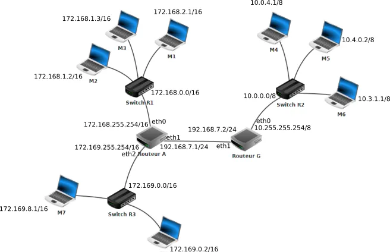
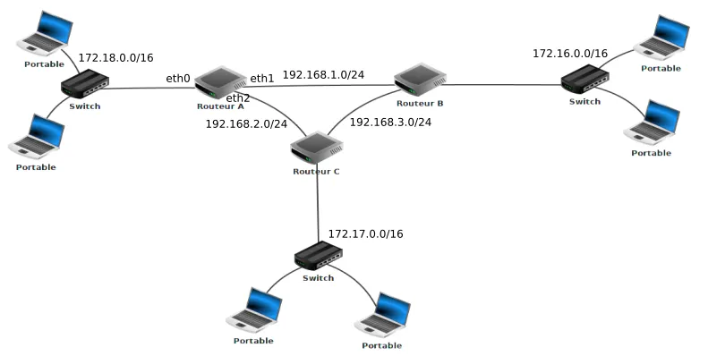
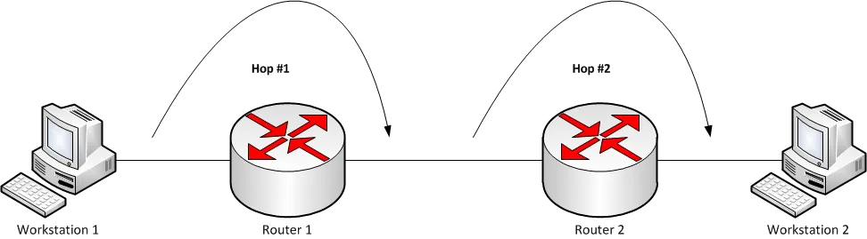

# Le Routage

## 1. Introduction au Routage

### 1.1 Définition du Routage
Le routage est le processus de transmission de données entre différents réseaux. Il implique la sélection du chemin optimal pour atteindre la destination, assurant ainsi une communication efficace.

### 1.2 Importance du Routage dans les Réseaux
Le routage est essentiel pour connecter des réseaux hétérogènes et acheminer les données de manière intelligente. Il permet la croissance des réseaux tout en maintenant des performances optimales.

### 1.3 Types de Routage
- **Routage Statique :** Les itinéraires sont configurés manuellement. Simple, mais peut être difficile à gérer dans des réseaux dynamiques.
- **Routage Dynamique :** Les itinéraires sont déterminés automatiquement par des protocoles de routage. Plus adaptable à des environnements en évolution.

## 2. Tables de routage d'un routeur

La table de routage associe des destinations à des interfaces de sortie et aux coûts associés (la métrique, qui dépend de la méthode de routage).

!!! warning "Interface"
      Attention, pour simplifier, quand on parle d'interface, on parle de carte réseau, pas de machine. Ca n'est pas votre ordinateur qui a une adresse IP. C'est la carte réseau. Si vous avez plusieurs cartes réseau, vous avez plusieurs adresses IP. Derrière un routeur, chaque prise correspond à une interface différente, dont à une adresse IP différente, souvent sur des sous-réseaux différents.

Lorsqu’un routeur reçoit un paquet celui-ci comporte une adresse IP de destination. Pour savoir dans quelle direction envoyer le paquet, chaque routeur possède une table de routage.

Une table de routage est un tableau indiquant pour chaque réseau de destination(connu à partir de l’IP de la destination), quelle interface réseau on peut utiliser en lui associant également une métrique qui mesure la «distance» séparant le routeur du réseau de destination.

!!! hint "Afficher une table de routage:"

      - Sous Windows : `route print`
      - Sous Unix/OS X : `netstat -rn`
      - Sous Linux : `ip -4/-6 route`

#### Diagramme d’un réseau

Les adresses près des switchs sont les adresses réseau.

Ce réseau contient:

- Trois réseaux locaux:
      - R1 dont l’adresse est 172.168.0.0/16 avec trois machines M1 à M3.
      - R2 dont l’adresse est 10.0.0.0/8 avec trois machines M4 à M6.
      - R3 dont l’adresse est 172.169.0.0/16 avec deux machines M7 et M8.
- Deux routeurs:
      - Routeur A qui possède 3 interfaces réseau que l’on nomme eth0, eth1 et eth2. Les adresses IP liées à ces interfaces réseau sont : 172.168.255.254/16 (eth0), 172.169.255.254/16 (eth2) et 192.168.7.1/24 (eth1).
      - Routeur G qui possède 2 interfaces réseau que l’on nomme eth0 et eth1. Les adresses IP liées à ces interfaces réseau sont : 10.255.255.254/8 (eth0) et 192.168.7.2/24 (eth1).

Voici une table de routage possible simplifiée du routeur A:

|Réseau | Interface |	Métrique|
|--|--|--|
|172.168.0.0/16	| eth0 |	0|
|192.168.7.0/24	| eth1 | 0|
|172.169.0.0/16	| eth2 | 0|
|10.0.0.0/8	| eth1 |1|

## 3. Routage Statique

### 3.1 Concept de Routage Statique
Le routage statique implique la configuration manuelle des itinéraires sur un routeur. Les itinéraires restent inchangés jusqu'à ce qu'ils soient modifiés manuellement.

### 3.2 Configuration des Routes Statiques
Les routes statiques sont configurées en ajoutant des entrées manuelles dans la table de routage du routeur.

### 3.3 Avantages et Inconvénients du Routage Statique
Avantages : Contrôle total sur les itinéraires. Inconvénients : Difficile à maintenir dans des réseaux complexes.

## 4. Routage Dynamique

### 4.1 Fonctionnement du Routage Dynamique

Le routage dynamique utilise des protocoles de routage pour automatiser le processus de découverte et de sélection des itinéraires. Deux protocoles couramment utilisés sont RIP (Routing Information Protocol) et OSPF (Open Shortest Path First).

### 4.2 Protocoles de Routage Dynamique

Nous utiliserons ce diagramme à partir de maintenant

#### 4.2.1 RIP (Routing Information Protocol)

**Fonctionnement :** RIP mesure la distance en sauts (nombre de routeurs à traverser) entre les routeurs pour déterminer la meilleure route vers une destination. C'est à dire celle qui nécessite le moins de sauts. Les routeurs échangent périodiquement des informations de routage, et chaque routeur maintient une table de routage avec le nombre de sauts vers chaque réseau. 

Au départ chaque routeur ne connait que les réseaux directement accessibles, avec une distance nulle.

Ensuite, toutes les 30 secondes, les réseaux envoient leurs tables de routages à leurs voisins directement accessibles, à la réception chaque routeur met à jour sa table de routage en associant à chaque destination la passerelle avec la plus courte distance en saut.

L'algorithme utilisé est une variante distribuée de l'algorithme de Bellman-Ford, qui permet à chaque nœud de calculer la distance entre 2 sommets d'un graphe selon cette définition récursive (pour un graphe non pondéré):

$$\large d(x, y, V) = \begin{cases}
   0 &\text{si } x=y \\
   \infin &\text{si } x \in V \\
   \displaystyle \min_{v \in voisins(x)\backslash V} 1 + d(v,y, V \cup \{x\}) &\text{sinon}
\end{cases}
$$

$V$ est l'ensemble des voisins visités.

On calcule 1 plus la distance de $v$ à $y$ pour chaque voisin $v$ de $x$ non visité. Puis en prenant le minimum, on obtient notre résultat. Il sera assez simple de programmer une telle formule lorsque vous aure compris la programmation dynamique. Pour un graphe pondéré, il suffit de remplacer le $1$ par $c(x,v)$ qui est le poids (ou coût) de l'arête $(x,v)$

!!! question Exercices
      1. En vous basant sur le protocole RIP (métrique = nombre de sauts), déterminez la table de routage du routeur A
      2. Quel est, d’après la table de routage construite ci-dessus, le chemin qui sera emprunté par un paquet pour aller d’une machine ayant pour adresse IP 172.18.1.1/16 à une machine ayant pour adresse IP 172.16.5.3/16 ?

Sur de grands réseaux, ce protocole provoque un trafic important, et de plus il possède des failles de sécurité rendant ces réseaux vulnérables à certaines attaques.

#### 4.2.2 OSPF (Open Shortest Path First)

**Fonctionnement :** OSPF utilise un algorithme SPF (Shortest Path First) pour calculer le chemin le plus court vers chaque réseau. Les routeurs échangent des informations sur l'état de leurs liens, et une base de données topologique est construite pour déterminer le meilleur chemin. Cet algorithme est une application concrète de l'algorithme de Dijkstra (Encore un BFS avec plugin).

Dans le protocole OSPF, les routeurs ont une vision globale du réseau et pas seulement de leurs voisins directs.

De plus, la métrique utilisée n’est plus le nombre de sauts, mais le coût de la liaison. Celui-ci tient compte du débit binaire de chaque liaison en bits par seconde.

On définit le coût par l’expression:

$$\text{coût} = {10^8\over \text{débit en Mbit/s}} $$

Le coût est inversement proportionnel à la vitesse, donc il est faible quand la vitesse est élevée, et vice-versa.

On peut représenter le réseau par un graphe dans laquelle les routeurs et les switchs sont des noeuds et les liaisons des arêtes étiquetées avec des coûts.

On cherche donc le chemin de coût le plus faible dans le graphe pondéré associé au réseau.

!!! question Exercices
      1. En vous basant sur le protocole OSPF (métrique = somme des coûts), déterminez la table de routage du routeur A.
      2. On donne les débits suivants :
         - liaison routeur A - routeur B : 1 Mbit/s
         - liaison routeur A - routeur C : 10 Mbit/s
         - liaison routeur C - routeur B : 10 Mbit/s
      Quel est, d’après la table de routage construite ci-dessus, le chemin qui sera emprunté par un paquet pour aller d’une machine ayant pour adresse IP 172.18.1.1/16 à une machine ayant pour adresse IP 172.16.5.3/16 ?

## Algorithme de Dijkstra

Le protocole OSPF (Open Shortest Path First) est une implémentation distribuée de l’algorithme de Dijkstra. Cet algorithme calcule le plus court chemin depuis un sommet vers tous les autres dans un graphe pondéré sans poids négatif.

Dijkstra repose sur une idée proche du parcours en largeur (BFS), mais avec une amélioration essentielle : on ne visite pas les sommets "dans l’ordre où on les découvre", mais "dans l’ordre croissant de leur coût depuis la source".

Cela nécessite une structure de données particulière appelée file de priorité (ou priority queue). Contrairement à une file FIFO classique, dans une file de priorité, on extrait toujours l’élément ayant la priorité la plus élevée (ici : la distance minimale).

On peut implémenter la file de priorité avec une structure efficace, comme par exemple un tas binaire (binary heap) qui permet des opérations rapides en :

- insertion
- extraction du minimum
- diminution de clé
