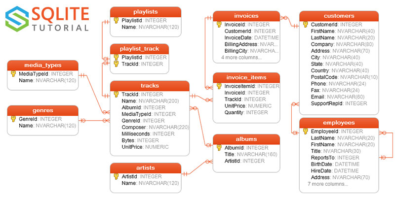

# Base de données et SGBD

EN CONSTRUCTION

!!! abstract "Introduction"
    Une base de données est un ensemble de données structurées.

    Un système de gestion de bases de données (SGBD) est un outil permattant de stocker et d'interagir avec des bases de données.

    Il existe plusieurs modèles pour stocker les données dans une base de données.

    Nous allons nous intéresser au modèle dit **relationnel**.

    Nous utiliserons les SGBD SQLite et Postgresql.


# Le modèle relationnel

Nous travaillerons avec cette base de données exemple bien connue qui s'appelle chinook.




## La théorie de l'algèbre relationnelle


Ne vous laissez pas avoir par le caractère ronflant des définitions. Au final, on manipule des lignes et des colonnes.

!!! abstract "Relation"
    Une relation est un ensemble fini d'entités relevant d'un même concept. les entités sont décrites par certaines de leur caractéristiques. Une relation a un nom par lequel elle est identifiée.

    Sur le dessin de la base de données, Chaque "boîte" est une relation.
    Par exemple, on a la relation Artiste.

!!! abstract "Attributs"
    Toute caractéristique décrivant les entités de la relation est appelée **attribut** de la relation.

    Par exemple, la relation Artiste a l'attribut Name.

!!! abstract "Domaine d'un attribut"
    Chaque attribut a un **domaine**. Il s'agit de l'ensemble des valeurs que peut prendre l'attribut. Le domaine de l'attribut Name de la relation Artiste est "chaîne de caractères"


!!! danger "Vocabulaire"
    En pratique, les mots attributs, relation et schéma ne sont pas utilisés en dehors de l'étude de l'algèbre relationnelle, qui constitue l'outil théorique derrière le modèle relationnel.

    Vous entendrez parler de:

    - Tables pour les relations
    - Champs (Fields) ou colonnes (columns), pour les attributs
    - Enregistrements (Records) ou lignes (rows) pour les entités
    - Le mot schéma est souvent utilisé pour décrire l'ensemble des tables constituant une base de données.


!!! tip "Notations - Algèbre relationnelle"

    Soit $R$ une relation avec n attributs. Cette relation est notée $R(a_1:dom_1, a_2: dom_2, ..., a_n:dom_n)$


    Par exemple, pour employee: **Employee(EmployeeId: entier, LastName: chaîne de caractère, FirstName: .....)**

    Un **n-uplet** (ou **tuple**) de $R$, est une entité respectant le schéma de $R$.

    L'**ensemble** des n-uplets d'une relation à un instant donné compose une **instance** de la relation.

    Cette définition ensembliste n'est pas anodine car elle impose que l'ordre des n-uplets n'a pas d'importance et qu'il ne peut pas y avoir de n-uplets identiques.

---

## La pratique

Un SGBD est un outil permettant de stocker et d'interagir avec des bases de données.


!!! abstract "SQL"
    SQL (Structured Query Language) est un langage de requête structurel. Il permet de manipuler des bases de données structurées.
    Il fonctionne avec des clauses.

### Requêtes SQL

!!! abstract "Les clauses SELECT et FROM"

    Sous cet encart, écrivez et exécutez:
    ```sql
    SELECT mediatypeid, name
    FROM media_types;
    ```

    - La clause FROM permet de signifier les relations sur lesquelles vous voulez travailler.
    - La clause SELECT permet de demander quels attributs vous voulez obtenir, séparés par une virgule.
    - `*` signifie tous les attributs de la relation.
    - **Toute requête se termine par un point-virgule**

    Essayez ces autres requêtes:
    ```sql
    SELECT *
    FROM media_types;

    SELECT title
    FROM albums
    LIMIT 3;
    ```

    - En SQLite, la clause LIMIT permet de ne renvoyer que les premiers enregistrements. C'est pratique pour tester des requêtes sans afficher des milliers de résultats.


{{sqlide titre="Exécuter des requêtes sur chinook:" base="assets/chinook.db" espace="chinook"}}


!!! abstract "La clause WHERE"
    La clause where permet d'émettre une condition sur les enregistrements récupérés.
    Par exemple, pour connaître tous les clients habitant en France, exécutez:

    ```sql
    SELECT *
    FROM customers
    WHERE country = 'France';
    ```

    Essayez cette autre requêtes:
    ```sql
    SELECT *
    FROM customers
    WHERE country = 'France' AND city = 'Paris';

    ```

    Dans une clause WHERE, on émet une condition sur les attributs des tables sur lesquelles on travaille.

    !!! tip "L'opérateur pratique LIKE"
        L'opérateur like permet une recherche basée sur un motif.

        - `WHERE Name LIKE 'A%'` : renvoie vrai pour tous les noms qui commencent par "A".
        - `WHERE Name LIKE '%land'` : renvoie vrai pour tous les noms qui se terminent par "land".
        - `WHERE Name LIKE '%an%'` : renvoie vrai pour tous les noms contenant "an".

        `%` représente 0 ou plusieurs caractères

        - `WHERE Name LIKE 'J_n'` : renvoie vrai pour "Jan", "Jon", etc.
        - `WHERE Name LIKE 'C_t%'` : renvoie vrai pour "Cat", "Cut", etc.

        `_` représente un seul caractère

!!! tip "Entraînement et CheatSheet"
    Voici un lien où vous pouvez vous entraîner sur des exemples variés:
    [Entraînement SQL](https://sqlzoo.net/wiki/SQL_Tutorial)

    Et voici une cheatsheet sur les fonctionnalités basiques: [SQL CheatSheet](/docs/assets/SQL_cheat_sheet.pdf)

!!! question "Exercices - automatismes"

    Pour chaque item de la liste suivante, écrivez la requête qui permet de l'obtenir. Notez que dans le contxte d'évaluation écrite, vous devez progressivement vous efforcer d'écrire vos requêtes afin qu'elles fonctionnent du premier coup, et pas d'y aller au petit bonheur la chance.

    Vous conserverez les réponses dans un fichier .sql
    
    Vous pouvez écrire des commentaires dans un fichier sql en les faisant précéder de `--`

    1. Les clients situés dans le pays "Canada".
    2. Le prénom et le nom des clients vivant à "Paris".
    3. Les clients dont l'email contient "yahoo".
    4. Les clients dont l'identifiant de support est "3".
    5. Les noms des employés qui travaillent dans la ville de "Calgary".
    6. Les employés avec le titre "Sales Support Agent".
    7. Les employés engagés après l'année 2003.
    8. Les informations des employés dont le supérieur a l'ID "1".
    9. Les factures d'un client ayant l'ID "10".
    10. Les factures dont le total est supérieur à 10.
    11. Les factures émises en "2010".
    12. Les factures provenant du pays "USA".
    13. Les titres dont la durée dépasse 5 minutes.
    14. Les artistes dont le nom contient "The".
    15. Les artistes dont le nom commence par "A".
    16. Les albums dont le titre contient "Greatest Hits".


{{sqlide titre="Exécuter des requêtes sur chinook:" base="assets/chinook.db" espace="chinook"}}

!!! abstract "Les fonctions d'agrégation"

    - SUM : Calcule la somme des valeurs d'une colonne.
    - COUNT : Compte le nombre de lignes (ou d'éléments non nuls) dans une colonne.
    - MAX : Retourne la valeur maximale d'une colonne.
    - MIN : Retourne la valeur minimale d'une colonne.
    - AVG : Calcule la moyenne des valeurs d'une colonne. (average)

    Par exemple, pour obtenir le nombre de factures, vous pouvez utiliser `SELECT COUNT(*) FROM invoices;`

    Pour calculer la moyenne du montant des factures, vous pouvez utiliser `SELECT AVG(total) FROM invoices;`

!!! questions "Exercices - fonctions d'agrégation"
    Calculer:

    1. Le nombre de factures.
    2. La somme des montants des factures.
    3. La moyenne des montants des factures.
    4. La valeur minimale des montants des factures.
    5. La valeur maximale des montants des factures.
