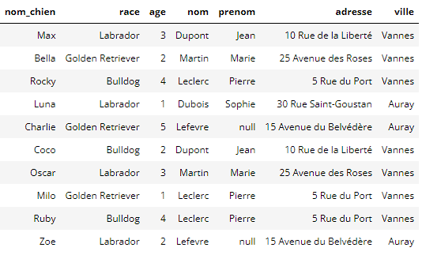
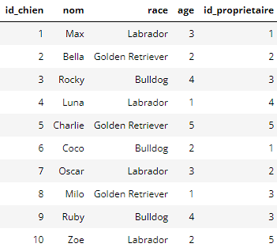

# Manipulation et intégrité

## Constitution et modification d'une base

!!! abstract "Des chiens et des propriétaires"

    Une clinique vétérinaire dispose de ces données sur des chiens et leur propriétaire.

    Ces données ne sont pas adaptées:

    - Que doit-on faire si Pierre Leclerc change d'adresse?
    - Que se passe-t-il si plusieurs personnes s'appellent Jean Dupont dans le même immeuble?

    Dans le même table, on a des informations sur 2 types d'entités: Des personnes et des chiens.




Exécutez les requêtes suivantes:

```sql
PRAGMA foreign_keys=ON;            /* SQLite seulement */
DROP TABLE IF EXISTS chien;        /* Supprimer la table chien si elle existe */
DROP TABLE IF EXISTS proprietaire; /* Supprimer la table proprietaire si elle existe */
```

{{sqlide titre="Exécuter des requêtes:" espace="chiens"}}


!!! hint "Création de table"

    On utilise la syntaxe `CREATE TABLE`.

    Ici nous voulons créer la table propriétaire.

    Chaque champ a un type, il est indiqué quelle(s) colonne(s) portent la clé primaire.

    - INT -> Entier
    - VARCHAR(50) -> Chaîne de caractères de taille maximale 50


!!! danger Clé primaire
    La base de données n'autorisera pas la création d'enregistrements ayant une clé primaire existante.


```sql
-- Création de la table "proprietaire"
CREATE TABLE proprietaire (
    id_proprietaire INT PRIMARY KEY,
    nom VARCHAR(50),
    prenom VARCHAR(50),
    adresse VARCHAR(100),
    ville VARCHAR(50)
);
```

!!! note Insertion de données dans une table

    On utilise la syntaxe `INSERT INTO`.

    Ici nous voulons insérer des enregistrements dans la table proprietaire.

    On indique l'ordre des colonnes entre parenthèse.

    On utilise la clause `VALUES` afin d'insérer les tuples/enregistrements.

    - INT -> Entier
    - VARCHAR(50) -> Chaîne de caractères de taille maximale 50

```sql
-- Insertion de quelques enregistrements dans la table "proprietaire"
INSERT INTO proprietaire (id_proprietaire, nom, prenom, adresse, ville)
VALUES
    (1, 'Dupont', 'Jean', '10 Rue de la Liberté', 'Vannes'),
    (2, 'Martin', 'Marie', '25 Avenue des Roses', 'Vannes'),
    (3, 'Leclerc', 'Pierre', '5 Rue du Port', 'Vannes'),
    (4, 'Dubois', 'Sophie', '30 Rue Saint-Goustan', 'Auray'),
    (5, 'Lefevre', NULL, '15 Avenue du Belvédère', 'Auray');
```


```sql
-- vérification du contenu ded la table
select * from proprietaire;
```

!!! note Mise à jour de données dans une table

    On utilise la syntaxe `UPDATE SET WHERE`.

    On a enfin trouvé le prénom de Monsieur Lefevre, c'est Tom.

    ```sql
    UPDATE proprietaire
    SET prenom = 'TOM'
    WHERE id_proprietaire is null;
    ```

    (is est spécifique à null, l'équivalent de None en Python, sinon, pour tester une égalité, on utilise un simple =)


!!! question "Mise à jour"

    Jean Dupont s'appelle en réalité Aristide Dupont. Ecrire et exécuter la requête permettant ce changement.


!!! question La table chiens

    Voici ci-dessous la table chiens.

    **Créer la table et insérer les données correspondantes.**

    ```sql
    DROP TABLE IF EXISTS chien;
    CREATE TABLE chien (
        ...,
        ...,
        ...,
        FOREIGN KEY (id_proprietaire) REFERENCES proprietaire(id_proprietaire)
    );
    ```

    La ligne FOREIGN KEY indique que la colonne id_propriétaire fait référence à la clé primaire de la table proprietaire.

    Ainsi:

    - On ne peut pas insérer de chien dont l'id_proprietaire n'existe pas dans la table proprietaire
    - On en peut pas supprimer de propriétaires qui ont des chiens (dans la table chien)
    - On ne peut pas mettre à jour un chien avec un id_proprietaire qui n'existe pas.




{{sqlide titre="Exécuter des requêtes:" espace="chiens"}}

!!! question "Anomalies d'insertion"

    Lisa Potiron arrive avec un chien nommé Bidule.

    Voici le code que quelqu'un a écrit pour faire état de ces changements.

    ```sql
    INSERT INTO chien (id_chien, nom, race, age, id_proprietaire)
    VALUES
        (8, 'Bidule', 'Chihuahua', 1, 11);

    INSERT INTO proprietaire (id_proprietaire, nom, prenom, adresse, ville)
    VALUES
        (11, 'Potiron', 'Lisa', '10 Rue de la forêt', 'Auray');
    ```

    Quels sont les problèmes consécutifs qui vont être rencontrés lors de l'exécution de ces requêtes d'insertion?

    Reprendre ce code afin qu'il s'exécute correctement.

!!! question "Anomalie de suppression"

    Madame Martin est décédée. Elle a légué ses chiens à Sophie Dubois.

    Voici le code que quelqu'un a écrit pour faire état de ces changements.

    ```sql
    DELETE FROM proprietaire
    WHERE id = 2;

    UPDATE chiens
    SET proprietaire_id = 4
    WHERE proprietaire_id = 2;

    ```
    Quel est le problème qui va être rencontré lors de l'exécution de ces requêtes d'insertion?

    Reprendre ce code afin qu'il s'exécute correctement.


## Contraintes d'intégrité

!!! abstract "Définition"
    Une contrainte d'intégrité est une propriété associée à la base de données, que les données de la base doivent toujours satisfaire.
    Les 2 principaux types de contraintes d'intégraité sont les suivantes:

    - Contrainte d'unicité
    - Contrainte d'inclusion


### Contrainte d'unicité


!!! abstract "Contrainte d'unicité"

    Une contrainte d'unicité a pour objectif de permettre l'identification unique d'une entité au sein d'une relation, entre autre pour éviter la création d'information redondante.

    (On va donc chercher à définir un ensemble d'attribut suffisant pour pouvoir identifier un enregistrement unique dans une table.)


!!! abstract "Superclé (surclé)"

    Attributs d’une relation permettant d’identifier un n-uplet de façon unique.


!!! abstract "Clé candidate (ou simplement clé)"

    Une clé candidate est une surclé de taille minimale


!!! example "Exemple"

    Imaginons la relation $Film(titre, sortie, réalisateur, budget, URI)$ où URI est une adresse http pointant vers une page web du film.

    Des surclés possibles (non exhaustif) sont:

    - {titre, sortie}
    - {titre, sortie, réalisateur}
    - {titre, sortie, budget}
    - {titre, sortie, URI}
    - {titre, sortie, réalisateur, budget}
    - {titre, sortie, réalisateur, budget, URI}
    - {URI}
    - {URI, titre}
    - {URI, budget}
    - {URI, titre, sortie}
    - {URI, titre, sortie, réalisateur}

    {titre, sortie} est une clé candidate mais {titre, sortie, réalisateur} ne l'est pas car elle contient une surclé (elle n'est pas minimale)

    {URI} est une autre clé candidate mais {URI, titre} ne l'est pas pour les mêmes raisons.


!!! abstract "Clé Primaire (PRIMARY KEY)"

    Une clé primaire est une clé candidate réellement choisie pour faire office de contrainte d'unicité sur la relation. Une relation ne comporte qu'une clé primaire.

    $\underline{Notation}:$

    On Souligne dans la définition de la relation les attributs choisis pour clé primaire. Par exemple, si on choisit titre et sortie:

    $Film(\underline{titre}, \underline{sortie}, réalisateur, budget, URI)$


!!! danger "Réalité des clés primaires"

    Dans la réalité, une clé primaire sera un identifiant qu'on donnera à chaque enregitrement de la table. Les bases de donnée disposent de mécanisme permettant de les générer automatiquement. Pour simplifier, lorsque vous avez un identifiant de commande, il s'agit d'une clé primaire de la table commandes. Lorsque vous avez un numéro de client, il s'agit de la clé primaire de la table clients.

    Pourquoi? Il est généralement hasardeux de présumer de l'unicité et de l'invariabilité d'un sous-ensemble d'attributs dans la relation. Par exemple, lorsque nous supposons que {titre, sortie} est une superclé, est-on réellement certain que deux films ne sortiront pas en même temps dans le monde sous le même titre? NON. **Soyez extrêmement critiques à ce sujet dans les questions qu'on pourrait vous poser**

    Ceci est d'ailleurs un problème pour les mutuelles françaises qui n'ont pas le droit d'utiliser le numéro de sécurité sociale dans leur système d'information afin d'identifier uniquement les assurés. Elles doivent alors se réfugier dans la présomption d'unicité d'une multitude d'attributs, ce qui occasionne toujours et encore des problèmes (par exemple, il faut penser à demander aux clients le rang gémellaire quand des parents assurent des jumeaux, plusieurs personnes ayant les même caractéritiques peuvent habiter dans le même immeuble, à l'état civil, des gens peuvent changer de nom, de prénom, de sexe, etc...). Sur des millions de personnes, ces cas qui peuvent paraître à la marge ne peuvent pas être ignorés. On se retrouverait donc à se trimballer une charette d'attributs partout où on veut faire référence à une personne, d'autant plus qu'ils peuvent changer. **On ne veut pas de clé primaire dont les attributs peuvent changer dans le temps, sous peine de devoir répliquer les modifications dans l'ensemble du système d'information**.


!!! danger "Violation de clé primaire"

    Dans la description de la table employees, le champ EmployeeId est clé primaire. (on voit la colonne pk à 1)

    Cette requête d'insertion échoue car l'employeeId 1 existe déjà:

    ```sql
    insert into employees(EmployeeId, FirstName, LastName) 
    values (1, 'prenom', 'nom');
    ```


{{sqlide titre="Exécuter des requêtes sur chinook:" base="assets/chinook.db" espace="chinook"}}

### Contrainte d'inclusion

L'idée ici est de s'assurer qu'à chaque fois qu'on fait référence à une entité dans une base de données, celle-ci existe.

!!! abstract Clé étrangère

    Une clé étrangère est un ensemble d'attributs qui est la clé primaire d'une autre table. Elle permet d'associer à des entités de la table une entité provenant d'une autre table.


!!! example Exemple

    ```sql
    -- Clés étrangères de la table employees
    PRAGMA foreign_key_list('employees');

    -- Clés étrangères de la table customers
    PRAGMA foreign_key_list('customers');

    /* 3 premiers employés de la table */
    select * from employees
    limit 3;

    /* 3 premiers clients de la table */
    select * from customers
    limit 3;

    ```

    Un client se voit affecter un employé en support. Il s'agit de la colonne SupportRepId. SupportRepId est une clé étrangère de la table customer qui fait référence à la clé primaire de la table employee.

    Ainsi, on voit que le client Luís Gonçalves a pour support l'employé de SupportRepId 3, à savoir Jane Peacock.


    La table employee a aussi une clé étrangère qui fait référence à elle-même: ReportsTo (qui donne l'identifiant de son supérieur hiérarchique). Jane Peacock a pour supérieur hiérarchique l'identifiant 2, à savoir Nancy Edwards, qui réfère elle-même à Andrew Adams.


### Anomalies liées aux contraintes

```sql
pragma foreign_keys=0N;

/* 
Anomalie d'insertion - NOT NULL
Cette requête d'insertion échoue car le champ email est obligatoire.
On ne veut pas autoriser de client sans email.
*/

insert into customers(CustomerId, FirstName, LastName) 
values (257, 'prenom', 'nom');

/* 
Anomalie d'insertion - clé étrangère
Cette requête d'insertion échoue car il n'y a pas d'employé 2435.
On n'autorise pas la création d'un client dont le support est renseigné sans correspondre à rien.
*/

insert into customers(CustomerId, FirstName, LastName, Email, SupportRepId) 
values (257, 'prenom', 'nom', 'bidule@truc.com', 2345);

pragma table_info('customers');

/* 
Anomalie de suppression - FOREIGN KEY
Cette requête de suppression échoue car il y a des clients rattachés à cet employé par une clé étrangère.
Si la base autorisait la suppression de l'employé, des clients se retrouveraient sans support associé.
Si on veut réellement supprimer l'employé de la base, il faut au préalable réaffecter tous ses clients à d'autres employés.
*/

delete from employees where EmployeeId = 3;
```


!!! question "Quelques aspects légaux de base (recherche)"

    - Comment s'appelle l'ensemble des lois qui régit en Europe la gestion des données à caractère personnel?
    - A quelle condition puis-je créer cette base de données?
    - Les données personnelles de mes clients appartiennent-t-elles à mes clients?

    Une autre clinique vétérinaire souhaite acheter les données de ma base.

    - A quelle condition puis-je légalement le faire?

