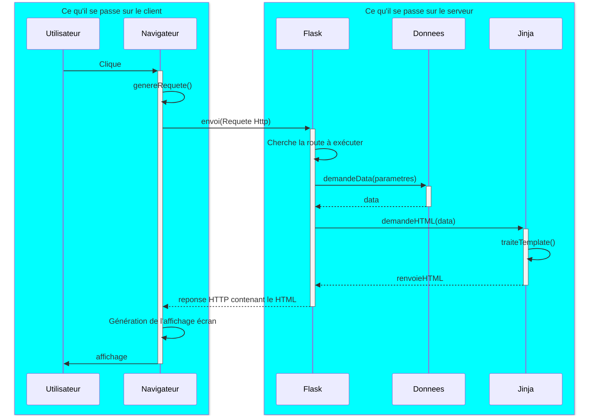

# Gestion d'un lycée

L'application flask qui vous a été transmise permet de gérer une liste d'élèves stockés dans une base de données

!!! danger "Je ne veux pas voir de cosmétique"
    L'application est volontairement moche. Aucun CSS n'a été rajouté, car la cosmétique ajoute énormément de code qui nuit à la compréhension globale, il y a déjà beaucoup à faire et ça va vous perdre.
    Nous verrons **ensuite** qu'il est assez facile de la faire resembler à quelque chose de regardable grâce à bootstrap, pour ceux que ça intéresse.

## Mission 1: Analyse et Compréhension

Le protocole HTTP est basé sur un protocole client-serveur. Ce protocole est utilisé par le navigateur web pour communiquer avec un serveur.

Ce protocole inclue plusieurs types de communication, qu'on nomme des méthodes HTTP.

Nous ne nous préoccuperons que de deux de ces méthodes:

- GET
    - Il s'agit d'une requête au serveur dans laquelle les paramètres sont tous inclus dans l'URL
- POST
    - Il s'agit d'une requête au serveur dans laquelle les paramètres sont inclus dans le corps de la requête

En règle générale, Lorsqu'un utilisateur interagit avec une page web:

- Il peut cliquer sur un lien (ou une image comportant un lien)

```html
<a href="https://www.monsite.com/afficherproduit/idproduit/16758"></a>
```

Voici à quoi ressemble cette requête qui sera envoyée au serveur:

```
GET /afficherproduit/idproduit/16758 HTTP/1.1
Host: www.monsite.com
```

Ici le navigateur demande au serveur distant de lui répondre avec les paramètres de la requête inclus dans le lien.
Le serveur lui renverra le html permettant d'afficher la page web du produit 16758.

- Il peut soumettre un formulaire. On dit qu'il poste les données d'un formulaire au serveur.

```html
<form method="POST" action="https://www.monsite.com/inscription_utilisateur">
    <input type="text" name="prenom">
    <input type="text" name="nom">
    <input type="submit">
</form>
```
En cliquant sur le bouton submit, l'utilisateur soummet son formulaire et les paramètres sont inclus dans le corps de la requête.

Voici à quoi ressemble cette requête qui sera envoyée au serveur:

```
POST https://www.monsite.com/inscription_utilisateur HTTP/1.1
Host: www.monsite.com
Content-Type: application/x-www-form-urlencoded

prenom=Jean&nom=Dupont
```

TOUT le web réside sur l'exploitation de ces méthodes.

!!! danger Distinctions importantes
    - Le HTML, le CSS, et le javascript sont interprétés par le navigateur du client.
    - Tout ce qui est python est interprété sur le serveur.

## Flask

Flask est un framework qui permet de construire des applications web.

Ceci suffit à créer un serveur web, qui ne sait rien faire pour le moment.

```python
from flask import Flask

app = Flask(__name__)
```

Lorsqu'une requête est envoyée au serveur Flask, il traite la requête et renvoie une page web au navigateur.

Les requêtes entrantes sont appelées **request** et les requêtes sortantes sont appelées **response**.

pour traiter l'exemple du GET, on a besoin d'ajouter une route:

```python

@app.route('/afficherproduit/<int:idproduit>')
def afficher_produit(idproduit):
    return f"Affichage du produit {idproduit}"
```

Avec ce code, la chaine de caractères "Affichage du produit 16758" sera envoyée au navigateur du client en réponse à sa requête.

Le HTML n'est que du texte. On voudrait bien l'afficher en page web.

## Jinja2

Jinja2 est un moteur de template. Il permet de créer du texte HTML dynamique.

Dans le répertoire templates (Flask a besoin de ce répertoire), on peut créer des fichiers html.

Voici le fichier `templates\produit.jinja`	
```html
<!DOCTYPE html>
<html>
    <head>
        <title>Mon site</title>
    </head>
    <body>
        <h1>Produit {idproduit}</h1>
    </body>
</html>
```

```python
from flask import Flask, render_template

app = Flask(__name__)

@app.route('/afficherproduit/<int:idproduit>', methods=['GET'])
def afficher_produit(idproduit):
    p = svc.get_produit(idproduit)   ## Demande de données
    return render_template('produit.html', produit=p)   ## Demande et renvoi de HTML
```

Ici, la route `afficher_produit` renvoie le template `produit.jinja` avec la variable `idproduit` passée en paramètre.
Jinja va compléter le texte HTML dynamiquement avant de l'envoyer au serveur.


Ce mode de fonctionnement n'est pas propre à Flask, on le retrouve un peu partout.

Voici le diagramme qui résumme la séquence des évènements quand un utilsateur innteragit avec une page web:




## Blueprints

En flask, un blueprint sert déjà à regrouper plusieurs routes.
En effet, si on gère des élèves, des profs, des salles, des agents, des cours, des notes, etc, on ne veut pas se retrouver avec un
fichier qui contient tout, c'est ingérable.

On va donc créer un fichier `produits.py` qui contient toutes les routes qui concernent les produits.

On appellera ce fichier le controlleur des produits.

```python
from flask import Blueprint

produits = Blueprint('produits', __name__)

@produits.route('/<int:idproduit>', methods=['GET'])
def afficher_produit(idproduit):
    return render_template('produit.html', idproduit=idproduit)
```

et dans le fichier app.py:

```python
from flask import Flask
from produits import produits

app = Flask(__name__)
app.register_blueprint(produits)
```

## Ce qui vous est livré

Une application minimaliste qui permet de gérer une liste d'élèves.

En réalité, on vous a fourni l'application contenant un CRUD pour les élèves.

Un CRUD est un ensemble de routes qui permettent de créer, modifier, supprimer et lire des données. (Create, Read, Update, Delete)


## Démarrer l'application

Dépaqueter l'application dans votre répertoire `projet`.

Il faut ajouter les dépendances flask et psycopg2 (pour postgresql)

```bash
uv add flask psycopg2
```

On démarre le serveur ainsi:

```bash
flask run --debug
```

Le site est alors accessible sur http://127.0.0.1:5000

## Exercices

Les exercices suivants se font progressivement ainsi:

- Etudier les modifications de la base de données à effectuer.
- Effectuer les modifications.
- Recenser les fichiers à créer t/ou modifier dans le code
- Procéder aux modifications
- A chaque pas, tester si l'application fonctionne toujours.

Il faut toujours vérifier que tout fonctionne encore, et qu'une modification n'a pas engendré de régression.
Une régression est un bug qui survient dans quelque chose qui fonctionnait à cause de l'ajout d'une fonctionnalité.
Leur détection fait partie du travail de recette de projet. 
La recette d'un projet est la phase de tests d'une nouvelle mouture d'une application avant de la rendre publique.
Il existe différents types de tests, ici, il s'agit de TNR (tests de non régression)
Les développeurs font attention, mais quand on a le nez dans le guidon, on ne peut pas tout voir.
C'est le travail spécifique de certaines personnes de construire des plans de test et de les exécuter.
Ces personnes sont souvent rattachés au QC (quality control).
Ce ne sont pas des développeurs, c'est une partie de l'entreprise qui se charge de tester.

!!! question "Ajouter l'âge dans l'application Flask"
    Lorsqu'un développeur arrive sur un projet, on lui donne une petite tâche qui sert surtout à prendre en main une architecture parfois complexe. (Ici ça n'est pas le cas) 
    Votre client veut que vous ajoutiez la possibilité de gérer la date de naissance de l'élève

!!! question "Un élève doit avoir une classe"
    Votre client veut que vous ajoutiez la possibilité de gérer la classe de l'élève.

    Il faut donc un CRUD pour les classes, ainsi que la possibilité pour un élève de sélectionner sa classe.

!!! question "Un élève doit avoir des notes"
    Votre client veut que vous ajoutiez la possibilité de gérer les notes de l'élève.

    Il faut donc un CRUD pour les notes d'un élève.

    Les notes d'un élève 

    Le client veut que ans la liste des élèves, on puisse voir et modifier les notes