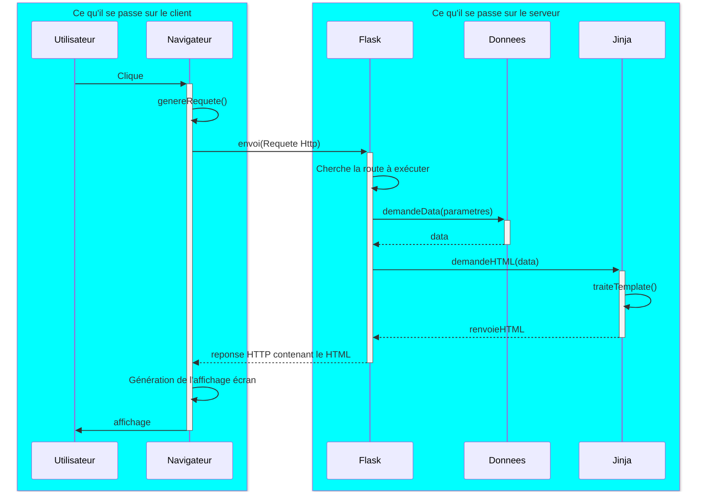

# Gestion d'un lycée - Fullstack

L'application flask qui vous a été transmise permet de gérer une liste d'élèves stockés dans une base de données    

!!! hint "C'est dur au début"
    Il est normal de trouver cette activité dure au début, car il faut penser à plein de choses en même temps.
    Moyennant une implication constante, vous passerez un cap, non seulement dans la compréhension des concepts, mais encore mieux, dans leur assimilation pérenne.

    Les explications techniques sont volontairement légères, afin de ne pas alourdir l'accès à la compréhension globale (le point de cette activité).

!!! danger "Je ne veux pas voir de cosmétique"
    L'application est volontairement moche. Aucun CSS n'a été rajouté, car la cosmétique ajoute énormément de code qui nuit à la compréhension globale, il y a déjà beaucoup à faire et ça va vous perdre.
    Nous verrons **ensuite** qu'il est assez facile de la faire resembler à quelque chose de regardable grâce à bootstrap, pour ceux que ça intéresse.

## Mission 1: Analyse et Compréhension

Le protocole HTTP est basé sur un protocole client-serveur. Ce protocole est utilisé par le navigateur web pour communiquer avec un serveur.

Ce protocole inclue plusieurs types de communication, qu'on nomme des méthodes HTTP.

Nous ne nous préoccuperons que de deux de ces méthodes:

- GET
    - Il s'agit d'une requête au serveur dans laquelle les paramètres sont tous inclus dans l'URL
- POST
    - Il s'agit d'une requête au serveur dans laquelle les paramètres sont inclus dans le corps de la requête

En règle générale, Lorsqu'un utilisateur interagit avec une page web:

- Il peut cliquer sur un lien (ou une image comportant un lien)

```html
<a href="https://www.monsite.com/afficherproduit/idproduit/16758"></a>
```

Voici à quoi ressemble cette requête qui sera envoyée au serveur:

```
GET /afficherproduit/idproduit/16758 HTTP/1.1
Host: www.monsite.com
```

Ici le navigateur demande au serveur distant de lui répondre avec les paramètres de la requête inclus dans le lien.
Le serveur lui renverra le html permettant d'afficher la page web du produit 16758.

- Il peut soumettre un formulaire. On dit qu'il poste les données d'un formulaire au serveur.

```html
<form method="POST" action="https://www.monsite.com/inscription_utilisateur">
    <input type="text" name="prenom">
    <input type="text" name="nom">
    <input type="submit">
</form>
```
En cliquant sur le bouton submit, l'utilisateur soummet son formulaire et les paramètres sont inclus dans le corps de la requête.

Voici à quoi ressemble cette requête qui sera envoyée au serveur:

```
POST /inscription_utilisateur HTTP/1.1
Host: www.monsite.com
Content-Type: application/x-www-form-urlencoded

prenom=Jean&nom=Dupont
```

Le web réside principalement sur l'exploitation de ces méthodes.

## Flask

Flask est un framework qui permet de construire des applications web.

Ceci suffit à créer un serveur web, qui ne sait rien faire pour le moment.

```python
from flask import Flask

app = Flask(__name__)
```

Lorsqu'une requête est envoyée au serveur Flask, il traite la requête et renvoie une page web au navigateur.

Les requêtes entrantes sont appelées **request** et les requêtes sortantes sont appelées **response**.

pour traiter l'exemple du GET, on a besoin d'ajouter une route:

```python

@app.route('/afficherproduit/<int:idproduit>')
def afficher_produit(idproduit):
    return f"Affichage du produit {idproduit}"
```

Avec ce code, la chaine de caractères "Affichage du produit 16758" sera envoyée au navigateur du client en réponse à sa requête.

Le HTML n'est que du texte. On voudrait bien l'afficher en page web.

## Jinja2

Jinja2 est un moteur de template. Il permet de créer du texte HTML dynamique.

Dans le répertoire templates (Flask a besoin de ce répertoire), on peut créer des fichiers html.

Voici le fichier `templates\produit.jinja`	
```html
<!DOCTYPE html>
<html>
    <head>
        <title>Mon site</title>
    </head>
    <body>
        <h1>Produit {idproduit}</h1>
    </body>
</html>
```

```python
from flask import Flask, render_template

app = Flask(__name__)

@app.route('/afficherproduit/<int:idproduit>', methods=['GET'])
def afficher_produit(idproduit):
    p = svc.get_produit(idproduit)   ## Demande de données
    return render_template('produit.html', produit=p)   ## Demande et renvoi de HTML
```

Ici, la route `afficher_produit` renvoie le template `produit.jinja` avec la variable `idproduit` passée en paramètre.
Jinja va compléter le texte HTML dynamiquement avant de l'envoyer au serveur.


Ce mode de fonctionnement n'est pas propre à Flask, on le retrouve un peu partout.

Voici le diagramme qui résumme la séquence des évènements quand un utilsateur innteragit avec une page web:




## Blueprints

En flask, un blueprint sert déjà à regrouper plusieurs routes.
En effet, si on gère des élèves, des profs, des salles, des agents, des cours, des notes, etc, on ne veut pas se retrouver avec un
fichier qui contient tout, c'est ingérable.

On va donc créer un fichier `produits.py` qui contient toutes les routes qui concernent les produits.

On appellera ce fichier le controlleur des produits.

```python
from flask import Blueprint

produits = Blueprint('produits', __name__)

@produits.route('/<int:idproduit>', methods=['GET'])
def afficher_produit(idproduit):
    return render_template('produit.html', idproduit=idproduit)
```

et dans le fichier app.py:

```python
from flask import Flask
from produits import produits

app = Flask(__name__)
app.register_blueprint(produits)
```

## Ce qui vous est livré

Une application minimaliste qui permet de gérer une liste d'élèves.

En réalité, on vous a fourni l'application contenant un CRUD pour les élèves.

Un CRUD est un ensemble de fonctionnalités qui permettent de créer, lire, modifier et supprimer des données relatives à un objet formel. (Create, Read, Update, Delete).


## Démarrer l'application

Dépaqueter l'application dans votre répertoire `projet`.

Il faut ajouter les dépendances flask et psycopg2 (pour postgresql)

```bash
uv add flask psycopg2
```

On démarre le serveur ainsi:

```bash
flask run --debug
```

Le site est alors accessible sur http://127.0.0.1:5000

## Exercices

!!! tip "Méthode"
    Les "exercices" suivants se font progressivement ainsi:

    - Etudier les modifications de la base de données à effectuer (mettre à jour le MPD).
    - Effectuer les modifications de la base avec des données exemples.
    - Effectuer les changements dans le modèle de classes en conséquence.
    - Effectuer les changements dans les services de données.
    - Créer/modifier le contrôleur nécessaire.
    - Créer/modifier la vue nécessaire (le jinja).
    - A chaque pas, tester.


!!! question "Ajouter l'âge dans l'application Flask"
    Lorsqu'un développeur arrive sur un projet, on lui donne une petite tâche qui sert surtout à prendre en main une architecture parfois complexe. (Ici ça n'est pas le cas) 

    - En tant qu'administrateur, Je veux ajouter la possibilité de gérer la date de naissance de l'élève.
    - En tant qu'administrateur, je veux pouvoir lire l'âge d'un élève. (ceci ne nécessite pas de modification de la base de données) 

!!! question "Un élève doit avoir une classe"
    Spécification fonctionnelle:

    - En tant qu'administrateur, je veux pouvoir CRUD des classes.
    - En tant qu'administrateur, je veux pouvoir affecter des élèves à des classes.
    - En tant qu'administrateur, je veux pouvoir modifier la classe d'un élève.


    Spécification UX/UI:

    Lorsqu'on créé ou modifie un élève, on doit avoir une liste déroulante permettant de choisir sa classe.

    Il faut donc :
    
    1. Un CRUD pour les classes
    2. La possibilité d'affecter un élève à une classe en création, lecture ou modification.

!!! question "Les élèves ont des matières"
    Spécification fonctionnelle:
    En tant qu'administrateur, je veux pouvoir CRUD des matières.

    Tous les élèves auront les mêmes matières.

    Spécification UX/UI:
    Identiques au CRUD élèves


!!! question "Un élève doit avoir des notes"
    Spécification fonctionnelle:
    - En tant qu'administrateur, lorsque je consulte un élève, je peux créer une note dans une matière.
    - En tant qu'administrateur, lorsque je consulte un élève, je vois la liste de ses notes.
    - En tant qu'administrateur, lorsque je consulte un élève, je dois pouvoir cliquer sur une note afin de la modifier.
    - En tant qu'administrateur, lorsque je consulte un élève, je peux supprimer une de ses notes.

    Une note a une valeur, une date, un coefficient, une matière.

    Spécification UX/UI:
    - L'affectation d'une matière à une note doit se faire par le biais d'une liste déroulante.
 
!!! question "Statistiques"
    Spécification fonctionnelle:
    - En tant qu'administrateur, lorsque je consulte la liste des classes, je veux voir apparaître la moyenne générale de classe.
 
