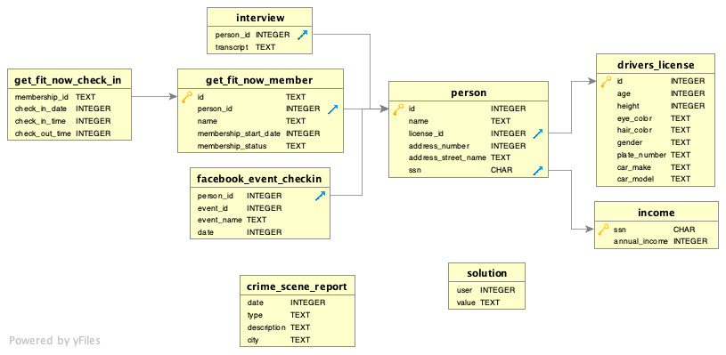

# SQL murder mystery

C'est un exercice traditionnel mondialement connu.

Un meurtre a été commis à SQL city. Le crime a eu lieu le 15 janvier 2018.

Vous disposez d'une base de données comportant toutes les informations qui ont pu être glanées.

Vous avez accès à la base de données de l'enquête.

Vous pouvez commencer par inspecter les données de rapport de scène de crime (crime_scene_report)

Bonne chance!



Exécutez toutes vos requêtes ci-dessous:

{{sqlide titre="Exécuter des requêtes:" base="assets/sql-murder-mystery.db" espace="mystery"}}


# Requête permettant de tester votre solution

```sql
INSERT INTO solution VALUES (1, "Nom du meurtrier");

SELECT value FROM solution;
```