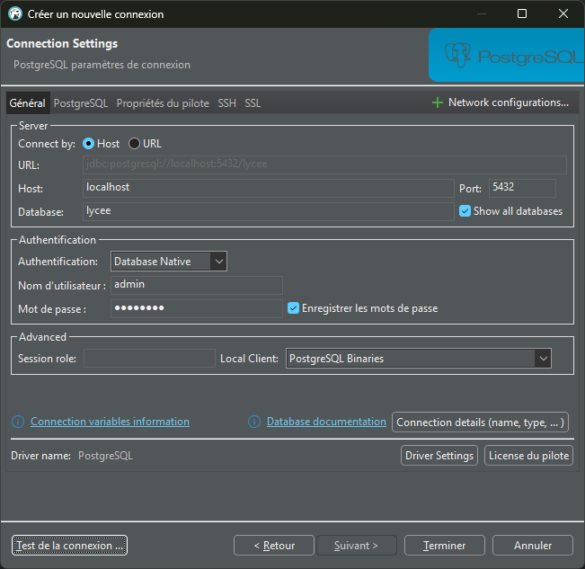
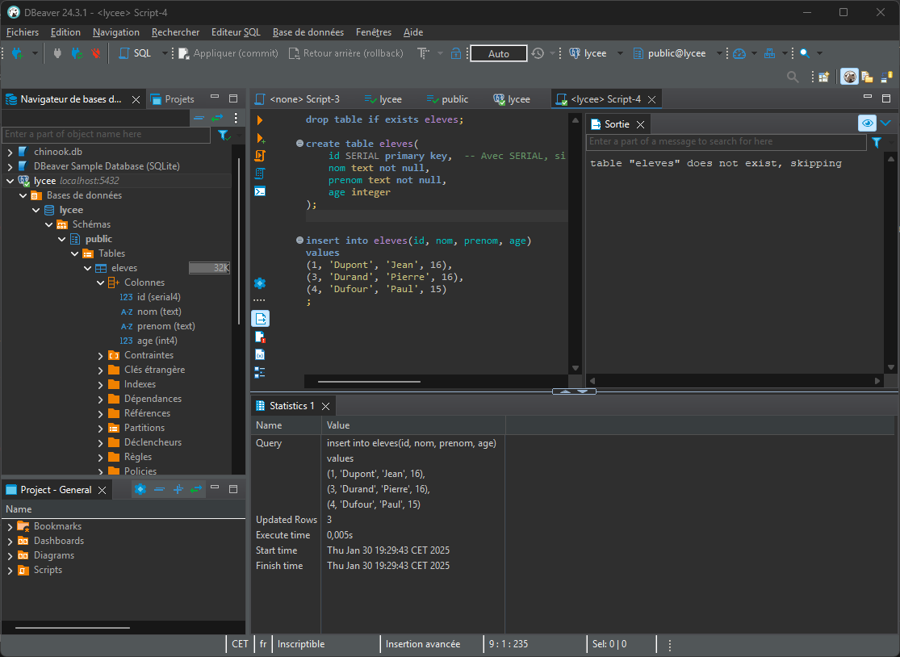

# SGBD - Postgresql


## Pré-requis
Ces outils doivent être installés (voir la section "les outils"):

- miniforge
- dbeaver


## Install & Setup PostgreSQL

Ici, nous allons utiliser PostgreSQL, qui est instalable via conda, dans une version plus ultra pratique pour le développement. 
Par contre, c'est juste inimaginable en production car toute la sécurité est levée.

Tout ce qui suit se fait dans le Miniforge Prompt.

### 1. Création et activation d'un environnement à part qui s'appelle `outils`

```bash
conda create -n outils
```

```bash
conda activate outils
```

!!! warning "Pas dans base"
    N'utilisez l'environnement base que pour créer et activer des environnements.
    Votre première action dans un prompt conda doit être d'activer un environnement spécifique.

### 2. Installation de postgresql

```bash
conda install postgresql
```

Maintenant, nous disposons d'un tas d'outils pour interagir avec postgresql.

### 3. Initialisation de Postgresql avec un répertoire de données

**Chez vous**, remplacez `P:\\data` partout par un autre chemin que vous connaissez sur votre disque.
Pour le mettre à la racine de votre répertoire utilisateur, vous pouvez utiliser `%USERPROFILE%\\data` à la place.

```bash
initdb -D P:\\data
```

Toutes vos bases de données seront stockées dans ce dossier.

### 4. Lancement du service Postgresql

```bash
pg_ctl start -D P:\\data
```

A partir de cet instant, un service tourne sur votre machine sur le port 5432. C'est le port par défaut de Postgresql.

!!! warning "Avant de quitter votre ordi"
    Attention, il faudra quitter proprement le SGBD à l'aide de la commande 

    ```bash
    pg_ctl stop -D P:\\data
    ```

### 5. Création d'un superutilisateur

Nous allons créer un utilisteur qui a le droit de tout faire sur postgresql.
Ce super utilisateur s'appelle `admin` et son mot de passe sera `password`.
(bien entendu c'est la plus over nulle des sécurisations)

```bash
createuser --superuser --password admin
```

Indiquer le mot de passe password

### 6. Création d'une base de données

```bash	
createdb lycee
```

### 7. Connexion à la base de données avec DBeaver

Maintenant, on peut ouvrir dBeaver pour interagir avec l'instance de postgresql que nous avous lancée.
Comme souvent, il y a plein de boutons, mais seulement peu nous intéressent.

Il faut ajouter une "Nouvelle connection"  à postgresql sachant que:

- Host: localhost
- Port: 5432
- Database: lycee
- User: admin
- Mot de passe: password



Vous pouvez tester la connexion avec le bouton en bas à gauche.

dBeaver va vouloir télécharger les drivers pour se connecter à postgresql, cliquez sur le bouton télécharger.
Il existe beaucoup de drivers pour diverses bases de données. dBeaver ne les récupère que lorsqu'il y a besoin.

!!! warning "Attention"
    Il faut bien cliquer la case à cocher "show all databases" qui est dans un des onglets selon la version de dBeaver.

Quand c'est bon, cliquez sur terminer.

L'arborescence de gauche ne se met pas à jour automatiquement quand vous créez ou supprimez de nouveaux objets.
Il faudra lui demander de se rafraîchir. (F5 ou menu contextuel)

### 8. Créer les données de base pour le projet:


```sql

drop table if exists eleves;

create table eleves(
    id SERIAL primary key,  -- Avec SERIAL, si on ajoute un enregistrement, l'id est automatiquement créée 
    nom text not null,
    prenom text not null,
    age integer
);


insert into eleves(id, nom, prenom, age) 
values
(1, 'Dupont', 'Jean', 16),
(3, 'Durand', 'Pierre', 16),
(4, 'Dufour', 'Paul', 15)
;

```

Voilà à quoi doit ressembler votre arborescence une fois que vous avez exécuté les requêtes ci-dessus:




!!! warning "Utilisation au quotidien"
    - Démarrer la base de données:
    ```bash
    conda activate outils
    pg_ctl start -D P:\\data
    ```
    - Bosser
    - Arreter la base de données:
    ```bash
    pg_ctl stop -D P:\\data
    ```
    

**FIN**

---

IGNORER CE QUI SUIT

## Exercices sur la base de données pagila

!!! question "Requêtes basiques"

    1. Créez une liste des prénoms et noms de famille de tous les acteurs. Affichez le prénom et le nom de chaque acteur dans une seule colonne. Nommez la colonne "nom_acteur".
    2. Trouvez l'identifiant, le prénom et le nom d'un acteur dont vous ne connaissez que le prénom: "Joe".
    3. Trouvez tous les acteurs dont le nom de famille contient les lettres "LI". Cette recherche doit être insensible à la casse et les résultats doivent être triés par nom de famille, puis par prénom.
    4. En utilisant IN, affichez les colonnes `country_id` et `country` pour les pays suivants : Afghanistan, Bangladesh et China.
    5. Ajoutez une colonne `middle_name` à la table `actor`. Spécifiez le type de colonne approprié.
    6. Supprimez la colonne `middle_name`.
    7. Mettez à jour l'enregistrement de GROUCHO WILLIAMS pour que son prénom devienne HARPO.
    8. Rétablissez le prénom de GROUCHO WILLIAMS de HARPO à GROUCHO.

!!! question "Requêtes à jointures"

    1. Affichez le prénom, le nom et l'adresse de chaque client.
    2. Listez les titres des films et les catégories auxquelles ils appartiennent.
    3. Affichez les prénoms, noms et adresses e-mail des clients vivant dans la ville de "Aurora".
    4. Listez les films et les langues dans lesquelles ils sont disponibles.
    5. Affichez les prénoms et noms des employés (staff) ainsi que le nom de leur magasin.
    6. Affichez les prénoms et noms des clients ayant loué un film intitulé "Academy Dinosaur".
    7. Listez les films disponibles dans le magasin avec l'identifiant `1`.
    8. Affichez les noms des acteurs ayant joué dans le film "Zorro Ark".

!!! question "Problème utile"
    Lister les clients qui sont en retard à la date du jour, en sélectionnant les informations utiles au call center afin de les relancer.


!!! example "Pour ceux qui ont fini"
    IMdb met à disposition gratuitement une grosse base de données cinématographique:

    https://developer.imdb.com/non-commercial-datasets/

    Chargez la dans Postgresql et explorez la.

    Pour ceci vous vous intéresserez à la clause COPY de Postgresql.

    Ici, tous les moyens sont bons, ChatGPT, google, etc...
