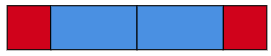

# Récursivité

!!! warning "Pré-requis"
    Vous avez déjà fortement travaillé la récursivité sur des structures de données de base (listes, arbres).

## Définitions

!!! abstract "Fonction récursive"
    Une fonction récursive est une fonction qui fait appel à elle-même dans sa définition.

!!! abstract "Type récursif"
    Un type récursif est un type qui fait appel à lui-même dans sa définition.

!!! abstract "Disjonction de cas"
    Lors de l'analyse d'un problème, il convient d'exhiber chacun des cas qui peuvent se produire sans en oublier parmis les possibles.

!!! abstract "Cas de base"
    Un cas de base est un cas exhibé dont le traitement ne nécessite pas d'appel récursif pour renvoyer un résultat.

L'objectif dans la construction d'une fonction récursif est d'assurer la convergence vers un cas de base afin que la fonction s'arrête.
On tâchera alors de faire apparaître 


## Application sur les entiers

La récursivité vous a été présentée via des structures de données elles-mêmes récursives. Ici nous allons nous concentrer sur les entiers naturels.

L'objectif est de construire toutes les opérations que vous connaissez, simplement à partir de la définition du successeur d'un nombre.

- On dispose d'un type `entiernat` représentant un entier naturel (qu'on modélise par un int).
- On dispose d'une fonction `succ`. Elle sert à renvoyer le successeur de l'entier en paramètre. - - On définit ZERO.
- On définit UN comme successeur de 0.
- On dispose d'une fonction `afficher` qui affiche la représentation de l'entier à l'écran.


```python
type entiernat = int

def succ(n: entiernat) -> entiernat:
    assert n>0, "Pas un entier naturel"
    return n + 1   

ZERO = 0
UN = succ(ZERO)

def afficher(n: entiernat):
  print(n)
```


**A partir de maintenant, plus aucun opérateur ne sera utilisé.** (+, -, *, /, **, ....)

On donne la fonction `pred` construite uniquement avec la fonction `succ`. Cette fonction renvoie le prédécesseur d'un entier.

```python

def pred(n: entiernat):
    assert n!=ZERO, "Aucun entier naturel n'a pour successeur 0"
    def aux(n: entiernat, acc: entiernat) -> entiernat:
        if succ(acc) == n:
            return acc
        else:
            return aux(n, succ(acc))

    return aux(n, ZERO)
```

### Exemple complet avec l'opération `plus`

On veut calculer $plus(a, b)$ de manière récursive, en utilisant les fonctions déjà existantes.
On sait alors que $plus(a, 0)$ vaut $a$, ça sera notre cas de base.
ça veut dire qu'on veut faire converger b vers 0 afin d'assurer la terminaison de notre fonction.
On doit donc réécrire $a+b$ afin de faire apparaître $b-1$, soit `pred(b)`. 

$$a+b =a+(b-1) +1 $$

donc $plus(a,b)=succ(plus(a, pred(b)))$

Ecrivons donc notre fonction en conséquence:

$$plus(a,b)=\begin{cases}
    a & , \text{si } b=0  \text{ (cas de base)}\\ 
    succ(plus(a, pred(b))) &, \text{sinon}
    \end{cases}$$

En écrivant bêtement la définition en python:

```python
def plus(a: entiernat, b: entiernat) -> entiernat:
  if b == ZERO:
    return a
  else:
    return succ(plus(a, pred(b)))

afficher(plus(9, 5))
```

!!! question "Autres opérations"
    En suivant ce mode opératoire, écrire successivement les fonctions `fois`, `puissance`

!!! hint "Pour aller plus loin"
    Vous pouvez, si vous le souhaitez, vous intéresser aux puissances itérées d'ordre $n$ et écrire un programme récursif qui les calcule. Pour aller encore plus loin, vous pouvez étudier la notion d'hyperopérateur et écrire la fonction d'hyperopération (celle qui les unit toutes).


### Construction de $\mathbb{N}$ par Von Neuman
Voici comment Von Neuman définit $\mathbb{N}$

- Un entier naturel est un ensemble.
- Le premier entier naturel est l'ensemble vide. On l'appelle zéro.
- Le successeur d'un entier naturel est l'union de cet entier avec l'ensemble contenant cet entier.
- La cardinalité de l'entier n est précisément n.

```python
type entiernat = set # Un entier naturel est un ensemble

def succ(n: entiernat)  -> entiernat:
  return n.union(set(n))  # L'union de cet entier avec l'ensemble contenant cet entier

ZERO = set()         # Zero est l'ensemble vide
UN = succ(ZERO)

def afficher(n: entiernat) -> int:
  """La cardinalité de n est précisément n"""
  print(len(n))
```


Vous pouvez remplacer les définitions précédentes par cette définition, et constater que vos fonctions fonctionnent toujours.

## Pavages

### Problème 1

On cherche à paver une bande composée de n carrés avec des tuiles de largeur 1 et 2.


- Dessiner les pavages possibles pour $n=1$, $n=2$, $n=3$, $n=4$
- Pour quelles tailles de bande pouvez vous donner directement la réponse sans trafiquer?
- Trouvez la relation de récurrence de $p_{n}$, le nombre de pavage d'une bande de taille $n$ 
- Ecrivez une fonction en python `nombre_pavages(n: int) → int` qui calcule le nombre de pavages pour une bande de taille n.


#### Variation
Reprendre ce problème pour paver une bande de taille $n$ avec des tuiles de largeur 1 et 3.

### Problème 2

Reprendre le problème 1, mais cette fois, nous cherchons à construire la liste des possibilités de pavages.



Ce pavage correspond à la liste ['R', 'B', 'B', 'R'] pour n=6.

- Ecrire `pavage(n: int) -> list[str]`

Ici, il faut s'appuyer sur la structure qui détermine le nombre de solutions (comme presque tout le temps en réalité). Vous pouvez ensuite dessiner les bandes à l'écran, en s'intéressant à ces deux str:


```python
rouge = "\N{LARGE RED SQUARE}"
bleu = 2*"\N{LARGE BLUE SQUARE}"
```

### Conversion Binaire

La conversion du décimal en binaire est un procédé récursif qui fonctionne sur base de la division euclidienne par 2.

Ecrire la fonction récursive:  `dec_to_bin(n: int) -> str`

Sachant que 1000 appels récursifs sont autorisés au maximum en python, quel est le plus grand nombre que vous pouvez convertir?

### Permutations des n premiers entiers naturels

TODO

### Le tour du cavalier

EN COURS

Le tour du cavalier est un problème hyper classique consistant à déplacer un cavalier sur un échiquier de manière à ce qu’il visite chaque case exactement une fois.

Il existe deux types de tours:

- **Tour fermé** : Le cavalier revient à sa case de départ après avoir visité chaque case une fois, formant ainsi un circuit fermé.
- **Tour ouvert** : Le cavalier termine son parcours sur une case différente de celle de départ sans revenir à sa position initiale.

!!! question "Sur un échiquier 5x5"

    - Quand le cavalier part d'une case blanche, peut-il aller sur une case de la même couleur?
    - Combien de mouvements doit faire le cavalier pour parcourir toutes les cases?
    - Expliquer, de manière structurée, en vous servant des réponses aux questions précédentes, pourquoi il est impossible qu'un cavalier revienne à son point de départ en ayant visité toutes les cases sur un échiquier 5x5. 


<iframe width="560" height="315" src="https://www.youtube.com/embed/ab_dY3dZFHM?si=oq-g4MCITwUF3dXC" title="YouTube video player" frameborder="0" allow="accelerometer; autoplay; clipboard-write; encrypted-media; gyroscope; picture-in-picture; web-share" referrerpolicy="strict-origin-when-cross-origin" allowfullscreen></iframe>

#### Tour ouvert

On donne les types suivants, ainsi que les variables globales LARGEUR et HAUTEUR (de l'échiquier)

```python
type coup = tuple[int, int] 
type chemin = list[coup]

HAUTEUR = 5
LARGEUR = 5
```

!!! question "Coups suivants"
    Ecrire la fonction `coups_suivants(c: coup) -> list[coup]`
    
    Cette fonction renvoie la liste des coups possibles à la suite du coup (i,j)


!!! question "Parcours de tous les tours possibles"
    Ecrire la fonction récursive `parcours(c: coup, chemins: list[chemin], acc: chemin)`

    - acc contient le chemin en cours de construction
    - chemins contient la liste de tous les chemins. Une liste est mutable, donc elle peut être modifiée à n'importe quel moment.
    - à chaque appel, il faut visiter tous les coups qui ne sont pas déjà dans le chemin, en l'ajoutant bien sur dans le chemin.
    - dès qu'on a un chemin dont la taille est égale au nombre de cases, il faut l'ajouter aux chemins.

!!! question "Tours fermés"
    - Dans une autre fonction au nom approprié, modifier le cas de base pour n'afficher que les tours fermés.
    - Ca ne doit rien renvoyer sur un échiquier 5x5
    - On ne testera que sur un échiquier de taille 6x5 (c'est très long)

!!! hint "Pour ceux qui tentent"
    Ceux qui se sont frottés à rust peuvent constater la différence de performance sur ce genre de problèmes.
    Dans cargo.toml, ajouter:
    ```toml
    [profile.release]
    opt-level = 3
    lto = true
    ```

    On utilisera le flag --release pour build ou run. Par exemple:
    ```sh
    cargo run --release
    ```
