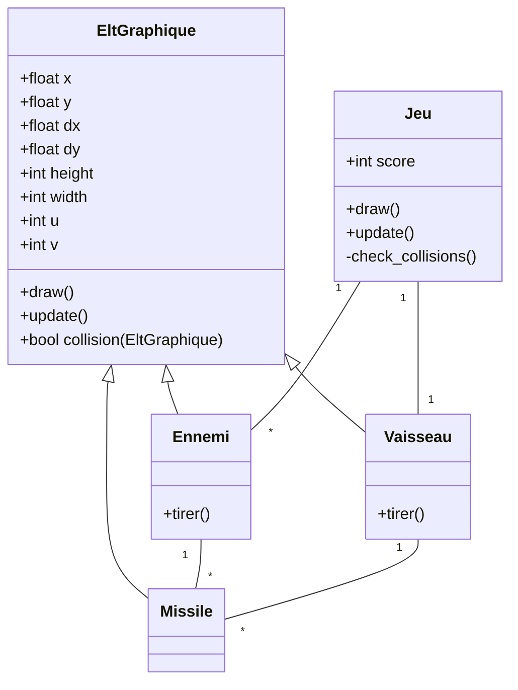

# Projet space invader

L'objectif est de créer un "space invader" like  (original: https://freeinvaders.org )


Nous allons utiliser le retro game engine pyxel (`pip install pyxel`)

!!! warning "Propreté"
    La très grande majorité des exemples sur internet de jeux pyxels ne sont pas propres du tout. Merci de ne pas vous en inspirer afin de ne pas prendre de mauvaises habitudes.
    A ce titre, c'est la raison pour laquelle je vous guide afin de le faire proprement, dans la limite du raisonable.

Voici la modélisation de ce space invader où nous utilisons l'héritage à fin de simplification (Je considère l'héritage comme faisant partie de la zone proximale de développement). Sans héritage, il faudrait gérer dans toutes les classes tous les attributs et méthodes d'EltGraphique. Il reste toujours possible de les adapter dans les classes filles.




## Element graphique
Un Elément Graphique est quelque chose qui peut apparaître à l'écran.

- Il a une position x, y dans le plan.
- Il a un vecteur de déplacement dx, dy duquel il se déplace en permanence
- Il a une coordonnée dans le fichier de ressource pour aller y rechercher son image.
- Il a une largeur `width` et une hauteur `height`.
- Il sait se dessiner à l'écran.
- Il sait se mettre à jour en fonction de son vecteur directeur.
- Il sait dire s'il est en collision avec un autre élément graphique (voir fonction donnée plus bas).

Par exemple, Un Vaisseau **EST UN** Element Graphique.

!!! danger
    Les vecteurs de position et de déplacement seront gérés en float. Par contre l'affichage attendra des ints.
    C'est équivalent à dire qu'on réfléchit au mouvement dans $\mathbb{R^2}$ mais qu'on affiche dans $\mathbb{Z^2}$

## Le Jeu
Le jeu est le chef d'orchestre.

il gère:

- Un Vaisseau 
- Des Ennemis
- Un Score
- Les évènements utilisateurs dans sa méthode update

Le Jeu doit pouvoir spawner un ennemi à une certaine position pour un certain vecteur de déplacement. Le jeu sait se dessiner et demander à ses vaisseaux et à ses ennemis de se mettre à jour et de se dessiner.

Le jeu sait tester toutes les collisions et agir en conséquence.

## Le Vaisseau
Un vaisseau doit pouvoir tirer un nouveau missile.
Un vaisseau connaît la liste de ses missiles et sait leur demander de se mettre à jour et de se dessiner. 

## L'ennemi
Un ennemi doit pouvoir tirer un nouveau missile.
Un ennemi connaît la liste de ses missiles et sait leur demander de se mettre à jour et de se dessiner. 


## Le missile
C'est un élément Graphique simple.


## Optionnel

- Il existe plusieurs types d'ennemis plus ou moins puissants.
- Il y a un boss ded fin de niveau.
- Les ennemis et le vaisseau peuvent avoir des points de vie.
- Le jeu peut créer une explosion à un certain endroit
- Les ennemis peuvent drop des Bonus (invincibilité, changement de missile, ...)
La liste est sans fin.

Ne vous lancez pas dans les fonctionnalités optionnelles sans avoir un code propre et complètement testé.
Ne vous lancez pas dans une amélioration sans avoir pensé sa modélisation.
Si vous écrivez trop de code, c'est que vous avez peut-être pris un mauvais chemin.

## Les collisions

Rajoutez cette méthode dans votre classe EltGraphique. L'objectif ici, c'est que vous vous plongiez dans la POO, pas d'étudier la collision d'objets dans l'espace (très vaste sujet), donc je vous la donne. (La collision peut faire l'objet d'un grand oral maths/info.)

```python
def collision(self, other: 'EltGraphique') -> bool:
    """ Cette méthode détecte les collisions entre 2 boites
    rectangulaires. Les rectangles doivent avoir des attributs:
    x, y, width, height
    Elle renvoie True si les deux boîtes sont en collision.
    """
    return not ( 
               (other.x >= self.x + self.width)   
            or (other.x + other.width <= self.x)  
            or (other.y >= self.y + self.height) 
            or (other.y + other.height <= self.y) 
     )
```

Pour aller plus loin dans les collisions, vous pouvez vous intéresser au théorème des axes séparateurs (Accessible spé math), ou encore à GJK, qui utilise la somme de Minkowski (Difficile à ce stade, mais je vous le mets quand même parce que c'est beau)

La détection de collisions utilise en fait plusieurs algorithmes. Un algorithme pour voir "en gros" qui pourrait entrer en collision en effectuant un partitionnement de l'espace (Broad phase). Un algorithme pour voir d'un peu plus près ce qui pourrait être en collision d'après le résultat du broad en utilisant la fonction que je vous ai donné, ou SAT, ou autre (Mid phase). Un algorithme pour déterminer au pixel près ce qui entre en collision d'après le résultat du Mid avec par exemple GJK (Narrow phase).