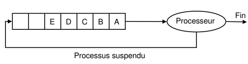
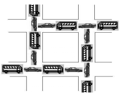
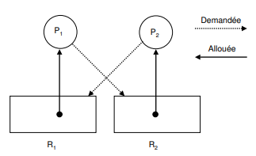

# Processus

Toute machine est dotée d'un système d'exploitation qui a pour fonction de charger les programmes depuis la mémoire de masse et de lancer leur exécution en leur créant des processus.


## 1. Généralités

!!! abstract "Définition"

    Un processus est l'instance en cours d'exécution d'un programme, gérée par le système d'exploitation.

    Un processus informatique est défini par :

    - Un ensemble d'instructions à exécuter (un programme) ;
    - Un espace mémoire pour les données de travail ;
    - Eventuellement, des ressources, comme des descripteurs de fichiers, des ports réseau, etc.

Tous les systèmes d'exploitation modernes (Linux, Windows, MacOS, Android, iOS...) sont capables de gérer l'exécution de plusieurs processus d'une manière qui paraît simultanée.

En réalité, un processeur ne gère qu'un processus à la fois.

Vu que ça va très vite, on a l'impression que tout s'exécute en même temps (mouvement de la souris, affichage d'une image, word, excel), mais en réalité, le processeur ne s'occupe que d'un processus à la fois. Le fait qu'il va très vite donne cette impression de simultanéité.

Les systèmes d'exploitation attribuent ainsi des "états" aux processus afin de les hiérarchiser.


!!! abstract "Les états"


    ```mermaid
    ---
    title: Diagramme d'état d'un processus à connaître
    ---
    stateDiagram-v2
    [*] --> Prêt : Réveil
    Prêt --> Elu : Election
    Elu --> Bloqué : Blocage
    Elu --> [*] : Fin
    Bloqué-->Prêt : Déblocage

    ```
    
    Il est fondamental de bien comprendre que le "chef d'orchestre" qui attribue aux processus leur état "élu", "bloqué" ou "prêt" est le système d'exploitation (OS - Operating System). On dit que le système d'exploitation gère l'ordonnancement des processus (un processus sera prioritaire sur un autre...).
    Lorsqu'il est créé, le processus passe à l'état prêt. Il intègre une "file d'attente", ça n'est pas forcément son tour directement.

    Lorsque c'est à son tour, il passe à l'état élu, ça veut dire que le processeur s'occupe vraiment de faire tourner le programme.
    
    Un processus qui se trouve dans l'état élu peut demander à accéder à une ressource pas forcément disponible instantanément (typiquement lire une donnée sur le disque dur). Le processus ne peut pas poursuivre son exécution tant qu'il n'a pas obtenu cette ressource. En attendant de recevoir cette ressource, il passe de l'état "élu" à l'état "bloqué".

    Lorsque la ressource se libère, il repasse en état prêt.

    Les règles de gestion de la file d'attente diffèrent selon le mode d'__ordonnancement__ du système d'exploitation.


## 2. Ordonnancement des processus
Dans un système multi-utilisateurs à temps partagé, plusieurs processus peuvent être présents en mémoire centrale en attente d'exécution. Si plusieurs processus sont prêts, le système d'exploitation doit gérer l'allocation du processeur aux différents processus à exécuter. C'est l'ordonnanceur qui s'acquitte de cette tâche.

Le système d'exploitation d'un ordinateur peut être vu comme un ensemble de processus dont l'exécution est gérée par un processus particulier : l'ordonnanceur (scheduler en anglais).

Un ordonnanceur fait face à deux problèmes principaux :

- le choix du processus à exécuter
- le temps d'allocation du processeur au processus choisi.

Un système d'exploitation multitâche est __préemptif__ lorsque celui-ci peut arrêter (réquisition) à tout moment n'importe quelle application pour passer la main à la suivante. Dans les systèmes d'exploitation préemptifs on peut lancer plusieurs applications à la fois et passer de l'une à l'autre, voire lancer une application pendant qu'une autre effectue un travail. Il y a aussi des systèmes d'exploitation dits multitâches, qui sont en fait des « multi-tâches coopératifs ». Quelle est la différence ? Un multitâche coopératif permet à plusieurs applications de fonctionner et d'occuper des plages mémoire, laissant le soin à ces applications de gérer cette occupation, au risque de bloquer tout le système. Par contre, avec un « multi-tâche préemptif », le noyau garde toujours le contrôle (qui fait quoi, quand et comment), et se réserve le droit de fermer les applications qui monopolisent les ressources du système. Ainsi les blocages du système sont inexistants.


!!! abstract "Objectifs de l'ordonnanceur"
    Les objectifs d'un ordonnanceur d'un système multi-utilisateurs sont, entre autres :

    - s'assurer que chaque processus en attente d'exécution reçoive sa part de temps processeur
    - minimiser le temps de réponse 
    - utiliser le processeur à 100% 
    - utiliser d'une manière équilibrée les ressources 
    - prendre en compte les priorités 
    - être prédictible

    Ces objectifs sont parfois complémentaires, parfois contradictoires : augmenter la performance par rapport à l'un d'entre eux peut se faire au détriment d'un autre. **Il est impossible de créer un algorithme qui optimise tous les critères de façon simultanée.**

### Ordonnancement non préemptif

!!! abstract "Ordonnanceurs non préemptifs : First-Come First-Served (FCFS) et Short Job First (SJF)"
    Dans un système à ordonnancement non préemptif ou sans réquisition, le système d'exploitation choisit le prochain processus à exécuter, en général, le Premier Arrivé est le Premier Servi PAPS (ou First-Come First-Served FCFS) ou le plus court d'abord (Short Job First SJF). 
    
    Il lui alloue le processeur jusqu'à ce qu'il se termine ou qu'il se bloque (en attente d'un événement). Il n'y a pas de réquisition. 
    
    Si l'ordonnanceur fonctionne selon la stratégie SJF, il choisit, parmis le lot de processus à exécuter, le plus court (plus petit temps d'exécution). Cette stratégie est bien adaptée au traitement par lots de processus dont les temps maximaux d'exécution sont connus ou fixés par les utilisateurs car elle offre un meilleur temps moyen de séjour. 
    
    !!! abstract "Temps de séjour"
        Le __temps de séjour__ d'un processus (temps de rotation ou de virement) est l'intervalle de temps entre la soumission du processus et son achèvement. 
    

    !!! question "Structures abstraites"
        D'après vos connaissances acquises, quelles structures de données vous semblent les plus adaptées pour programmer FCFS, puis pour SJF? 

<div style="page-break-after: always;"></div>

#### Exemple Ordonnancement FCFS
On doit trouver l'ordonnancement des processus sachant leur temps d'arrivage et la durée d'exécution prévue:

|Processus |Temps d'exécution |Temps d'arrivage|
|--|--|--|
|A |3 |0|
|B |6 |1|
|C |4 |4|
|D |2 |6|
|E |1 |7|

Voici ce que ça donnerait si ils pouvaient être élus en même temps au niveau de l'exécution. __!!!MAIS CA N'EST PAS LE CAS!!!!__

```mermaid
gantt
    dateFormat mm
    axisFormat %M
    A : 00, 3m
    B : 01, 6m
    C : 04, 4m
    D : 06, 2m
    E : 07, 1m
```


Au temps 0, seulement le processus A est dans le système et il s'exécute. Au temps 1 le processus B arrive mais il doit attendre qu'A termine car il a encore 2 unités de temps. Ensuite B s'exécute pendant 6 unités de temps. Au temps 4, 6, et 7 les processus C, D et E arrivent mais B n'a pas fini. Une fois que B a terminé, C, D et E entrent au système dans l'ordre (tout ça en supposant qu'il n'y a pas de blocage)

Voici donc le __schéma d'exécution__:

```mermaid
gantt
    dateFormat mm
    axisFormat %M
    Arrivage de A :milestone, 00, 0d
    A : a1, 00, 3m
    Arrivage de B :milestone, 01, 0d
    B : b1, after a1, 6m
    Arrivage de C :milestone, 04, 0d
    C : c1, after b1, 4m
    Arrivage de D :milestone, 06, 0d
    D : d1, after c1, 2m
    Arrivage de E :milestone, 07, 0d
    E : e1, after d1, 1m
```




|Processus |Temps d'exécution |Temps d'arrivage| Temps de terminaison |
|--|--|--|--|
|A |3 |0|3|
|B |6 |1|9|
|C |4 |4|13|
|D |2 |6|15|
|E |1 |7|16|

Le temps de séjour pour chaque processus est obtenu soustrayant le temps d'entrée du processus du temps de terminaison. Ainsi :
Le temps d'attente est calculé soustrayant le temps d'exécution du temps de séjour :

|Processus |Temps de sejour| Temps d'attente|
|--|--|--|
|A |$3-0 = 3$ | $3-3 = 0$|
|B |$9-1 = 8$ | $8-6 = 2$|
|C |$13-4 = 9$ | $9-4 = 5$|
|D |$15-6 = 9$ | $9-2 = 7$|
|E |$16-7 = 9$ | $9-1 = 8$|

Tout simplement, on peut déduire ces informations du dessin si on l'a fait au lieu d'apprendre des formules.

On calcule tout bêtement les moyennes de ces colonnes si on nous demande des temps moyens.


#### Exemple Ordonnancement SJF
On doit trouver l'ordonnancement des processus sachant leur temps d'arrivage et la durée d'exécution prévue:

|Processus |Temps d'exécution |Temps d'arrivage|
|--|--|--|
|A |3 |0|
|B |6 |1|
|C |4 |4|
|D |2 |6|
|E |1 |7|

Ici, l'ordre de priorité sera donc  A,B,E,D,C  car __E, D et C arrivent pendant l'exécution de B__. A la fin de B, le plus court est choisi, donc c'est E, puis D, puis C.

```mermaid
gantt
    dateFormat mm
    axisFormat %M
    Arrivage de A :milestone, 00, 0d
    A : a1, 00, 3m
    Arrivage de B :milestone, 01, 0d
    B : b1, after a1, 6m
    Arrivage de C :milestone, 04, 0d
    C : c1, after d1, 4m
    Arrivage de D :milestone, 06, 0d
    D : d1, after e1, 2m
    Arrivage de E :milestone, 07, 0d
    E : e1, after b1, 1m
```



Je vous laisse créer le tableau comportant les temps d'attente et de terminaison.

### Ordonnancement préemptif
!!! abstract "Ordonnancement préemptif"

    Dans un schéma d'ordonnanceur préemptif, ou avec réquisition, pour s'assurer qu'aucun processus ne s'exécute pendant trop de temps, les ordinateurs ont une horloge électronique qui génère périodiquement une interruption. A chaque interruption d'horloge, le système d'exploitation reprend la main et décide si le processus courant doit poursuivre son exécution ou s'il doit être suspendu pour laisser place à un autre. S'il décide de suspendre son exécution au profit d'un autre, il doit d'abord sauvegarder l'état des registres du processeur avant de charger dans les registres les données du processus à lancer. C'est qu'on appelle la commutation de contexte ou le changement de contexte. Cette sauvegarde est nécessaire pour pouvoir poursuivre ultérieurement l'exécution du processus suspendu.
    Le processeur passe donc d'un processus à un autre en exécutant chaque processus pendant quelques dizaines ou centaines de millisecondes. Le temps d'allocation du processeur au processus est appelé quantum. Cette commutation entre processus doit être rapide, c'est-à-dire, exiger un temps nettement inférieur au quantum.

    Le processeur, à un instant donné, n'exécute réellement qu'un seul processus, mais pendant une seconde, le processeur peut exécuter plusieurs
    processus et donne ainsi l'impression de parallélisme (pseudo-parallélisme).

    **Problèmes :**

    - Choix de la valeur du quantum.

    - Choix du prochain processus à exécuter dans chacune des situations suivantes :

    1. Le processus en cours se bloque (passe à l'état Attente).
    2. Le processus en cours passe à l'état Prêt (fin du quantum...).
    3. Un processus passe de l'état Attente à l'état Prêt (fin d'une E/S).
    4. Le processus en cours se termine.


!!! abstract "Ordonnancement du plus petit temps de séjour"
    L'ordonnancement du plus petit temps de séjour ou Shortest Remaining Time est la version préemptive de l'algorithme SJF. Un processus arrive dans la file de processus, l'ordonnanceur compare la valeur espérée pour ce processus contre la valeur du processus actuellement en exécution. Si le temps du nouveau processus est plus petit, il rentre en exécution immédiatement.

!!! abstract "Ordonnancement circulaire" 
    L'algorithme du tourniquet, circulaire ou round robin est un algorithme ancien, simple, fiable et très utilisé. Il mémorise    dans une file du type FIFO (First In First Out) la liste des processus prêts, c'est-à-dire en attente d'exécution.

    

    __Choix du processus à exécuter:__

    Il alloue le processeur au processus en tête de file, pendant un quantum de temps. Si le processus se bloque ou se termine avant la fin de son quantum, le processeur est immédiatement alloué à un autre processus (celui en tête de file). Si le processus ne se termine pas au bout de son quantum, son exécution est suspendue. Le processeur est alloué à un autre processus
    (celui en tête de file). Le processus suspendu est inséré en queue de file. Les processus qui arrivent ou qui passent de l'état bloqué à l'état prêt sont insérés en queue de file.
    
    __Choix de la valeur du quantum:__

    Un quantum trop petit provoque trop de commutations de processus et abaisse l'efficacité du processeur. Un quantum trop élevé augmente le temps de réponse des courtes commandes en mode interactif. Un quantum entre 20 et 50 ms est souvent un compromis raisonnable

## Exemple

Soient deux processus A et B prêts tels que A est arrivé en premier suivi de B, 2 unités de temps après. Les temps de UCT nécessaires pour l'exécution des processus A et B sont respectivement 15 et 4 unités de temps. Le temps de commutation est supposé nul. Calculer le temps de séjour de chaque processus A et B, le temps moyen de séjour, le temps d'attente, le temps moyen d'attente, et le nombre de changements de contexte
pour :

- SRT
- Round robin (quantum = 10 unités de temps)
- Round robin (quantum = 3 unités de temps)

__Il faut faire des dessins__

### Exemple SRT

Schéma d'exécution:

Quand B arrive, il reste 13 unités de temps à A. B prend donc la main avec ses 4 unités de temps, puis A reprend son exécution et se termine.

```mermaid
gantt
    dateFormat mm
    axisFormat %M
    Arrivage de A :milestone, 00, 0d
    A : a1, 00, 2m
    Arrivage de B :milestone, 02, 0d
    B : b1, after a1, 4m
    A : a2, after b1, 13m
```



Complétez:

|Processus |Temps de sejour| Temps d'attente|
|--|--|--|
|A | | |
|B | | |

- Temps moyen de séjour:
- Temps moyen d'attente:


### Exemple Round Robin (q=10)

- A prend direct 10 unités (le max) puis repart dans sa file.
- B prend ses 4 unités et se termine.
- A est défilé, prend ses 5 unités restantes et se termine.

```mermaid
gantt
    dateFormat mm
    axisFormat %M
    Arrivage de A :milestone, 00, 0d
    A : a1, 00, 10m
    Arrivage de B :milestone, 02, 0d
    B : b1, after a1, 4m
    Terminaison B :milestone, after b1, 0d
    A : a2, after b1, 5m
    Terminaison A :milestone, after a2, 0d
```



Complétez:

|Processus |Temps de sejour| Temps d'attente|
|--|--|--|
|A | | |
|B | | |

- Temps moyen de séjour:
- Temps moyen d'attente:


### Exemple Round Robin (q=3)

Commentez le schéma d'exécution suivant:

```mermaid
gantt
    dateFormat mm
    axisFormat %M
    Arrivage de A :milestone, 00, 0d
    A : a1, 00, 3m
    Arrivage de B :milestone, 02, 0d
    B : b1, after a1, 3m
    A : a2, after b1, 3m
    B : b2, after a2, 1m
    Terminaison B :milestone, after b2, 0d
    A : a3, after b2, 9m
    Terminaison A :milestone, after a3, 0d

```



Complétez:

|Processus |Temps de sejour| Temps d'attente|
|--|--|--|
|A | | |
|B | | |

- Temps moyen de séjour:
- Temps moyen d'attente:


# Ressources et interblocage

L'exécution d'un processus nécessite un ensemble de ressources (mémoire principale, disques, fichiers, périphériques, etc.) qui lui sont attribuées par le système d'exploitation. L'utilisation d'une ressource passe par les étapes suivantes :

- __Demande de la ressource__ : Si l'on ne peut pas satisfaire la demande, il faut attendre. La demande sera mise dans une table d'attente des ressources.
- __Utilisation de la ressource__ : Le processus peut utiliser la ressource.
- __Libération de la ressource__ : Le processus libère la ressource demandée et allouée. 

Lorsqu'un processus demande un accès exclusif à une ressource déjà allouée à un autre processus, le système d'exploitation décide de le mettre en attente jusqu'à ce que la ressource demandée devienne disponible ou lui retourner un message indiquant que la ressource n'est pas disponible: réessayer plus tard.

!!! danger "Interblocage (deadlock)"
    Des problèmes peuvent survenir, lorsque les processus obtiennent des accès exclusifs aux ressources. Par exemple, un processus A détient une ressource P et attend une autre ressource Q qui est utilisée par un autre processus B; le processus B détient la ressource Q et attend la ressource P. On a une situation d'interblocage (deadlock en anglais) car Les deux processus attendent mutuellement des ressources qui ne seront jamais libérées. Les deux processus vont attendre indéfiniment.

    En général, un ensemble de processus est en interblocage si chaque processus attend la libération d'une ressource qui est allouée à un autre processus de l'ensemble. Comme tous les processus sont en attente, aucun ne  pourra s'exécuter et donc libérer les ressources demandées par les autres. Ils attendront tous indéfiniment

!!! abstract "Conditions d'interblocage"
    Pour qu'une situation d'interblocage ait lieu, les quatre conditions suivantes doivent être remplies (Conditions de Coffman) :
    
    - __L'exclusion mutuelle__. A un instant précis, une ressource est allouée à un seul processus.
    - __La détention et l'attente__. Les processus qui détiennent des ressources peuvent en demander d'autres.
    - __Pas de préemption__. Les ressources allouées à un processus sont libérées uniquement par le processus.
    - __L'attente circulaire__. Il existe une chaîne de deux ou plus processus de telle maniére que chaque processus dans la chaîne requiert une ressource allouée au processus suivant dans la chaîne.


!!! example "Accès à une base de données"

    Supposons deux processus A et B qui demandent des accès exclusifs aux enregistrements d'une base de données. On arrive à une situation d'interblocage si :

    - Le processus A a verrouillé l'enregistrement P et demande l'accès à l'enregistrement Q.
    - Le processus B a verrouillé l'enregistrement Q et demande l'accès à l'enregistrement P.

!!! example "circulation routière"
    Considérons deux routes à double sens qui se croisent comme dans la figure suivante, où la circulation est impossible. Un problème d'interblocage y est présent. A chaque intersection, une voiture (processus) attend que la route (ressource) se libère.

    


!!! example "accès périphériques"

    Supposons que deux processus A et B veulent imprimer, en utilisant la même imprimante, un fichier stocké sur une bande magnétique. La taille de ce fichier est supérieure à la capacité du disque. Chaque processus a besoin d'un accès exclusif au dérouleur et à l'imprimante simultanément. On a une situation d'interblocage si :

    - Le processus A utilise l'imprimante et demande l'accès au dérouleur.
    - Le processus B détient le dérouleur de bande et demande l'imprimante.

    !!! question Python
        Le programme imprimante.py donné permet de rendre compte de cet interblocage. (Il utilise de ce fait une mauvaise façon de programmer)
        Les instructions sleep permettent de simuler des actions supplémentaires (et de passer la main aux autres processus entre temps).
        L'instruction with verrou signifie "attend que la ressource soit disponible et exécute le bloc ensuite en la verrouillant, puis dévérouille la ressource. C'est pour ça qu'on utilise with pour lire et écrire dans des fichiers.

        Proposez une résolution de cette situation d'interblocage en modifiant sensiblement le programme python.
    

!!! abstract "Détection d'interblocage"
    __Le graphe d'allocation des ressources__ est un graphe biparti composé de deux types de nœuds et d'un ensemble d'arcs :

    - Les processus qui sont représentés par des cercles.
    - Les ressources qui sont représentées par des rectangles. Chaque rectangle contient autant de points qu'il y a d'exemplaires de la ressource représentée.
    - Un arc orienté d'une ressource vers un processus signifie que la ressource est allouée au processus.
    - Un arc orienté d'un processus vers une ressource signifie que le processus est bloqué en attente de la ressource

    Exemple de graphe d'allocation des ressources au moment de l'interblocage. On remarque qu'il est cyclique.

    L'apparition d'un cycle dans le graphe d'allocation des ressources indique une situation d'interblocage. 

    


!!! question "Mise en évidence d'interblocages"

    Soient trois processus A, B et C qui utilisent trois ressources R, S et T.

    |A |B| C|
    |--|--|--|
    |Demande R| Demande S| Demande T|
    |Demande S| Demande T| Demande R|
    |Libère R |Libère S |Libère T|
    |Libère S |Libère T |Libère R|

    Pour répondre aux question suivantes, on dessinera progressivement le graphe d'allocation des ressources. S'il y a un interblocage possible, on pourra répondre en dessinant le graphe au crayon gris pour l'expliquer.
    Il faut dessiner le graphe étape par étape, et ne pas oublier d'effacer les arêtes correspondant à la libération de ressources ou au déblocage des processus

    1. Si les processus sont exécutés séquentiellement, les uns après les autres, y-a-t-il interblocage possible?
    2. Si l'exécution est gérée par un ordonnanceur de type circulaire, y-a-t'il interblocage? (A demande R, B demande S, ...)


!!! abstract "Résolution d'interblocages"

    La plupart du temps, il suffit de se donner une ligne de conduite:

    Tous les processus doivent bloquer les ressources dans le même ordre et les libérer dans le même ordre. Attention, c'est un sujet extrêmement vaste et prisé de la recherche, et ça ne se résume pas qu'à ça, mais c'est un très bon début.

    !!! question Résolution interblocage
        Réordonnez le contenu des programmes des processus A, B et C pour se défaire de l'interblocage précédent.

        |A |B| C|
        |--|--|--|
        | | | |
        | | | |
        | | | |
        | | | |


## Outil interblocage


<div id="process_viewer"></div>

<script src="/javascripts/process_viewer.js" defer></script>


## Bidouiller du processus > Les trucs qui servent tout le temps


Un processus peut créer un ou plusieurs processus à l'aide d'une commande système ("fork" sous les systèmes de type Unix).

Imaginons un processus A qui crée un processus B. On dira que A est le père de B et que B est le fils de A. B peut, à son tour créé un processus C (B sera le père de C et C le fils de B). On peut modéliser ces relations père/fils par une structure arborescente

Si un processus est créé à partir d'un autre processus, comment est créé le tout premier processus ?

Sous un système d'exploitation comme Linux, au moment du démarrage de l'ordinateur un tout premier processus (appelé processus 0 ou encore Swapper) est créé à partir de "rien" (il n'est le fils d'aucun processus). Ensuite, ce processus 0 crée un processus souvent appelé "init" ("init" est donc le fils du processus 0).

!!! question "La base 1"
    Pour installer les utilitaires de gestion des processus, entrez la commande suivante dans le shell de MSYS2 (Notez que sous linux, ces utilitaires sont intallés par défaut)

    `pacman -S procps-ng psmisc`


    Lancez le programme perl qui vous a été donné:
    ```bash
    ./process_create.pl
    ```

    Ce programme permet de créer une arborescence de processus (qui ne font pas grand chose à part être là).

    Le prompt ne revient pas. En effet, le processus que vous avez lancé est en "avant plan" (foreground).

    On va le mettre en "arrière plan" (background). Pour commencer, appuyez sur <kbd>Ctrl+Z</kbd>

    Cette commande permet d'envoyer un signal de suspension spécial SIGTSTP (Signal Terminal STOP) au processus en avant plan dans un terminal.

    Exécutez maintenant la commande `ps`. Elle permet de lister les processus (sous MSYS2, on ne voit pas tout, mais c'est justement bien suffisant).
 
    ```bash
    $ ps
          PID    PPID    PGID     WINPID   TTY         UID    STIME COMMAND
         7359     628    7359      24820  cons0     197612 17:12:20 /usr/bin/ps
          628       1     628      99764  cons0     197612 17:06:56 /usr/bin/bash
    S    7328     628    7328      71104  cons0     197612 17:11:38 /usr/bin/perl
    ...
    ...
    ```

    Ici, un processus associé à l'exécution de notre programme perl est en troisième ligne. Il est suspendu, mais il existe toujours.

    !!! danger "Commande ps"

        - Chaque ligne représente un processus. 
        - PID signifie Processus ID. C'est l'identifiant unique donné au processus par le système d'exploitation.
        - PPID signifie Parent Processus ID. C'est l'identifiant du processus qui a créé ce processus.
        - COMMAND représente le programme que fait tourner le processus
        - Le reste on s'en fiche

        Vu qu'il y a des parents et des enfants on se doute bien maintenant que ça fait un arbre de processus. On voit d'ailleurs que c'est le bash qui a créé les 2 autres processus. Si vous ne voyez pas, demandez.


    Vous pouvez maintenant demander sa mise en arrière plan avec la commande `bg`.

    Si vous réexécutez la commande ps, le S aura disparu.

    Remettez le processus en avant plan avec la commande `fg`

    On va maintenant killer le processus. Entrez la combinaison de touches <kbd>Ctrl+C</kbd>. Cette combinaison envoie un signal SIGKILL pour tuer le processus en avant plan.

    refaites un `ps`, le processus perl a disparu.

    Vous avez la base de la gestion des process dans un terminal. (Et oui, on peut causer avec les processus par le biais de signaux, on ne les abordera pas, mais il vous faut le guide de survie minimum)


!!! question "On y retourne (la base 2)"

    Pour lancer directement le programme en arrière plan, lancez la commande
    
    ```bash
    ./create_process.pl &
    ```

    Les processus créés ne vivront qu'une minute. Relancez la commande si les processus disparaissent.

    Comme vous l'avez deviné, mettre un & à la fin d'une commande permet de lancer le processus associé en arrière plan.

    Vu que le process écrit sur la sortie standard, il faut appuyer sur entrée pour avoir le retour du prompt.

    vous pouvez observer les processus créés grâce à la commande `top`. Elle dispose d'une multitude de paramètres et d'interactions possibles. Pour quitter la commande top, appuyez sur la touche <kbd>q</kbd>

    Vous pouvez demander l'affichage de l'arborescence des processus avec la commande `pstree -p`

# Exercices à réaliser après avoir travaillé et compris le cours.

- Q1. Qu'est-ce qu'un processus informatique ?
- Q2. Quels sont les états dans lequel un processus peut se trouver ?
- Q3. Quel dispositif attribue à un processus un état ?
- Q4. Dans quel état se trouve un processus en cours d'exécution par le microprocesseur ?
- Q5. Par quoi est identifié un processus ?
- Q6. Qu'est-ce que l'ordonnancement des processus ?
- Q7. Nommez les 2 grandes famille d'ordonnanceurs et décrivez leur différence fondamentale.
- Q8. Considérons cinq processus notés A, B, C, D et E dans une file d'attente. Les durées d'exécution et leurs dates d'arrivage respectifs sont donnés dans le tableau ci-dessous.

|Processus |Durée d'exécution| Date d'arrivage |
|--|--|--|
|A| 10| 0|
|B| 1 |1|
|C| 2 |2|
|D| 1 |3|
|E| 5 |4|

Donner le schéma d'exécution des algorithmes d'ordonnancement suivants :

- First-Come First-Served (FCFS)
- Short Job First (SJF)
- Shortest Remaining Time (SRT)
- Round Robin (RR) avec un quantum de 2

Quelle politique d'ordonnancement donne le meilleur résultat, c'est-à-dire celui correspondant à la durée minimale d'attente moyenne par processus ?

- Q9. Trois processus A, B et C ont été chargés dans un système informatique comme indiqué ci-dessous :

|Processus |Durée d'exécution| Date d'arrivage |
|--|--|--|
|A| 4 |0|
|B |2 |0|
|C |1 |3|

Donner le schéma d'exécution des algorithmes d'ordonnancement suivants (il n'est pas requis de connaître ces termes. Ils vous seront rappelés. Round Robin est quand même super utilisé, c'est bien de se souvenir de son fonctionement):

- First-Come First-Served (FCFS)
- Short Job First (SJF)
- Shortest Remaining Time (SRT)
- Round Robin (RR) avec un quantum de 1

Quelle politique d'ordonnancement donne le meilleur résultat c'est-à-dire celui correspondant à la durée minimale d'attente moyenne par processus ?

- Q10. Quelle commande permet de lister les processus en cours sur la machine?
- Q11. Quelle Combinaison de touche permet de killer un processus dans un terminal?
- Q12. Quelle Combinaison de touche permet de killer le processus en avant plan dans un terminal?
- Q13. Réalisez le diagramme d'état d'un processus.
