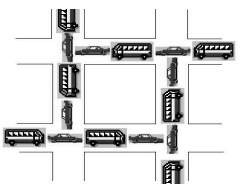
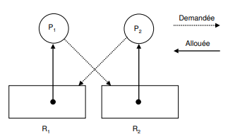

# Ressources et interblocage

L'exécution d'un processus nécessite un ensemble de ressources (mémoire principale, disques, fichiers, périphériques, etc.) qui lui sont attribuées par le système d'exploitation. L'utilisation d'une ressource passe par les étapes suivantes :

- __Demande de la ressource__ : Si l'on ne peut pas satisfaire la demande, il faut attendre. La demande sera mise dans une table d'attente des ressources.
- __Utilisation de la ressource__ : Le processus peut utiliser la ressource.
- __Libération de la ressource__ : Le processus libère la ressource demandée et allouée. 

Lorsqu'un processus demande un accès exclusif à une ressource déjà allouée à un autre processus, le système d'exploitation décide de le mettre en attente jusqu'à ce que la ressource demandée devienne disponible ou lui retourner un message indiquant que la ressource n'est pas disponible: réessayer plus tard.

!!! danger "Interblocage (deadlock)"
    Des problèmes peuvent survenir, lorsque les processus obtiennent des accès exclusifs aux ressources. Par exemple, un processus A détient une ressource P et attend une autre ressource Q qui est utilisée par un autre processus B; le processus B détient la ressource Q et attend la ressource P. On a une situation d'interblocage (deadlock en anglais) car Les deux processus attendent mutuellement des ressources qui ne seront jamais libérées. Les deux processus vont attendre indéfiniment.

    En général, un ensemble de processus est en interblocage si chaque processus attend la libération d'une ressource qui est allouée à un autre processus de l'ensemble. Comme tous les processus sont en attente, aucun ne  pourra s'exécuter et donc libérer les ressources demandées par les autres. Ils attendront tous indéfiniment

!!! abstract "Conditions d'interblocage"
    Pour qu'une situation d'interblocage ait lieu, les quatre conditions suivantes doivent être remplies (Conditions de Coffman) :
    
    - __L'exclusion mutuelle__. A un instant précis, une ressource est allouée à un seul processus.
    - __La détention et l'attente__. Les processus qui détiennent des ressources peuvent en demander d'autres.
    - __Pas de préemption__. Les ressources allouées à un processus sont libérées uniquement par le processus.
    - __L'attente circulaire__. Il existe une chaîne de deux ou plus processus de telle maniére que chaque processus dans la chaîne requiert une ressource allouée au processus suivant dans la chaîne.

!!! example "Accès à une base de données"

    Supposons deux processus A et B qui demandent des accès exclusifs aux enregistrements d'une base de données. On arrive à une situation d'interblocage si :

    - Le processus A a verrouillé l'enregistrement P et demande l'accès à l'enregistrement Q.
    - Le processus B a verrouillé l'enregistrement Q et demande l'accès à l'enregistrement P.

!!! example "circulation routière"
    Considérons deux routes à double sens qui se croisent comme dans la figure suivante, où la circulation est impossible. Un problème d'interblocage y est présent. A chaque intersection, une voiture (processus) attend que la route (ressource) se libère.

    

!!! example "accès périphériques"

    Supposons que deux processus A et B veulent imprimer, en utilisant la même imprimante, un fichier stocké sur une bande magnétique. La taille de ce fichier est supérieure à la capacité du disque. Chaque processus a besoin d'un accès exclusif au dérouleur et à l'imprimante simultanément. On a une situation d'interblocage si :

    - Le processus A utilise l'imprimante et demande l'accès au dérouleur.
    - Le processus B détient le dérouleur de bande et demande l'imprimante.

    !!! question Python
        Le programme imprimante.py donné permet de rendre compte de cet interblocage. (Il utilise de ce fait une mauvaise façon de programmer)
        Les instructions sleep permettent de simuler des actions supplémentaires (et de passer la main aux autres processus entre temps).
        L'instruction with verrou signifie "attend que la ressource soit disponible et exécute le bloc ensuite en la verrouillant, puis dévérouille la ressource. C'est pour ça qu'on utilise with pour lire et écrire dans des fichiers.

        Proposez une résolution de cette situation d'interblocage en modifiant sensiblement le programme python.
    

!!! abstract "Détection d'interblocage"
    __Le graphe d'allocation des ressources__ est un graphe biparti composé de deux types de nœuds et d'un ensemble d'arcs :

    - Les processus qui sont représentés par des cercles.
    - Les ressources qui sont représentées par des rectangles. Chaque rectangle contient autant de points qu'il y a d'exemplaires de la ressource représentée.
    - Un arc orienté d'une ressource vers un processus signifie que la ressource est allouée au processus.
    - Un arc orienté d'un processus vers une ressource signifie que le processus est bloqué en attente de la ressource

    Exemple de graphe d'allocation des ressources au moment de l'interblocage. On remarque qu'il est cyclique.

    L'apparition d'un cycle dans le graphe d'allocation des ressources indique une situation d'interblocage. 

    

!!! question "Mise en évidence d'interblocages"

    Soient trois processus A, B et C qui utilisent trois ressources R, S et T.

    |A |B| C|
    |--|--|--|
    |Demande R| Demande S| Demande T|
    |Demande S| Demande T| Demande R|
    |Libère R |Libère S |Libère T|
    |Libère S |Libère T |Libère R|

    Pour répondre aux question suivantes, on dessinera progressivement le graphe d'allocation des ressources. S'il y a un interblocage possible, on pourra répondre en dessinant le graphe au crayon gris pour l'expliquer.
    Il faut dessiner le graphe étape par étape, et ne pas oublier d'effacer les arêtes correspondant à la libération de ressources ou au déblocage des processus

    1. Si les processus sont exécutés séquentiellement, les uns après les autres, y-a-t-il interblocage possible?
    2. Si l'exécution est gérée par un ordonnanceur de type circulaire, y-a-t'il interblocage? (A demande R, B demande S, ...)

!!! abstract "Résolution d'interblocages"

    La plupart du temps, il suffit de se donner une ligne de conduite:

    Tous les processus doivent bloquer les ressources dans le même ordre et les libérer dans le même ordre. Attention, c'est un sujet extrêmement vaste et prisé de la recherche, et ça ne se résume pas qu'à ça, mais c'est un très bon début.

    !!! question Résolution interblocage
        Réordonnez le contenu des programmes des processus A, B et C pour se défaire de l'interblocage précédent.

        |A |B| C|
        |--|--|--|
        | | | |
        | | | |
        | | | |
        | | | |

## Outil interblocage

