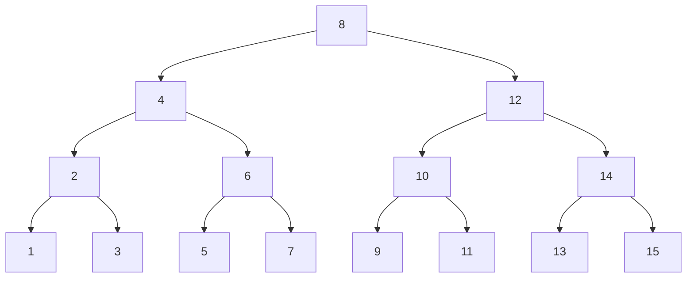

# Arbre binaire

!!! abstract "Arbre"
    Un arbre est soit vide, soit composé d'une donnée ainsi que de plusieurs sous-arbres.

    !!! question "Exercice"
        Proposez une implémentation python du type arbre.

    On nomme noeud chaque sous-arbre d'un arbre.

    On nomme racine le noeud qui n'a pas de parent.

    On nomme feuille un noeud qui n'a pas d'enfant.

    On nomme hauteur d'un arbre la longueur du chemin de sa racine à sa feuille la plus éloignée.

    On nomme taille d'un arbre son nombre de noeuds.

!!! abstract "Arbre binaire"
    Un arbre binaire est une structure composée d'une clé (ou étiquette), ainsi que de 2 arbres, le sous-arbre gauche (sag) ainsi que le sous-arbre droit (sad). C'est un arbre très particulier car on distingue bien la position de chaque sous-arbre.

    !!! question "Exercice"
        En vous inspirant du travail fait sur les listes:

        1. Proposez une implémentation python du type arbrebin.
        2. Proposez une implémentation OCaml du type arbrebin.


!!! question "Exercices"
    Implémenter les fonctions d'accès de base:
    - `cle(a: arbrebin) -> int`
    - `sag(a: arbrebin) -> arbrebin`
    - `sad(a: arbrebin) -> arbrebin`
    - `est_vide(a: arbrebin) -> bool`
    
    Implémenter en conséquence les fonctions récursives:
    
    - `hauteur` calcule la hauteur d'un arbre
    - `taille` calcule le nombre de noeuds d'un arbre
    - `somme` calcule la somme des élements d'un arbre
    - `to_str` renvoie une str comportant toutes les clés d'un arbre.

!!! question "Arbre équilibré"
    Un arbre est équilibré s'il est vide ou que:

    - la différence de hauteur de ses enfants est au maximum 1.
    - ses enfants sont équilibrés.
    
    Ecrire la fonction `est_equilibre(a: arbrebin) -> bool`.

!!! hint "Implémentation mutable"
    L'implémentation ci-dessous utilise aussi une sentinelle, mais ne l'utilise pas de manière aussi sioux que pour les listes. Elle signifie seulement l'absence d'enfant. La création d'une sentinelle nous permet de ne pas utiliser la valeur générique None, qui pourrait signifier bien autre chose qu'une absence d'enfant, car None n'est pas propre à notre structure.

    ```python
    class Noeud:
        def __init__(self, cle, gauche: 'Noeud', droit: 'Noeud'):
            self.cle = cle
            self.gauche = gauche
            self.droit = droit

        def est_feuille(self):
            return self.gauche is NIL and self.droite is NIL

    class Sentinelle(Noeud):
        def __init__(self):
            super().__init__(0, self, self)

    NIL = Sentinelle()

    class ArbreBin:
        def __init__(self, racine: 'Noeud'):
            self.racine = racine
        
        def est_vide(self) -> bool:
            return self.racine is NIL

    ```

!!! question "Exercice"
    Implémentez les mêmes fonctions pour la version mutable.


## Les méthodes de parcours en profondeur d'un arbre

### préfixe

<iframe width="560" height="315" src="https://www.youtube.com/embed/gLx7Px7IEzg?si=rR-4Mtf7nPubX4nD" title="YouTube video player" frameborder="0" allow="accelerometer; autoplay; clipboard-write; encrypted-media; gyroscope; picture-in-picture; web-share" referrerpolicy="strict-origin-when-cross-origin" allowfullscreen></iframe>

### infixe

<iframe width="560" height="315" src="https://www.youtube.com/embed/ne5oOmYdWGw?si=druIgvEBO_Pg0AfH" title="YouTube video player" frameborder="0" allow="accelerometer; autoplay; clipboard-write; encrypted-media; gyroscope; picture-in-picture; web-share" referrerpolicy="strict-origin-when-cross-origin" allowfullscreen></iframe>

### postfixe

<iframe width="560" height="315" src="https://www.youtube.com/embed/a8kmbuNm8Uo?si=ktKC8v8jtKmckYnW" title="YouTube video player" frameborder="0" allow="accelerometer; autoplay; clipboard-write; encrypted-media; gyroscope; picture-in-picture; web-share" referrerpolicy="strict-origin-when-cross-origin" allowfullscreen></iframe>

## Parcours en largeur d'un arbre.

Pour parcourir un arbre en largeur, nous allons nous appuyer sur la structure 
de file.


!!! abstract "Arbre binaire de recherche (ABR)"
    Un arbre binaire de recherche (ABR) est un arbre binaire possèdant cette propriété:
    - La clé de l'enfant gauche est inférieure ou égale à sa clé.
    - La clé de l'enfant droit est supérieure ou égale à sa clé.
    - L'enfant gauche ainsi que l'enfant droit sont des ABR.

    L'objectif est ici de disposer d'une structure qui nous permette de rechercher de l'information très rapidement.



!!! question "Exercices"
    - Dessiner 3 ABR où, partant d'un arbre vide, on insère successivement les valeurs:
        - 3, 7, 1, 9, 4, 8, 2, 5, 6
        - 6, 2, 9, 1, 5, 3, 8, 4, 7
        - 9, 5, 3, 7, 2, 6, 1, 8, 4

    - Ecrire une fonction `est_abr(a: arbrebin) -> bool`
    - Ecrire une fonction `insere_abr(e: int, a: arbrebin) -> arbrebin`

