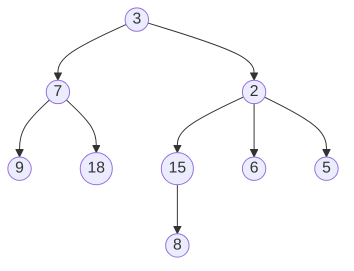
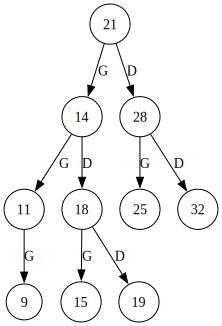
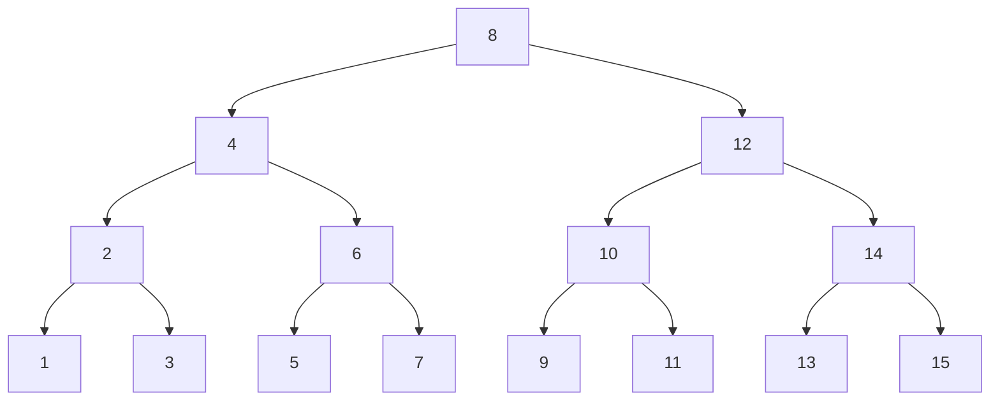
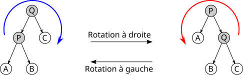

# Arbres enracinés

!!! danger "Pré-requis"
    Si les listes sont maîtrisées, ceci ne devrait presque être qu'une formalité.

## Arbre enraciné quelconque
Voici un arbre enraciné quelconque:



!!! abstract "Arbre (enraciné)"
    Un arbre est soit **vide**, soit composé d'un **noeud** portant une donnée ainsi qu'une **forêt**.

    Une **forêt** est vie ou c'est un ensemble d'arbres disjoints.

    On appelle **racine** un noeud qui n'a pas de parent.

    On appelle **feuille** un noeud n'ayant pas d'enfant.

    La **taille** d'un arbre est son nombre de noeuds.

    La **hauteur** d'un arbre possède 2 définitions impactant la définition de la hauteur de l'arbre vide:
    
    - Longueur du chemin à la feuille la plus éloignée ($hauteur(\empty)=-1$)
    - Nombre de noeuds dans le chemin à la feuille la plus éloignée. ($hauteur(\empty)=0$)


Dans un premier temps, nous allons nous intéresser à une forme spéciale d'arbre, les arbres binaires.

## Arbres binaires

!!! abstract "Arbre binaire"
    Un arbre binaire est une structure composée d'une **clé** (ou étiquette), ainsi que de 2 arbres, le **sous-arbre gauche** (sag) ainsi que le **sous-arbre droit** (sad). C'est un arbre très particulier car on distingue bien la position de chaque sous-arbre.

    

    !!! question "Exercice"
        Proposez une implémentation python immuable du type arbrebin.


!!! question "Exercices"
    Implémenter les fonctions d'accès de base:

    - `cle(a: arbrebin) -> int`
    - `sag(a: arbrebin) -> arbrebin`
    - `sad(a: arbrebin) -> arbrebin`
    - `est_vide(a: arbrebin) -> bool`
    - `est_feuille(a: arbrebin) -> bool`
    
    Implémenter en conséquence les fonctions récursives:
    
    - `hauteur` calcule la hauteur d'un arbre
        - (je suis un arbre, je pose la question à mon sag et mon sad, qu'est-ce que je fais avec leurs réponse?)
    - `taille` calcule le nombre de noeuds d'un arbre
    - `somme` calcule la somme des clés d'un arbre
    - `to_str` renvoie une str comportant toutes les clés d'un arbre.
    - `minimum` renvoie la clé minimum d'un arbre binaire.
    - `maximum` renvoie la clé maximum d'un arbre binaire.
    - `sont_egaux` renvoie si 2 arbres sont identiques.

!!! question "Arbre aléatoire"
    - Créer une fonction récursive `genere_alea(h: int) -> arbrebin` qui génère un arbre complet ayant pour hauteur h, comportant des clés aléatoires de 1 à 100.
    - Spé maths: Créer une fonction récursive `genere_alea2() -> arbrebin` qui génère un arbre comportant des clés aléatoires de 1 à 100. La probabilité de créer un noeud doit être l'inverse de sa hauteur.
    - Spé Maths: Etudiez les fonctions $f_\alpha(x)=e^{-\alpha  x^2}, x\in \mathbb{R^+},  \alpha \in \mathbb{R}^{*+}$
        - Variations, limites, convexité
        - Trouvez les coordonnées de leur point d'inflexion.
        - Proposez comment utiliser cette fonction pour générer la probabilité de créer un noeud de hauteur $x$, pour que l'arbre ait à peu près la hauteur $h$. (on estimera que la probabilité renvoyée au delà du point d'inflexion est rapidement trop faible pour aller bien loin, et qu'il est déjà probable que certaines branches se soient déjà arrêtées avant d'atteindre la hauteur $h$)

!!! question "Arbre équilibré"
    Un arbre est équilibré s'il est vide ou que, à la fois:

    - La distance entre la hauteur de ses enfants est au maximum 1.
    - Ses enfants sont équilibrés.
    
    Dessinez un arbre équilibré.
    Ecrire la fonction `est_equilibre(a: arbrebin) -> bool`.


!!! hint "Implémentation mutable"
    L'implémentation ci-dessous utilise aussi une sentinelle, mais ne l'utilise pas de manière aussi sioux que pour les listes. Rien dde circulaire. Elle signifie seulement l'arbre vide. La création d'une sentinelle nous permet de ne pas utiliser la valeur générique None, qui pourrait signifier bien autre chose qu'une absence d'enfant, car None n'est pas propre à notre structure.

    ```python
    class ArbreBin:
        def __init__(self, cle, gauche: 'ArbreBin', droit: 'ArbreBin'):
            self.cle = cle
            self.gauche = gauche
            self.droit = droit

        def est_feuille(self):
            return self.gauche is ARBRE_VIDE and self.droite is ARBRE_VIDE

        def est_vide(self):
            return self.gauche is ARBRE_VIDE and self.droite is ARBRE_VIDE

        def taille(self) -> int:
            if self.est_vide():
                return -1
            return 1 + self.gauche.taille() + self.droit.taille()


    class Sentinelle(ArbreBin):
        def __init__(self):
            super().__init__(0, self, self)

    ARBRE_VIDE = Sentinelle()
    ```

    Un autre possibilté est celle-ci, cette fois-ci avec l'utilisation de None:

    ```python

    class Noeud:
        def __init__(self, cle, gauche: 'Noeud|None', droit: 'Noeud|None'):
            self.cle = cle
            self.gauche = gauche
            self.droit = droit

        def est_feuille(self):
            return self.gauche is None and self.droite is None

        ## Ici, on ne peut pas avoir de méthode est_vide() car self ne peut jamais être None. 
        ## Si self existe, c'est qu'un objet a été instancié, donc qu'il n'est nécessairement pas rien.

        def taille(self) -> int:
            """
            self ne pouvant pas être None, le cas de base est qu'il est une feuille.
            Ca nous oblige à tester que self.gauche et self.droite ne sont pas None, car None n'a pas de méthode taille()
            Comparez ceci avec l'implémentation ci-dessus. 
            """
            if self.is_feuille():
                return 0
            tg, td = 0, 0
            if self.gauche:
                td = self.gauche.taille()
            if self.droite:
                tg = self.droite.taille()
            return 1 + tg + td

    ```

!!! question "Exercice"
    Implémentez les mêmes fonctions pour les versions mutables proposées.


## Les méthodes de parcours en profondeur d'un arbre

### préfixe

<iframe width="560" height="315" src="https://www.youtube.com/embed/gLx7Px7IEzg?si=rR-4Mtf7nPubX4nD" title="YouTube video player" frameborder="0" allow="accelerometer; autoplay; clipboard-write; encrypted-media; gyroscope; picture-in-picture; web-share" referrerpolicy="strict-origin-when-cross-origin" allowfullscreen></iframe>

### infixe

<iframe width="560" height="315" src="https://www.youtube.com/embed/ne5oOmYdWGw?si=druIgvEBO_Pg0AfH" title="YouTube video player" frameborder="0" allow="accelerometer; autoplay; clipboard-write; encrypted-media; gyroscope; picture-in-picture; web-share" referrerpolicy="strict-origin-when-cross-origin" allowfullscreen></iframe>

### postfixe

<iframe width="560" height="315" src="https://www.youtube.com/embed/a8kmbuNm8Uo?si=ktKC8v8jtKmckYnW" title="YouTube video player" frameborder="0" allow="accelerometer; autoplay; clipboard-write; encrypted-media; gyroscope; picture-in-picture; web-share" referrerpolicy="strict-origin-when-cross-origin" allowfullscreen></iframe>

## Parcours en largeur d'un arbre.

Parcourir un arbre en largeur revient à le parcourir étage par étage, de gauche à droite.

Nous allons, pour ce faire, nous appuyer sur la structure de file.

- On initialise une file avec la racine.
- Tant que la file n'est pas vide:
    - On défile un noeud
    - On l'affiche (ou autre action)
    - On enfile ses enfants.


!!! question "Implémentation"
    - Ecrire une fonction de parcours en largeur qui affiche un arbre.
    - Modifier sensiblement la fonction pour qu'elle retourne une liste de ses éléments.
    - Remplacez le mécanisme de file par un mécanisme de pile. Que se passe-t-il?


## Arbre binaire de recherche

!!! abstract "Arbre binaire de recherche (ABR)"
    Un arbre binaire de recherche (ABR) est un arbre binaire vide ou possèdant ces propriétés:
    
    - le max des clés de son sag est inférieur à sa clé
    - le min des clés de son sad est supérieur à sa clé
    - son sag et son sad sont des abr

    Définition équivalente:
    Pour chaque noeud d'un ABR:
    
    - Toutes les clés de son sag sont inférieures ou égales à sa clé
    - Toutes les clés de son sad sont supérieures ou égales à sa clé


    L'objectif est ici de disposer d'une structure qui nous permette de rechercher de l'information très rapidement.

    On considère dans le cours que les clés sont uniques, ce qui est habituellement le cas, mais on pourrait aussi prendre en compte des clés dupliquées, auquel cas, on travaillerait sur des inégalités au sens large.



!!! question "Exercices"
    - Dessiner 3 ABR où, partant d'un arbre vide, on insère successivement les valeurs:

        - 3, 7, 1, 9, 4, 8, 2, 5, 6
        - 6, 2, 9, 1, 5, 3, 8, 4, 7
        - 9, 5, 3, 7, 2, 6, 1, 8, 4

    - Ecrire une fonction `est_abr(a: arbrebin) -> bool`
    - Ecrire une fonction `insere_abr(e: int, a: arbrebin) -> arbrebin`
    - Ecrire une fonction `recherche_abr(e: int, a: arbrebin) -> bool`
    - Discussion: Quelle est la complexité de `recherche_abr`? 
        - Pour un arbre filiforme
        - Pour un arbre parfait

    - Implémentez ces fonctions pour la version mutable (important)

!!! question "Arbre symétrique"
    ```mermaid
    graph TD
    A1["10"] --- B1["5"]
    A1 --- C1["15"]
    B1 --- D1["3"]
    B1 --- E1["7"]
    C1 --- F1["12"]
    C1 --- G1["18"]

    %% Arbre miroir
    A2["10"] --- B2["15"]
    A2 --- C2["5"]
    B2 --- D2["18"]
    B2 --- E2["12"]
    C2 --- F2["7"]
    C2 --- G2["3"]
    ```

    Les deux arbres ci-dessus sont des miroirs l'un de l'autre.

    Ecrire une fonction `sont_miroirs[T](a1: arbrebin[T], a2: arbrebin[T]) -> bool`.

    L'arbre ci-dessous est symétrique.
    ```mermaid
    graph TD
    A["10"] --- B["5"]
    A --- C["5"]
    B --- D["3"]
    B --- E["7"]
    C --- F["7"]
    C --- G["3"]
    D --- H["1"]
    D --- I["2"]
    G --- J["2"]
    G --- K["1"]
    E --- L["4"]
    E --- M["6"]
    F --- N["6"]
    F --- O["4"]
    ```

    Ecrire une fonction `est_symetrique[T](a: arbrebin[T]) -> bool`.

!!! question "Application à la compression de données - Codage de Huffman"

    <iframe width="560" height="315" src="https://www.youtube.com/embed/_PG-jJKB_do?si=jCH2BWFpFK6zjw3v" title="YouTube video player" frameborder="0" allow="accelerometer; autoplay; clipboard-write; encrypted-media; gyroscope; picture-in-picture; web-share" referrerpolicy="strict-origin-when-cross-origin" allowfullscreen></iframe>


    Liens à consulter:

    - https://www.youtube.com/watch?v=iiGZ947Tcck
    - https://cmps-people.ok.ubc.ca/ylucet/DS/Huffman.html
    - https://www.csfieldguide.org.nz/en/interactives/huffman-tree/

    Créez un package "projets" à la racine de votre repo. N'oubliez pas de mettre `__init__.py` dans le dossier.

    ```python
    from structures.hierarchiques import arbrebin_mutable as ab
    from structures.hierarchiques import dessin

    def get_dicofreq(texte: str) -> dict[str, int]:
        """Renvoie un dictionnaire de fréquence des lettres du texte en entrée"""
        pass

    def get_arbre_huffman(dicofreq: dict[str, int]) -> ab.ArbreBin:
        """Renvoie un arbre de Huffman d'après le dictionnaire de fréquences des lettres"""
        # Etape 1: Construire EN COMPREHENSION une liste de feuilles d'après le dictionnaire de fréquences

        # Etape 2: Construire l'arbre de Huffman en agrégeant progresivement les arbres de la liste

        pass

    def get_codes(arbre: ab.ArbreBin) -> dict[str, str]:
        """
        Fonction récursive.
        Renvoie un dictionnaire contenant la codification binaire de chaque caractère
        """
        pass

    def compresser(texte, codes: dict[str, str]) -> str:
        """Compresse un texte en utilisant le dictionnaire d'encodage"""
        pass

    def decompresser(texte, codes: dict[str, str]) -> str:
        """Décompresse un texte en utilisant le dictionnaire d'encodage"""
        pass
    ```


!!! info "Encadrement de la hauteur d'un arbre"
    
    $hauteur(\empty)=-1$

    **Hauteur d'un arbre filiforme**

    Un arbre filiforme de taille $n$ est de hauteur $n-1$


    **Hauteur d'un arbre parfait à $n$ noeuds***

    ```mermaid
    graph TD
    subgraph Niveau0 ["2^0 nœud"]
        A["1"]
    end
    subgraph Niveau1 ["2^1 nœuds"]
        A --- B["2"]
        A --- C["3"]
    end
    subgraph Niveau2 ["2^2 nœuds"]
        B --- D["4"]
        B --- E["5"]
        C --- F["6"]
        C --- G["7"]
    end
    subgraph Niveau3 ["2^3 nœuds"]
        D --- H["8"]
        D --- I["9"]
        E --- J["10"]
        E --- K["11"]
        F --- L["12"]
        F --- M["13"]
        G --- N["14"]
        G --- O["15"]
    end
    ```
    Cet arbre de hauteur 3 a $2^0 + 2^1 + 2^2 + 2^3 = 15$ nœuds ($2^{4}-1$).

    Un arbre parfait de hauteur $h$ a $\displaystyle \sum_{k=0}^h 2^k$ noeuds.

    On reconnaît la somme des termes d'une suite géométrique de raison 2.
    
    Un arbre parfait de hauteur $h$ a donc $N=2^{h+1}-1$ nœuds.

    $N = 2^{h+1} - 1$

    $2^{h+1} = N + 1$
    
    En passant au logarithme de base 2 de chaque côté, la hauteur d'un arbre parfait ayant $n$ noeuds est donnée par la formule $h = \log_2(n+1)$.


!!! tip "Avancé - Rotations"
    

    - Montrer que la rotation préserve les propriétés d'ABR
    - Ecrire une fonction `rotation_droite`
    - Ecrire une fonction `rotation_gauche`
    - En considérant les hauteurs des sad et sag avant et après rotation, discuter à quoi pourraient servir les rotations.


!!! question "MP2I"
    Implémentez doctement toutes les fonctions en OCaml. (seulement la version immuable. Il est aussi possible d'implémenter la version mutable en OCaml, mais chaque chose en son temps)

    On utilisera cette définition d'un arbre binaire:

    ```ocaml
    type 'a arbrebin = Vide | Noeud of 'a * 'a arbrebin * 'a arbrebin
    ```

    `'a` est l'équivalent du type générique T qu'on a utilisé en python.
    `'a arbrebin` veut dire arbre binaire portant des données de type `'a`

