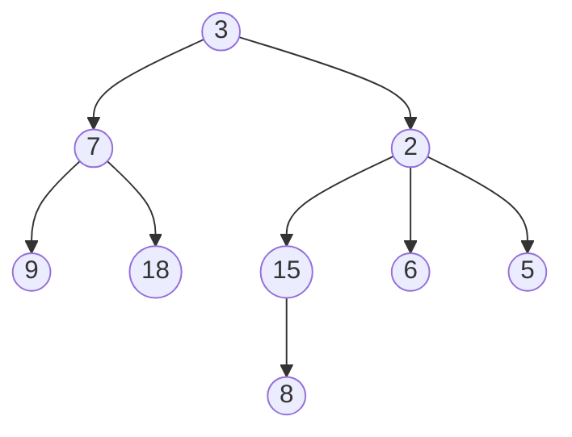
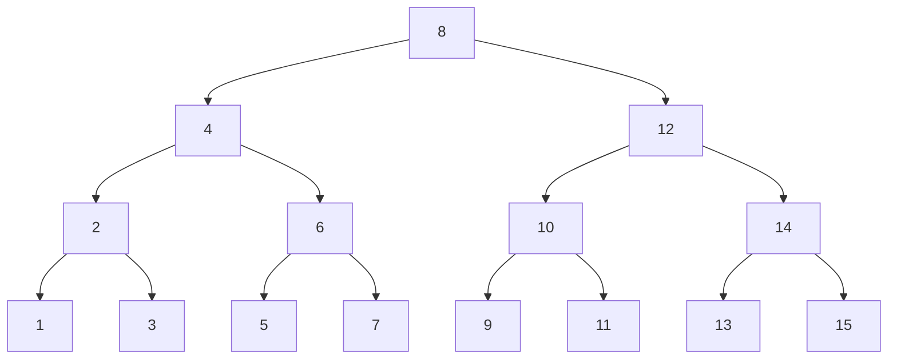

# Arbres enracinés

EN CONSTRUCTION 

!!! danger "Pré-requis"
    Si les listes sont maîtrisées, ceci ne devrait presque être qu'une formalité.

## Arbre enraciné quelconque
Voici un arbre enraciné quelconque:



!!! abstract "Arbre (enraciné)"
    Un arbre est soit **vide**, soit composé d'un **noeud** portant une donnée ainsi qu'une **forêt**.

    Une **forêt** est vie ou c'est un ensemble d'arbres disjoints.

    On appelle **racine** un noeud qui n'a pas de parent.

    On appelle **feuille** un noeud n'ayant pas d'enfant.

    La **taille** d'un arbre est son nombre de noeuds.

    La **hauteur** d'un arbre possède 2 définitions impactant la définition de la hauteur de l'arbre vide:
    - Longueur du chemin à la feuille la plus éloignée ($hauteur(\empty)=-1$)
    - Nombre de noeuds dans le chemin à la feuille la plus éloignée. ($hauteur(\empty)=0$)


Dans un premier temps, nous allons nous intéresser à une forme spéciale d'arbre, les arbres binaires.

## Arbres binaires

!!! abstract "Arbre binaire"
    Un arbre binaire est une structure composée d'une **clé** (ou étiquette), ainsi que de 2 arbres, le **sous-arbre gauche** (sag) ainsi que le **sous-arbre droit** (sad). C'est un arbre très particulier car on distingue bien la position de chaque sous-arbre.

    

    !!! question "Exercice"
        Proposez une implémentation python immuable du type arbrebin.


!!! question "Exercices"
    Implémenter les fonctions d'accès de base:

    - `cle(a: arbrebin) -> int`
    - `sag(a: arbrebin) -> arbrebin`
    - `sad(a: arbrebin) -> arbrebin`
    - `est_vide(a: arbrebin) -> bool`
    - `est_feuille(a: arbrebin) -> bool`
    
    Implémenter en conséquence les fonctions récursives:
    
    - `hauteur` calcule la hauteur d'un arbre
        - (je suis un arbre, je pose la question à mon sag et mon sad, qu'est-ce que je fais avec leurs réponse?)
    - `taille` calcule le nombre de noeuds d'un arbre
    - `somme` calcule la somme des clés d'un arbre
    - `to_str` renvoie une str comportant toutes les clés d'un arbre.
    - `minimum` renvoie la clé minimum d'un arbre binaire.
    - `maximum` renvoie la clé maximum d'un arbre binaire.
    - `sont_egaux` renvoie si 2 arbres sont identiques.

!!! question "Arbre aléatoire"
    - Créer une fonction récursive `genere_alea(h: int) -> arbrebin` qui génère un arbre complet ayant pour hauteur h, comportant des clés aléatoires de 1 à 100.
    - Spé maths: Créer une fonction récursive `genere_alea2() -> arbrebin` qui génère un arbre comportant des clés aléatoires de 1 à 100. La probabilité de créer un noeud doit être l'inverse de sa hauteur.
    - Spé Maths: Etudiez les fonctions $f_\alpha(x)=e^{-\alpha  x^2}, x\in \mathbb{R^+},  \alpha \in \mathbb{R}^{*+}$
        - Variations, limites, convexité
        - Trouvez les coordonnées de leur point d'inflexion.
        - Proposez une utilisation de cette fonction pour qu'elle génère un arbre de hauteur à peu près $h$ en vous servant du point d'inflexion. (on estimera que la probabilité donnée au delà du point d'inflexion est rapidement trop faible pour aller bien loin, et qu'il est déjà probable que certaines branches se soient déjà arrêtées avant d'atteindre la hauteur $h$)
        - Répétez le procédé en vous basant non pas sur le point d'inflexion mais là ou un noeud à la hauteur h a pour probabilité 0.5 d'être créée.

!!! question "Arbre équilibré"
    Un arbre est équilibré s'il est vide ou que, à la fois:

    - La distance entre la hauteur de ses enfants est au maximum 1.
    - Ses enfants sont équilibrés.
    
    Dessinez un arbre équilibré.
    Ecrire la fonction `est_equilibre(a: arbrebin) -> bool`.

!!! question "Renforcement"
    Ecrire les mêmes fonctions pour un arbre enraciné quelconque.
    (Ca n'est en réalité qu'une généralisation de chaque algorithme à un nombre quelconque d'enfants)


!!! hint "Implémentation mutable"
    L'implémentation ci-dessous utilise aussi une sentinelle, mais ne l'utilise pas de manière aussi sioux que pour les listes. Rien dde circulaire. Elle signifie seulement l'arbre vide. La création d'une sentinelle nous permet de ne pas utiliser la valeur générique None, qui pourrait signifier bien autre chose qu'une absence d'enfant, car None n'est pas propre à notre structure.

    ```python
    class ArbreBin:
        def __init__(self, cle, gauche: 'ArbreBin', droit: 'ArbreBin'):
            self.cle = cle
            self.gauche = gauche
            self.droit = droit

        def est_feuille(self):
            return self.gauche is ARBRE_VIDE and self.droite is ARBRE_VIDE

    class Sentinelle(Noeud):
        def __init__(self):
            super().__init__(0, self, self)

    ```

!!! question "Exercice"
    Implémentez les mêmes fonctions pour la version mutable.


## Les méthodes de parcours en profondeur d'un arbre

### préfixe

<iframe width="560" height="315" src="https://www.youtube.com/embed/gLx7Px7IEzg?si=rR-4Mtf7nPubX4nD" title="YouTube video player" frameborder="0" allow="accelerometer; autoplay; clipboard-write; encrypted-media; gyroscope; picture-in-picture; web-share" referrerpolicy="strict-origin-when-cross-origin" allowfullscreen></iframe>

### infixe

<iframe width="560" height="315" src="https://www.youtube.com/embed/ne5oOmYdWGw?si=druIgvEBO_Pg0AfH" title="YouTube video player" frameborder="0" allow="accelerometer; autoplay; clipboard-write; encrypted-media; gyroscope; picture-in-picture; web-share" referrerpolicy="strict-origin-when-cross-origin" allowfullscreen></iframe>

### postfixe

<iframe width="560" height="315" src="https://www.youtube.com/embed/a8kmbuNm8Uo?si=ktKC8v8jtKmckYnW" title="YouTube video player" frameborder="0" allow="accelerometer; autoplay; clipboard-write; encrypted-media; gyroscope; picture-in-picture; web-share" referrerpolicy="strict-origin-when-cross-origin" allowfullscreen></iframe>

## Parcours en largeur d'un arbre.

Pour parcourir un arbre en largeur, nous allons nous appuyer sur la structure 
de file.

## Arbre binaire de recherche

!!! abstract "Arbre binaire de recherche (ABR)"
    Un arbre binaire de recherche (ABR) est un arbre binaire vide ou possèdant ces propriétés:
    
    - la clé du sag non vide est inférieure ou égale à sa clé.
    - la clé du sad non vide est supérieure ou égale à sa clé.
    - Le sad et le sag sont des ABR.

    Définition équivalente:
    Pour chaque noeud d'un ABR:
    
    - Toutes les clés de son sag sont inférieures ou égales à sa clé
    - Toutes les clés de son sad sont supérieures ou égales à sa clé


    L'objectif est ici de disposer d'une structure qui nous permette de rechercher de l'information très rapidement.



!!! question "Exercices"
    - Dessiner 3 ABR où, partant d'un arbre vide, on insère successivement les valeurs:

        - 3, 7, 1, 9, 4, 8, 2, 5, 6
        - 6, 2, 9, 1, 5, 3, 8, 4, 7
        - 9, 5, 3, 7, 2, 6, 1, 8, 4

    - Ecrire une fonction `est_abr(a: arbrebin) -> bool`
    - Ecrire une fonction `insere_abr(e: int, a: arbrebin) -> arbrebin`
    - Ecrire une fonction `recherche_abr(e: int, a: arbrebin) -> bool`
    - Discussion: Quelle est la complexité de `recherche_abr`? 
        - Pour un arbre filiforme
        - Pour un arbre parfait

    - Implémentez ces fonctions pour la version mutable (important)

!!! question "Application à la compression de données - Codage de Huffman"
    Sensibilisation à la notion d'information.
    Vidéo introductive:

    <iframe width="560" height="315" src="https://www.youtube.com/embed/_PG-jJKB_do?si=jCH2BWFpFK6zjw3v" title="YouTube video player" frameborder="0" allow="accelerometer; autoplay; clipboard-write; encrypted-media; gyroscope; picture-in-picture; web-share" referrerpolicy="strict-origin-when-cross-origin" allowfullscreen></iframe>


!!! tip "Avancé - Rotations"
    

    - Montrer que la rotation préserve les propriétés d'ABR
    - Ecrire une fonction `rotation_droite`
    - Ecrire une fonction `rotation_gauche`
    - En considérant les hauteurs des sad et sag avant et après rotation, discuter à quoi pourraient servir les rotations.


!!! question "MP2I"
    Implémentez doctement toutes les fonctions en OCaml. (seulement la version immuable. Il est aussi possible d'implémenter la version mutable en OCaml, mais chaque chose en son temps)