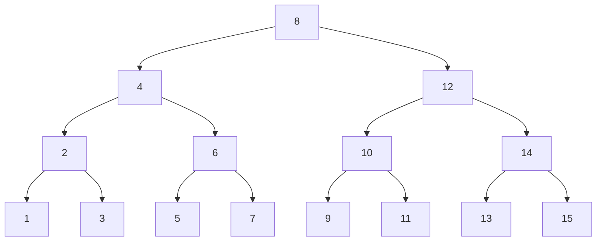
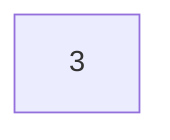
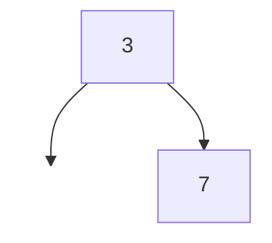
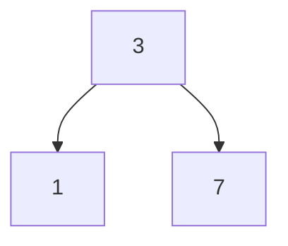
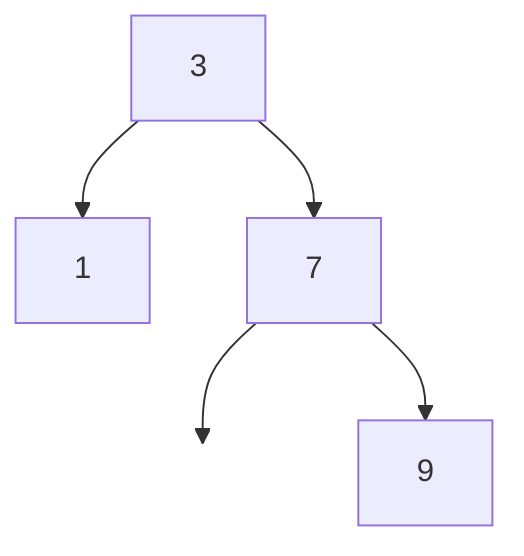
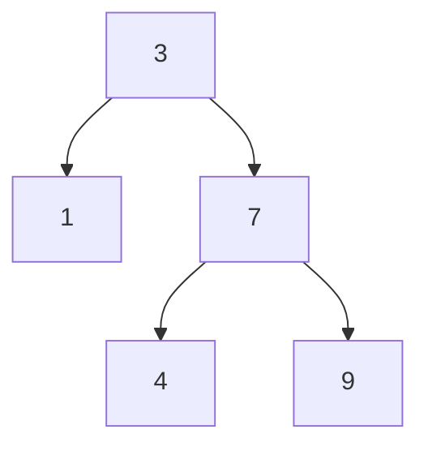
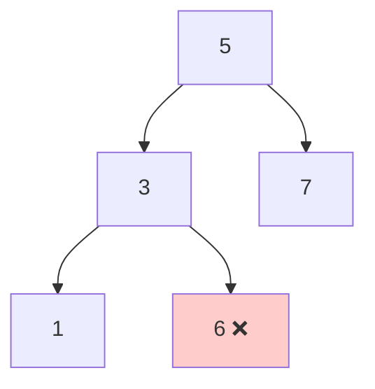
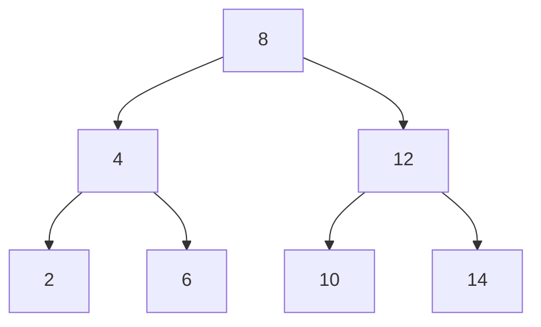
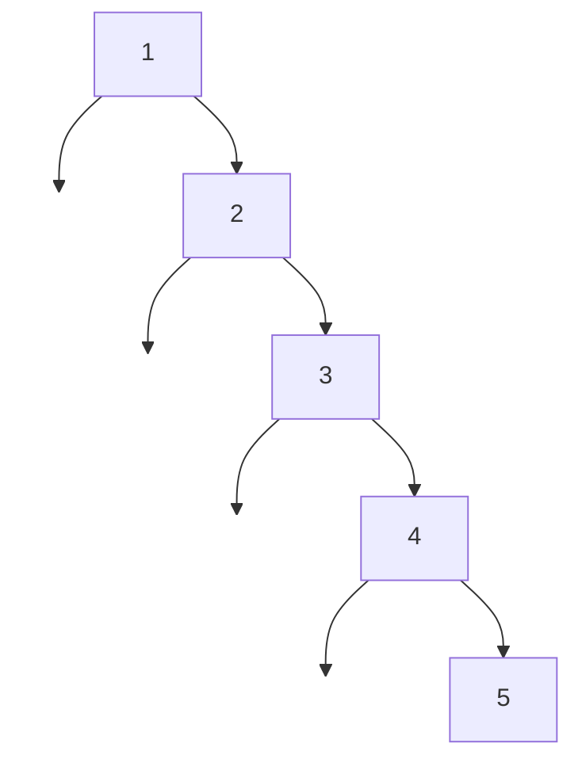

# Arbre binaire de recherche (ABR)

## 1. Introduction

Les arbres binaires de recherche (ABR) sont une structure de données qui combine les avantages des **tableaux** (accès rapide) et des **listes chaînées** (insertion/suppression efficace).

### Pourquoi les ABR ?

Comparons les performances pour rechercher un élément dans différentes structures :

| Structure | Recherche | Insertion | Suppression |
|-----------|-----------|-----------|-------------|
| Liste non triée | O(n) | O(1) | O(n) |
| Liste triée | O(log n) avec recherche dichotomique | O(n) | O(n) |
| **ABR équilibré** | **O(log n)** | **O(log n)** | **O(log n)** |

Un ABR bien équilibré offre des performances **logarithmiques** pour toutes les opérations principales !

## 2. Définition

!!! abstract "Arbre binaire de recherche (ABR)"
    Un arbre binaire de recherche (ABR) est un arbre binaire vide ou possédant ces propriétés :

    - Le max des clés de son **sous-arbre gauche (sag)** est **inférieur** à sa clé
    - Le min des clés de son **sous-arbre droit (sad)** est **supérieur** à sa clé
    - Son sag et son sad sont des ABR (propriété récursive)

    **Définition équivalente :**
    Pour chaque nœud d'un ABR :

    - Toutes les clés de son sag sont **inférieures ou égales** à sa clé
    - Toutes les clés de son sad sont **supérieures ou égales** à sa clé

    !!! note "Clés uniques"
        Dans ce cours, on considère que les clés sont **uniques** (pas de doublons), ce qui est le cas habituel. Si on accepte les doublons, on travaille avec des inégalités au sens large (≤ et ≥).

### Exemple d'ABR



**Vérification :** Prenons le nœud 8 (racine) :

- Toutes les clés à gauche (1, 2, 3, 4, 5, 6, 7) sont < 8 ✓
- Toutes les clés à droite (9, 10, 11, 12, 13, 14, 15) sont > 8 ✓

## 3. Structure de données en Python

Nous utilisons la représentation fonctionnelle que vous avez créée avec des tuples :

```python
# Type arbre binaire : soit vide (), soit un tuple (clé, sag, sad)
ArbreBin = tuple[()] | tuple[T, 'ArbreBin[T]', 'ArbreBin[T]']
```


### Exemple d'utilisation

```python
# Construire l'arbre:
#      8
#     / \
#    4   12
#   / \
#  2   6

arbre = creer(
    8,
    creer(4, creer(2, (), ()), creer(6, (), ())),
    creer(12, (), ())
)

print(cle(arbre))           # 8
print(cle(sag(arbre)))      # 4
print(est_feuille(creer(5, (), ())))  # True
print(est_vide(()))         # True
```

## 4. Opérations sur les ABR

### 4.1 Recherche dans un ABR

La recherche est très efficace : on compare la valeur cherchée avec la racine et on descend à gauche ou à droite.

**Algorithme :**

1. Si l'arbre est vide, la valeur n'est pas présente → renvoyer `False`
2. Si la valeur cherchée est égale à la racine → renvoyer `True`
3. Si la valeur est plus petite, chercher dans le sous-arbre gauche
4. Si la valeur est plus grande, chercher dans le sous-arbre droit

**Exemple :** Rechercher 11 dans l'arbre ci-dessus

```
8 (11 > 8, aller à droite)
  └─> 12 (11 < 12, aller à gauche)
        └─> 10 (11 > 10, aller à droite)
              └─> 11 (trouvé !)
```

Seulement **4 comparaisons** au lieu de parcourir tous les 15 nœuds !

**Implémentation Python :**

```python
def recherche_abr[T: Comparable](element: T, arbre: ArbreBin[T]) -> bool:
    """Recherche un élément dans un ABR."""
    if est_vide(arbre):
        return False

    if element == cle(arbre):
        return True
    elif element < cle(arbre):
        return recherche_abr(element, sag(arbre))
    else:
        return recherche_abr(element, sad(arbre))
```

### 4.2 Insertion dans un ABR

L'insertion maintient la propriété d'ABR en plaçant le nouvel élément au bon endroit.

**Algorithme :**

1. Si l'arbre est vide, créer un nouveau nœud avec l'élément
2. Si l'élément est plus petit que la racine, insérer dans le sous-arbre gauche
3. Si l'élément est plus grand que la racine, insérer dans le sous-arbre droit
4. Si l'élément est égal à la racine, ne rien faire (clé déjà présente)

**Exemple :** Insérer les valeurs **3, 7, 1, 9, 4** dans un arbre vide

**Étape 1 : Insérer 3**



**Étape 2 : Insérer 7**



**Étape 3 : Insérer 1**



**Étape 4 : Insérer 9**



**Étape 5 : Insérer 4** (arbre final)



**Implémentation Python :**

```python
def insere_abr[T: Comparable](element: T, arbre: ArbreBin[T]) -> ArbreBin[T]:
    """Insère un élément dans un ABR (crée un nouvel arbre)."""
    if est_vide(arbre):
        return creer(element, (), ())

    if element < cle(arbre):
        return creer(cle(arbre), insere_abr(element, sag(arbre)), sad(arbre))
    elif element > cle(arbre):
        return creer(cle(arbre), sag(arbre), insere_abr(element, sad(arbre)))
    else:
        return arbre  # Élément déjà présent
```

**Exemple d'utilisation :**

```python
arbre = ()
arbre = insere_abr(8, arbre)
arbre = insere_abr(4, arbre)
arbre = insere_abr(12, arbre)
arbre = insere_abr(2, arbre)

print(recherche_abr(4, arbre))   # True
print(recherche_abr(10, arbre))  # False
```

### 4.3 Vérifier qu'un arbre est un ABR

Il ne suffit pas de vérifier que chaque nœud est plus grand que son fils gauche et plus petit que son fils droit. Il faut vérifier que **tous** les descendants respectent la propriété.

**Contre-exemple (pas un ABR) :**



⚠️ **6 est dans le sous-arbre gauche de 5, mais 6 > 5 !** Ce n'est pas un ABR.

**Implémentation correcte :**

```python
def est_abr[T: Comparable](arbre: ArbreBin[T],
                           min_val: float = float('-inf'),
                           max_val: float = float('inf')) -> bool:
    """Vérifie qu'un arbre binaire est un ABR."""
    if est_vide(arbre):
        return True

    # Vérifier que la valeur est dans l'intervalle autorisé
    if not (min_val < cle(arbre) < max_val):
        return False

    # Vérifier récursivement les sous-arbres avec des intervalles ajustés
    return (est_abr(sag(arbre), min_val, cle(arbre)) and
            est_abr(sad(arbre), cle(arbre), max_val))
```

## 5. Complexité et cas dégénérés

### 5.1 Hauteurs d'arbres particuliers

- **Arbre parfait** : toutes les feuilles sont au même niveau, $hauteur = log(n)$
- **Arbre filiforme** : tous les nœuds ont au plus un fils, $hauteur = n$

### 5.2 Complexité de la recherche

La complexité dépend de la **hauteur** de l'arbre :

- **Meilleur cas (arbre équilibré)** : O(log n)
  - Exemple : arbre parfait avec 15 nœuds → hauteur = 3
  - Recherche : au maximum 4 comparaisons

- **Pire cas (arbre filiforme)** : O(n)
  - Exemple : insérer 1, 2, 3, 4, 5 dans l'ordre croissant
  - Résultat : une liste chaînée déguisée !

**Arbre parfait (h=3) :**



**Arbre filiforme (h=5) :**



### 5.3 Importance de l'équilibrage

Pour garantir O(log n), il existe des **arbres auto-équilibrés** :

- **AVL** : maintient la différence de hauteur entre sous-arbres ≤ 1
- **Arbre rouge-noir** : utilisé dans les implémentations de `TreeMap`, `TreeSet`

Ces structures sont hors programme.

Les index de bases de données utilisent des B-trees (arbres B), qui sont aussi une version évoluée des arbres binaires

### Parcours infixe

Le parcours **infixe** (gauche → racine → droite) d'un ABR donne les éléments **triés**.

```python
def parcours_infixe(arbre: ArbreBin[T]) -> list[T]:
    """Parcours infixe : retourne les clés triées."""
    if est_vide(arbre):
        return []

    return (parcours_infixe(sag(arbre)) +
            [cle(arbre)] +
            parcours_infixe(sad(arbre)))
```

**Exemple :**

```python
arbre = creer(8,
              creer(4, creer(2, (), ()), creer(6, (), ())),
              creer(12, creer(10, (), ()), creer(14, (), ())))

print(parcours_infixe(arbre))  # [2, 4, 6, 8, 10, 12, 14]
```

## 7. Exercices

### Exercice 1 : Construction d'ABR

Dessinez les ABR obtenus en insérant successivement les valeurs suivantes dans un arbre vide :

1. **3, 7, 1, 9, 4, 8, 2, 5, 6**
2. **6, 2, 9, 1, 5, 3, 8, 4, 7**
3. **9, 5, 3, 7, 2, 6, 1, 8, 4**

??? success "Solutions"
    **Séquence 1 : 3, 7, 1, 9, 4, 8, 2, 5, 6**

    ```mermaid
    graph TD
        A[3] --> B[1]
        A --> C[7]
        B --> D[ ]
        B --> E[2]
        C --> F[4]
        C --> G[9]
        F --> H[ ]
        F --> I[5]
        G --> J[8]
        G --> K[ ]
        I --> L[ ]
        I --> M[6]
        style D fill:none,stroke:none
        style H fill:none,stroke:none
        style K fill:none,stroke:none
        style L fill:none,stroke:none
    ```

    **Séquence 2 : 6, 2, 9, 1, 5, 3, 8, 4, 7**

    ```mermaid
    graph TD
        A[6] --> B[2]
        A --> C[9]
        B --> D[1]
        B --> E[5]
        C --> F[8]
        C --> G[ ]
        E --> H[3]
        E --> I[ ]
        F --> J[7]
        F --> K[ ]
        H --> L[ ]
        H --> M[4]
        style G fill:none,stroke:none
        style I fill:none,stroke:none
        style K fill:none,stroke:none
        style L fill:none,stroke:none
    ```

    **Séquence 3 : 9, 5, 3, 7, 2, 6, 1, 8, 4**

    ```mermaid
    graph TD
        A[9] --> B[5]
        A --> C[ ]
        B --> D[3]
        B --> E[7]
        D --> F[2]
        D --> G[ ]
        E --> H[6]
        E --> I[8]
        F --> J[1]
        F --> K[ ]
        J --> L[ ]
        J --> M[4]
        style C fill:none,stroke:none
        style G fill:none,stroke:none
        style K fill:none,stroke:none
        style L fill:none,stroke:none
    ```

    **Observation :** L'ordre d'insertion a un impact majeur sur la forme de l'arbre !

### Exercice 2 : Vérifier qu'un arbre est un ABR

Implémentez la fonction `est_abr(arbre: ArbreBin[T]) -> bool` qui vérifie qu'un arbre binaire est un ABR.

??? warning "Correction"
    ```python
    def est_abr(arbre: ArbreBin[T],
                min_val: float = float('-inf'),
                max_val: float = float('inf')) -> bool:
        """Vérifie qu'un arbre binaire est un ABR."""
        if est_vide(arbre):
            return True

        # La valeur doit être dans l'intervalle [min_val, max_val]
        if not (min_val < cle(arbre) < max_val):
            return False

        # Vérifier récursivement
        return (est_abr(sag(arbre), min_val, cle(arbre)) and
                est_abr(sad(arbre), cle(arbre), max_val))
    ```

    **Test :**

    ```python
    # ABR valide
    arbre1 = creer(8, creer(4, (), ()), creer(12, (), ()))
    print(est_abr(arbre1))  # True

    # Pas un ABR (6 > 5 mais dans le sous-arbre gauche)
    arbre2 = creer(5,
                   creer(3, creer(1, (), ()), creer(6, (), ())),
                   creer(7, (), ()))
    print(est_abr(arbre2))  # False
    ```

### Exercice 3 : Insertion dans un ABR

Implémentez la fonction `insere_abr(element: T, arbre: ArbreBin[T]) -> ArbreBin[T]` qui insère un élément dans un ABR.

??? warning "Correction"
    ```python
    def insere_abr[T: Comparable](element: T, arbre: ArbreBin[T]) -> ArbreBin[T]:
        """Insère un élément dans un ABR."""
        if est_vide(arbre):
            return creer(element, (), ())

        if element < cle(arbre):
            return creer(cle(arbre),
                        insere_abr(element, sag(arbre)),
                        sad(arbre))
        elif element > cle(arbre):
            return creer(cle(arbre),
                        sag(arbre),
                        insere_abr(element, sad(arbre)))
        else:
            return arbre  # Élément déjà présent
    ```

    **Test :**

    ```python
    arbre = ()
    arbre = insere_abr(5, arbre)
    arbre = insere_abr(3, arbre)
    arbre = insere_abr(7, arbre)
    arbre = insere_abr(1, arbre)

    print(parcours_infixe(arbre))  # [1, 3, 5, 7]
    ```

### Exercice 4 : Recherche dans un ABR

Implémentez la fonction `recherche_abr(element: T, arbre: ArbreBin[T]) -> bool`.

??? warning "Correction"
    ```python
    def recherche_abr[T: Comparable](element: T, arbre: ArbreBin[T]) -> bool:
        """Recherche un élément dans un ABR."""
        if est_vide(arbre):
            return False

        if element == cle(arbre):
            return True
        elif element < cle(arbre):
            return recherche_abr(element, sag(arbre))
        else:
            return recherche_abr(element, sad(arbre))
    ```

### Exercice 5 : Complexité

1. Quelle est la complexité de `recherche_abr` pour un **arbre filiforme** de n éléments ?
2. Quelle est la complexité de `recherche_abr` pour un **arbre parfait** de n éléments ?
3. Expliquez pourquoi l'ordre d'insertion impacte les performances.

??? success "Réponses"
    1. **Arbre filiforme :** O(n)
       - La hauteur est n-1
       - Dans le pire cas, on parcourt tous les nœuds
       - Exemple : rechercher 5 dans 1→2→3→4→5 (5 comparaisons)

    2. **Arbre parfait :** O(log n)
       - La hauteur est log₂(n)
       - Chaque comparaison élimine la moitié des nœuds restants
       - Exemple : rechercher dans un arbre de 15 nœuds → max 4 comparaisons

    3. **Impact de l'ordre d'insertion :**
       - Insérer des valeurs **triées** (1, 2, 3, 4, 5) → arbre filiforme (pire cas)
       - Insérer des valeurs **aléatoires** → arbre relativement équilibré
       - Insérer la **médiane d'abord** puis récursivement → arbre parfait

       **Exemple :** Pour [1, 2, 3, 4, 5, 6, 7]
       - Ordre trié : 1→2→3→4→5→6→7 (filiforme)
       - Ordre optimal : 4→2→6→1→3→5→7 (parfait)

### Exercice 6 : Minimum et maximum

Implémentez les fonctions `min_abr(arbre: ArbreBin[T]) -> T` et `max_abr(arbre: ArbreBin[T]) -> T`.

??? warning "Correction"
    ```python
    def min_abr[T: Comparable](arbre: ArbreBin[T]) -> T:
        """Trouve le minimum d'un ABR (nœud le plus à gauche)."""
        assert not est_vide(arbre), "Arbre vide"

        if est_vide(sag(arbre)):
            return cle(arbre)
        return min_abr(sag(arbre))

    def max_abr[T: Comparable](arbre: ArbreBin[T]) -> T:
        """Trouve le maximum d'un ABR (nœud le plus à droite)."""
        assert not est_vide(arbre), "Arbre vide"

        if est_vide(sad(arbre)):
            return cle(arbre)
        return max_abr(sad(arbre))
    ```

    **Test :**

    ```python
    arbre = creer(8,
                  creer(4, creer(2, (), ()), creer(6, (), ())),
                  creer(12, creer(10, (), ()), creer(14, (), ())))

    print(min_abr(arbre))  # 2
    print(max_abr(arbre))  # 14
    ```

### Exercice 7 : Parcours infixe

Implémentez la fonction `parcours_infixe(arbre: ArbreBin[T]) -> list[T]` qui retourne les clés dans l'ordre croissant.

??? warning "Correction"
    ```python
    def parcours_infixe(arbre: ArbreBin[T]) -> list[T]:
        """Parcours infixe : retourne les clés triées."""
        if est_vide(arbre):
            return []

        return (parcours_infixe(sag(arbre)) +
                [cle(arbre)] +
                parcours_infixe(sad(arbre)))
    ```

    **Test :**

    ```python
    arbre = creer(5,
                  creer(3, creer(1, (), ()), creer(4, (), ())),
                  creer(8, creer(7, (), ()), creer(9, (), ())))

    print(parcours_infixe(arbre))  # [1, 3, 4, 5, 7, 8, 9]
    ```

    **Propriété importante :** Le parcours infixe d'un ABR donne **toujours** les éléments triés !

### Exercice 8 : Taille et hauteur

Implémentez les fonctions `taille(arbre: ArbreBin[T]) -> int` et `hauteur(arbre: ArbreBin[T]) -> int`.

??? warning "Correction"
    ```python
    def taille(arbre: ArbreBin[T]) -> int:
        """Calcule le nombre de nœuds d'un arbre."""
        if est_vide(arbre):
            return 0
        return 1 + taille(sag(arbre)) + taille(sad(arbre))

    def hauteur(arbre: ArbreBin[T]) -> int:
        """Calcule la hauteur d'un arbre."""
        if est_vide(arbre):
            return -1
        return 1 + max(hauteur(sag(arbre)), hauteur(sad(arbre)))
    ```

    **Test :**

    ```python
    arbre = creer(8,
                  creer(4, creer(2, (), ()), creer(6, (), ())),
                  creer(12, (), ()))

    print(taille(arbre))    # 5
    print(hauteur(arbre))   # 2
    ```

## 7. Version mutable des algorithmes

Jusqu'à présent, nous avons utilisé une **approche fonctionnelle immuable** avec des tuples. Chaque modification (insertion, suppression) créait un **nouvel arbre** sans modifier l'ancien.

Dans cette section, nous allons explorer une **approche mutable orientée objet** où :

- Les arbres sont représentés par des **objets modifiables**
- Les insertions **modifient directement** l'arbre existant
- On utilise le **pattern Sentinelle** pour simplifier le code

### Changement de paradigme : Sous-arbres vs Nœuds

**Différence conceptuelle fondamentale** :

- **Approche immuable** : On pense en termes de **sous-arbres**
  - `sag(arbre)` et `sad(arbre)` sont des **arbres complets** (des entités autonomes)
  - On manipule des structures **récursives** où chaque sous-arbre est lui-même un arbre
  - Les primitives (`cle`, `sag`, `sad`) **cachent** la représentation interne

- **Approche mutable** : On pense en termes de **nœuds** et de **liens**
  - `noeud.gauche` et `noeud.droite` sont des **pointeurs** vers d'autres nœuds
  - On manipule des **objets** qui ont des **références** entre eux
  - On accède **directement** aux attributs des objets

!!! example "Illustration de la différence"
    **Immuable** : "L'arbre a un sous-arbre gauche qui est lui-même un arbre complet"
    ```python
    sag(arbre)  # Retourne un ArbreBin[T] (un arbre complet)
    ```

    **Mutable** : "Le nœud a un lien vers un autre nœud à gauche"
    ```python
    noeud.gauche  # Référence vers un autre Noeud[T]
    ```

Cette différence explique pourquoi les algorithmes mutables sont plus **impératifs** (on modifie des liens) tandis que les algorithmes immuables sont plus **fonctionnels** (on construit de nouveaux arbres).

### Le pattern Sentinelle

Au lieu d'utiliser `None` pour représenter l'absence de nœud, on utilise un **objet sentinelle** qui pointe vers lui-même. Cela évite de nombreux tests `if noeud is None`.

```python
class Noeud[T]:
    def __init__(self, cle: T, gauche: "Noeud[T]", droite: "Noeud[T]"):
        self.cle = cle
        self.gauche = gauche
        self.droite = droite


class Sentinelle[T](Noeud[T]):
    def __init__(self):
        super().__init__(None, self, self) #type: ignore

ARBRE_VIDE = Sentinelle()
```

### Exemple d'utilisation

Vérifier si un nœud est une sentinelle
```python
def est_sentinelle[T](noeud: Noeud[T]) -> bool:
    return noeud.gauche is noeud and noeud.droite is noeud
```

### Recherche dans un ABR mutable

!!! example "Exercice 10 : Recherche mutable"
    Implémentez la fonction `recherche_abr_mut` qui recherche un élément dans un ABR mutable.

    **Indication** : Au lieu de tester `if est_vide(arbre)`, testez `if est_sentinelle(noeud)`.

??? warning "Correction"
    ```python
    def recherche_abr_mut[T: Comparable](element: T, noeud: Noeud[T]) -> bool:
        """Recherche un élément dans un ABR mutable.

        Args:
            element: L'élément à rechercher
            noeud: Le nœud racine de l'ABR

        Returns:
            True si l'élément est présent, False sinon
        """
        # Cas de base : nœud sentinelle (arbre vide)
        if est_sentinelle(noeud):
            return False

        # Cas de base : élément trouvé
        if element == noeud.cle:
            return True

        # Recherche récursive
        if element < noeud.cle:
            return recherche_abr_mut(element, noeud.gauche)
        else:
            return recherche_abr_mut(element, noeud.droite)
    ```

    **Comparaison avec la version immuable** :

    - Immuable : `if est_vide(arbre): return False`
    - Mutable : `if est_sentinelle(noeud): return False`
    - Immuable : accès via `cle(arbre)`, `sag(arbre)`, `sad(arbre)`
    - Mutable : accès direct via `noeud.cle`, `noeud.gauche`, `noeud.droite`

### Insertion dans un ABR mutable

L'insertion mutable est **plus complexe** que la version immuable car on doit **modifier l'arbre existant** au lieu d'en créer un nouveau.

!!! example "Exercice 11 : Insertion mutable"
    Implémentez la fonction `insere_abr_mut` qui insère un élément dans un ABR mutable.

    **Différence majeure** : Au lieu de retourner un nouvel arbre, on modifie directement les attributs `gauche` et `droite` du nœud parent.

??? warning "Correction"
    ```python
    def insere_abr_mut[T: Comparable](element: T, noeud: Noeud[T], sentinelle: Noeud[T]) -> Noeud[T]:
        """Insère un élément dans un ABR mutable.

        Args:
            element: L'élément à insérer
            noeud: Le nœud courant
            sentinelle: La sentinelle utilisée pour les feuilles vides

        Returns:
            Le nœud racine de l'arbre (peut changer si l'arbre était vide)
        """
        # Cas de base : on a trouvé la position d'insertion
        if est_sentinelle(noeud):
            # Créer un nouveau nœud avec des sentinelles comme fils
            return Noeud(element, sentinelle, sentinelle)

        # Si l'élément est déjà présent, ne rien faire
        if element == noeud.cle:
            return noeud

        # Insertion récursive
        if element < noeud.cle:
            noeud.gauche = insere_abr_mut(element, noeud.gauche, sentinelle)
        else:
            noeud.droite = insere_abr_mut(element, noeud.droite, sentinelle)

        return noeud
    ```

    **Exemple d'utilisation** :

    ```python
    # Créer un arbre vide
    sentinelle: Noeud[int] = Sentinelle()
    arbre = sentinelle

    # Insérer des éléments
    arbre = insere_abr_mut(8, arbre, sentinelle)
    arbre = insere_abr_mut(3, arbre, sentinelle)
    arbre = insere_abr_mut(10, arbre, sentinelle)
    arbre = insere_abr_mut(1, arbre, sentinelle)

    # Recherche
    print(recherche_abr_mut(3, arbre))   # True
    print(recherche_abr_mut(7, arbre))   # False
    ```

### Parcours infixe mutable

!!! example "Exercice 12 : Parcours infixe mutable"
    Implémentez `parcours_infixe_mut` qui affiche les éléments d'un ABR mutable dans l'ordre croissant.

??? warning "Correction"
    ```python
    def parcours_infixe_mut[T](noeud: Noeud[T]) -> None:
        """Affiche les éléments d'un ABR mutable dans l'ordre infixe.

        Args:
            noeud: Le nœud racine de l'ABR
        """
        if not est_sentinelle(noeud):
            parcours_infixe_mut(noeud.gauche)
            print(noeud.cle)
            parcours_infixe_mut(noeud.droite)
    ```

    **Version qui retourne une liste** :

    ```python
    def parcours_infixe_liste_mut[T](noeud: Noeud[T]) -> list[T]:
        """Retourne les éléments d'un ABR mutable dans l'ordre infixe.

        Args:
            noeud: Le nœud racine de l'ABR

        Returns:
            Liste des éléments dans l'ordre croissant
        """
        if est_sentinelle(noeud):
            return []

        return (parcours_infixe_liste_mut(noeud.gauche) +
                [noeud.cle] +
                parcours_infixe_liste_mut(noeud.droite))
    ```

### Comparaison des deux approches

| Aspect | Immuable (tuples) | Mutable (objets) |
|--------|-------------------|------------------|
| **Représentation vide** | `()` | `Sentinelle()` |
| **Test de vide** | `est_vide(arbre)` | `est_sentinelle(noeud)` |
| **Accès aux données** | `cle(arbre)`, `sag(arbre)`, `sad(arbre)` | `noeud.cle`, `noeud.gauche`, `noeud.droite` |
| **Insertion** | Retourne un nouvel arbre | Modifie l'arbre existant |
| **Sûreté** | ✅ Immutabilité garantit qu'on ne casse rien | ❌ Modifications peuvent introduire des bugs |
| **Performance** | ❌ Création de nouveaux tuples à chaque insertion | ✅ Modification en place, pas de copie |
| **Complexité du code** | ✅ Plus simple, moins de cas particuliers | ❌ Doit gérer les modifications en place |

!!! note "Quand utiliser quelle approche ?"
    - **Immuable** : préférable en **programmation fonctionnelle**, quand on veut garder l'historique des modifications, dans les systèmes concurrents
    - **Mutable** : préférable quand la **performance** est critique, quand on fait beaucoup de modifications, dans les implémentations bas niveau

### Exercice final

!!! example "Exercice 13 : Conversion d'un ABR immuable en mutable"
    Écrivez une fonction qui convertit un ABR immuable (tuple) en ABR mutable (Noeud/Sentinelle).

??? warning "Correction"
    ```python
    def tuple_vers_mut[T](arbre: ArbreBin[T], sentinelle: Noeud[T]) -> Noeud[T]:
        """Convertit un ABR tuple en ABR mutable.

        Args:
            arbre: L'ABR immuable (tuple)
            sentinelle: La sentinelle à utiliser pour les feuilles vides

        Returns:
            L'ABR mutable équivalent
        """
        if est_vide(arbre):
            return sentinelle

        return Noeud(
            cle(arbre),
            tuple_vers_mut(sag(arbre), sentinelle),
            tuple_vers_mut(sad(arbre), sentinelle)
        )
    ```

    **Exemple** :

    ```python
    # Créer un ABR immuable
    arbre_tuple = creer(8,
                        creer(3, creer(1, (), ()), ()),
                        creer(10, (), ()))

    # Convertir en ABR mutable
    sentinelle: Noeud[int] = Sentinelle()
    arbre_mut = tuple_vers_mut(arbre_tuple, sentinelle)

    # Utiliser l'ABR mutable
    print(recherche_abr_mut(3, arbre_mut))  # True
    parcours_infixe_mut(arbre_mut)          # Affiche : 1 3 8 10
    ```

## 8. Résumé

- Un **ABR** est un arbre binaire où chaque nœud est plus grand que tous les nœuds de son sous-arbre gauche et plus petit que tous ceux de son sous-arbre droit
- **Représentation** : tuples `()` (vide) ou `(clé, gauche, droit)`
- **Primitives** : `creer`, `est_vide`, `est_feuille`, `cle`, `sag`, `sad`
- **Recherche** : O(log n) pour un arbre équilibré, O(n) pour un arbre filiforme
- **Insertion** : suit le même principe que la recherche, maintient la propriété d'ABR
- **Parcours infixe** : donne les éléments triés
- L'**ordre d'insertion** a un impact majeur sur la structure et les performances
- Les **arbres auto-équilibrés** (AVL, Rouge-Noir) garantissent O(log n) en toute circonstance
