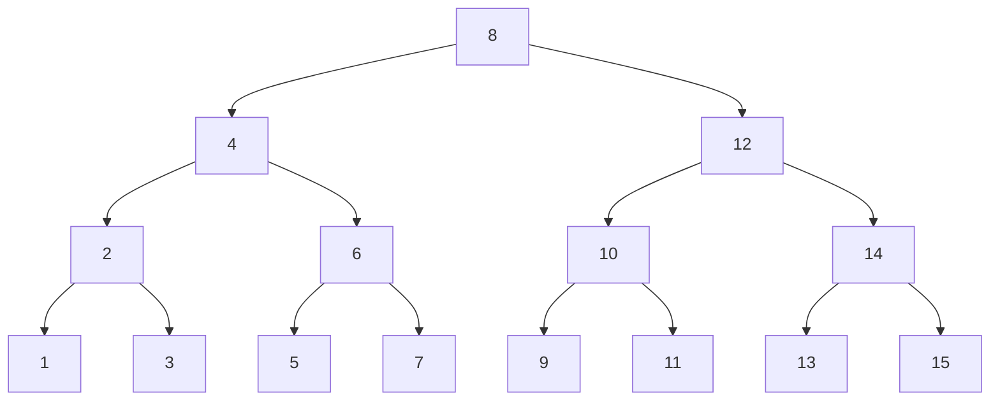

# Arbre binaire de recherche

!!! abstract "Arbre binaire de recherche (ABR)"
    Un arbre binaire de recherche (ABR) est un arbre binaire vide ou possèdant ces propriétés:
    
    - le max des clés de son sag est inférieur à sa clé
    - le min des clés de son sad est supérieur à sa clé
    - son sag et son sad sont des abr

    Définition équivalente:
    Pour chaque noeud d'un ABR:
    
    - Toutes les clés de son sag sont inférieures ou égales à sa clé
    - Toutes les clés de son sad sont supérieures ou égales à sa clé

    L'objectif est ici de disposer d'une structure qui nous permette de rechercher de l'information très rapidement.

    On considère dans le cours que les clés sont uniques, ce qui est habituellement le cas, mais on pourrait aussi prendre en compte des clés dupliquées, auquel cas, on travaillerait sur des inégalités au sens large.

!!! question "Exercices"
    - Dessiner 3 ABR où, partant d'un arbre vide, on insère successivement les valeurs:

        - 3, 7, 1, 9, 4, 8, 2, 5, 6
        - 6, 2, 9, 1, 5, 3, 8, 4, 7
        - 9, 5, 3, 7, 2, 6, 1, 8, 4

    - Ecrire une fonction `est_abr[T: Comparable](a: ArbreBin[T]) -> bool`
    - Ecrire une fonction `insere_abr[T: Comparable](e: int, a: arbrebin) -> arbrebin`
    - Ecrire une fonction `recherche_abr[T: Comparable](e: int, a: arbrebin) -> bool`
    - Discussion: Quelle est la complexité de `recherche_abr`? 
        - Pour un arbre filiforme
        - Pour un arbre parfait

    - Implémentez ces fonctions pour la version mutable (important)

