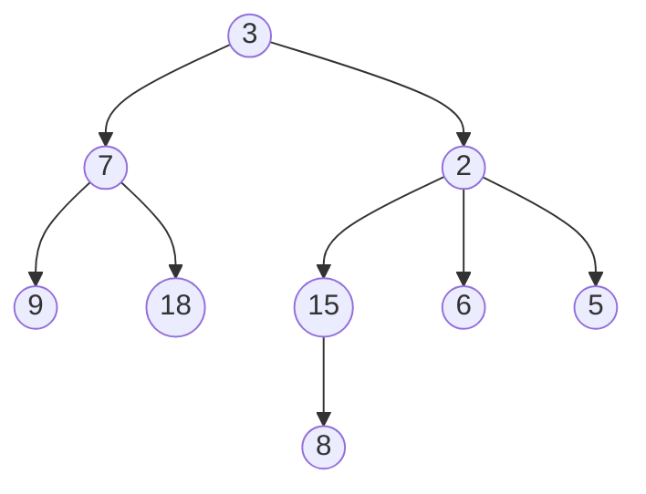

# Arbres enracinés

Voici un arbre enraciné quelconque:

!!! abstract "Arbre (enraciné)"
    Un arbre est soit **vide**, soit composé d'un **noeud** portant une donnée ainsi qu'une **forêt**.

    Une **forêt** est vide ou c'est un ensemble d'arbres disjoints.

    On appelle **racine** un noeud qui n'a pas de parent.

    On appelle **feuille** un noeud n'ayant pas d'enfant.

    La **taille** d'un arbre est son nombre de noeuds.

    La **hauteur** d'un arbre possède 2 définitions impactant la définition de la hauteur de l'arbre vide:
    
    - Longueur du chemin à la feuille la plus éloignée ($hauteur(\empty)=-1$)
    - Nombre de noeuds dans le chemin à la feuille la plus éloignée. ($hauteur(\empty)=0$)

