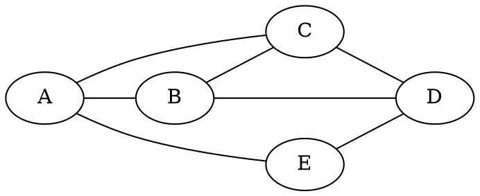
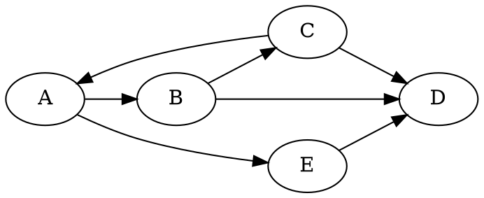

# Graphes - Structures Relationnelles

## Introduction

Les graphes sont des structures de données essentielles en informatique, permettant de modéliser des relations entre des éléments. Que ce soit pour représenter un réseau routier, un réseau électrique, Internet ou des relations sociales, les graphes offrent une manière **puissante** de visualiser et d'analyser ces connexions. Toutes les structures que nous avons vues peuvent être vues comme des cas particuliers de graphes.

## I. Définition des Termes

### A. Sommets, Arêtes et Arcs

1. **Sommets (ou nœuds)** : Ce sont les entités de base du graphe, représentées par des points. Dans le contexte du réseau routier, un sommet pourrait être une intersection.

2. **Arêtes** : Ce sont les connexions entre les sommets. Dans le contexte d'un réseau routier, une arête pourrait être une route reliant deux intersections.

3. **Arcs** : Dans le cas des graphes orientés, les connexions entre les sommets sont appelées arcs. Ils ont une direction, ce qui signifie qu'ils vont d'un sommet source à un sommet destination.


### B. Graphes Orientés et Non Orientés

1. **Graphes Orientés** : Les graphes orientés ont des arcs avec une direction spécifiée. Ils sont utilisés pour représenter des relations asymétriques, comme les connexions dans un réseau social où on peut suivre quelqu'un sans qu'il nous suive.

2. **Graphes Non Orientés** : Dans ces graphes, les arêtes n'ont pas de direction. Ils sont utilisés pour représenter des relations symétriques, comme des amitiés.

## II. Modélisation de Situations sous Forme de Graphes

Les graphes peuvent être utilisés pour représenter diverses situations, notamment :

### A. Réseau Routier

- **Sommets** : Intersections ou points d'entrée/sortie.
- **Arêtes** : Routes reliant les intersections.
- **Graphes Orientés** : Si les routes sont à sens unique.

### B. Réseau Électrique

- **Sommets** : Stations électriques, points de distribution.
- **Arêtes** : Câbles ou lignes électriques reliant les stations.
- **Graphes Orientés** : La direction indique le flux d'électricité.

### C. Internet

- **Sommets** : Serveurs, sites web.
- **Arêtes** : Liens hypertextes ou connexions entre serveurs.
- **Graphes Non Orientés** : Les liens peuvent être bidirectionnels.

### D. Réseaux Sociaux

- **Sommets** : Utilisateurs.
- **Arêtes** : Amitiés ou relations entre utilisateurs.
- **Graphes Non Orientés** : Les relations peuvent être mutuelles.
- **Graphes Orientés** : On peut follow quelqu'un sans être followed.

### E. Réseaux de neurones (Intelligence artificielle)
- **Sommets** : Neurones
- **Arêtes** : Connexions entre neurones.
- **Graphes Non Orientés** : Les relations peuvent être mutuelles.


## III. Implémentations des Graphes

Pour travailler avec des graphes, différentes représentations peuvent être utilisées :

### A. Matrice d'Adjacence

!!! hint "Préambule: MATRICES"
    En mathématiques, une matrice est un tableau rectangulaire d'éléments, organisé en lignes et colonnes. Chaque élément de la matrice est identifié par ses indices de ligne et de colonne. Une matrice de dimensions $m \times n$ a $m$ lignes et $n$ colonnes.

    Voici comment une matrice peut être représentée :

    $$
    A = \begin{pmatrix}
    a_{11} & a_{12} & \ldots & a_{1n} \\
    a_{21} & a_{22} & \ldots & a_{2n} \\
    \vdots & \vdots & \ddots & \vdots \\
    a_{m1} & a_{m2} & \ldots & a_{mn} \\
    \end{pmatrix}
    $$

    Dans cette représentation, $a_{ij}$ représente l'élément situé à la $i$-ème ligne et $j$-ème colonne de la matrice.

    Les matrices sont utilisées dans divers domaines des mathématiques, de l'informatique, de la physique, et d'autres disciplines pour représenter et manipuler des données. Les matrices jouent un rôle crucial dans la résolution de systèmes d'équations linéaires, la transformation géométrique, la théorie des graphes, et de nombreux autres domaines.

    Les cartes graphiques sont des composants presque principalement créés pour le calcul matriciel. En python, il est possible d'exécuter des calculs sur la carte graphique avec les modules numba et cuda (nvidia).

!!! abstract "Matrice d'adjacence - Graphes non-orientés"

    Une matrice où `mat[i][j]` est Vrai si et seulement si il y a une arête entre les sommets `i` et `j`. Notez que la matrice est forcément symétrique.

!!! hint "Matrice symétrique"
    Une matrice $M$ est dite symétrique ssi $ \forall (i,j), M_{i,j}=M_{j,i}$

<center>

<!--- Ci-dessous, j'utilise l'intégration de mermaid https://mermaid.js.org/-->



</center>

$$
% ceci est du latex (prononcer latek)
\begin{array}{c|ccccc}
 & A & B & C & D & E \\
\hline
A & 0 & 1 & 1 & 0 & 1 \\
B & 1 & 0 & 1 & 1 & 0 \\
C & 1 & 1 & 0 & 1 & 0 \\
D & 0 & 1 & 1 & 0 & 1 \\
E & 1 & 0 & 0 & 1 & 0 \\
\end{array}
$$


!!! abstract "Matrice d'adjacence - Graphes orientés"
    Une matrice à deux dimensions où `mat[i][j]` est Vrai si et seulement si il y a une arête allant du sommet `i` au sommet `j`. `i` est l'indice ligne. `j` est l'indice colonnes. 


<center>



</center>

$$ 
\begin{array}{c|ccccc}
 & A & B & C & D & E \\
\hline
A & 0 & 1 & 0 & 0 & 1 \\
B & 0 & 0 & 1 & 1 & 0 \\
C & 1 & 0 & 0 & 1 & 0 \\
D & 0 & 0 & 0 & 0 & 1 \\
E & 0 & 0 & 0 & 1 & 0 \\
\end{array}
$$

### B. Listes de Successeurs/Prédécesseurs

Chaque sommet est représenté par une liste contenant les sommets adjacents. Dans le cas des graphes orientés, on peut avoir une liste de successeurs (suivants) et une liste de prédécesseurs (précédents).

!!! example "Implémentation possible"
    On peut utiliser un dictionnaire `dict[str, list[str]]`

    Chaque clé sera un sommet, chaque valeur sera la liste des sommets sortants.

!!! question Application
    Compléter le code suivant pour le graphe orienté, et aussi pour le graphe non orienté:

    ```python
    listes_adj_NO = {
        "A": [...],
        "B": [...],
        ...
    }
    ```

    ```python
    listes_adj_O = {
        "A": [...],
        "B": [...],
        ...
    }
    ```


## IV. Passage entre les Représentations

Il est souvent nécessaire de passer d'une représentation à une autre en fonction des opérations que l'on souhaite effectuer, car certaines tâches seront moins complexes en fonction de la représentation.
Par eemple, dans le cas de la représentation par liste de successeurs/prédécesseurs, la complexité de l'algorithme de parcours en profondeur est généralement proportionnelle au nombre total d'arêtes dans le graphe. En revanche, dans le cas de la matrice d'adjacence, la complexité dépend du nombre total de sommets dans le graphe, car il faut parcourir la ligne correspondant au sommet de départ pour trouver ses voisins. Ainsi, la complexité peut varier en fonction de la densité du graphe et du choix de la représentation.

### A. De la Matrice d'Adjacence à la Liste de Successeurs

- Parcourir chaque ligne de la matrice.
- Pour chaque ligne, créer une liste contenant les indices des sommets adjacents.

### B. De la Liste de Successeurs à la Matrice d'Adjacence

- Créer une matrice vide.
- Pour chaque liste de successeurs, marquer les éléments correspondants dans la matrice.

## V. Exercices fondamentaux

!!! question "Exercice 1 (Graphe Orienté) :"
    Considérez le graphe orienté suivant :
    ```mermaid
    graph LR
    A --> B
    B --> C
    C --> A
    D --> A
    D --> B
    ```
    !!! abstract "Cycles"
        Dans un graphe non orienté, un cycle est une suite d'arêtes consécutives distinctes (chaine simple) dont les deux sommets extrémités sont identiques. Dans les graphes orientés, la notion équivalente est celle de circuit, même si on parle parfois aussi de cycle. Afin de simplifier le vocabulaire, on parlera de cycle pour les deux. Un graphe ne comportant pas de cycle est dit acyclique.

    - Le graphe est-il acyclique? Justifier
    - Écrivez la matrice d'adjacence.
    - Écrivez les listes de successeurs

!!! question "Exercice 2 (Graphe Non Orienté) :"
    Considérez le graphe non orienté suivant :

    ```mermaid
    graph LR
    A --- B
    A --- C
    A --- D
    B --- C
    B --- D
    C --- D
    E --- F
    E --- G
    F --- G
    ```
    !!! abstract "Graphe connexe"
        Un graphe est dit connexe si, pour chaque paire de nœuds distincts dans le graphe, il existe un chemin entre ces deux nœuds. Autrement dit, il n'y a pas de sous-graphes isolés dans un graphe connexe, chaque nœud peut être atteint à partir de n'importe quel autre nœud par une séquence d'arêtes. 

    - Le graphe est-il connexe? Justifier
    - Le graphe est-il cyclique? Justifier
    - Écrivez la matrice d'adjacence.
    - Écrivez les listes de successeurs


!!! question "IMPLEMENTATION GRAPHE NON ORIENTE - COURS"
    Créer une classe GrapheNO possédant une liste d'adjacence, vide à la création. Vous vous focaliserez sur la maintenance de la liste d'adjacence lors des ajouts/suppression
    
    La classe doit disposer de ces méthodes:
    - add_sommet
    - add_arrete
    - remove_sommet
    - remove_arrete
    - get_sommets
    - get_adjacency_matrix
    - get_adjacency_list

!!! question "IMPLEMENTATION GRAPHE ORIENTE - COURS"
    Créer une classe GrapheO possédant une matrice d'adjacence et une liste de noeuds (str), vides à la création. A la construction, on doit pouvoir indiquer s'il s'agit d'un graphe orienté ou pas. Vous vous focaliserez sur la maintenance de la matrice d'adjacence ainsi que de la liste de noeuds lors des ajouts/suppression.
    
    La classe doit disposer de ces méthodes:
    - add_sommet
    - add_arrete
    - remove_sommet
    - remove_arrete
    - get_sommets
    - get_adjacency_matrix
    - get_adjacency_list

!!! question "Degres d'un graphe:"
    Le degré d'un sommet est le nombre d'arretes adjacentes au sommet.
    Donner un algorithme permettant de calculer le degré d'un sommet.


!!! question "graphes complets et densité:"
    Un graphe est complet si chaque sommet est relié à tous les autres.
    1. Dessiner un graphe complet à n sommet for n in (0, 5)

    2. Soit un graphe complet à n sommets. 
        a. Combien d'arêtes ajoute-t-on lorsque l'on ajoute un sommet au graphe?
        b. Soit $A_n$ le nombre d'arrete d'un graphe complet à n sommets. Exprimer A_n en fonction de $A_{n-1}$
        d. Trouver le terme général de la suite $A_n$ pour $n$ sommets d'un graphe complet. (Conjecturer et démontrer par récurrence.)
        e. Donner une fonction ```nb_aretes_complet(n: int) -> int``` ou n est le nombre de sommets d'un graphe complet ayant n sommets.
    2. La densité d'un graphe à n sommets est la quantité $\delta$ représentant le rapport de son nombre d'aretes au nombre d'aretes du graphe complet associé aux sommets.
        2.a Quelle est la densité du graphe vide, du graphe comportant un sommet? d'un graphe acyclique comportant 3 sommets?
        2.b La densité d'un graphe est toujours comprise entre 2 valeurs entières. Lesquelles et pourquoi?. Que représentent-elles comme information?
        2.c Ecrire une fonction `densite` qui calcule la densité d'un graphe.


!!! tip "Graphe exemple"
    Dans un premier temps vous ignorerez les poids (les nombres sur les arêtes)
    ```mermaid
    graph LR
    A((A)) ---|85| B((B))
    A ---|217| C((C))
    A ---|173| E((E))
    B ---|80 | F((F))
    C ---|186| G((G))
    C ---|103| H((H))
    H ---|183| D((D))
    H ---|167| J((J))
    F ---|250| I((I))
    E ---|502| J
    I ---|84 | J

    ```


!!! tip "Graphe exemple2"
    ```mermaid
    graph
    A((A)) --- J((J))
    A --- M((M))
    B((B)) --- G((G))
    B --- J
    B --- L((L))
    B --- M
    C((C)) --- G
    C --- L((L))
    D((D)) --- E((E))
    E --- K((K))
    E --- L
    F((F)) --- G
    G --- H((H))
    G --- I((I))
    G --- J
    J --- L

    ```


!!! question "Parcours en profondeur - DFS (Depth First Search)"
    - Faites l'exercice de vous rappeler du parcours en profondeur préfixe sur les arbres binaires sans consulter le cours.

    - Ecrire l'ordre des visites pour un parcours en profondeur des graphes exemples de cette manière. Je vous conseille de les recopier et de gribouiller au papier.

    Ici, le problème est qu'on peut indéfiniment boucler sur des cycles de sommets. Il faut donc garder en mémoire quels sommets on a visité pour ne pas les visiter plusieurs fois. 

    - En vous inspirant de ce fonctionnement, écrire une méthode de parcours récursif en profondeur des sommets d'un graphe. Le comportement de visite est l'affichage du nom du noeud.

    ```python
    def dfs(g: GrapheNO, depart: str, visites: list[str])
    ```

!!! question "Graphes connexes"

    En utilisant la fonction dfs, écrire un algorithme qui détermine si un graphe est connexe ou pas. 

    ```python
    def is_connexe(g: GrapheNO)
    ```

!!! question "Composantes connexes"
    En utilisant la fonction dfs, écrire un algorithme qui détermine renvoie la liste des composantes connexes d'un graphe. (Une composante connexe est un sous-graphe, donc un Graphe) 

!!! question "Parcours en largeur - Breadth Firsst Search (BFS)"
    Donnez l'ordre des visites pour le parcours en largeur du graphe exemple.

    De la même manière, en vous inspirant du travail sur les arbres binaires, écrire une fonction qui réalise le parcours en largeur d'un graphe.


!!! question "Plus court chemin - Non pondéré"
    On peut trouver le plus court chemin entre 2 sommets d'un graphe non pondéré en réalisant un parcours en largeur depuis le premier sommet jusqu'à visiter le deuxième sommet.
    Ecrire une fonction
    ```python
        def shortest_path(g: GrapheNO, s1: str, s2: str) -> list[str]
    ```


!!! question "IMPLEMENTATION Graphes pondérés non orientés"
    ```mermaid
        graph LR
        A((A)) ---|4| B((B))
        A ---|7| C((C))
        B ---|2| D((D))
        B ---|5| E((E))
        C ---|3| F((F))
        D ---|6| G((G))
        E ---|1| G
        F ---|8| G

    ```

    Nous avons parfois besoin d'associer à une arête un poids (ou coût). Par exemple, dans un réseau informatique, il peut s'agir de la vitesse de connexion entre 2 machines. Dans un réseau routier, il peut s'agir de la distance entre deux endroits. Dans un réseau de neurone, il peut s'agir de l'importance à accorder à une connexion entre deux neurones...

    Dans la liste d'adjacence, on utilisera maintenant un disctionnaire de sommets accompagnés du poids de l'arête correspondante.

    La matrice d'adjacence contiendra les poids des arêtes.

    Proposez une implémentation de graphe pondéré non orienté.

