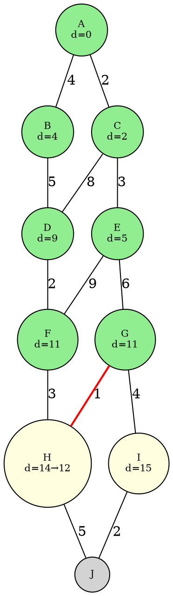

# Algorithme de Dijkstra


Dijkstra est un algorithme de plus court chemin dans un graphe **pondéré** (avec des poids non négatifs) qui permet, à partir d’un sommet source s, de trouver les distances minimales vers tous les autres sommets.

## Du BFS à Dijkstra

On a vu que le BFS avec les plugins **prédécesseurs** et **distances** résout le problème du plus court chemin dans un graphe **non pondéré**. Dijkstra fait la même chose, mais sur un graphe **pondéré**. On part du même squelette et on adapte.

L'idée clé : en traitant toujours le sommet découvert le plus proche du départ, on garantit que sa distance est définitive. En effet, tout autre chemin vers ce sommet passerait par des sommets de distance supérieure ou égale, et ne pourrait donc pas faire mieux (à condition que les poids soient positifs). C'est pour ça que le relâchement est nécessaire : quand on découvre un voisin, on ne sait pas encore si un meilleur chemin passant par un sommet pas encore traité n'existe pas.

| | BFS (non pondéré) | Dijkstra (pondéré) |
|---|---|---|
| **Structure** | File (FIFO) | On défile toujours le sommet de **distance minimale** |
| **Plugin distance** | `dist[v] = dist[u] + 1` | `dist[v] = dist[u] + poids(u, v)` |
| **Plugin prédécesseur** | `π[v] = u` | `π[v] = u` (identique) |
| **Zone 3** | Si `v` n’a jamais été vu | Si on trouve une distance **plus courte** (relâchement) |

En résumé : on fait la même chose sauf que :

1. Pour la distance, **`+ 1` devient `+ poids(u, v)`** car les arêtes n’ont plus toutes le même coût.
2. **On peut mettre à jour une distance déjà connue** si on découvre un chemin plus court (on appelle ça **relâcher** l’arête). En BFS, la première découverte est toujours optimale ; en pondéré, ce n’est plus garanti.
3. **On défile toujours le sommet de plus petite distance estimée** (au lieu du FIFO). C’est ce qui garantit que quand on traite un sommet, sa distance est définitive. Idéalement on utilise une file de priorité, mais une version naïve avec `min` suffit.

### Exemple de relâchement

Voici l’état de l’algorithme sur un graphe à 10 sommets, au moment où on vient d’extraire G (distance 11) et où on examine son voisin H :



- 🟢 **Vert** : sommets extraits (distance définitive) — A(0), C(2), B(4), E(5), D(9), F(11), G(11).
- 🟡 **Jaune** : sommets découverts, en attente dans la file. H avait été découvert via F avec $d = 11 + 3 = 14$. En traitant G, on trouve $11 + 1 = 12 < 14$ : on **relâche** l’arête G—H (en rouge) et la distance de H passe de 14 à 12.
- ⚪ **Gris** : sommet pas encore découvert. J sera découvert plus tard via H ou I.

C’est exactement la situation que le BFS ne gère pas : en non pondéré, la première découverte est toujours la meilleure. En pondéré, un chemin avec plus d’arêtes peut être plus court.

Relâcher l’arête (u, v) signifie que, si la distance de la source à v en passant par u est plus petite que la distance déjà connue, on met à jour cette distance dans le dictionnaire (on a trouvé une plus petite distance source→v).

Pourquoi le mot "relâcher" ? Ça vient de la terminologie de l’optimisation. On dit qu’on "relâche" une contrainte ou un majorant quand on le réduit si une meilleure valeur est trouvée. On relâche l’ancienne valeur pour adopter la nouvelle.


```python
def dijkstra(depart: str, g: gr.Graphe) -> tuple[dict[str, float], dict[str, str]]:
    """
    Version dite naïve d’implémentation de l’algorithme de Dijkstra.
    Normalement, f est une file de priorité pour des raisons de réduction drastique
    de complexité, mais cette structure n’est pas au programme.
    Le principe de l’algorithme reste exactement le même cependant.
    """
    f = [depart]

    # Plugin distance : on construit au fur et à mesure, comme en BFS
    distance_depart: dict[str, float] = {depart: 0}
    # Plugin prédécesseur (identique au BFS)
    precedent: dict[str, str] = dict()

    while len(f) > 0:
        # Au lieu du FIFO, on extrait le sommet de distance minimale et on le supprime.
        u = min(f, key=lambda sommet: distance_depart[sommet])
        f.remove(u)

        for v in gr.get_voisins(u, g):
            nouvelle_dist = distance_depart[u] + gr.poids(u, v, g)
            # Zone 3 : relâchement (remplace le "if v not in visites" du BFS)
            if v not in distance_depart or distance_depart[v] > nouvelle_dist:   # Jamis vu OU distance plus petite
                distance_depart[v] = nouvelle_dist  # Plugin distance
                precedent[v] = u                     # Plugin prédécesseur
                if v not in f:
                    f.append(v)
    return distance_depart, precedent
```

---

Voici **l’idée générale** de la démonstration de la **correction** de l’algorithme de Dijkstra (dans un graphe à **poids d’arêtes non négatifs**). On énonce souvent cette preuve sous forme d’un **invariant** qui est préservé à chaque étape, ou par **induction** sur la taille de l’ensemble de sommets déjà “fixés” par Dijkstra.


## Énoncé de l’invariant

Soit \(S\) l’ensemble des sommets définitivement “fixés” (ou « extraits » de la structure de priorité, selon l’implémentation).  
**Invariant** : Pour tout sommet \(x \in S\), la valeur `distance[x]` coïncide *exactement* avec la **distance réelle** la plus courte de \(s\) à \(x\).

Nous allons montrer :

1. L’invariant est vrai avant toute itération (initialement, seul le sommet source \(s\) a `distance[s] = 0`, et c’est bien la distance réelle).  
2. Il est **préservé** à chaque étape (si l’invariant est vrai, alors après avoir choisi le prochain sommet et fait les relâchements, il reste vrai).  
3. Quand l’algorithme se termine, tous les sommets de \(V\) (ou en tout cas ceux qui sont atteignables depuis \(s\)) ont leur distance correcte.

---

## Preuve (esquisse)

1. **Initialisation**  
   - Au début, `distance[s] = 0` et `distance[v] = +∞` pour \(v \neq s\). Le seul sommet éventuellement “fixé” est \(s\), ou bien aucun si on attend la première étape pour “fixer” un sommet.  
   - De toute façon, `distance[s] = 0` est la bonne distance de \(s\) à lui-même, et `distance[v] = +∞` est un majorant correct pour les autres.

2. **Choix du sommet \(u\) et vérification de sa distance**  
   Supposons que tous les sommets déjà dans \(S\) (verrouillés) ont leur distance exacte. L’algorithme choisit un sommet \(u\notin S\) qui a la plus petite distance estimée parmi ceux restants.  
   - **Idée-clé** : si `distance[u]` n’était **pas** la véritable distance de \(s\) à \(u\), cela signifierait qu’il existerait un chemin plus court \(\pi\) de \(s\) vers \(u\), passant (forcément) par un sommet \(w\) qui n’est pas encore « fixé ».  
   - Or, si un tel chemin plus court existait, alors `distance[w]` (ou un autre sommet intermédiaire) serait nécessairement **plus petit** que `distance[u]`, donc on aurait extrait ce sommet \(w\) avant \(u\) (puisque Dijkstra choisit toujours le plus petit).  
   - Cette contradiction montre que `distance[u]` est en réalité **exacte**.  
   - On ajoute alors \(u\) à \(S\).

3. **Relâchements des arêtes sortant de \(u\)**  
   On met à jour la distance de ses voisins \(v\). Cela ne viole pas l’invariant pour les sommets **déjà** dans \(S\), puisqu’on ne touche pas à leurs distances (ils restent fixés).  
   - Pour les sommets hors de \(S\), on **abaisse** éventuellement la distance estimée si on découvre un chemin plus court passant par \(u\). Mais comme \(u\) est maintenant correct, ces nouvelles valeurs restent de bonnes estimations (ou s’améliorent).

4. **Induction**  
   - Au démarrage, l’invariant est vrai pour le sommet source \(s\).  
   - Si, à l’itération \(k\), l’invariant est vrai pour les sommets dans \(S\), alors après avoir choisi un nouveau sommet \(u\) et relâché ses arêtes, \(S\cup\{u\}\) conserve la propriété.  
   - Lorsque l’algorithme se termine (ou quand tous les sommets atteignables depuis \(s\) ont été choisis), chaque sommet de \(S\) a sa distance « figée » et **exacte**.

**Conclusion** : L’ensemble final des distances (\(\text{distance}[v]\)) renvoyé par Dijkstra coïncide donc avec les **plus courtes distances** de \(s\) à chaque sommet \(v\).  

