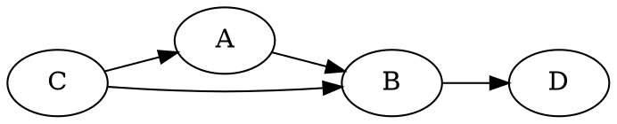
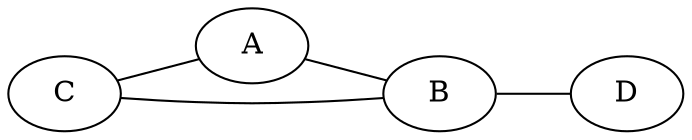
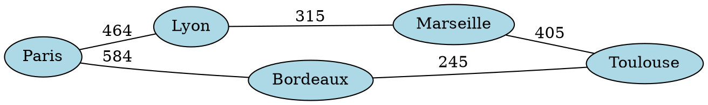
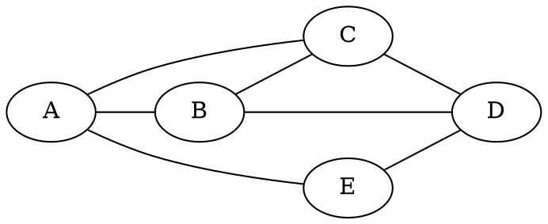
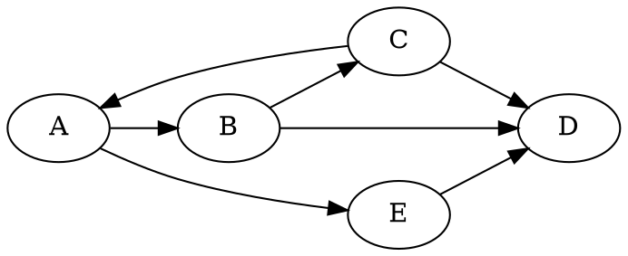
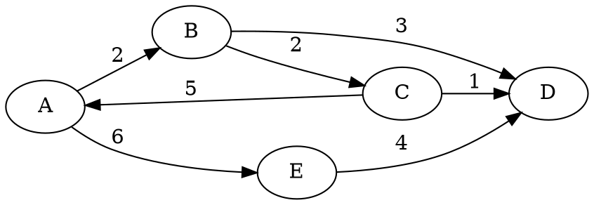

# Graphes - Généralités et Implémentation

## Introduction

Les graphes sont des structures de données essentielles en informatique, permettant de modéliser des relations entre des éléments. Que ce soit pour représenter un réseau routier, un réseau électrique, Internet ou des relations sociales, les graphes offrent une manière **puissante** de visualiser et d'analyser ces connexions. Toutes les structures que nous avons vues peuvent être vues comme des cas particuliers de graphes.

## I. Définition des Termes

### A. Sommets, Arêtes et Arcs

1. **Sommets (ou nœuds)** : Ce sont les entités de base du graphe, représentées par des points. Dans le contexte du réseau routier, un sommet pourrait être une intersection.

2. **Arêtes** : Ce sont les connexions entre les sommets. Dans le contexte d'un réseau routier, une arête pourrait être une route reliant deux intersections.

3. **Arcs** : Dans le cas des graphes orientés, les connexions entre les sommets sont appelées arcs. Ils ont une direction, ce qui signifie qu'ils vont d'un sommet source à un sommet destination.

3. **Poids** : Parfois, les arêtes portent une information appelée poids. Dans un graphe représentant des interconnexions entre des villes, il peut s'agir d'une distance. Dans un graphe de neurones, il peut s'agir de l'importance à accorder à une connexion entre deux neurones. Dans un graphe de routage, il peut s'agir de la vitesse de connexion entre 2 routeurs. On appelle graphe pondéré un graphe dont les arêtes portent un poids.

### B. Graphes Orientés et Non Orientés

1. **Graphes Orientés** : Les graphes orientés ont des arcs avec une direction spécifiée. Ils sont utilisés pour représenter des relations asymétriques, comme les connexions dans un réseau social où on peut suivre quelqu'un sans qu'il nous suive.



2. **Graphes Non Orientés** : Dans ces graphes, les arêtes n'ont pas de direction. Ils sont utilisés pour représenter des relations symétriques, comme des amitiés.



3. **Graphes pondérés** : Les graphes pondérés sont des graphes dont les arêtes portent un poids.

Voici un exemple de graphe non orienté pondéré où le poids représente la distance entre les villes. 
On peut aussi avoir des graphes orientés pondérés.




## II. Modélisation de Situations sous Forme de Graphes

Les graphes peuvent être utilisés pour représenter diverses situations, notamment :

### A. Réseau Routier

- **Sommets** : Intersections ou points d'entrée/sortie.
- **Arêtes** : Routes reliant les intersections.
- **Graphes Orientés** : Si les routes sont à sens unique.

### B. Réseau Électrique

- **Sommets** : Stations électriques, points de distribution.
- **Arêtes** : Câbles ou lignes électriques reliant les stations.
- **Graphes Orientés** : La direction indique le flux d'électricité.

### C. Internet

- **Sommets** : Serveurs, sites web.
- **Arêtes** : Liens hypertextes ou connexions entre serveurs.
- **Graphes Non Orientés** : Les liens peuvent être bidirectionnels.

### D. Réseaux Sociaux

- **Sommets** : Utilisateurs.
- **Arêtes** : Amitiés ou relations entre utilisateurs.
- **Graphes Non Orientés** : Les relations peuvent être mutuelles.
- **Graphes Orientés** : On peut follow quelqu'un sans être followed.

### E. Réseaux de neurones (Intelligence artificielle)
- **Sommets** : Neurones
- **Arêtes** : Connexions entre neurones.
- **Graphes Non Orientés** : Les relations peuvent être mutuelles.


## III. Implémentations des Graphes

Pour travailler avec des graphes, différentes représentations peuvent être utilisées :

### A. Matrice d'Adjacence

!!! hint "Préambule: MATRICES"
    En mathématiques, une matrice est un tableau rectangulaire d'éléments, organisé en lignes et colonnes. Chaque élément de la matrice est identifié par ses indices de ligne et de colonne. Une matrice de dimensions $m \times n$ a $m$ lignes et $n$ colonnes.

    Voici comment une matrice peut être représentée :

    $$
    A = \begin{pmatrix}
    a_{11} & a_{12} & \ldots & a_{1n} \\
    a_{21} & a_{22} & \ldots & a_{2n} \\
    \vdots & \vdots & \ddots & \vdots \\
    a_{m1} & a_{m2} & \ldots & a_{mn} \\
    \end{pmatrix}
    $$

    Dans cette représentation, $a_{ij}$ représente l'élément situé à la $i$-ème ligne et $j$-ème colonne de la matrice. Par convention, la notation mathématique commence souvent à 1 et non à 0. Ce qui ne sera évidemment pas le cas dans le code.

    Les matrices sont utilisées dans divers domaines des mathématiques, de l'informatique, de la physique, et d'autres disciplines pour représenter et manipuler des données. Les matrices jouent un rôle crucial dans la résolution de systèmes d'équations linéaires, la transformation géométrique, la théorie des graphes, et de nombreux autres domaines.

    Les cartes graphiques (GPU) sont conçues pour le rendu d’images, mais leur architecture est spécialisée dans le calcul matriciel et vectoriel massivement parallèle. C’est ce qui les rend aussi utiles pour l’intelligence artificielle et le calcul scientifique.

!!! abstract "Matrice d'adjacence - Graphes non-orientés"

    Une matrice où $mat[i][j]$ vaut $1$ si et seulement si il y a une arête entre les sommets $i$ et $j$, $0$ sinon. Notez que la matrice est forcément symétrique.

!!! hint "Matrice symétrique"
    Une matrice $M$ est dite symétrique ssi $ \forall (i,j), M_{i,j}=M_{j,i}$

<center>




</center>

$$
\begin{array}{c|ccccc}
 & A & B & C & D & E \\
\hline
A & 0 & 1 & 1 & 0 & 1 \\
B & 1 & 0 & 1 & 1 & 0 \\
C & 1 & 1 & 0 & 1 & 0 \\
D & 0 & 1 & 1 & 0 & 1 \\
E & 1 & 0 & 0 & 1 & 0 \\
\end{array}
$$


!!! abstract "Matrice d'adjacence - Graphes orientés"
    Une matrice à deux dimensions où $mat[i][j]$ est Vrai si et seulement si il y a une arête allant du sommet $i$ au sommet $j$. $i$ est l'indice ligne. $j$ est l'indice colonnes. 


<center>



</center>

$$ 
\begin{array}{c|ccccc}
 & A & B & C & D & E \\
\hline
A & 0 & 1 & 0 & 0 & 1 \\
B & 0 & 0 & 1 & 1 & 0 \\
C & 1 & 0 & 0 & 1 & 0 \\
D & 0 & 0 & 0 & 0 & 1 \\
E & 0 & 0 & 0 & 1 & 0 \\
\end{array}
$$

!!! abstract "Matrice d'adjacence - Graphes orientés" 
    Une matrice à deux dimensions où $mat[i][j]$ est égal au poids de l’arête allant du sommet $i$ au sommet $j$, et 0 s’il n’existe pas d’arête. $i$ est l’indice ligne. $j$ est l’indice colonne.

<center>


</center>


$$ 
\begin{array}{c|ccccc}
 & A & B & C & D & E \\
\hline
A & 0 & 2 & 0 & 0 & 6 \\
B & 0 & 0 & 2 & 3 & 0 \\
C & 5 & 0 & 0 & 1 & 0 \\
D & 0 & 0 & 0 & 0 & 0 \\
E & 0 & 0 & 0 & 4 & 0 \\
\end{array}
$$

!!! example "Implémentations possible"
    On peut utiliser une liste de listes  pour matérialiser la matrice et assimiler le graphe à la matrice, sans considération des étiquettes.
    
    ```python
        type num = int|float
        type graphe = list[list[num]]
    ```

    On peut vouloir aussi intégrer l'étiquette des sommets.

    ```python
        type num = int|float
        type matrice = list[list[num]]
        type graphe = tuple[list[str], matrice]

        def creer_vide() -> graphe:
            return ([], [])
        
        def sommets(g: graphe) -> list[str]:
            return g[0]

        def matrice(g: graphe) -> matrice:
            return g[1]

        def poids(i: int, j: int, g: graphe) -> matrice:
            return matrice(g)[i][j]

        def index_sommet(g: graphe, s: str) -> int:
            return sommets(g).index(s)
    ```

    L'implémentation des graphes est rarement effectuée en POO, ou alors tout simplement pour encapsuler les méthodes précédentes pour être raccord avec le paradigme du langage d'implémentation.

    ```python
    class GrapheNO:
        """Graphe non orienté"""
        def __init__(self, mat: list[list[int]], sommets: list[str]):
            self.mat = mat
            self.sommets = sommets
        
        def nb_voisins(self, s: str) -> int:
            return sum(self.mat[self.sommets.index[s]])
    ```

!!! question "Graphes non orientés"
    Complétez le code du fichier python fourni implémentant un graphe non orienté pondéré.


### B. Listes d'adjacence

Chaque sommet est représenté par une liste contenant les sommets adjacents. Dans le cas des graphes orientés, on peut avoir une liste de successeurs (suivants) ou une liste de prédécesseurs (précédents). Dans les exercices, on aura une liste de successeurs.

!!! example "Implémentation possible"
    On peut utiliser `dict[str, list[str]]` pour un graphe non pondéré.

    Chaque clé sera un sommet, chaque valeur sera la liste des sommets sortants.

    Dans le cas d'un graphe pondéré, on peut utiliser `dict[str, dict[str, int|float]]`.

    Chaque clé sera un sommet, chaque valeur sera un dictionnaire contenant les sommets sortants assortis de leur poids.

!!! question Application
    Compléter le code suivant pour le graphe orienté, et aussi pour le graphe non orienté:

    ```python
    listes_adj_NO = {
        "A": [...],
        "B": [...],
        ...
    }
    ```

    ```python
    listes_adj_O = {
        "A": [...],
        "B": [...],
        ...
    }
    ```

!!! question "Graphes orientés pondérés"
    Complétez le code du fichier python fourni implémentant un graphe orienté pondéré.


!!! question "Graphes complets et densité:"
    On ne parlera ici de de graphes non orientés.

    Un graphe est complet si chaque sommet est relié à tous les autres. On appelle $K_n$ le graphe complet à $n$ sommets.

    1. Dessiner $K_n, n \in \llbracket 1, 5 \rrbracket $ 
    2. Soit un graphe complet à n sommets. 
        - Combien d'arêtes ajoute-t-on à $K_{n-1}$ pour obtenir $K_n$?
        - Soit $A_n$ le nombre d'arrete d'un graphe complet à n sommets. Exprimer $A_n$ en fonction de $A_{n-1}$
        - Démontrer par récurrence que $A_n = \frac{n(n-1)}{2}$
        - Donner une fonction ```nb_aretes_complet(n: int) -> int``` ou n est le nombre de sommets d'un graphe complet ayant n sommets.
    2. La densité d'un graphe à $n$ sommets et $m$ arêtes est la quantité $\delta(n, m)$ représentant le rapport de son nombre d'aretes au nombre d'aretes du graphe complet associé aux sommets.
        - Quelle est la densité de $K_n, n>1$?
        - Quelle est la densité d'un graphe à n sommets sans arêtes?
        - La densité d'un graphe est toujours comprise entre 2 valeurs entières. Lesquelles et pourquoi?. Que représentent-elles comme information?
        - Donner l'expression de $\delta(n, m)$
        - Ecrire une fonction `densite` qui calcule la densité d'un graphe.


!!! question "Graphes orientés pondérés"
    - Ajoutez une fonction get_listes_adjacences à l'implémentation du graphe non orienté pondéré.
    - Ajoutez une fonction get_matrice_adjacence à l'implémentation du graphe orienté pondéré.


## IV. Passage entre les Représentations

Il est parfois nécessaire de passer d'une représentation à une autre en fonction des opérations que l'on souhaite effectuer, car certaines tâches seront moins complexes en fonction de la représentation.
Par exemple, dans le cas de la représentation par listes d'adjacence, la complexité de l'algorithme de parcours en profondeur est généralement proportionnelle au nombre total d'arêtes dans le graphe. En revanche, dans le cas de la matrice d'adjacence, la complexité dépend du nombre total de sommets dans le graphe, car il faut parcourir la ligne correspondant au sommet de départ pour trouver ses voisins. Ainsi, la complexité peut varier en fonction de la densité du graphe et du choix de la représentation.

### A. De la Matrice d'Adjacence à la Liste de Successeurs

- Parcourir chaque ligne de la matrice.
- Pour chaque ligne, créer une liste contenant les indices des sommets adjacents.

### B. De la Liste de Successeurs à la Matrice d'Adjacence

- Créer une matrice vide.
- Pour chaque liste de successeurs, marquer les éléments correspondants dans la matrice.


## V. Exercices fondamentaux

!!! question "Exercice 1 :"
    Considérez le graphe suivant :
    
    ```graphviz dot g4.png
    digraph G {
    rankdir=LR;
    A -> B;
    B -> C;
    A -> C;
    D -> A;
    D -> B;
    }
    ```

    !!! abstract "Cycles"
        Dans un graphe non orienté, un cycle est une suite d'arêtes consécutives distinctes (chaine simple) dont les deux sommets extrémités sont identiques. Dans les graphes orientés, la notion équivalente est celle de circuit, même si on parle parfois aussi de cycle. Afin de simplifier le vocabulaire, on parlera de cycle pour les deux. Un graphe ne comportant pas de cycle est dit acyclique.

    Partie 1:

    - Le graphe est-il acyclique? Justifier
    - Écrivez la matrice d'adjacence.
    - Écrivez les listes de successeurs

    Partie 2:

    - On considère la version non orientée de ce graphe.
    - Répondre aux même questions.

!!! question "Exercice 2 :"
    Considérez le graphe non orienté suivant :

    ```graphviz dot g5.png
    graph G {
        rankdir=LR;

        A -- B;
        A -- C;
        A -- D;
        B -- C;
        B -- D;
        C -- D;
        E -- F;
        E -- G;
        F -- G;
    }
    ```

    !!! abstract "Graphe connexe"
        Un graphe est dit connexe si, pour chaque paire de nœuds distincts dans le graphe, il existe un chemin entre ces deux nœuds. Autrement dit, il n'y a pas de sous-graphes isolés dans un graphe connexe, chaque nœud peut être atteint à partir de n'importe quel autre nœud par une séquence d'arêtes. 

    - Le graphe est-il connexe? Justifier
    - Le graphe est-il cyclique? Justifier
    - Écrivez la matrice d'adjacence.
    - Écrivez les listes de successeurs


!!! abstract "Relation entre sommets et arêtes"

    On peut prouver que la somme des degres d'un graphe est le double du nombre d'arêtes.

    Euler l'a fait par double dénombrement.

    On se propose de compter le nombre d'extrémités d'arêtes de 2 manières:

    - Chaque arête possède 2 extrémités, donc c'est 2 fois le nombre d'arêtes.
    - **Le degré d'un sommet représente le nombre d'extrémités rattachées**. Donc la somme des degrés représente le nombre total d'extrémités.

    On aboutit donc à cette formule, pour un graphe $(S, A)$, où $S$ est l'ensemble des sommets, et $A$ l'ensemble des arêtes:

    $$ \sum_{s \in S} deg(s) = 2 \times |A| $$

!!! question "Poignées de main"
    Lors d’une réception réunissant 8 personnes, on demande à chacune d’entre elles de dire combien de poignées de main elles ont échangées au total pendant la soirée. En additionnant ces 8 réponses, on obtient 20.
    Combien de poignées de main ont effectivement eu lieu pendant cette réception ?
    Quelle est la densité du graphe des poignées de mainassocié?


