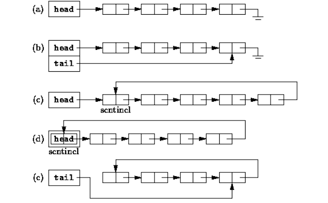
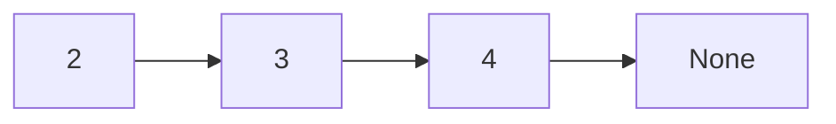

# Listes chaînées, en objet

!!! danger "Requis"
    Vous devez savoir refaire les exercices sur la création et l'utilisation de classes en POO sans regarder le corrigé.

## Introduction

On implémente une liste une **troisième** fois. En Gleam puis en Python fonctionnel, une liste était `Vide` **ou** `Cons(tête, queue)`. Ici, en **objet** et de façon **mutable** : une chaîne de **maillons**, chaque maillon portant une donnée et une **référence** vers le suivant. Le dernier ne pointe vers rien : `None`.

C'est la **même structure**, vue sous le troisième paradigme :

| Gleam / fonctionnel | Objet (ici) |
|---|---|
| `Vide` | `None` |
| `Cons(tête, queue)` | un `Maillon` (donnée + référence au suivant) |



## La classe `Maillon`

Un maillon a une **donnée** (`data`) et une référence `next` vers le maillon **suivant**, ou `None` s'il est le dernier.

```python
class Maillon[T]:
    def __init__(self, data: T, next: "Maillon[T] | None"):
        self.data = data      # la donnée
        self.next = next      # référence vers le suivant, ou None
```

On peut fabriquer une chaîne à la main. La liste `2 -> 3 -> 4` :

```python
m3 = Maillon(4, None)     # le dernier pointe vers None
m2 = Maillon(3, m3)
m1 = Maillon(2, m2)
```

À comparer avec le Gleam `Cons(2, Cons(3, Cons(4, Vide)))` : le même emboîtement, mais avec des **références** entre objets.



## La classe `Liste`

Manipuler les maillons à la main est pénible. On enveloppe la chaîne dans une classe `Liste`, qui garde une **référence vers son premier maillon** (`tete`), ou `None` si elle est vide.

```python
class Liste[T]:
    def __init__(self) -> None:
        self.tete: "Maillon[T] | None" = None    # une liste neuve est vide
```

**Disjonction de cas, comme en fonctionnel.** Toute méthode distingue deux cas : la liste est **vide** (`tete is None`), ou elle a une tête et une suite.

```python
    def est_vide(self) -> bool:
        return self.tete is None

    def ajouter_debut(self, e: T) -> None:
        # un nouveau maillon dont le suivant est l'ancienne tête
        self.tete = Maillon(e, self.tete)
```

`ajouter_debut` est le **`Cons` mutable** : au lieu de *renvoyer* une nouvelle liste, on **modifie** `self.tete`.

!!! warning "Piège : `is None`, pas `== None`"
    Pour tester si une référence vaut `None`, on écrit `is None` (comparaison d'identité), pas `== None`.

## Parcourir : la longueur

En fonctionnel, on parcourait par **récursivité**. En objet impératif, on parcourt avec une **boucle `while`** : on avance de maillon en maillon jusqu'à `None`.

```python
    def longueur(self) -> int:
        n = 0
        courant = self.tete
        while courant is not None:
            n += 1
            courant = courant.next
        return n
```

C'est le **contraste de paradigmes** : même structure, mais ici on **itère** (`while`) et on met à jour un compteur, là où Gleam **récursait**.

## À toi

!!! question "Les méthodes de la liste"
    Écris, comme **méthodes** de la classe `Liste`, sans récursivité (avec des boucles `while`) :

    - `ajouter_fin(e)` : ajoute `e` à la fin.
    - `contient(e)` : renvoie `True` si `e` est dans la liste.
    - `__str__` : renvoie une chaîne du style `"3 -> 2 -> 1 -> _|_"`.

    Fais la **disjonction de cas au papier** d'abord (liste vide ? sinon ?).

    ??? success "Corrigé"
        ```python
        def ajouter_fin(self, e: T) -> None:
            if self.tete is None:
                self.tete = Maillon(e, None)
            else:
                courant = self.tete
                while courant.next is not None:
                    courant = courant.next
                courant.next = Maillon(e, None)

        def contient(self, e: T) -> bool:
            courant = self.tete
            while courant is not None:
                if courant.data == e:
                    return True
                courant = courant.next
            return False

        def __str__(self) -> str:
            s = ""
            courant = self.tete
            while courant is not None:
                s += str(courant.data) + " -> "
                courant = courant.next
            return s + "_|_"
        ```

## Pour aller plus loin : la sentinelle

??? note "Supprimer tous les cas particuliers"
    Les méthodes ci-dessus traitent à part le cas vide et le premier maillon. On peut **éliminer ces cas spéciaux** avec une astuce : donner à la liste un **maillon sentinelle** placé avant le premier, toujours présent (même quand la liste est « vide »). Poussée à l'extrême, la liste **est** sa propre sentinelle, un maillon circulaire qui, au départ, pointe sur lui-même, et `None` n'apparaît alors jamais dans la structure.

    C'est **plus élégant** (les méthodes n'ont plus aucun cas particulier) mais **plus subtil** (un objet qui se référence lui-même, de l'héritage). À explorer une fois la version simple ci-dessus bien acquise. La version complète avec sentinelle circulaire figure dans l'historique de cette page.
