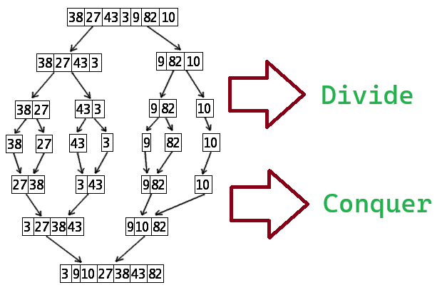

# Tri Fusion

## Fusion

L'objectif est, à partir de **2 listes triées** `lst1` et `lst2`, d'obtenir leur fusion en **une liste triée**.

### Algorithme


On procède par disjonction de cas, en bon lutin:

#### On reçoit 2 listes vides

La fusion de deux listes vides est une liste vide.

```elm
(Vide, Vide) -> Vide
```

#### On reçoit `lst1` vide et `lst2` non vide

On n'a rien à faire qu'à renvoyer lst2 qui est déjà triée 

```elm
(Vide, Cons t q) -> lst2
```

#### On reçoit `lst1` non vide et `lst2` vide

Pareil, il n'y a qu'à renvoyer `lst2`

```elm
(Cons t q, Vide) -> lst1
```

#### On reçoit deux listes non vides

Alors ici, on sait qu'on va devoir **construire** la liste résultat.

La liste résultat commencera forcément par la plus petite des têtes.

```elm
(Cons t1 q1, Cons t2 q2) -> 
        if t1 <= t2 then
            Cons t1 ........
        else
            Cons t2 ........
```

Dans le premier cas, quelle est la queue de la liste résultat?

Une fois qu'on a mis t1 dans la liste résultat, il nous reste à y mettre fla fusion de q1 et de lst2. On a qu'à demander à un autre lutin de le faire!

```elm
(Cons t1 q1, Cons t2 q2) -> 
        if t1 <= t2 then
            Cons t1 (fusion q1 lst2)
        else
            Cons t2 ........
```

De la même manière, dans le deuxième cas, il nous reste à fusionner lst1 et q2 pour la queue.

```elm
(Cons t1 q1, Cons t2 q2) -> 
        if t1 <= t2 then
            Cons t1 (fusion q1 lst2)
        else
            Cons t2 (fusion lst1 q2)
```

ce qui nous donne au final:

```elm
fusion : Liste comparable -> Liste comparable -> Liste comparable
fusion : lst1                lst2 =
    case (lst1, lst2) of
        (Vide, Vide) -> Vide
        (Vide, Cons t q) -> lst2
        (Cons t q, Vide) -> lst1
        (Cons t1 q1, Cons t2 q2) -> 
                if t1 <= t2 then
                    Cons t1 (fusion q1 lst2)
                else
                    Cons t2 (fusion lst1 q2)
```

La terminaison est assurée par la diminution stricte de la taille du problème.
Si on note $n = |lst1| + |lst2|$, alors n décroît strictement à chaque appel puisqu'on appelle toujours fusion sur un élément de moins. On finira donc par tomber sur un des cas de base.

### Complexité de la fusion

Le pire des cas est celui où on doit tout le temps appeler le cas récursif, donc quand les listes ont la même taille, et gardent la même taille (à 1 près). Pour garder la même taille, il faut que les deux listes soient entrelacées pour garantir une alterannce entre gauche et droite:
```python
lst1 = [1, 3, 5, 7, 9]
lst2 = [2, 4, 6, 8, 10]
```

Soit $n = n_1 + n_2$ la taille totale du problème (somme des tailles des deux listes).

Soit $T_n$ le temps qu'il faut pour effectuer cette fusion.

À chaque étape de la fusion :
- On traite 1 élément (on le place dans le résultat)
- Le problème restant a taille $n - 1$

Le temps qu'in faut pour fusionner, c'est une unité de temps (simplement construire le résultat avec une tete qu'on a déjà), plus le temps qu'il faut pour construire sa queue de taille $ n - 1 $ par fusion. Donc pour un temps $T_{n-1}$ 

On obtient la **suite récurrente** :

$$T(n) = 1 + T(n-1)$$

$$T(0) = 1$$

C'est une **suite arithmétique de raison 1**. Son terme général est :
$$T(n) = T(0) + n \times 1 = n + 1$$

**Conclusion** : La complexité temporelle de la fusion est $O(n)$

On notera que pour fusionner 2 listes, on est obligés de traiter chacun des éléments, d'une manière ou d'une autre. Ils ne vont pas arriver magiquement dans le résultat. On est donc certains qu'on ne peut pas avoir de complexité inférieure pour la fusion de deux listes quelconques.

## Tri fusion

Ici, la technique en oeuvre est officiellement appelée "diviser pour mieux régner" (divide and conquer).

!!! danger "diviser pour mieux régner"
    Un algorithme "diviser pour mieux régner" divise le problème plusieurs sous problèmes et combine les résultats.

### Algorithme

Je suis un lutin trieur et mon job s'appelle `tri_fusion` 

1. Si on me donne une liste Vide:
    - Je renvoie Vide.

2. Si on me donne une liste à 1 élément:
    - Je renvoie cette liste. La présence de ce cas est expliquée dans la terminaison.

3. Si on me donne une liste non vide:

    - **DIVIDE** Je commence par la diviser en 2 parties à peu près égales `lst1` et `lst2`.
        - je demande à un lutin trieur de trier `lst1`
        - je demande à un lutin trieur de trier `lst2`
    - **CONQUER** Lorsque j'ai reçu les 2 résultats (donc triés), je demande à un lutin fusionneur de les fusionner.

donc je FUSIONne le TRI de lst1 et le TRI de lst2.

```elm
fusion (tri_fusion lst1) (trifusion lst2)
```

La fonction complète:

```elm
triFusion : Liste comparable -> Liste comparable
triFusion   lst =
    let n = taille lst in 
    case lst of
        Vide -> Vide
        Cons _ Vide -> lst
        _ -> fusion (triFusion (take (n//2) lst)) (triFusion (drop (n//2) lst))
```

En gros, le seul calcul que j'ai fait, c'est n//2, et j'ai délégué tout le reste à d'autres lutins.

### Terminaison 

On rappelle à chaque fois `tri_fusion` sur des listes de taille strictement inférieure, sauf dans le cas de la liste à un élément qui divise la liste en 1 liste à 0 éléments et une liste à un élément. Mais ce cas est capturé par un cas de base. La fonction se termine donc.

### Complexité

Le pire des cas pour le tri fusion est tordu, c'est celui où il y a un nombre de comparaisons maximal pendant les fusions.

De toute façon, la grande force du tri fusion, c'est que tous les cas se valent en terme de complexité.

L'idée générale, c'est que le tri fusion divise toujours le tableau en deux moitiés égales (ou presque), récursivement :

- Profondeur de récursion : $\log n$ (car on divise par 2 à chaque niveau, comme pour la dichotomie)
- Travail par niveau de récursion : $O(n)$ pour fusionner, take, drop et taille

Donc : $\log n$ niveaux fois $O(n)$ travail par niveau =

$$\huge \mathcal{O}(n \log n)$$

**On peut aussi voir ça comme on l'a fait pour la fusion:**


Ici, on est dans le cas où  pour calculer $T_n$, on fait déjà 2 fois triFusion sur $n \over 2$ éléments (donc ça dure $2 \times T_{n \over 2}$) puis on fusionne, ce qui nous rajoute un $O(n)$.

On a donc $T_n = 2 \times T_{n \over 2} + O(n)$, avec $T_0=1$

Alors là c'est un peu plus complexe qu'une suite arithmétique.

Il existe un théorème, le [`Master Theorem`](https://fr.wikipedia.org/wiki/Master_theorem), qui nous permet souvent de conclure sur la complexité de ce genre de suites.

On peut aussi demander à [WolframAlpha](https://www.wolframalpha.com/input?i=t%280%29%3D1%2C+t%28n%29%3D2*t%28n%2F2%29%2Bn)

### Représentation visuelle

On peut représenter visuellement 



## Python avec le type `list`

### Fusion

En impératif, on va s'appuyer sur notre définition récursive pour construire la fonction suivante:

```python
def fusion[T: Comparable](lst1: list[T], lst2: list[T]) -> list[T]:
```

On va simuler la consommation progressive des listes avec des indices $i_1$ et $i_2$. i1, c'est la position de la tete courante de lst1, et i2 c'est la position de la tete courante de lst2.

TODO Mettre un dessin

Donc nos têtes sont `lst1[i1]` et `lst2[i2]`

On va procéder par accumulation dans un résultat, comme d'habitude.

```python
i1: int = 0   # On met les tetes au début des listes
i2: int = 0
res: list[T] = []  # On créé notre accumulateur
```

dans la boucle while, on ne va traiter **que le cas récursif**, donc quand le reste à traiter est non vide des deux côtés. Donc quand `i1 < len(lst1)` et `i2 < len(lst2)`

```python
while i1 < len(lst1) and i2 < len(lst2):
    if lst1[i1] <= lst2[i2]:
        res.append(lst1[i1])
        i1 += 1     # on fait avancer la tete vu qu'on l'a consommée dans le résultat
    else:
        res.append(lst2[i2])
        i2 += 1     # Pareil du côté lst2
```

Maintenant, on est sûrs d'être dans un des cas de base.
Il faut rajouter au résultat ce qu'il reste de lst1 ou ce qu'il reste de lst2 s'il en reste. C'est là que les slices sont super pratiques. Elles ne râlent pas en cas de débordement et renvoient juste la liste vide (tiens tiens... comme take et drop...).

Ce qu'il reste de lst1 à traiter, c'est `lst1[i1:]`, pareil pour lst2.

On n'a plus qu'à concaténer le résultat avec tout ça, vu qu'on est sûrs que soit l'une, soit l'autre, soit les 2 sont vides à cause de la garde du while.

```python
res += lst1[i1:]
res += lst2[i2:]
```

Voici donc la fonction finalisée:

```python
def fusion[T: Comparable](lst1: list[T], lst2: list[T]) -> list[T]:

    i1: int = 0  # indice de la tête dans lst1
    i2: int = 0  # Indice de la tete dans lst2
    res: list[T] = []

    while i1 < len(lst1) and i2 < len(lst2):
        if lst1[i1] <= lst2[i2]:
            res.append(lst1[i1]) # On ajoute la tete au résultat
            i1 += 1              # On avance la tete de lst1
        else:
            res.append(lst2[i2])
            i2 += 1

    res += lst1[i1:]
    res += lst2[i2:]

    return res   # On n'oublie pas le bon vieux return
```

### Tri Fusion

En python, on le fera aussi récursivement, de la même manière.

```python
def tri_fusion[T: Comparable](lst: list[T]) -> list[T]:

    n: int = len(lst)//2

    match lst:
        case []:
            return []
        case [_]:
            return lst
        case [t, *q]:
            return fusion(tri_fusion(lst[:]n), tri_fusion(lst[n:]))
```

je vous laisse réécrire ça avec des if en vous basant sur la taille de la liste.

!!! tip "Variantes"
    Il existe plusieurs variantes à l'implémentation impérative du tri fusion, mais qui respectents toutes la spécification fonctionnelle.
    Ce que je vous présente ici, c'est la base.

