# Listes chaînées - Approche Orientée Objet


!!! danger "Requis"
    Vous devez savoir refaire les exercices sur la création et l'utilisation de classes en POO sans regarder le corrigé.

## Introduction

Une liste chaînée est aussi une structure permettant d'implémenter une liste.

La chaîne que représente la liste est composée de plusieurs maillons.

Chaque Maillon est composé d'un élément et d'une référence vers le maillon suivant.


Il existe plusieurs façons d'organiser ces maillons:

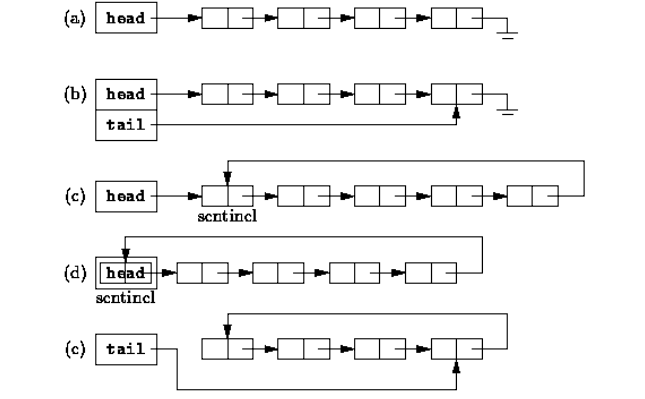


Il reste un bon exercice d'essayer de temps en temps d'implémenter une autre version de liste chaînée.


## Définition de la classe `Maillon`

Un `Maillon` de la chaîne possède une donnée ainsi qu'une référence à son maillon suivant. 

Un maillon a donc deux attributs :

1. **`data`** : La donnée contenue dans le maillon (ici un entier).
2. **`next`** : Une référence vers le maillon suivant.

```python
class Maillon:
    def __init__(self, data: int, next: 'Maillon'):
        self.data = data
        self.next = next
```

### Problème initial

Cette définition présente un problème. Lorsqu’on crée un maillon, on doit spécifier le maillon suivant (`next`), mais ce maillon suivant n’existe pas encore à ce stade de la création. Nous devons résoudre ce problème pour pouvoir créer une chaîne. 

```python
premier_maillon = Maillon(3, ...euh, j'ai pas de maillon...)
```

### Sentinelle
!!! abstract "Définition"
    En informatique, une **sentinelle** est une valeur spéciale qui indique une ou plusieurs bornes d'une structure de données. 


Appliqué à notre cas, en considérant que la sentinelle et dans notre chaîne, et qu'il n'y a que des maillons dans la chaîne:

- La sentinelle est dans la chaîne, donc la **Sentinelle EST UN Maillon**.
- Mais tout maillon a un prochain maillon.    
- Vu que la sentinelle est un Maillon, elle doit donc avoir un prochain maillon. 

Il semble que nous soyons de retour à notre problème initial, mais en réalité, pas du tout.
Pour résoudre ce casse tête, On va lui dire que son prochain maillon, c'est ___initialement___ elle-même.

#### Classe `Sentinelle`

```python
class Sentinelle(Maillon):    # Une Sentinelle EST UN Maillon
    def __init__(self):
        super().__init__(0, self)   # Son prochain Maillon est initialement elle-même
```


Cette classe hérite de la classe `Maillon`. 
Grâce à l’appel de **`super()`**, nous invoquons le constructeur de `Maillon` tout en assignant la sentinelle comme le maillon suivant d'elle-même.
Sa donnée est arbitrairement mise à 0.


Voici comment évoluera progressivement notre sentinelle (0) lorsqu'on ajoutera en tête les éléments 5, 3, puis 12:

<table><tr><td>

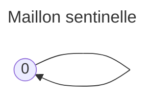
</td><td>

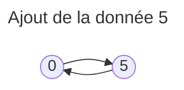
</td><td>

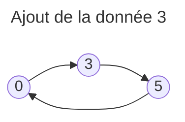
</td></tr></table>

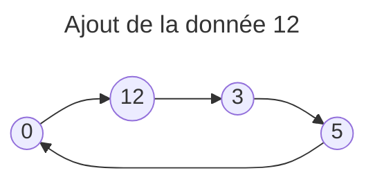

Sauf lorsque la liste est vide, le premier élément de la liste est juste après la sentinelle. Le dernier est juste avant.

!!! note 
    Il est important de réaliser que l'attribut next est une référence à un noeud. ___"next, c'est la flèche qui va vers"___


## Définition de la classe `Liste`

Nous allons gérer une liste à partir de sa sentinelle. **Nous assimilerons alors une liste à sa sentinelle, en renommant tout simplement la classe sentinelle en Liste. On OUBLIE donc la classe sentinelle qui n'était là que pour la démarche de réflexion. La sentinelle d'une liste, c'est elle-même en tant que Maillon.**

La classe `Liste` hérite de `Maillon` et représente notre liste chaînée complète.

Lorsqu'elle est créée (donc vide), c'est un maillon pointant sur lui-même et qui représentera toujours sa propre sentinelle.

#### Attributs de `Liste`
- **`__taille`** : Stocke la taille de la liste.
- **`ajouter_tete`** : Ajoute un nouvel élément en tête de la liste.

```python
class Liste(Maillon):
    def __init__(self):
        super().__init__(0, self)
        self.__taille = 0
```

Dans une méthode, self.next représente toujours le premier Maillon, à moins que la liste ne soit vide, auquel cas elle pointe sur elle même.

Ici, on choisit de plus de maintenir la taille du maillon en permanence.
On marque cet attribut comme privé grâce au double underscore, afin de signifier qu'il ne doit pas être modifié par les programmeurs qui utilisent cette classe.

Vu que la récupération de la taille est une opérationn courante, sa récupération sera donc en $\mathcal{O}(1)$, au lieu de $\mathcal{O}(n)$ s'il faut parcourir tous les maillons d'une liste de taille $n$. Ceci se fait au prix de l'augmentation de la taille de stockage de la liste, mais on ne peut pas tout avoir.

**Tout ce qui suit est du légo avec les maillons, il faut juste penser à bien faire les opérations dans l'ordre à chaque fois. On procèdera de manière impérative, avec des while.**

#### Ajouter un élément

On veut ajouter un nouveau maillon portant la donnée 12 en tête de liste:

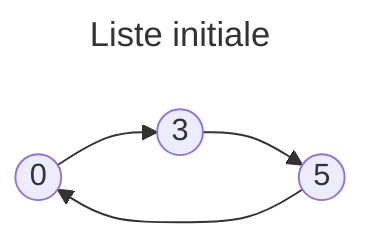

1. On créé un Maillon portant la donnée 12 et pointant vers le Maillon suivant la sentinelle (donc suivant la liste elle meme, puisqu'elle est sa sentinelle)
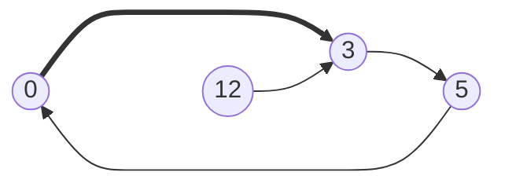
2. La flèche 0->3 représente la référence self.next
il faut la remplacer par une référence au maillon 12
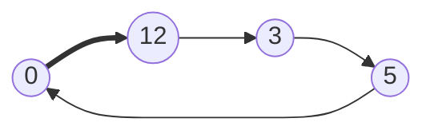
3. Vu qu'on a choisi de maintenir la taille, il ne faut pas oublier de lui ajouter 1

La méthode `ajouter_tete` écrite en conséquence insère un nouveau maillon juste après la sentinelle.

```python
def ajouter_tete(self, e: int):
    m = Maillon(e, self.next)     # 1
    self.next = m                 # 2
    self.__taille += 1            # 3
```

L'approche proposée permet de simplifier le code des méthodes.
En effet, ça marche indépendamment du fait que la liste soit vide ou pas.


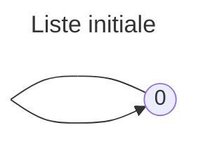
1. On créé un Maillon portant la donnée 12 et pointant vers le Maillon suivant la sentinelle 
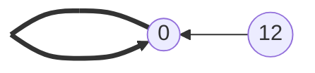

2. La flèche en gras représente la référence self.next
il faut la remplacer par une référence au maillon 12

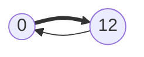

#### Méthodes de départ

Afin de vous lancer sur le parcours de cette structure, je vous donne votre deuxième méthode, la méthode `est_vide`.

```python
def est_vide(self) -> bool:
    """
    Renvoie True si la liste est vide, False sinon.
    """
    return self.next is self
```

ainsi que la méthode longueur, qui renvoie la taille calculée de la liste.

A l'origine, le maillon courant est le premier maillon de la liste, ou elle même si la liste est vide.
Tant que courant n'est pas self (sinon ça veut dire qu'on est revenu à la sentinelle), on incremente l'accumulateur et on passe au maillon suivant.

```python
def longueur(self) -> bool:
    """
    Renvoie la taille calculée de la liste.
    """
    acc = 0
    courant = self.next
    while courant is not self:
        acc += 1
        courant = courant.next
    return acc
```


!!! tip Opérateur is
    l'opérateur is sert à comparer les objets, non pas en termes de valeur, mais en termes d'adresse mémoire.


!!! question Défi 
    A vous maintenant de recréer les fonctions que vous avez vues en programmation fonctionnelles en tant que méthodes de la classe liste en commençant par la méthode ajouter_fin. Vous n'utiliserez pas la récursivité.

    Tout comme nous l'avons fait avec OCaml en programmation fonctionnelle, complétez aussi le programme en C++.

