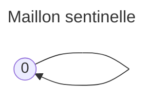
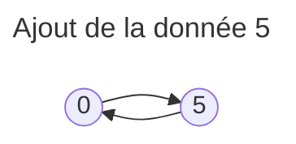
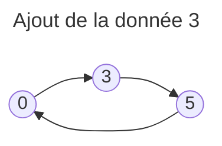
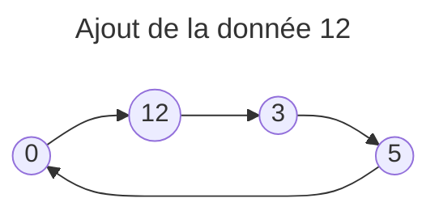
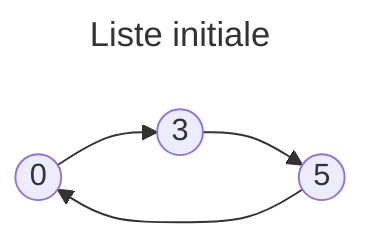
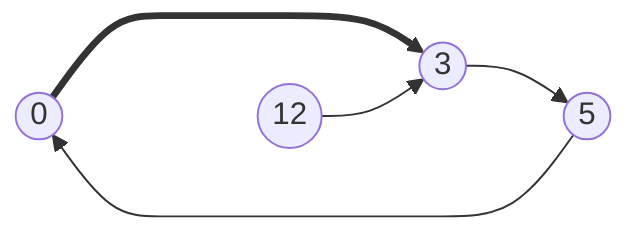
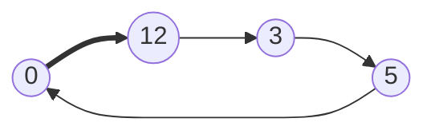
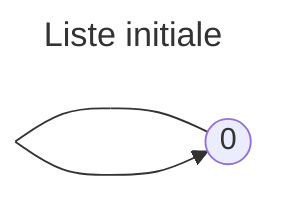
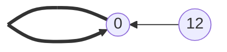
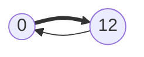

# Listes Chaînées 


!!! danger "Attention"
    Ici, nous ne parlons pas du tout des listes python. Nous n'en utiliserons d'ailleurs pas.


Les **listes chaînées** sont une structure de données linéaire qui permet de stocker une séquence d'éléments. Il existe une multitude de manière de les implémenter. Nous en verrons 2. 

Les listes chaînées sont un outil formidable pour faire ses premiers pas en récursivité. C'est aussi l'occasion de découvrir le paradigme fonctionnel, et aussi d'aller juste un peu plus loin dans le paradigme orienté objet.


## Partie 1 - Paradigme fonctionnel


!!! tip "Le Paradigme Fonctionnel"
    Le paradigme fonctionnel se distingue principalement par :
    
    - L'**immuabilité** des structures de données : ici, chaque fonction renvoie une **nouvelle** liste, sans affecter l'originale. Lorsqu'on insere dans une liste, il faut comprendre "renvoyer une nouvelle liste dans laquelle on a inséré"
    - L'usage intensif de la **récursivité** : au lieu de boucles, les fonctions comme `taille`, `somme`, ou `inverser` utiliseront la récursivité pour recueillir des informations sur la liste.
    - L'importance des **fonctions pures** : chaque fonction renvoie toujours le même résultat pour les mêmes arguments, sans effets de bord.

    Ce style de programmation garantit des comportements prévisibles et sûrs, ce qui est particulièrement utile en programmation concurrente et dans les applications où la fiabilité est critique.

Dans cette partie, nous allons explorer les bases des listes chaînées **immuables**, ce qui signifie qu'elles ne peuvent pas être modifiées par le code une fois créées. Toute opération qui "modifie" une liste renvoie une **nouvelle** liste, tout en préservant l'ancienne.


!!!abstract "Définition"
    Nous travaillerons avec des listes chaînées où chaque élément est un entier. 

    Chaque liste peut être :

    1. **vide**
    2. Contenir un élément appelé la **tête**, suivi de la **queue**, qui est une autre liste chaînée.

### Exemple concret de représentation en python

Nous utiliserons des tuples pour contenir une liste chainée car les tuples sont immuables, ils collent bien au cadre de la programmation fonctionnelle.

Nous matérialiserons la liste vide par un tuple vide.

Le tuple suivant représente une liste où la tête est `2`, et la queue est une liste dont la tête est `3`, suivie d'une liste ou la tete est 4, suivie elle-même de la liste vide.

```python
(2, (3, (4, ())))
```

### Traduction de notre définition en python:

```python
type vide = tuple[()]
LISTE_VIDE: vide = ()

type liste = vide | tuple[int, liste]
```
Nous créons ici deux types :

- `vide` représente le vide modélisé par un tuple vide.
- `liste` est une structure récursive qui peut être soit vide, soit un 2-uplet: tête (int) et queue(liste).


### Création et Accès aux Éléments

### Création d'une Liste
Une fonction typique pour créer une nouvelle liste à partir d'un entier et d'une autre liste :
```python
def creer(t: int, q: liste) -> liste:
    return (t, q)
```
Elle prend deux arguments :
- `t` : la tête (l'élément à ajouter).
- `q` : la queue (la liste suivante).

### Accès aux Éléments
Les deux opérations d'accès principales sont :
- **Tête** : obtenir le premier élément de la liste.
- **Queue** : obtenir la sous-liste à partir du deuxième élément.

```python
def tete(lst: liste) -> int:
    assert len(lst) == 2, "Liste vide"
    return lst[0]

def queue(lst: liste) -> liste:
    assert len(lst) == 2, "Liste vide"
    return lst[1]
```

### Fonctions de Base

#### Tester si une Liste est Vide
```python
def est_vide(lst: liste) -> bool:
    return lst == LISTE_VIDE
```
Cette fonction retourne `True` si la liste est vide, sinon `False`.

#### Calculer la Taille d'une Liste
```python
def taille(lst: liste) -> int:
    if est_vide(lst):
        return 0
    return 1 + taille(queue(lst))
```
Ici, on calcule récursivement la taille en comptant chaque élément jusqu'à atteindre la liste vide.

#### Calculer la Somme des Éléments
```python
def somme(lst: liste) -> int:
    if est_vide(lst):
        return 0
    return tete(lst) + somme(queue(lst))
```


#### Fonctions De modification

#### Ajouter un Élément en Tête

!!! success Supprimer la Tête
    ```python
    def supprimer_tete(lst: liste) -> liste:
        assert not est_vide(lst), "La liste est vide"
        return queue(lst)
    ```
    On peut supprimer la tête de la liste, mais il est nécessaire de vérifier que la liste n'est pas vide avant de le faire.

!!! success "Inverser une Liste"

    ```python
    def inverser(lst: liste) -> liste:
        if est_vide(lst):
            return LISTE_VIDE
        else:
            return ajouter_fin(tete(lst), inverser(queue(lst)))
    ```
    La fonction part du constat qu'il faut inverser la queue et lui ajouter la tete à la fin pour renverser une liste en sachant qu'on sait déjà renverser une sous-liste.


## Partie 2 - POO
### Listes chaînées - Programmation Orientée Objet

Les listes chaînées sont un prétexte pour apprendre plein de choses à base d'une structure simple, avant de passer à des structures plus évoluées. Vous croyez en avoir fini après la programmation fonctionnelle? Que nenni! Accrochez vous à votre poney, c'est parti!

!!! abstract Définition
    En programmation orientée objet, un programme est un ensemble d'entités qui interagissent. Ces entités sont appelées des **objets**. Un objet possède un **état** (les données qui le caractérisent) et des **comportements** (ce qu'il sait faire).

    L'état d'un objet est représenté par l'ensemble de ses **attributs**
    Les comportements d'un objet sont représentés par l'ensemble de ses **méthodes**

    Une **classe** permet de définir une famille d'objets. A partir d'une classe, on peut créer autant d'objets que l'on veut. Ce sont des exemplaires, des **instances** de la classe.

#### Exemple : Classe `Animal`

Voici un exemple basique d'une classe en Python :

```python
class Animal:
    def __init__(self, nom: str):
        self.nom = nom  # Attribut d'instance
    
    def parler(self):   # Méthode d'instance
        print(f"{self.nom} fait du bruit.")
```

Dans cet exemple :
- **`__init__`** : Le constructeur de la classe. Il initialise les objets de la classe avec des attributs spécifiques (ici, le nom de l'animal).
- **`self`** : Représente l'instance actuelle de la classe. Il permet d'accéder aux attributs et méthodes de l'objet lui-même.
  
Exemple d'instanciation :

```python
x = Animal("Bidule")   # création d'une instance d'Animal
print(x.nom)           # On accède aux attributs avec le point. Affiche: Bidule
x.nom = "Truc"         # (mutabilité) On modifie les attributs de la même manière 
x.parler()  # On accède aussi aux méthodes par le point. Affiche: Truc fait du bruit.
```

!!! danger Requis
    Vous devez savoir refaire les exercices sur la création et l'utilisation de classes en POO sans regarder le corrigé.

!!! info Classe `Maillon`

    Nous allons maintenant appliquer ces concepts à la structure de données **liste chaînée**. En programmation fonctionnelle, nous avons considéré qu'une liste est un couple d'éléments tête et queue, la queue étant elle même une liste, et nous avons défini la liste vide.

    Ici nous allons commencer par nous concentrer sur un Maillon d'une chaîne.

    Un maillon porte une donnée, ainsi qu'une référence vers son maillon suivant.

#### Définition de la classe `Maillon`

La classe `Maillon` représente un élément de notre liste chaînée. Chaque maillon contient deux attributs :
1. **`data`** : La donnée contenue dans le maillon (ici un entier).
2. **`next`** : Une référence vers le maillon suivant. (nous reviendrons sur ce terme)

```python
class Maillon:
    def __init__(self, data: int, next: 'Maillon'):
        self.data = data
        self.next = next
```

##### Problème initial

Cependant, cette définition présente un problème. Lorsqu’on crée un maillon, on doit spécifier le maillon suivant (`next`), mais ce maillon suivant n’existe pas encore à ce stade de la création. Nous devons résoudre ce problème pour pouvoir créer une chaîne. 

```python
premier_maillon = Maillon(3, ...euh, j'ai pas de maillon...)
```

Il existe plusieurs façons de palier ce problème, mais j'ai fait le choix de l'élégance car vous le valez bien.

Ce choix nécessite de vous introduire à un concept fondamental en POO: L'héritage.

!!! info Héritage en POO
    L’**héritage** est un autre concept fondamental en POO. Il permet à une classe (dite **classe dérivée**, ou **sous classe**) d’hériter des attributs et méthodes d’une autre classe (dite **classe de base**, ou **super classe**).

#### Exemple : Classe `Chien` héritant de `Animal`

```python
class Chien(Animal):

    def __init__(self):
        super().__init__()

    def parler(self):
        print(f"{self.nom} aboie.")
```

La classe `Chien` hérite de `Animal` mais peut redéfinir certaines méthodes (ici, `parler`), ou encore en créer d'autres. Ainsi, un objet de la classe `Chien` pourra aboyer au lieu de "faire du bruit"


*Programme exemple*:
```python
x = Animal("Animal quelconque")
x.parler()
y = Chien("Rex")
y.parler()
print(isinstance(x, Animal), isinstance(x, Chien))
print(isinstance(y, Animal), isinstance(y, Chien))
```
*Affichage:*
```
Animal quelconque fait du bruit
Rex aboie
True False
True True
```

La fonction `isinstance` sert à savoir si un objet est une instance d'une classe.
Si on a besoin de l'utiliser, c'est presque toujours du à un défaut de conception. On n'aura pas besoin de l'utiliser.

En français, on peut très bien dire dès lors "Un Chien **EST UN** Animal"
### Sentinelle dans les Listes Chaînées
Revenons maintenant à notre problème initial.

!!! info Sentinelle
    En informatique, une **sentinelle** est une valeur spéciale qui indique une ou plusieurs bornes d'une structure de données. 

Appliqué à notre cas, en considérant que la sentinelle et dans notre chaîne:
- Il n'y a que des maillons dans la chaine. 
- La sentinelle est dans la chaîne, donc la **Sentinelle EST UN Maillon**.
- Mais tout maillon a un prochain maillon.    
- Vu que la sentinelle est un Maillon, elle doit donc avoir un prochain maillon. 

Il semble que nous soyons de retour à notre problème initial, mais en fait non.
Pour résoudre ce casse tête, On va lui dire que son prochain maillon, c'est ___initialement___ elle-même.

#### Classe `Sentinelle`

```python
class Sentinelle(Maillon):    # Une Sentinelle EST UN Maillon
    def __init__(self):
        super().__init__(0, self)   # Son prochain Maillon est initialement elle-même
```


Cette classe hérite de la classe `Maillon`. 
Grâce à l’appel de **`super()`**, nous invoquons le constructeur de `Maillon` tout en assignant la sentinelle comme le maillon suivant d'elle-même.
Sa donnée est arbitrairement mise à 0.

Notre **liste chaînée circulaire** revient à sa sentinelle, créant ainsi une boucle. Ici, la **sentinelle** est utilisée pour maintenir cette boucle en pointant vers elle-même.

Voici comment évoluera progressivement notre sentinelle (0) lorsqu'on ajoutera en tête les éléments 5, 3, puis 12:

<table><tr><td>


</td><td>


</td><td>


</td></tr></table>



Il est très important de comprendre que l'attribut next est une référence à un noeud. ___"next, c'est la flèche qui va vers"___

### Définition de la liste chaînée

Comme il peut se deviner à partir des dessins précédents, nous allons gérer une liste à partir de sa sentinelle. **Nous assimilerons alors une liste à sa sentinelle, en renommant tout simplement la classe sentinelle en Liste. On OUBLIE donc la classe sentinelle qui n'était là que pour la démarche de réflexion. La sentinelle d'une liste, c'est elle-même en tant que Maillon**

### Classe `Liste`

La classe `Liste` hérite de `Maillon` et représente notre liste chaînée complète.

Lorsqu'elle est créée, c'est un maillon pointant sur lui-même et qui représentera toujours sa propre sentinelle.

#### Attributs de `Liste`
- **`__taille`** : Stocke la taille de la liste.
- **`ajouter_tete`** : Ajoute un nouvel élément en tête de la liste.

```python
class Liste(Maillon):
    def __init__(self):
        super(0, self).__init__()
        self.__taille = 0
```

Dans une méthode, self.next représente toujours le premier Maillon, à moins que la liste ne soit vide, auquel cas elle pointe sur elle même.

Ici, on choisit de plus de maintenir la taille du maillon en permanence.
On marque cet attribut comme privé grâce au double underscore, afin de signifier qu'il ne doit pas être modifié par les programmeurs qui utilisent cette classe.

Vu que la récupération de la taille est une opérationn courante, sa récupération sera donc en $\mathcal{O}(1)$, au lieu de $\mathcal{O}(n)$ s'il faut parcourir tous les maillons d'une liste de taille $n$. Ceci se fait au prix de l'augmentation de la taille de stockage de la liste, mais on ne peut pas tout avoir.

**Tout ce qui suit est du légo avec les maillons, il faut juste penser à bien faire les opérations dans l'ordre à chaque fois. On procèdera de manière impérative, avec des while.**

#### Ajouter un élément

On veut ajouter un nouveau maillon portant la donnée 12 en tête de liste:


1. On créé un Maillon portant la donnée 12 et pointant vers le Maillon suivant la sentinelle (donc la liste elle meme, puisqu'elle est sa sentinelle)


2. La flèche en gras représente la référence self.next
il faut la remplacer par une référence au maillon 12



3. Vu qu'on a choisi de maintenir la taille, il ne faut pas oublier de lui ajouter 1

La méthode `ajouter_tete` écrite en conséquence insère un nouveau maillon juste après la sentinelle.

```python
def ajouter_tete(self, e: int):
    m = Maillon(e, self.next)     # 1
    self.next = m                 # 2
    self.__taille += 1            # 3
```

L'approche proposée permet de simplifier le code des méthodes.
En effet, ça marche indépendamment du fait que la liste soit vide ou pas.



1. On créé un Maillon portant la donnée 12 et pointant vers le Maillon suivant la sentinelle 


2. La flèche en gras représente la référence self.next
il faut la remplacer par une référence au maillon 12



#### La méthode str

Afin de vous lancer sur le parcours de cette structure, je vous donne votre deuxième méthode, la méthode `__str__`, car je veux pointer du doigt comment déterminer si on est arrivés à la fin de la chaîne lorsqu'on la parcourt du début.

Nous utilisons la traditionnelle technique d'accumulation.

```python
def __str__(self) -> str:
    acc = ""                 # Accumulateur
    courant = self.next      # Element en cours de traitement
    while courant is not self:
        acc += f"{courant.data} -> "
        courant = courant.next
    return acc + "_|_"
```

On saute de maillon en maillon en utilisant `courant = courant.next`
On avance tant que le maillon courant n'est pas la sentinelle, à savoir self.

!!! tip Opérateur is
    l'opérateur is sert à comparer les objets, non pas en termes de valeur, mais en termes d'adresse mémoire.

### Le problème de la mutabilité
TODO

!!! question Défi 
    A vous maintenant de recréer toutes les fonctionalités que vous avez vues en programmation fonctionnelles en tant que méthodes de ces listes.

