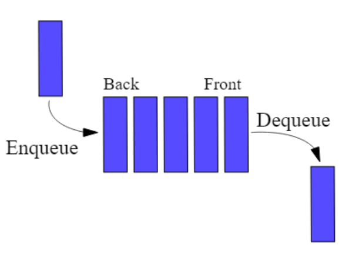

# Files


Les files (queues en anglais) correspondent exactement à la notion de file dans la vie courante:

Une file d’attente à la caisse, à un feu rouge…



Lorsqu'on ajoute un élément, celui-ci se retrouve à la fin de la file, et on retire les éléments dans l’ordre dans lequel ils sont arrivés.

En anglais on dit first in, first out ou FIFO pour dire: premier arrivé premier sorti.

Ce type de structure de données est par exemple utilisé dans:

- Un gestionnaire d’impression pour ordonner l’ordre des impressions.
- Un processeur pour planifier l’ordre des opérations.
- Un serveur web pour ordonner les réponses en fonction de l’ordre des demandes.

## Interface

Une file est définie par l’interface comprenant les primitives suivantes:
Ici, f est une File contenant des éléments e de type T quelconque.

| Primitive | Description |
| ---- | ----- |
|CREER() → File|Renvoie une nouvelle File vide | 
|EST_VIDE(f) → Booléen|Savoir si la file f est vide|
|ENFILER(e, f)|Ajouter un élément à l'entrée de la file|
|DEFILER(f) → T|Supprimer et renvoyer l'élément à la sortie de la file|


## Implémentation

L’objet list en Python présente deux méthodes qui lui permettent d’implémenter la file:

- list.append(e): ajoute l’élément e en fin de liste.
- list.pop(0): supprime le premier élément de la liste et le renvoie.

Toutefois, pop(0) est en O(n), on veut mieux que ça en termes de complexité.

Pour une première implémentation, on peut utiliser un nouveau type, `collections.deque`. Les deques offrent les méthodes append et pop, comme `list`, mais offrent aussi les méthodes appendleft et popleft en O(1).

```python
from collections import deque
from typing import Any

def creer() -> File:
    return deque()

def est_vide(f: File) -> bool:
    return len(f) == 0

def enfiler(e: Any, f: File) -> bool:
    f.appendleft(e, f)

def defiler(f: File) -> Any:
    assert len(f)!=0, "File Vide"
    return f.pop()
```

## Exercices

!!! question "Préparation"
    - Créer le fichier `structures/lineaires/file.py`
    - Créer le fichier `exos/exos_files.py`

    ```python
    from structures.lineaires import file
    ```

!!! question "Réécriture"
    Réécrire l'impémentation de file dans file.py

    On reprendra la même rigueur de typage que présentée pour les piles.

Les exercices suivants se font dans le fichier exos_files.py.

!!! question "File exemple"

    Créer une fonction `file_exemple` qui renvoie la pile suivante:

    ```
      --------------------------------------
    > 'rouge' 'vert' 'jaune' 'rouge' 'jaune' >
      --------------------------------------
    ```

!!! question "Sortie d'une file"
    Ecrire une fonction qui renvoie l'élément à la sortie d'une file sans qu'elle soit modifiée à la sortie de la fonction.

!!! question "Sans exécuter le code"
    On considère la file exemple.
    Dessiner P et F après l’exécution du programme Python suivant.

    ```python
    F = file_exemple()

    P = pile.creer()
    while not(file.est_vide(F)):
        pile.empiler(defiler(F), P)
    ```


!!! question "Fonction mystère"
    Etant donné une file de départ f, on transfère son contenu dans une pile puis on retransfère le contenu de la pile vers la file.

    Quel est l'effet de cet algorithme sur la file f?
    
    APRES avoir répondu aux questions précédentes, écrire une fonction qui implémente cet algorithme.

!!! question "Taille d'une file"
    Créer 2 fonctions `taille_file_nuke` et `taille_file` qui renvoient la taille d'une file de manière:
    
    - Destructive
    - Non destructive


!!! question "Occurences"

    Écrire une fonction nb_elements qui prend en paramètres une file et un élément de n'importe quel type, et qui renvoie le nombre de fois où l'élément est présent dans la file. Après appel de cette fonction la file doit avoir retrouvé son état d’origine. Vous commencerez bien sûr par prendre le temps d'écrire la signature de la fonction proprement.

    ```python
    """
    >>> F = file_exemple()
    >>> nb_elements(F, "rouge")
    2
    >>> F == creer_F() #? La file est toujours égale à la file exemple
    True
    >>> nb_elements(F, "vert")
    1
    >>> nb_elements(F, "violet")
    0
    """
    ```

!!! question "Créer une file avec 2 piles"
    Implémenter la structure de file avec 2 files.

    ```python
    from structures.lineaires import pile

    type File = tuple[pile.Pile, pile.Pile]
    ```


!!! question "Look-and-say"
    A reprendre.
    
    La suite "Look-and-say", de Conway, consiste à lire à haute voix une série de chiffres en les groupant: ainsi la suite 11121223 est lue "trois 1, un 2, un 1,deux 2, un trois", qu'on écrit 3112112213.

    1. Ecrire une fonction `etape` qui prend 2 files, `entree` et `sortie`, en paramètre. Elle retire les `n` premiers chiffres `c` identiques de `entree` et ajoute les chiffres `n` et `c` à la sortie. Testez cette fonction.
    2. Ecrire une fonction `lookandsay` qui prend une file et retourne la file transformée. Testez cette fonction avec l'exemple.
    3. Afficher les 10 premières valeurs de la suite à partir d'une file contenant seulement un 1.
