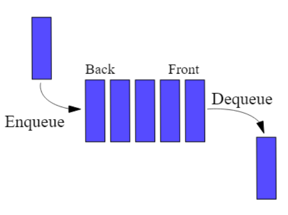

# Files

Les files (queues en anglais) correspondent exactement à la notion de file dans la vie courante:

Une file d’attente à la caisse, à un feu rouge…



Lorsqu'on ajoute un élément, celui-ci se retrouve à la fin de la file, et on retire les éléments dans l’ordre dans lequel ils sont arrivés.

En anglais on dit first in, first out ou FIFO pour dire: premier arrivé premier sorti.

Ce type de structure de données est par exemple utilisé dans:

- Un gestionnaire d’impression pour ordonner l’ordre des impressions.
- Un processeur pour planifier l’ordre des opérations.
- Un serveur web pour ordonner les réponses en fonction de l’ordre des demandes.

Comme les piles, les files sont **partout** (parcours en largeur d'un graphe, files d'attente, ordonnancement), et tu les reverras toute l'année. Tout l'enjeu de ce cours est d'en obtenir une dont les opérations restent en `O(1)`, à partir de deux piles.

## Interface

Une file est définie par l’interface comprenant les primitives suivantes:
Ici, f est une File contenant des éléments e de type T quelconque.

| Primitive | Description |
| ---- | ----- |
|CREER() → File|Renvoie une nouvelle File vide | 
|EST_VIDE(f) → Booléen|Savoir si la file f est vide|
|ENFILER(e, f)|Ajouter un élément à l'entrée de la file|
|DEFILER(f) → T|Supprimer et renvoyer l'élément à la sortie de la file|


## Une première implémentation : avec un tableau

Une liste Python sait déjà se comporter comme une file :

- `list.append(e)` ajoute en fin de liste (l'entrée) ;
- `list.pop(0)` retire et renvoie le premier élément (la sortie).

```python
type File[T] = list[T]

def creer[T]() -> File[T]:
    return []

def est_vide[T](f: File[T]) -> bool:
    return len(f) == 0

def enfiler[T](e: T, f: File[T]) -> None:
    f.append(e)          # on entre en fin de liste

def defiler[T](f: File[T]) -> T:
    assert not est_vide(f), "File vide"
    return f.pop(0)      # on sort en tête
```

Cette implémentation fonctionne, mais `pop(0)` est **coûteux** : retirer le premier élément oblige à **décaler tous les autres d'un cran**, soit `O(n)` à chaque défilement.

!!! note "Une solution toute faite : `collections.deque`"
    La bibliothèque standard fournit `collections.deque`, une file à deux bouts dont `appendleft` et `pop` sont en `O(1)`. En pratique, c'est ce qu'on utiliserait. Mais l'objectif de ce cours est ailleurs : **obtenir une file efficace uniquement à partir d'une structure qu'on maîtrise déjà, la pile.**

## Objectif du cours : une file avec deux piles

On veut construire une file **sans jamais toucher à une liste directement**, à partir de la seule **interface de la pile** (`creer`, `est_vide`, `empiler`, `depiler`). C'est l'idée forte de l'abstraction : une structure peut s'appuyer sur l'*interface* d'une autre, sans rien connaître de son implémentation.

**L'idée.** On utilise deux piles, `entree` et `sortie`.

- **Enfiler** : on empile sur `entree`.
- **Défiler** : si `sortie` est vide, on **bascule** tout `entree` dans `sortie` (ce qui inverse l'ordre), puis on dépile `sortie`.

Empiler sur `entree` place le dernier arrivé au sommet ; le basculement l'envoie au fond de `sortie`. Le premier arrivé se retrouve donc au sommet de `sortie` : c'est bien du FIFO.

```python
from structures.lineaires import pile

type File[T] = tuple[pile.Pile[T], pile.Pile[T]]   # (entree, sortie)

def creer[T]() -> File[T]:
    return (pile.creer(), pile.creer())

def est_vide[T](f: File[T]) -> bool:
    entree, sortie = f
    return pile.est_vide(entree) and pile.est_vide(sortie)

def enfiler[T](e: T, f: File[T]) -> None:
    entree, sortie = f
    pile.empiler(e, entree)

def defiler[T](f: File[T]) -> T:
    assert not est_vide(f), "File vide"
    entree, sortie = f
    if pile.est_vide(sortie):
        while not pile.est_vide(entree):
            pile.empiler(pile.depiler(entree), sortie)
    return pile.depiler(sortie)
```

!!! note "Et la complexité ?"
    Un défilement peut coûter cher quand il faut tout basculer. Mais chaque élément n'est basculé **qu'une seule fois** de `entree` vers `sortie` sur toute sa vie dans la file. Réparti sur l'ensemble des opérations, le coût est en `O(1)` **amorti**, bien meilleur que le `pop(0)` du tableau.

## Lire une file sans la détruire

Les primitives ne donnent accès qu'à la sortie. Pour **parcourir** toute la file (par exemple pour l'afficher) sans la modifier, on la vide dans une file temporaire, puis on la reconstruit. Cette fonction n'utilise que l'interface : elle marchera quelle que soit l'implémentation.

```python
def elements[T](f: File[T]) -> list[T]:
    """Liste des éléments de f, de la sortie vers l'entrée, sans modifier f."""
    resultat: list[T] = []
    temp: File[T] = creer()
    while not est_vide(f):
        e = defiler(f)
        resultat.append(e)
        enfiler(e, temp)
    while not est_vide(temp):        # on remet f dans son état initial
        enfiler(defiler(temp), f)
    return resultat
```

!!! warning "Piège : `defiler` **vide** la file"
    Comme `depiler` pour la pile, `defiler` retire l'élément (effet de bord). Compter les éléments d'une file ou en chercher un **en défilant** la détruit. Toute fonction censée « ne pas modifier la file » doit la reconstruire à l'identique : c'est exactement ce que fait `elements`, et ce que demandent les exercices « taille non destructive » et « occurrences ».

!!! tip "Ce que l'IA ne fait pas à ta place"
    Le vrai travail n'est pas d'écrire `enfiler` et `defiler` (une IA le fait), mais de **spécifier** (que se passe-t-il si on défile une file vide ?) et de **tester**. La file avec deux piles en est le meilleur exemple : le code est court, mais toute la valeur est de se convaincre, tests à l'appui, qu'il respecte bien le contrat FIFO.

## Exercices

!!! question "Préparation"
    - Créer le fichier `structures/lineaires/file.py`
    - Créer le fichier `exos/exos_files.py`

    ```python
    from structures.lineaires import file
    ```

!!! question "Écrire le fichier `file.py`"
    Reporter dans `structures/lineaires/file.py` l'implémentation **avec deux piles** (c'est celle qu'on garde, et sur laquelle tournera le snake), ainsi que la fonction `elements`.

    On reprendra la même rigueur de typage que pour les piles.

Les exercices suivants se font dans le fichier exos_files.py.

!!! question "File exemple"

    Créer une fonction `file_exemple` qui renvoie la file suivante:

    ```
      --------------------------------------
    > 'rouge' 'vert' 'jaune' 'rouge' 'jaune' >
      --------------------------------------
    ```

!!! question "Sortie d'une file"
    Ecrire une fonction qui renvoie l'élément à la sortie d'une file sans qu'elle soit modifiée à la sortie de la fonction.

!!! question "Sans exécuter le code"
    On considère la file exemple.
    Dessiner P et F après l’exécution du programme Python suivant.

    ```python
    F = file_exemple()

    P = pile.creer()
    while not(file.est_vide(F)):
        pile.empiler(defiler(F), P)
    ```


!!! question "Fonction mystère"
    Etant donné une file de départ f, on transfère son contenu dans une pile puis on retransfère le contenu de la pile vers la file.

    Quel est l'effet de cet algorithme sur la file f?
    
    APRES avoir répondu aux questions précédentes, écrire une fonction qui implémente cet algorithme.

!!! question "Taille d'une file"
    Créer 2 fonctions `taille_file_nuke` et `taille_file` qui renvoient la taille d'une file de manière:
    
    - Destructive
    - Non destructive


!!! question "Occurences"

    Écrire une fonction nb_elements qui prend en paramètres une file et un élément de n'importe quel type, et qui renvoie le nombre de fois où l'élément est présent dans la file. Après appel de cette fonction la file doit avoir retrouvé son état d’origine. Vous commencerez bien sûr par prendre le temps d'écrire la signature de la fonction proprement.

    ```python
    """
    >>> F = file_exemple()
    >>> nb_elements(F, "rouge")
    2
    >>> F == file_exemple() #? La file est toujours égale à la file exemple
    True
    >>> nb_elements(F, "vert")
    1
    >>> nb_elements(F, "violet")
    0
    """
    ```

!!! question "Look-and-say"
    A reprendre.

    La suite "Look-and-say", de Conway, consiste à lire à haute voix une série de chiffres en les groupant: ainsi la suite 11121223 est lue "trois 1, un 2, un 1,deux 2, un trois", qu'on écrit 3112112213.

    1. Ecrire une fonction `etape` qui prend 2 files, `entree` et `sortie`, en paramètre. Elle retire les `n` premiers chiffres `c` identiques de `entree` et ajoute les chiffres `n` et `c` à la sortie. Testez cette fonction.
    2. Ecrire une fonction `lookandsay` qui prend une file et retourne la file transformée. Testez cette fonction avec l'exemple.
    3. Afficher les 10 premières valeurs de la suite à partir d'une file contenant seulement un 1.
