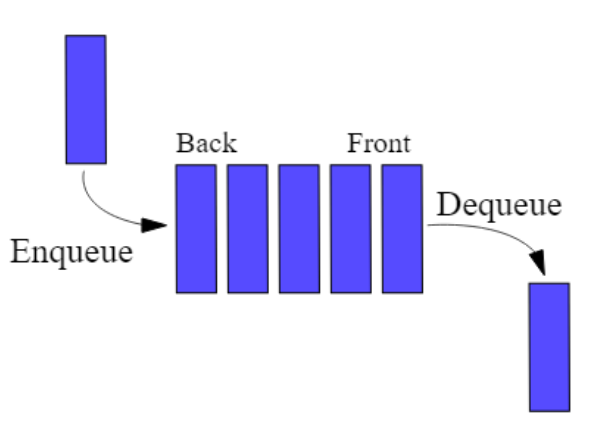

# Files

!!! question "Rappel d'ouverture (5 minutes, de mémoire, cahier fermé)"
    Les files s'appuient entièrement sur les piles. Vérifie que tu les tiens **sans rouvrir le cours**.

    1. Quelles sont les quatre primitives d'une pile ?
    2. La pile `p` vaut `[4, 7]` (du bas vers le haut). Qu'affiche `print(depiler(p))`, et que vaut `p` ensuite ?
    3. Si on empile `1` puis `2` puis `3` dans une pile vide et qu'on dépile trois fois, dans quel ordre sortent les éléments ?

    ??? success "Correction"
        1. `creer`, `est_vide`, `empiler`, `depiler`.
        2. Affiche `7`, et `p` vaut `[4]`. `depiler` retire **et** renvoie.
        3. `3`, `2`, `1` : c'est le LIFO. Retiens cet ordre **inversé**, c'est exactement ce qui va servir à fabriquer une file.

Les files (queues en anglais) correspondent exactement à la notion de file dans la vie courante:

Une file d’attente à la caisse, à un feu rouge…



Lorsqu'on ajoute un élément, celui-ci se retrouve à la fin de la file, et on retire les éléments dans l’ordre dans lequel ils sont arrivés.

En anglais on dit first in, first out ou FIFO pour dire: premier arrivé premier sorti.

Ce type de structure de données est par exemple utilisé dans:

- Un gestionnaire d’impression pour ordonner l’ordre des impressions.
- Un processeur pour planifier l’ordre des opérations.
- Un serveur web pour ordonner les réponses en fonction de l’ordre des demandes.

Comme les piles, les files sont **partout** (parcours en largeur d'un graphe, files d'attente, ordonnancement), et tu les reverras toute l'année. Tout l'enjeu de ce cours est d'en obtenir une dont les opérations restent en `O(1)`, à partir de deux piles.

## Interface

Une file est définie par l’interface comprenant les primitives suivantes:
Ici, f est une File contenant des éléments e de type T quelconque.

| Primitive | Description |
| ---- | ----- |
|CREER() → File|Renvoie une nouvelle File vide | 
|EST_VIDE(f) → Booléen|Savoir si la file f est vide|
|ENFILER(e, f)|Ajouter un élément à l'entrée de la file|
|DEFILER(f) → T|Supprimer et renvoyer l'élément à la sortie de la file|


## Une première implémentation : avec un tableau

Une liste Python sait déjà se comporter comme une file :

- `list.append(e)` ajoute en fin de liste (l'entrée) ;
- `list.pop(0)` retire et renvoie le premier élément (la sortie).

```python
type File[T] = list[T]

def creer[T]() -> File[T]:
    return []

def est_vide[T](f: File[T]) -> bool:
    return len(f) == 0

def enfiler[T](e: T, f: File[T]) -> None:
    f.append(e)          # on entre en fin de liste

def defiler[T](f: File[T]) -> T:
    assert not est_vide(f), "File vide"
    return f.pop(0)      # on sort en tête
```

Cette implémentation fonctionne, mais `pop(0)` est **coûteux** : retirer le premier élément oblige à **décaler tous les autres d'un cran**, soit `O(n)` à chaque défilement.

!!! note "Une solution toute faite : `collections.deque`"
    La bibliothèque standard fournit `collections.deque`, une file à deux bouts dont `appendleft` et `pop` sont en `O(1)`. En pratique, c'est ce qu'on utiliserait. Mais l'objectif de ce cours est ailleurs : **obtenir une file efficace uniquement à partir d'une structure qu'on maîtrise déjà, la pile.**

## Un piège à connaître avant de commencer

!!! warning "Piège : `defiler` **vide** la file"
    Comme `depiler` pour la pile, `defiler` retire l'élément (effet de bord). Compter les éléments d'une file ou en chercher un **en défilant** la détruit.

    Plusieurs exercices ci-dessous demandent une fonction qui **ne modifie pas** la file. À toi de trouver comment la reconstruire à l'identique : c'est le vrai travail de cette page.

## Exercices d'appropriation

!!! question "Préparation"
    - Créer le fichier `structures/lineaires/file.py`
    - Créer le fichier `exos/exos_files.py`

    Tous les exercices qui suivent s'écrivent dans `exos/exos_files.py`, et plusieurs manipulent **aussi** une pile. Ce fichier commence donc par ces deux lignes, une fois pour toutes :

    ```python
    from structures.lineaires import file
    from structures.lineaires import pile
    ```

    C'est ce qui explique les préfixes que tu verras partout : `file.defiler(...)` appelle la fonction `defiler` **du module `file`**, et `pile.empiler(...)` celle du module `pile`. Le préfixe dit **de quelle structure** on parle, ce qui est utile précisément quand les deux sont en jeu dans la même ligne.

    Et il dit surtout **où tu es**, comme sur la page des piles : préfixe, tu es dans un fichier d'exercice et tu **utilises** la structure ; pas de préfixe, tu es dans `file.py` et tu la **fabriques**. C'est la même frontière que celle du cours, interface d'un côté, implémentation de l'autre.

!!! question "Écrire le fichier `file.py`"
    Reporter dans `structures/lineaires/file.py` l'implémentation **avec un tableau** ci-dessus, c'est-à-dire les quatre primitives.

    C'est une implémentation correcte, et elle suffit pour tous les exercices qui suivent. On la remplacera plus tard par une meilleure, et ce sera l'occasion de vérifier quelque chose d'important.

    On reprendra la même rigueur de typage que pour les piles.

Les exercices suivants se font dans le fichier exos_files.py.

!!! question "File exemple"

    Créer une fonction `file_exemple` qui renvoie la file suivante:

    ```
      --------------------------------------
    > 'rouge' 'vert' 'jaune' 'rouge' 'jaune' >
      --------------------------------------
    ```

    ```python
    def file_exemple() -> file.File[str]:
    ```

    Rappel de la frontière : le préfixe `file.` est là parce que tu es dans `exos_files.py`, donc du côté qui **utilise** la structure.

!!! question "Sortie d'une file"
    Écrire une fonction qui renvoie l'élément à la sortie d'une file **sans qu'elle soit modifiée** à la sortie de la fonction.

    ```python
    def sortie[T](f: file.File[T]) -> T:
    ```

    Teste-la sur la file exemple : `sortie(file_exemple())` doit rendre `'rouge'`. Vérifie **aussi** qu'après l'appel la file contient toujours ses cinq éléments, dans le même ordre. C'est cette seconde vérification qui compte, et c'est celle qu'on oublie.

!!! question "Sans exécuter le code"
    On considère la file exemple.
    Dessiner P et F après l’exécution du programme Python suivant.

    ```python
    # dans exos/exos_files.py
    from structures.lineaires import file
    from structures.lineaires import pile

    F = file_exemple()

    P = pile.creer()
    while not(file.est_vide(F)):
        pile.empiler(file.defiler(F), P)
    ```

    Lis bien les préfixes : `P` est une **pile**, `F` est une **file**, et chaque appel dit à laquelle des deux il s'adresse.


!!! question "Fonction mystère"
    Étant donné une file de départ `f`, on transfère son contenu dans une pile, puis on retransfère le contenu de la pile vers la file.

    1. **Quel est l'effet de cet algorithme sur la file `f` ?** Réponds **avant** d'écrire du code, en reprenant le dessin de l'exercice précédent.
    2. Écris la fonction qui implémente cet algorithme. **À toi de la nommer** : une fonction se nomme d'après **ce qu'elle fait**, pas d'après la façon dont elle le fait. `mystere` et `transfert` sont donc de mauvais noms.
    3. Teste-la sur la file exemple.

    ??? tip "Indice pour le nom"
        Écris la file avant, puis la file après, l'une sous l'autre. Le nom est dans la comparaison des deux lignes.

!!! question "Taille d'une file"
    Créer 2 fonctions `taille_file_nuke` et `taille_file` qui renvoient la taille d'une file de manière:

    - Destructive
    - Non destructive

    **Puis écris leurs deux fonctions de test**, `test_taille_file_nuke` et `test_taille_file`, avec des `assert`. Une fonction de test ne prend rien, ne renvoie rien, et **échoue bruyamment** si le code est faux.

    ```python
    def test_taille_file_nuke() -> None:
        ...

    def test_taille_file() -> None:
        ...
    ```

    Chacune doit vérifier **deux choses** : que la taille renvoyée est la bonne, et que la file est dans l'état attendu **après** l'appel. Ce n'est pas le même état dans les deux cas, et c'est tout l'intérêt de les tester séparément.

    ??? tip "Indice : que vérifier après l'appel"
        Pour la version destructive, la file doit être **vide**. Pour l'autre, elle doit être **intacte** : même taille, et la sortie doit toujours être `'rouge'`.

!!! question "Occurrences"

    Écrire une fonction nb_elements qui prend en paramètres une file et un élément de n'importe quel type, et qui renvoie le nombre de fois où l'élément est présent dans la file. Après appel de cette fonction la file doit avoir retrouvé son état d’origine. Tu commenceras bien sûr par prendre le temps d'écrire la signature de la fonction proprement.

    On te donne la fonction de test. **Lis-la avant d'écrire `nb_elements`** : elle dit exactement ce qui est attendu, y compris ce qu'on oublie toujours, à savoir que la file survive à l'appel.

    ```python
    def test_nb_elements() -> None:
        F = file_exemple()
        assert nb_elements(F, "rouge") == 2
        assert nb_elements(F, "vert") == 1
        assert nb_elements(F, "violet") == 0
        # la file doit avoir survécu aux trois appels précédents :
        assert file.defiler(F) == "rouge"
        assert taille_file(F) == 4
    ```

    ??? tip "Indice léger"
        Tu ne peux voir que la sortie de la file. Pour examiner tous les éléments, il faut donc les faire sortir. Reste à savoir où tu les mets en attendant, et comment tu les remets dans le **bon ordre**.

    ??? tip "Indice plus précis"
        Une pile temporaire inverserait l'ordre, une **file** temporaire le conserve : ce qui entre en premier en ressort en premier, deux fois de suite. Défile `f` en entier, compte au passage, enfile chaque élément dans la file temporaire, puis vide la temporaire dans `f`.

    ??? question "Avant d'ouvrir la solution"
        En une phrase, sur ton cahier : qu'est-ce que l'indice t'a appris sur ce qui n'allait pas dans **ton** code ?

    ??? success "Solution"
        ```python
        def nb_elements[T](f: File[T], e: T) -> int:
            """Nombre d'occurrences de e dans f. La file f est laissée intacte."""
            n: int = 0
            temp: File[T] = creer()
            while not est_vide(f):
                x = defiler(f)
                if x == e:
                    n += 1
                enfiler(x, temp)
            while not est_vide(temp):
                enfiler(defiler(temp), f)
            return n
        ```

        Retiens la structure : **sortir, garder au passage, remettre**. Une fonction qui prétend ne pas modifier une file doit toujours la reconstruire. Tu viens de l'écrire pour la troisième fois, après « Sortie d'une file » et « Taille non destructive » : la section suivante en tire la conséquence.

## Généraliser ce que tu viens de faire trois fois : la fonction `elements`

Regarde en arrière. Dans « Sortie d'une file », dans « Taille non destructive » et dans « Occurrences », tu as écrit **trois fois la même chose** : vider la file dans une temporaire, faire quelque chose au passage, puis tout remettre. Seul le « quelque chose » changeait.

Quand un même motif revient trois fois, on l'écrit une fois pour toutes.

!!! question "Écris `elements`, puis ajoute-la à `file.py`"
    Écris une fonction `elements` qui renvoie la **liste** des éléments d'une file, de la sortie vers l'entrée, **sans modifier la file**.

    ```python
    def elements[T](f: File[T]) -> list[T]:
        """Liste des éléments de f, de la sortie vers l'entrée, sans modifier f."""
    ```

    Deux exigences, et la seconde est la plus importante :

    1. elle n'utilise **que** les quatre primitives, jamais l'intérieur de la file ;
    2. à la fin, `f` doit être **exactement** dans l'état où elle était au début, contenu **et** ordre.

    ??? tip "Indice"
        Tu l'as déjà écrit dans « Occurrences ». Reprends ta solution et enlève le comptage : ce qui reste **est** `elements`.

    ??? note "Avant d'ouvrir la solution"
        En une phrase, sur ton cahier : pourquoi une **file** temporaire, et pas une **pile** ?

    ??? success "Solution"
        ```python
        def elements[T](f: File[T]) -> list[T]:
            """Liste des éléments de f, de la sortie vers l'entrée, sans modifier f."""
            resultat: list[T] = []
            temp: File[T] = creer()
            while not est_vide(f):
                e = defiler(f)
                resultat.append(e)
                enfiler(e, temp)
            while not est_vide(temp):        # on remet f dans son état initial
                enfiler(defiler(temp), f)
            return resultat
        ```

        Une **file** temporaire, parce qu'elle conserve l'ordre : ce qui y entre en premier en ressort en premier, et deux transferts de suite rendent donc `f` identique. Une pile l'aurait inversée, et il aurait fallu deux piles pour rattraper.

    **Ajoute cette fonction à `structures/lineaires/file.py`.** Elle n'utilise que l'interface : elle marchera donc **quelle que soit l'implémentation**, et tu vérifieras ce point tout à l'heure.

## Le vrai objectif du cours : la même file, mais efficace

On veut construire une file **sans jamais toucher à une liste directement**, à partir de la seule **interface de la pile** (`creer`, `est_vide`, `empiler`, `depiler`). C'est l'idée forte de l'abstraction : une structure peut s'appuyer sur l'*interface* d'une autre, sans rien connaître de son implémentation.

**L'idée.** On utilise deux piles, `entree` et `sortie`.

- **Enfiler** : on empile sur `entree`.
- **Défiler** : si `sortie` est vide, on **bascule** tout `entree` dans `sortie` (ce qui inverse l'ordre), puis on dépile `sortie`.

Empiler sur `entree` place le dernier arrivé au sommet ; le basculement l'envoie au fond de `sortie`. Le premier arrivé se retrouve donc au sommet de `sortie` : c'est bien du FIFO.

### Le bac à sable : manipule la file avant de l'écrire

Ci-dessous, une file à deux piles que tu peux actionner. **Elle ne te donne pas le code** : elle te donne le **comportement**. Le texte ci-dessus dit les **règles**, le bac à sable montre les **états**. Avec les deux, tu as tout ce qu'il faut pour écrire l'implémentation toi-même, et c'est ce qu'on te demande juste après.

Chaque `defiler` te demande d'abord **ce qu'il va rendre**. Réponds avant de valider : c'est là que tu vérifies ton modèle, pas en regardant.

<div id="file_deux_piles"></div>
<script src="/javascripts/file_deux_piles.js" defer></script>

!!! question "Trois manipulations à faire, dans cet ordre"
    1. **Enfile cinq éléments, puis défile-les un par un.** Regarde la colonne « coût du dernier appel ». Que remarques-tu sur le **premier** défilement comparé aux quatre suivants ? Et sur la **moyenne** ?
    2. **Alterne** : enfile, défile, enfile, défile. Le coût moyen change-t-il ?
    3. **Coche « basculer à chaque défilement »**, puis rejoue la séquence `enfiler 1`, `enfiler 2`, `defiler`, `enfiler 3`, `defiler`. Note ce que rend le dernier appel.

    ??? note "Ce que la manipulation 1 doit t'apprendre"
        Le premier `defiler` coûte cher : il bascule toute la pile `entree`. Les suivants coûtent **1**, parce que `sortie` n'est plus vide et qu'il n'y a rien à rebasculer.

        Chaque élément ne traverse **qu'une seule fois** de `entree` vers `sortie` au cours de sa vie dans la file. C'est pour cela qu'on dit que le coût est en `O(1)` **amorti** : pas « toujours 1 », mais « 1 en moyenne, sur la durée ».

    ??? warning "Ce que la manipulation 3 doit t'apprendre, et c'est le cœur du cours"
        Le dernier appel rend **3** au lieu de **2**. L'ordre FIFO est cassé.

        Sans la condition, le basculement du quatrième pas empile `3` **par-dessus** `2` qui attendait déjà dans `sortie`. Deux vagues de basculement se mélangent, donc deux ordres se mélangent.

        La condition « si `sortie` est vide » n'est donc **pas une optimisation** : c'est ce qui rend la file correcte. Retiens le raisonnement, pas la ligne de code.

!!! question "Maintenant, à la main : trace le basculement"
    Le bac à sable te l'a montré ; à toi de le **produire**. Remplis ce tableau **à la main**, ligne par ligne, sans le rouvrir. La dernière colonne est celle qui compte : `enfiler` ne rend rien, `defiler` rend un élément **et** le retire.

    | opération | `entree` (bas vers haut) | `sortie` (bas vers haut) | valeur rendue |
    |---|---|---|---|
    | `enfiler(1, f)` | | | |
    | `enfiler(2, f)` | | | |
    | `defiler(f)` | | | |
    | `enfiler(3, f)` | | | |
    | `defiler(f)` | | | |
    | `defiler(f)` | | | |

    ??? note "À ouvrir une fois que tu as rempli les six lignes"
        | opération | `entree` | `sortie` | valeur rendue |
        |---|---|---|---|
        | `enfiler(1, f)` | `[1]` | `[]` | rien |
        | `enfiler(2, f)` | `[1, 2]` | `[]` | rien |
        | `defiler(f)` | `[]` | `[2]` | `1`, après basculement |
        | `enfiler(3, f)` | `[3]` | `[2]` | rien |
        | `defiler(f)` | `[3]` | `[]` | `2`, sans basculement |
        | `defiler(f)` | `[]` | `[]` | `3`, après basculement |

!!! question "Pourquoi la condition « si `sortie` est vide » ?"
    Tu viens de le constater dans le bac à sable, manipulation 3 : sans cette condition, le cinquième appel rend `3` au lieu de `2`.

    Écris **en une phrase, sur ton cahier**, pourquoi. Pas « parce que la case était cochée » : ce qui se passe dans les deux piles.

    ??? note "Ce que tu dois avoir écrit"
        Au quatrième pas, `entree` vaut `[3]` et `sortie` vaut `[2]`. Un basculement inconditionnel empile donc `3` **par-dessus** `2`, et `sortie` vaut `[2, 3]`. Le `defiler` suivant rend `3` alors qu'il devrait rendre `2`.

        Basculer une pile dans une autre **inverse** son ordre. Mélanger deux vagues de basculement mélange donc deux ordres. La condition n'est pas une optimisation, c'est ce qui rend la file correcte.

!!! question "Maintenant, écris l'implémentation"
    Tu as le texte, qui te donne les **règles**. Tu as le bac à sable, qui te montre les **états**. Tu as ta trace à la main. Cela suffit : **écris `file.py` toi-même**, sans regarder la correction.

    On te donne seulement la déclaration du type, parce qu'elle contient une décision de conception qui ne se devine pas :

    ```python
    from structures.lineaires import pile

    type File[T] = tuple[pile.Pile[T], pile.Pile[T]]   # (entree, sortie)
    ```

    À écrire, avec signatures typées et docstrings testables comme pour les piles : `creer`, `est_vide`, `enfiler`, `defiler`.

    Trois questions à te poser **avant** d'écrire `defiler`, dans cet ordre :

    1. Quand faut-il basculer, et comment le sais-tu ?
    2. Que veut dire « basculer », en n'utilisant que les primitives de la **pile** ?
    3. Une file vide, c'est quoi, quand la file est faite de **deux** piles ?

    ??? tip "Indice léger"
        `defiler` ne fait pas toujours la même chose. Il commence par un test, et ce test ne porte pas sur la file entière.

    ??? tip "Indice précis"
        Le basculement est une boucle : tant que `entree` n'est pas vide, dépiler `entree` et empiler le résultat sur `sortie`. Une seule ligne de corps.

    ??? note "En une phrase, sur ton cahier, avant d'ouvrir la solution"
        Qu'est-ce que ton `defiler` fait quand `sortie` n'est pas vide ? Écris-le en français. Si tu ne sais pas le dire, tu ne sais pas encore l'écrire.

    ??? success "Solution"
        ```python
        def creer[T]() -> File[T]:
            return (pile.creer(), pile.creer())

        def est_vide[T](f: File[T]) -> bool:
            entree, sortie = f
            return pile.est_vide(entree) and pile.est_vide(sortie)

        def enfiler[T](e: T, f: File[T]) -> None:
            entree, _ = f
            pile.empiler(e, entree)

        def defiler[T](f: File[T]) -> T:
            assert not est_vide(f), "File vide"
            entree, sortie = f
            if pile.est_vide(sortie):
                while not pile.est_vide(entree):
                    pile.empiler(pile.depiler(entree), sortie)
            return pile.depiler(sortie)
        ```

        Remarque que `enfiler` ignore `sortie` et que `defiler` ne touche `entree` que pour la vider. Aucune des deux ne regarde **dans** une pile : elles n'utilisent que `creer`, `est_vide`, `empiler`, `depiler`. C'est ce qui fait qu'une file peut être bâtie sur une pile sans rien savoir de son intérieur.

!!! note "Et la complexité ?"
    Un défilement peut coûter cher quand il faut tout basculer. Mais chaque élément n'est basculé **qu'une seule fois** de `entree` vers `sortie` sur toute sa vie dans la file. Réparti sur l'ensemble des opérations, le coût est en `O(1)` **amorti**, bien meilleur que le `pop(0)` du tableau.

!!! tip "Ce que l'IA ne change pas"
    Une IA écrit `enfiler` et `defiler`, et elle sait aussi les spécifier et les tester. Le point n'est pas là.

    La file avec deux piles est le meilleur exemple de ce qui reste à ta charge : le code est court, mais l'essentiel est de **se convaincre**, tests à l'appui, qu'il respecte bien le contrat FIFO. Cette conviction ne se délègue pas : ou bien tu sais dire ce que doit produire la structure (y compris quand on défile une file vide) et tu peux valider ce que tu lis, ou bien tu fais confiance sans pouvoir vérifier.

## Et maintenant, la vraie leçon : tes exercices marchent toujours

Tu viens de remplacer **entièrement** l'intérieur de la file. La première version stockait une liste Python ; celle-ci ne connaît que des piles. Rien de commun.

!!! question "Relance tes exercices, sans en changer une ligne"
    1. Dans `structures/lineaires/file.py`, remplace l'implémentation à tableau par celle **à deux piles** que tu viens d'écrire. Garde `elements`, qui n'a pas à changer.
    2. Ne touche **à rien** dans `exos/exos_files.py`.
    3. Relance tes tests.

    ??? note "Ce que tu dois constater, et ce que ça veut dire"
        **Tout passe.** `file_exemple`, `taille_file`, `nb_elements`, la fonction mystère : aucune n'a bougé, et aucune n'avait besoin de bouger.

        C'est **la** démonstration du cours, et elle ne se raconte pas, elle se constate. Tes fonctions n'ont jamais utilisé que les quatre primitives. Elles ne savaient pas ce qu'il y avait sous le capot, donc elles ne pouvaient pas être cassées par un changement de capot.

        Retiens la contrepartie, qui est la vraie discipline : **si l'une de tes fonctions avait triché**, en écrivant par exemple `f.pop(0)` ou `f[0]` au lieu de passer par `defiler`, elle serait cassée maintenant. C'est à ce moment précis qu'on paie la triche, pas avant.

    ??? warning "Le seul exercice dont la réponse change, et c'est instructif"
        L'exercice « Sans exécuter le code » demandait de **dessiner** `F`. Le contenu de la file, lui, est identique dans les deux versions. Mais sa **forme interne** ne l'est plus du tout : avant, une liste ; maintenant, deux piles dont l'une est peut-être vide.

        Ce qui devrait donc être dessiné, c'est la file comme **suite d'éléments de la sortie vers l'entrée**, jamais sa représentation interne. Si ton dessin dépend de l'implémentation, c'est que tu regardais sous le capot.

!!! abstract "Définition - Structure de données abstraite"
    Une structure de données est dite **abstraite** quand on la définit par ce qu'elle **sait faire** (son interface) et non par la façon dont elle est **faite** (son implémentation). Un même comportement peut alors avoir plusieurs réalisations, qui se distinguent par leur **coût**.

Regarde les deux ensemble, maintenant que tu les as écrites toutes les deux :

| | avec un tableau | avec deux piles |
|---|---|---|
| ce qu'on écrit pour l'utiliser | `creer`, `est_vide`, `enfiler`, `defiler` | `creer`, `est_vide`, `enfiler`, `defiler` |
| ce qu'il y a à l'intérieur | une `list` | un couple de `Pile` |
| coût d'un défilement | `O(n)` | `O(1)` amorti |

La première ligne est l'**interface**, et elle n'a pas changé. La deuxième est l'**implémentation**, et elle a entièrement changé. La troisième dit pourquoi on s'est donné ce mal.

!!! question "Choisir sous contrainte : la structure ne se devine pas, elle se justifie par son coût"
    Pour chacune des trois situations, dis **quelle structure** tu utiliserais et **pourquoi**, en parlant de coût. Attention : dans un cas, la bonne réponse n'est ni une pile ni une file.

    1. Annuler la dernière action d'un éditeur de texte, autant de fois que l'utilisateur le demande.
    2. Servir des documents d'impression dans l'ordre où ils ont été envoyés.
    3. Savoir si un pseudonyme est déjà pris, parmi dix mille pseudonymes déjà enregistrés.

    ??? tip "Indice"
        Ne commence pas par le nom de la structure. Demande-toi d'abord : **quel élément dois-je atteindre**, et **combien d'éléments dois-je regarder** pour l'atteindre.

    ??? note "En une phrase, avant d'ouvrir la correction"
        Écris pour toi, sur ton cahier, ce que chaque situation coûte si tu choisis mal. C'est cette phrase-là qui te servira à l'épreuve pratique, pas le nom de la structure.

    ??? success "Correction"
        1. **Une pile.** L'élément dont on a besoin est le **dernier entré**, et une pile le rend sans parcourir quoi que ce soit : `O(1)`.
        2. **Une file.** L'élément dont on a besoin est le **premier entré**. Attention au piège : une file mal implémentée, avec `pop(0)` sur un tableau, coûte `O(n)` à chaque document. C'est le sujet entier de ce cours.
        3. **Ni l'une ni l'autre : un dictionnaire** (ou un ensemble). Ni pile ni file ne permettent de chercher un élément quelconque autrement qu'en les parcourant, donc en `O(n)`. Un dictionnaire répond en `O(1)`. Une structure ne se choisit pas parce qu'elle est au programme, mais parce que son coût correspond à ce qu'on lui demande.

## Bonus : la suite de Conway

!!! question "Look-and-say"
    À faire **une fois tout le reste terminé**. C'est le seul exercice de la page qui te fasse manipuler **deux files à la fois**, et il n'apporte aucune notion nouvelle : c'est de l'entraînement, sur une suite amusante.

    La suite « Look-and-say », de Conway, consiste à lire à haute voix une série de chiffres en les groupant : ainsi la suite 11121223 se lit « trois 1, un 2, un 1, deux 2, un 3 », qu'on écrit 3112112213.

    1. Écrire une fonction `etape` qui prend deux files, `entree` et `sortie`, en paramètre. Elle retire les `n` premiers chiffres `c` identiques de `entree` et ajoute les chiffres `n` et `c` à la sortie. Teste cette fonction.
    2. Écrire une fonction `lookandsay` qui prend une file et renvoie la file transformée. Teste-la sur l'exemple ci-dessus.
    3. Afficher les 10 premières valeurs de la suite à partir d'une file contenant seulement un 1.

    ??? tip "Indice sur la question 1"
        Pour savoir combien de chiffres identiques se suivent, tu dois en défiler un, puis regarder le suivant **sans le perdre**. Or `defiler` retire. Relis « Lire une file sans la détruire » : le problème y est déjà résolu.

    ??? note "Ce que tu peux remarquer, si tu as fait le bonus jusqu'au bout"
        Les termes de cette suite grandissent vite. Regarde le nombre de `defiler` que fait ton programme au dixième terme, et souviens-toi de ce que t'a montré le compteur du bac à sable : c'est exactement le genre de situation où le coût d'une file cesse d'être une question théorique.
