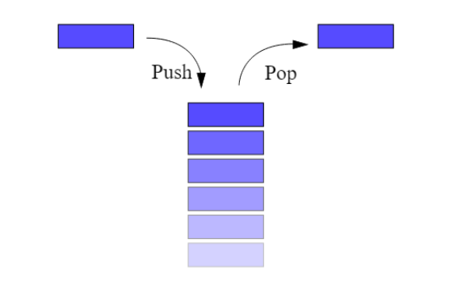

# Les Piles

!!! question "Rappel d'ouverture (5 minutes, de mémoire, cahier fermé)"
    Avant de commencer les piles, reprends ce que tu dois déjà tenir. **Écris les réponses de mémoire**, sans rouvrir le cours : c'est le fait de produire qui installe, pas le fait de relire.

    1. Écris la signature typée d'une fonction qui prend une liste d'entiers et renvoie leur somme.
    2. Quelle est la différence entre `return` et `print` dans une fonction ?
    3. Après `a = [1, 2]` puis `b = a` puis `b.append(3)`, que vaut `a` ? Pourquoi ?

    ??? success "Correction"
        1. `def somme(nombres: list[int]) -> int:`
        2. `return` **rend une valeur à l'appelant**, qui peut s'en servir ; `print` **affiche** et ne rend rien (`None`). Une fonction qui affiche au lieu de renvoyer est inutilisable dans un calcul.
        3. `a` vaut `[1, 2, 3]`. `b = a` ne copie pas la liste, il donne un **second nom au même objet** : c'est l'aliasing. Retiens-le, il revient sur les piles.

Les piles (*stacks* en anglais) correspondent **exactement** à la notion de pile dans la vie courante. C'est une structure qui contient des éléments empilés.

- Une pile de cartes à jouer,
- Une pile d’assiettes…




Pour ajouter un élément on **empile** cet élément, il se retrouve donc au-dessus, et pour retirer un élément on ne peut retirer que l’élément se trouvant au sommet de la pile. On dit qu'on le **dépile**.

En anglais on dit last in, first out ou LIFO pour dire: dernier arrivé premier sorti.

Ce type de structure de données est par exemple utilisé dans:

- les éditeurs avec la fonction Annuler (CTRL+Z) et rétablir (CTRL+Y)
- les navigateurs pour reculer ou avancer dans l'historique.
- La lecture d'expressions mathématiques
- En général le parcours de structures de données comme les graphes, arbres... que nous verrons plus tard.

!!! info "Pourquoi ces structures comptent"
    Bien implémentées, les piles et les files garantissent leurs opérations d'ajout et de retrait en **temps constant**, `O(1)` : quelle que soit la quantité de données, empiler, dépiler, enfiler et défiler prennent le même temps. C'est ce qui les rend **omniprésentes** en informatique : la pile d'appels de la **récursivité**, annuler/refaire, le **parcours des graphes** (en profondeur avec une pile, en largeur avec une file), l'ordonnancement des tâches. Tu les **reverras toute l'année**. Ce ne sera alors pas le moment de les réapprendre : il faut les avoir acquises dès maintenant.

## Interface

!!! abstract "Définition - Interface"
    L'interface d'une structure de données abstraite est composée des fonctionnalités **théoriques** que doit savoir remplir la structure de données. On appelle ces fonctionnalités des **primitives**.

    Tu dois penser à la structure et au fonctionnement de l'interface (comme des légos) lorsque tu résous des problèmes. Pas à Python en particulier.

Une pile est définie par l’interface comprenant les primitives suivantes:

|Primitive|Description|
|--|--|
| CREER() → Pile | Renvoie une nouvelle Pile vide |
| EST_VIDE(p: Pile) → Booléen |Savoir si la pile p est vide |
| EMPILER(e: T, p: Pile) |Empiler un élément e pour le mettre au sommet de la pile p |
| DEPILER(p: Pile) → T | Dépiler un élément: le retirer du sommet de la pile et le renvoyer |

!!! question "Avant toute ligne de Python : trace la pile à la main"
    Tu as le contrat ci-dessus, et c'est **tout ce qu'il faut**. Pas besoin de savoir comment une pile est fabriquée pour savoir ce qu'elle fait.

    Dessine la pile `p` à chacune de ses modifications, dans un tableau à trois colonnes : l'opération, l'état de la pile, et **la valeur rendue** par l'opération.

    La troisième colonne est celle qui piège : `EMPILER` ne rend rien, `DEPILER` rend l'élément **et** le retire.

    ```
    p ← CREER()
    pour v dans [2, 4, 3, 6, 8, 5, 77, 9, 1] :
        si v est pair :  EMPILER(v, p)
        sinon :          DEPILER(p)
    ```

    Deux questions en fin de trace, et la seconde compte plus que la première :

    1. Que contient `p` à la fin ?
    2. À un moment, l'une des opérations n'aurait **pas dû** être possible. Laquelle, et pourquoi ?

    ??? note "Sur la question 2, si tu ne vois pas"
        Regarde l'état de `p` juste avant chaque `DEPILER`. Le contrat dit que cette opération a une **précondition**.
    ??? question "Avant de regarder la correction, écris une phrase"
        Pourquoi la troisième colonne n'est-elle pas remplie de la même façon selon l'opération ? Si tu ne sais pas l'écrire, ta trace n'est pas finie, et la correction ne t'apprendra rien.

    ??? success "Correction"
        | opération | état de `p` (du bas vers le haut) | valeur rendue |
        |---|---|---|
        | `CREER()` | `[]` | la pile neuve |
        | `EMPILER(2, p)` | `[2]` | rien |
        | `EMPILER(4, p)` | `[2, 4]` | rien |
        | `DEPILER(p)` | `[2]` | `4` |
        | `EMPILER(6, p)` | `[2, 6]` | rien |
        | `EMPILER(8, p)` | `[2, 6, 8]` | rien |
        | `DEPILER(p)` | `[2, 6]` | `8` |
        | `DEPILER(p)` | `[2]` | `6` |
        | `DEPILER(p)` | `[]` | `2` |
        | `DEPILER(p)` | **impossible** | **précondition violée** |

        1. **`p` est vide.** Les quatre derniers `DEPILER` l'ont entièrement dépilée. Piège de la question : elle porte sur ce que **contient** `p`, pas sur ce que les opérations ont **rendu**. La dernière valeur rendue est `2`, et pourtant `p` ne contient plus rien.
        2. **Le dernier `DEPILER(p)`, celui que déclenche la valeur `1`.** La pile était déjà vide. Le contrat ne définit pas `DEPILER` sur une pile vide : c'est une **précondition**, à la charge de celui qui appelle. Ce n'est pas une erreur qui apparaîtrait « au moment de l'exécution », c'est une opération qui n'a **aucun sens** dans le contrat. Tu n'as écrit aucune ligne de Python, et le défaut se voit quand même : c'est le contrat qui l'a dit.

!!! question "Vérification individuelle : trois questions, cinq minutes, sans aide"
    À faire seul, sans code, sans voisin et sans machine. Une seule notion par question : le but n'est pas de te noter, c'est de savoir **lesquelles des trois** tu dois reprendre avant d'aller plus loin.

    1. Après `EMPILER(7, p)`, qu'est-ce que l'opération a **rendu** ?
    2. La pile `p` vaut `[3, 9]` (du bas vers le haut). Que vaut `p` après `DEPILER(p)`, et que rend l'appel ?
    3. `p` est vide. Que se passe-t-il si on appelle `DEPILER(p)`, et pourquoi est-ce voulu ?

    ??? success "Correction"
        1. **Rien.** `EMPILER` modifie la pile sans rien renvoyer. Confondre « modifier » et « renvoyer » est l'erreur d'entrée la plus fréquente.
        2. `p` vaut `[3]`, et l'appel rend `9`. `DEPILER` fait les **deux** : il retire **et** il renvoie.
        3. L'opération n'est **pas définie** : c'est une **précondition**, une condition que l'appelant doit garantir. En Python, tu verras plus bas que cela se traduit par une assertion qui arrête le programme. Tu retrouveras cette idée sur toutes les structures de l'année.

## Implémentation en Python

!!! abstract "Définition - Implémentation"

    L'implémentation d'une structure de donnée est la traduction pratique de son interface dans un langage de programmation spécifique.
    Les primitives doivent trouver une implémentation la plus rapide possible. Il peut exister plusieurs façon d'implémenter une structure de données dans un langage.

    (on trouvera aussi parfois les termes implanter/implantation à la place d'implémenter/implémentation)

Le type list en Python présente deux méthodes rapides qui lui permettent d’implémenter la Pile:

- list.append(e): ajoute l’élément en fin de liste en O(1).
- list.pop(): supprime le dernier élément de la liste et le renvoie en O(1).

(voir la [Documentation de python](https://wiki.python.org/moin/TimeComplexity))


### Implémentation minimaliste

On introduit d'abord un **nouveau type** `Pile[T]`, construit à partir de `list` (une pile de `T` est une liste de `T`), puis les quatre primitives.

```python
type Pile[T] = list[T]

def creer[T]() -> Pile[T]:
    return []

def est_vide[T](p: Pile[T]) -> bool:
    return len(p) == 0

def empiler[T](e: T, p: Pile[T]) -> None:
    p.append(e)

def depiler[T](p: Pile[T]) -> T:
    assert not est_vide(p), "La pile est vide"
    return p.pop()

```


### Implémentation avancée

Ici on considère que:

**Une Pile d'éléments d'un type quelconque T est une liste d'éléments de type T**

On ajoute aussi des docstrings qui intègrent les tests unitaires de chaque fonction.

Voici le fichier pile.py

```python
# Python 3.13

type Pile[T] = list[T]

def creer[T]() -> Pile[T]:
    """Crée et renvoie une pile vide."""
    return []

def est_vide[T](p: Pile[T]) -> bool:
    """Indique si la pile p est vide."""
    return len(p) == 0

def empiler[T](e: T, p: Pile[T]) -> None:
    """
    Empile l'élément e au sommet de la pile p.
    Modifie p sur place et ne renvoie rien.
    """
    p.append(e)

def depiler[T](p: Pile[T]) -> T:
    """
    Retire l'élément au sommet de la pile p et le renvoie.
    Précondition : p ne doit pas être vide.
    """
    assert not est_vide(p), "La pile est vide"
    return p.pop()


# --- Tests ---------------------------------------------------------------
# Une fonction de test par primitive, nommée test_<primitive>.
# Elle ne prend rien, ne renvoie rien, et échoue bruyamment si le code est faux.

def test_creer() -> None:
    p: Pile[int] = creer()
    assert est_vide(p)

def test_est_vide() -> None:
    p: Pile[str] = creer()
    assert est_vide(p)
    empiler("test", p)
    assert not est_vide(p)

def test_empiler() -> None:
    p: Pile[int] = creer()
    assert empiler(10, p) is None      # empiler ne RENVOIE rien, il MODIFIE p
    assert not est_vide(p)
    empiler(5, p)
    assert depiler(p) == 5             # 5 est bien au sommet : dernier entré

def test_depiler() -> None:
    p: Pile[int] = creer()
    empiler(1, p)
    empiler(2, p)
    assert depiler(p) == 2             # retire ET renvoie
    assert depiler(p) == 1
    assert est_vide(p)

def test_depiler_pile_vide() -> None:
    p: Pile[int] = creer()
    try:
        depiler(p)
    except AssertionError:
        return                          # comportement attendu
    assert False, "depiler sur une pile vide aurait dû échouer"


if __name__ == "__main__":
    test_creer()
    test_est_vide()
    test_empiler()
    test_depiler()
    test_depiler_pile_vide()
    print("pile.py : tous les tests passent")
```

!!! note "La convention de test de l'année, à prendre tout de suite"
    Tu ne verras **jamais** de test écrit dans une docstring sur ce site. La règle est unique et vaut partout :

    - la **docstring** dit le **contrat** en français : ce que la fonction prend, ce qu'elle rend, ce qu'elle exige ;
    - une **fonction séparée**, nommée `test_` suivi du nom de la fonction testée, porte les `assert`.

    Deux raisons, et la première est celle qui compte : **c'est la forme qu'on te demandera à l'épreuve pratique**. Autant s'entraîner dans la forme où l'on sera évalué. La seconde est pratique : ton éditeur sait retrouver tout seul les fonctions qui commencent par `test_`.

    Regarde `test_empiler` ci-dessus : il ne vérifie pas seulement que ça marche, il vérifie qu'`empiler` **ne renvoie rien**. Un test qui ne contrôle que la valeur rendue laisse passer la moitié des erreurs sur une structure de données.

!!! warning "Piège : `empiler` et `depiler` **modifient** la pile"
    Ces deux primitives ont un **effet de bord** : elles changent l'état de la pile passée en argument. Après `depiler(p)`, l'élément a disparu de `p`. Conséquence directe : calculer la taille d'une pile **en la dépilant** la **vide**. Une fonction censée laisser la pile intacte doit remettre les éléments en place (voir les exercices « destructif / non destructif »).

!!! warning "Piège : une pile faite avec une `list` n'est **pas** une `list`"
    L'implémentation utilise une `list` Python, donc rien ne t'empêche techniquement d'écrire `p.insert(0, x)` ou `p[2]`. Python l'acceptera sans broncher.

    Ce serait pourtant une **faute**, et pas une faute de style : tu aurais atteint la pile **par-dessous son interface**. Les quatre primitives sont tout ce qu'une pile sait faire ; le jour où on remplace l'implémentation par une autre, ton `p[2]` cesse de marcher alors que le reste du programme continue.

    La règle tient en une phrase : **tu utilises une pile par `creer`, `est_vide`, `empiler` et `depiler`, jamais autrement.** Le fait que le langage te laisse tricher ne rend pas la triche correcte.

!!! note "L'état d'une pile est caché : seul le sommet est visible"
    On n'accède jamais au milieu d'une pile, seulement à son sommet. Le reste de l'état n'apparaît nulle part dans le code. Pour comprendre ce que font vraiment `empiler` et `depiler`, le bon réflexe est de **tracer l'état à la main**, comme dans l'exercice « Sans exécuter le code » plus bas.

!!! tip "Ce que l'IA ne change pas"
    Une IA écrit `empiler` et `depiler` en une seconde, et elle sait aussi rédiger la spécification et les tests. Ce n'est pas une question de capacité de la machine.

    C'est une question de **dépendance**. Décider ce que doit faire chaque primitive (que se passe-t-il si on dépile une pile vide ? renvoie-t-on une erreur, `None`, autre chose ?) est un **choix de conception** que tu assumes, et dont tu réponds. Si tu ne sais pas énoncer ce contrat, tu ne peux pas juger si l'implémentation qu'on te propose le respecte. D'où la règle, qui vaut que tu écrives le code ou non : **signature typée et tests d'abord, corps ensuite.** L'épreuve pratique, elle, se passe sans IA.

## Exercices

!!! question "Préparation"
    Les chemins sont donnés relativement à ton répertoire `prog_term`

    Les commandes sont lancées dans ce même répertoire.

    Préparation des fichiers:

    - Crée le répertoire `structures`. Ajoutes-y un fichier vide `__init__.py`
    - Crée le répertoire `structures/lineaires`. Ajoutes-y un fichier vide `__init__.py`
    - Reporter le code de création de la structure de Pile dans le fichier `structures/lineaires/pile.py`
    - Crée le fichier `exos/exospiles.py` et ajoute ce code:

    ```python
    from structures.lineaires import pile
    ```

    **Tu travailleras dans le fichier exospiles.py**

!!! warning "À savoir avant le premier exercice : deux endroits, deux façons d'écrire"
    À partir d'ici tu vas écrire dans **deux fichiers différents**, et il faut savoir à tout moment dans lequel tu es.

    | | `structures/lineaires/pile.py` | `exos/exospiles.py` |
    |---|---|---|
    | ce que tu y fais | tu **fabriques** la structure | tu **utilises** la structure |
    | tu écris | `def empiler(...)`, `type Pile[T] = list[T]` | `pile.empiler(x, p)`, `p: pile.Pile[int]` |
    | tu as le droit de | toucher à la `list` qui est dessous | **seulement** les quatre primitives |

    **Le préfixe `pile.` n'est pas une décoration : c'est la frontière.** Quand tu écris `pile.empiler(...)`, tu dis « j'appelle la fonction `empiler` **du module** `pile` », donc tu es **dehors**, tu utilises. Quand tu écris `empiler(...)` tout court, tu es **dedans**, tu fabriques.

    C'est le même partage que celui du cours : **implémentation** d'un côté, **interface** de l'autre. Le préfixe te dit de quel côté tu te trouves, et il te préviendra le jour où tu voudras tricher : dans `exospiles.py`, `p[0]` ou `p.insert(...)` fonctionneront, mais tu auras traversé la frontière sans le dire.

    - Tu lanceras ton programme à l'aide de la commande `uv run -m exos.exospiles`


!!! question "Exercice 1"

    Créer une fonction `pile_exemple` qui renvoie la pile suivante:

    ```
    | 'jaune' |
    | 'rouge' |
    | 'jaune' |
    | 'vert'  |
    | 'rouge' |
    -----------
    ``` 

!!! question "Sommet d'une pile"
    Écrire une fonction `sommet` qui renvoie le sommet d'une pile sans qu'elle soit modifiée à la sortie de la fonction. (on peut donc la modifier, mais on remet tout bien en place avant de sortir de la fonction)

    ```python
    def sommet[T](p: pile.Pile[T]) -> T:
        """
        Compléter la docstring : que prend la fonction, que rend-elle,
        et dans quel état laisse-t-elle p ?
        """


    def test_sommet() -> None:
        P = pile_exemple()
        assert sommet(P) == "jaune"
        ...   # et surtout : vérifie que P n'a pas bougé
    ```

    La ligne à compléter dans `test_sommet` est **l'essentiel de l'exercice**. Une fonction qui renvoie le bon sommet en vidant la pile est fausse, et seul ce second `assert` le détecte.

!!! question "Taille d'une pile - version destructive"
    Créer une fonction  ```taille_pile[T](p: pile.Pile[T]) -> int``` qui renvoie la taille de p de manière destructive.
    (la pile est vide si on l'affiche après un appel de fonction)


!!! question "Taille d'une pile - version non destructive"
    Créer une fonction  ```taille_pile[T](p: pile.Pile[T]) -> int``` qui renvoie la taille de p de manière non destructive.
    (la pile est intacte si on l'affiche après un appel de fonction)

    On pourra utiliser une pile temporaire.

    **Puis compare les deux versions par leur coût**, et c'est la vraie question de cet exercice :

    1. Pour une pile de `n` éléments, combien de `EMPILER` et de `DEPILER` fait chacune des deux ?
    2. L'introduction de cette page affirme qu'`empiler` et `depiler` coûtent `O(1)`. Ta fonction non destructive coûte-t-elle `O(1)` elle aussi ? Sinon, combien ?
    3. Le contrat de la pile ne propose **aucune** primitive qui donne la taille. Est-ce un oubli, à ton avis ?

    ??? tip "Indice sur la question 3"
        Une primitive `TAILLE()` en `O(1)` est possible : il suffirait de tenir un compteur à jour à chaque empilement. Demande-toi ce qu'on gagne à ne **pas** la mettre dans le contrat.

    ??? success "Correction"
        1. La destructive fait `n` dépilements. La non destructive fait `n` dépilements, `n` empilements sur la temporaire, puis `n` dépilements et `n` empilements pour tout remettre : **`4n` opérations** contre `n`.
        2. **Non.** Chaque opération de base est en `O(1)`, mais ta fonction en enchaîne un nombre proportionnel à `n` : elle est en `O(n)`. **Un assemblage d'opérations en temps constant n'est pas en temps constant.** C'est l'erreur de raisonnement la plus fréquente sur les structures de données, et elle vaut pour toute l'année.
        3. Ce n'est pas un oubli, c'est un **choix**. Un contrat minimal est plus facile à implémenter de plusieurs façons, et c'est tout l'intérêt de la notion d'interface. Le prix de ce choix, tu viens de le payer : ce que le contrat ne donne pas coûte `O(n)` à reconstruire.

!!! question "Renverser une pile"
    Créer et tester une fonction ```renverse``` qui prend une pile $p$ en paramètre et renvoie une pile contenant les éléments de $p$ dans l'ordre inverse.
        
    On commencera bien évidemment par travailler la signature de la fonction d'après l'énoncé.


!!! question "Renverser une pile en place"
    Créer une fonction  ```renverse_inplace``` qui prend une pile en paramètre et la renverse **en place**.
    Cette fonction ne retourne rien.

    ??? tip "Indice léger"
        Transférer une pile dans une autre, élément par élément, **inverse** son ordre. Combien de transferts te faut-il, sachant que le résultat doit se retrouver dans `p` elle-même ?

    ??? tip "Indice plus précis"
        Un transfert inverse l'ordre, deux transferts le rétablissent. Il t'en faut donc un nombre **impair**, et le dernier doit arriver dans `p`. Trois transferts, donc deux piles temporaires. Aucune autre structure n'est nécessaire, et tu n'as le droit d'utiliser que les quatre primitives.

    ??? question "Avant d'ouvrir la solution"
        En une phrase, sur ton cahier : qu'est-ce que l'indice t'a appris sur ce qui n'allait pas dans **ton** code ?

    ??? success "Solution"
        ```python
        def renverse_inplace[T](p: pile.Pile[T]) -> None:
            t1: pile.Pile[T] = pile.creer()
            t2: pile.Pile[T] = pile.creer()
            while not pile.est_vide(p):
                pile.empiler(pile.depiler(p), t1)    # p vers t1 : ordre inverse
            while not pile.est_vide(t1):
                pile.empiler(pile.depiler(t1), t2)   # t1 vers t2 : ordre rétabli
            while not pile.est_vide(t2):
                pile.empiler(pile.depiler(t2), p)    # t2 vers p : ordre inverse de l'original
        ```

        La pile `p` n'est jamais remplacée, seulement vidée puis remplie : c'est ce que veut dire « en place ».


!!! question "Sujet épreuve pratique (30 minutes grand maximum)"
    Ne te grille pas immédiatement cet exercice. Il faut le faire une fois que tu es à l'aise avec les autres, et pas le même jour.

    On dispose de chaînes de caractères contenant uniquement des parenthèses ouvrantes et fermantes.
    Un parenthésage est correct si :

    - le nombre de parenthèses ouvrantes de la chaîne est égal au nombre de parenthèses fermantes.
    - en parcourant la chaîne de gauche à droite, le nombre de parenthèses déjà ouvertes doit être, à tout moment, supérieur ou égal au nombre de parenthèses déjà fermées.

    Ainsi, "((()())(()))" est un parenthésage correct.
    Les parenthésages "())(()" et "(())(()" sont, eux, incorrects.

    On souhaite programmer une fonction parenthesage qui prend en paramètre une chaîne de caractères ch formée de parenthèses et renvoie True si la chaîne ch est bien parenthésée et False sinon.

    Cette fonction utilise une pile et suit le principe suivant : en parcourant la chaîne de gauche à droite, si on trouve une parenthèse ouvrante, on l’empile au sommet de la pile et si on trouve une parenthèse fermante, on dépile (si possible) la parenthèse ouvrante stockée au sommet de la pile.
    
    La chaîne est alors bien parenthésée si, à la fin du parcours, la pile est vide.
    Elle est, par contre, mal parenthésée :
    
    - si dans le parcours, on trouve une parenthèse fermante, alors que la pile est vide ;
    - ou si, à la fin du parcours, la pile n’est pas vide.


    Compléter le code, puis écrire sa fonction de test à partir de ces trois cas :

    ```python
    def test_parenthesage() -> None:
        assert parenthesage("((()())(()))")
        assert not parenthesage("())(()")
        assert not parenthesage("(())(()")
    ```

    Ajoute au moins **deux cas de ton choix**, dont la chaîne vide. Une fonction de test qui ne contient que les exemples de l'énoncé ne teste que ce que l'énoncé avait déjà prévu.

    Code:

    ```python

    def parenthesage(ch: str) -> bool:
        """
        Renvoie True si la chaîne ch est bien parenthésée
        et False sinon
        """
        p: pile.Pile[str] = pile.creer()
        for c in ch:
            if c == ...:
                pile.empiler(c, p)
            elif c == ...:
                if pile.est_vide(p):
                    return ...
                else:
                    ...
        return pile.est_vide(p)

    ```

