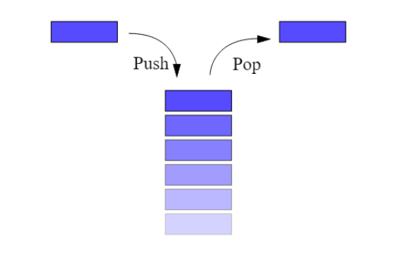

# Les Piles

Les piles(stacks en anglais) correspondent **exactement** à la notion de pile dans la vie courante. C'est une structure qui contient des éléments empilés.

- Une pile de cartes à jouer,
- Une pile d’assiettes…




Pour ajouter un élément on **empile** cet élément, il se retrouve donc au-dessus, et pour retirer un élément on ne peut retirer que l’élément se trouvant au sommet de la pile. On dit qu'on le **dépile**.

En anglais on dit last in, first out ou LIFO pour dire: dernier arrivé premier sorti.

Ce type de structure de données est par exemple utilisé dans:

- les éditeurs avec la fonction Annuler (CTRL+Z) et rétablir (CTRL+Y)
- les navigateurs pour reculer ou avancer dans l'historique.
- La lecture d'expressions mathématiques
- En général le parcours de structures de données comme les graphes, arbres... que nous verrons plus tard.

## Interface

!!! abstract "Définition - Interface"
    L'interface d'une structure de données abstraite est composée des fonctionalités **théoriques** que doit savoir remplir la structure de données. On appelle ces fonctionalités des **primitives**.

    Vous devez penser à la structure et au fonctionnement de l'interface (comme des légos) lorsque vous résolvez des problèmes. Pas à Python en particulier.

Une pile est définie par l’interface comprenant les primitives suivantes:

|Primitive|Description|
|--|--|
| CREER() → Pile | Renvoie une nouvelle Pile vide |
| EST_VIDE(p: Pile) → Booléen |Savoir si la pile p est vide |
| EMPILER(p: Pile, e: T) |Empiler un élément e pour le mettre au sommet de la pile p |
| DEPILER(p: Pile) → T | Dépiler un élément: le retirer du sommet de la pile et le renvoyer |

## Implémentation en Python

!!! abstract Définition - Implémentation

    L'implémentation d'une structure de donnée est la traduction pratique de son interface dans un langage de programmation spécifique.
    Les primitives doivent trouver une implémentation la plus rapide possible. Il peut exister plusieurs façon d'implémenter une structure de données dans un langage.

    (on trouvera aussi parfois les termes implanter/implantation à la place d'implémentater/implémentation)

Le type list en Python présente deux méthodes rapides qui lui permettent d’implémenter la Pile:

- list.append(e): ajoute l’élément en fin de liste en O(1).
- list.pop(): supprime le dernier élément de la liste et le renvoie en O(1).

(voir la [Documentation de python](https://wiki.python.org/moin/TimeComplexity))


### Implémentation minimaliste

Voici une pile de "n'importe quoi" (str, int, float, ...) implémentée avec une liste de "n'importe quoi"

```python
from typing import Any # N'importe quoi

type Pile = list[Any]

def creer() -> Pile:
    return []

def est_vide(p: Pile) -> bool:
    return len(p) == 0

def empiler(e: Any, p: Pile):
    p.append(e)

def depiler(p: Pile) -> Any:
    assert not pile_vide(p), "La pile est vide"
    return p.pop()

```


### Implémentation avancée

Ici on considère que:

**Une Pile d'éléments d'un type quelconque T est une liste d'éléments de type T**

On ajoute aussi des docstrings qui intègrent les tests unitaires de chaque fonction.

Voici le fichier pile.py

```python
# Python 3.13

type Pile[T] = list[T]

def creer[T]() -> Pile[T]:
    """
    Crée une pile vide.

    >>> p: Pile[int] = creer()
    >>> p
    []
    """
    return []

def est_vide[T](p: Pile[T]) -> bool:
    """
    Indique si la pile est vide.

    >>> p: Pile[str] = creer()
    >>> est_vide(p)  #? True pour une pile vide
    True
    >>> empiler("test", p)
    >>> est_vide(p)  #? False sinon
    False
    """
    return len(p) == 0

def empiler[T](e: T, p: Pile[T]):
    """
    Empile l'élément e au sommet de la pile p (modifie p sur place).

    >>> p = creer()
    >>> empiler(10, p)  #? pas de valeur de retour (None)
    >>> p
    [10]
    >>> empiler(5, p)
    >>> p
    [10, 5]
    """
    p.append(e)


def depiler[T](p: Pile[T]) -> T:
    """
    Dépile et retourne l'élément au sommet de la pile p.

    >>> p = creer()
    >>> empiler(1, p)
    >>> empiler(2, p)
    >>> depiler(p)
    2
    >>> p
    [1]

    Dépile sur pile vide -> AssertionError :

    >>> depiler(p)
    1
    >>> depiler(p)  # doctest: +ELLIPSIS
    Traceback (most recent call last):
    ...
    AssertionError: La pile est vide
    """
    assert not est_vide(p), "La pile est vide"
    return p.pop()


if __name__ == "__main__":
    import doctest
    doctest.testmod()
```

## Exercices

!!! question "Préparation"
    Les chemins sont donnés relativement à votre répertoire `prog_term`

    Les commandes sont lancées dans ce même répertoire.

    Préparation des fichiers:

    - Créez le répertoire `structures`. Ajoutez-y un fichier vide `__init__.py`
    - Créez le répertoire `structures/lineaires`. Ajoutez-y un fichier vide `__init__.py`
    - Reporter le code de création de la structure de Pile dans le fichier `structures/lineaires/pile.py`
    - Créez le fichier `exos\exospiles.py` et ajoutez y ce code:

    ```python
    from structures.lineaires import pile
    ```

    **Vous travaillerez dans le fichier exospiles.py**

    - Vous lancerez votre programme à l'aide de la commande `uv run -m exos.exospiles`


!!! question "Exercice 1"

    Créer une fonction `pile_exemple` qui renvoie la pile suivante:

    ```
    | 'jaune' |
    | 'rouge' |
    | 'jaune' |
    | 'vert'  |
    | 'rouge' |
    -----------
    ``` 

!!! question "Sans exécuter le code - papier"
    Dessinez la pile p à chacune de ses modifications.

    ```python
    p: Pile[int] = creer_pile()
    for v in [2, 4, 3, 6, 8, 5, 77, 10, 1]:
        if v%2 == 0:
            empiler(p, v)
        else:
            depiler(p)
    ```


!!! question "Sommet d'une pile"
    Écrire une fonction `sommet` qui renvoie le sommet d'une pile sans qu'elle soit modifiée à la sortie de la fonction. (on peut donc la modifier, mais on remet tout bien en place avant de sortir de la fonction)

    ```python 
    def sommet[T](p: Pile[T]) -> T:
        """
        Compléter la docstring
        
        >>> P = pile_exemple()
        >>> sommet(P)
        'jaune'
        """
    ```

!!! question "Taille d'une pile - version destructive"
    Créer une fonction  ```taille_pile[T](p: Pile[T]) -> int``` qui renvoie la taille de p de manière destructive.
    (la pile est vide si on l'affiche après un appel de fonction)


!!! question "Taille d'une pile - version non destructive"
    Créer une fonction  ```taille_pile[T](p: Pile[T]) -> int``` qui renvoie la taille de p de manière non destructive.
    (la pile est intacte si on l'affiche après un appel de fonction)

    On pourra utiliser une pile temporaire.


!!! question "Renverser une pile"
    Créer et tester une fonction ```renverse``` qui prend une pile $p$ en paramètre et renvoie une pile contenant les éléments de $p$ dans l'ordre inverse.
        
    On commencera bien évidemment par travailler la signature de la fonction d'après l'énoncé.


!!! question "Renverser une pile en place"
    Créer une fonction  ```renverse_inplace``` qui prend une pile en paramètre et la renverse **en place**.
    Cette fonction ne retourne rien.


!!! question "Sujet épreuve pratique (30 minutes grand maximum)"
    Ne vous grillez pas immédiatement cet exercice. Il faut le faire une fois que vous êtes à l'aise avec les autres, et pas le même jour.

    On dispose de chaînes de caractères contenant uniquement des parenthèses ouvrantes et fermantes.
    Un parenthésage est correct si :

    - le nombre de parenthèses ouvrantes de la chaîne est égal au nombre de parenthèses fermantes.
    - en parcourant la chaîne de gauche à droite, le nombre de parenthèses déjà ouvertes doit être, à tout moment, supérieur ou égal au nombre de parenthèses déjà fermées.

    Ainsi, "((()())(()))" est un parenthésage correct.
    Les parenthésages "())(()" et "(())(()" sont, eux, incorrects.

    On souhaite programmer une fonction parenthesage qui prend en paramètre une chaîne de caractères ch formée de parenthèses et renvoie True si la chaîne ch est bien parenthésée et False sinon.

    Cette fonction utilise une pile et suit le principe suivant : en parcourant la chaîne de gauche à droite, si on trouve une parenthèse ouvrante, on l’empile au sommet de la pile et si on trouve une parenthèse fermante, on dépile (si possible) la parenthèse ouvrante stockée au sommet de la pile.
    
    La chaîne est alors bien parenthésée si, à la fin du parcours, la pile est vide.
    Elle est, par contre, mal parenthésée :
    
    - si dans le parcours, on trouve une parenthèse fermante, alors que la pile est vide ;
    - ou si, à la fin du parcours, la pile n’est pas vide.


    Compléter le code de `parenthesage` et le tester.

    Exemples :
    ``` python
    >>> parenthesage("((()())(()))")
    True
    >>> parenthesage("())(()")
    False
    >>> parenthesage("(())(()")
    False
    ```

    Code:

    ```python

    def parenthesage(ch: str) -> bool:
        """
        Renvoie True si la chaîne ch est bien parenthésée
        et False sinon
        """
        p = Pile()
        for c in ch:
            if c == ...:
                empiler(p, c)
            elif c == ...:
                if pile_vide(p):
                    return ...
                else:
                    ...
        return pile_vide(p)

    ```

